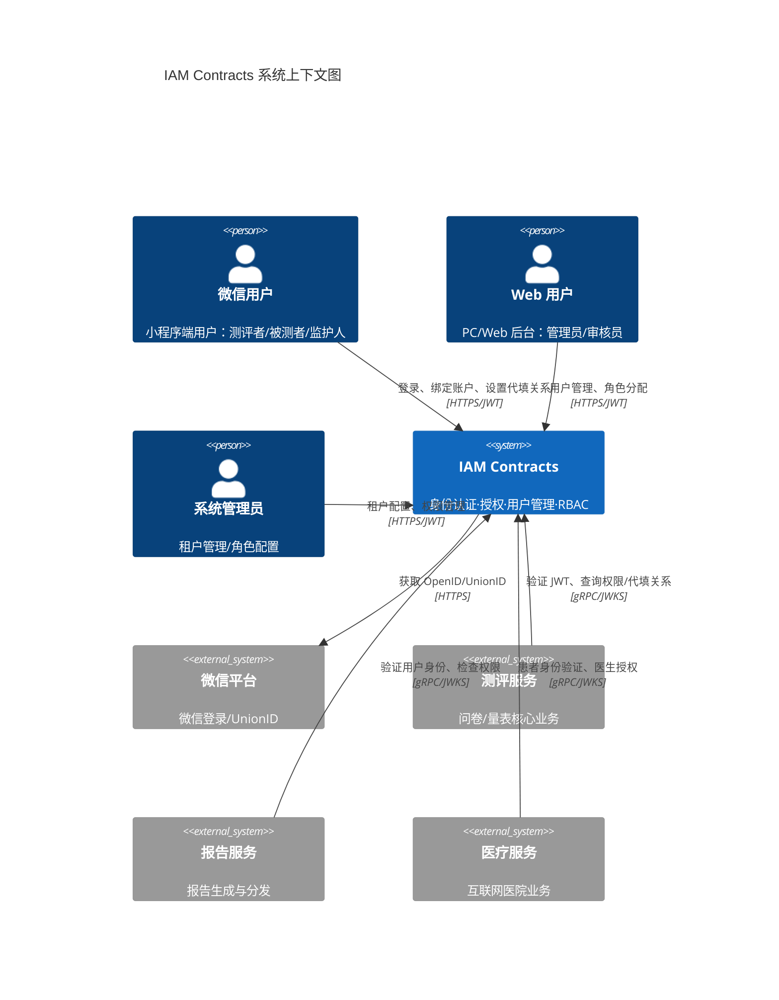
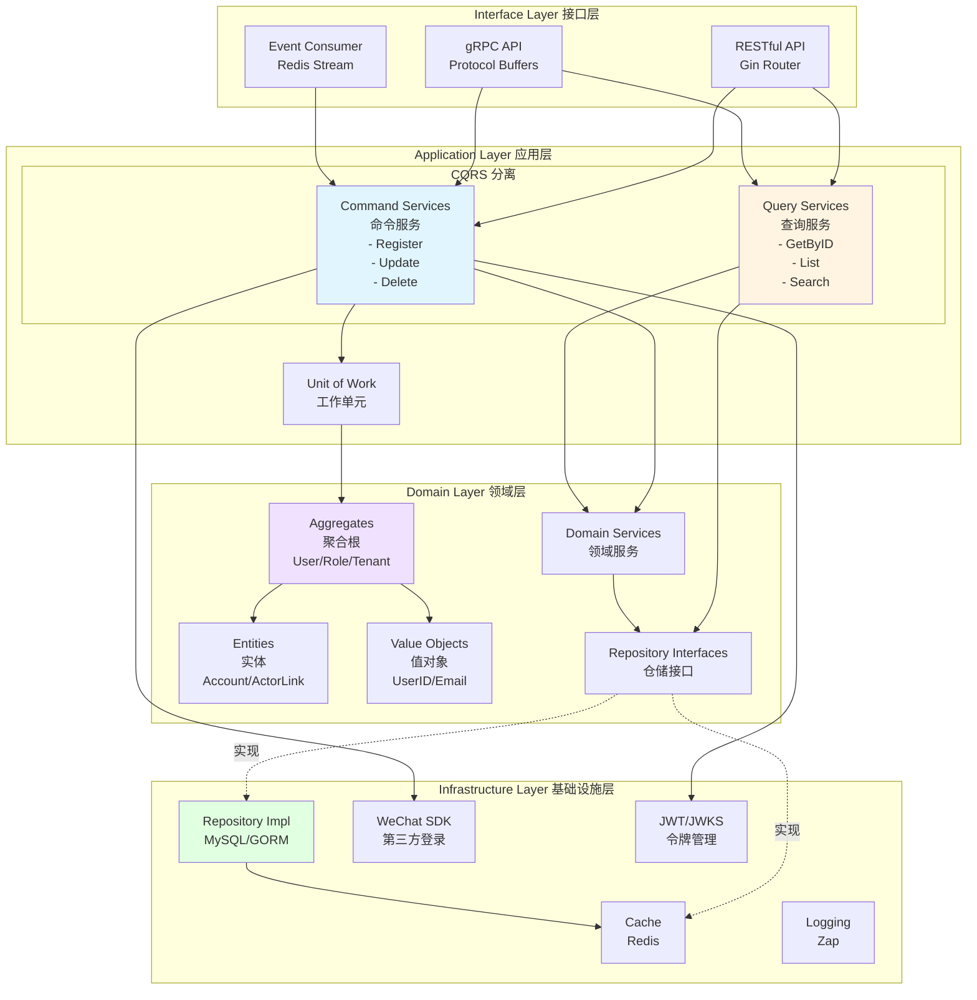
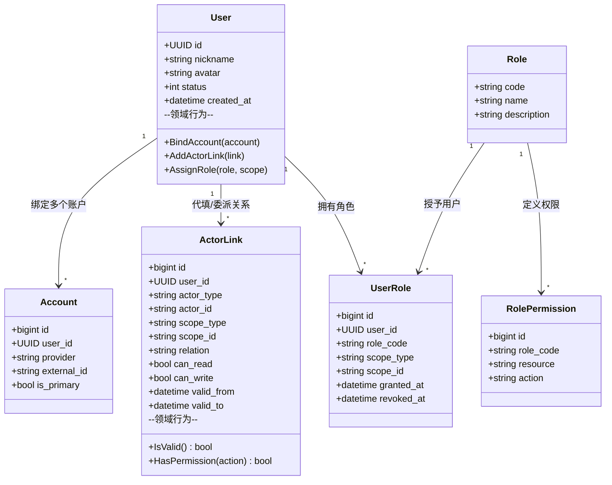
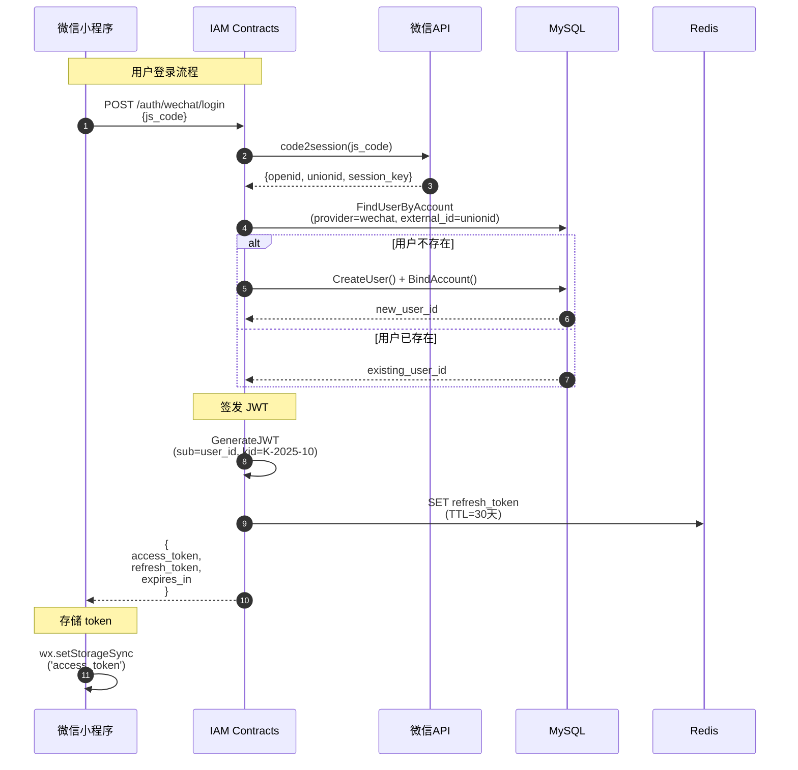
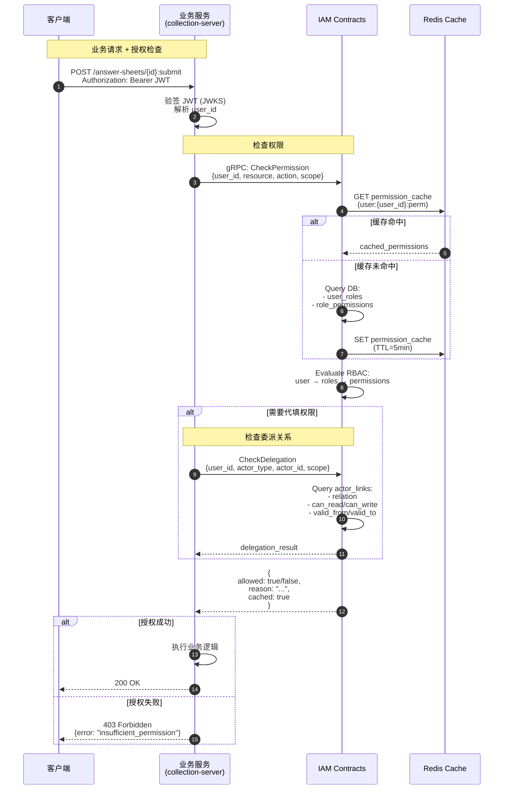
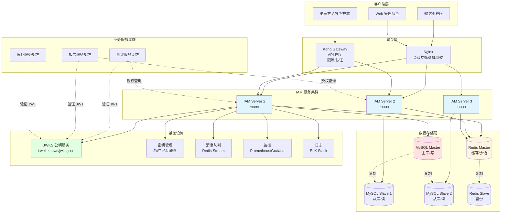

# IAM Contracts · 企业级身份与访问管理平台

[](https://go.dev/)
[](LICENSE)
[](docs/architecture-overview.md)

> 🔐 为多租户 SaaS 平台提供统一的身份认证、细粒度授权、角色管理和委派代填能力

**IAM Contracts** 是一个基于六边形架构、领域驱动设计（DDD）和 CQRS 模式构建的企业级身份与访问管理系统，专为 ToB/ToG SaaS 场景设计，支持多租户隔离、多端登录、灵活的 RBAC 授权和复杂的代填关系管理。

---

## 📋 目录

- [核心特性](#-核心特性)
- [快速开始](#-快速开始)
- [架构设计](#-架构设计)
- [项目结构](#-项目结构)
- [技术栈](#-技术栈)
- [文档导航](#-文档导航)
- [开发指南](#-开发指南)
- [贡献指南](#-贡献指南)
- [许可证](#-许可证)

---

## 🚀 核心特性

### 统一认证（Authentication）

- **多端支持**：微信小程序、企业微信、Web、PC 客户端
- **多账户绑定**：支持微信 UnionID/OpenID、手机号、邮箱、CA 证书、本地密码
- **JWT + JWKS**：标准 OAuth 2.0/OIDC 协议，支持密钥轮换和公钥发布
- **令牌管理**：Access Token、Refresh Token、黑名单机制

### 灵活授权（Authorization）

- **RBAC 授权**：基于角色的权限控制，支持资源和操作级细粒度权限
- **作用域隔离**：支持 `system`、`tenant`、`org`、`project`、`questionnaire` 等多级作用域
- **委派代填**：支持监护人代未成年人、医生代患者、教师代学生等复杂业务场景
- **CQRS 架构**：命令与查询分离，查询性能优化，写操作事务一致性保证

### 多租户管理

- **租户隔离**：数据和权限按租户完全隔离
- **组织结构**：支持层级部门、医院科室、学校班级等多种组织形式
- **租户配置**：每个租户可独立配置认证方式、权限策略

### 集成友好

- **HTTP/gRPC API**：提供 RESTful 和 gRPC 双协议支持
- **JWKS 端点**：业务服务可自行验签 JWT，无需每次调用 IAM
- **中间件 SDK**：提供 Go/Java/Node.js 认证授权中间件

---

## 🏁 快速开始

### 前置条件

- **Go**: 1.21 或更高版本
- **MySQL**: 8.0+
- **Redis**: 7.0+
- **Docker** (可选，用于本地开发环境)

### 本地开发

#### 1. 克隆仓库

```bash
git clone https://github.com/fangcun-mount/iam-contracts.git
cd iam-contracts
```

#### 2. 安装依赖

```bash
# 下载 Go 依赖
make deps

# 安装开发工具（可选）
make install-tools
```

#### 3. 启动数据库（使用 Docker）

```bash
# 启动 MySQL 容器
make docker-mysql-up

# 或使用现有 MySQL 服务
# 确保 MySQL 8.0+ 正在运行
```

#### 4. 初始化数据库

```bash
# 创建数据库、表结构和加载种子数据
make db-init

# 使用自定义数据库连接
make db-init DB_HOST=localhost DB_USER=root DB_PASSWORD=mypassword

# 或使用环境变量
export DB_HOST=localhost
export DB_USER=root
export DB_PASSWORD=mypassword
make db-init
```

**默认账户**:

- 系统管理员: `admin` / `admin123`
- 演示租户管理员: `zhangsan` / `admin123`
- 演示租户监护人: `lisi` / `admin123`

⚠️ **安全提示**: 生产环境部署后请立即修改默认密码！

#### 5. 构建项目

```bash
# 构建 API Server
make build

# 查看构建版本
make version
```

#### 6. 启动 API Server

```bash
# 启动服务
make run

# 或使用开发模式（热更新）
make dev

# 查看服务状态
make status
```

#### 7. 验证服务

```bash
# 健康检查
curl http://localhost:8080/healthz
# 输出: {"status":"ok"}

# 测试登录（使用默认账户）
curl -X POST http://localhost:8080/api/v1/auth/login \
  -H "Content-Type: application/json" \
  -d '{"username":"admin","password":"admin123"}'

# 获取 JWKS 公钥
curl http://localhost:8080/.well-known/jwks.json
```

### 使用 Makefile

项目提供了常用的 Makefile 命令：

```bash
make help           # 查看所有可用命令
make build          # 编译二进制文件
make test           # 运行单元测试
make lint           # 代码静态检查
make docker-build   # 构建 Docker 镜像
```

---

## 🏛 架构设计

### 系统上下文（C4 Context）



### 整体架构（六边形架构 + DDD + CQRS）

IAM Contracts 采用 **六边形架构（Hexagonal Architecture）** + **领域驱动设计（DDD）** + **CQRS** 模式：



### 核心领域模型



### CQRS 模式

项目实施了完整的 CQRS（Command Query Responsibility Segregation）架构：

- **Command Services（命令服务）**：处理所有写操作（创建、更新、删除），保证强一致性和事务完整性
- **Query Services（查询服务）**：处理所有读操作，优化查询性能，支持缓存和读副本

**示例**：

```go
// Command Service - 处理用户注册
type UserApplicationService interface {
    Register(ctx context.Context, cmd RegisterUserCommand) (*UserDTO, error)
}

// Query Service - 处理用户查询
type UserQueryApplicationService interface {
    GetByID(ctx context.Context, userID string) (*UserDTO, error)
    GetByPhone(ctx context.Context, phone string) (*UserDTO, error)
}
```

### 认证流程（微信小程序登录）



### 授权流程（RBAC + 委派代填）



### 核心模块

1. **UC 模块（User Center）**：用户、账户、角色、委派关系管理
2. **AuthN 模块（Authentication）**：JWT 签发、JWKS 发布、多端登录适配
3. **AuthZ 模块（Authorization）**：RBAC 决策、权限缓存、委派授权

### 部署架构



详细架构设计请参阅 [架构文档](#-文档导航)。

---

## 📁 项目结构

```text
iam-contracts/
├── cmd/                        # 可执行程序入口
│   └── apiserver/              # API Server 主程序
├── configs/                    # 配置文件
│   ├── apiserver.yaml          # 主配置文件
│   ├── env/                    # 环境变量配置
│   └── cert/                   # JWT 密钥证书
├── internal/                   # 内部应用代码（不对外暴露）
│   └── apiserver/
│       ├── application/        # 应用层（Command & Query Services）
│       ├── domain/             # 领域层（实体、值对象、仓储接口）
│       ├── infrastructure/     # 基础设施层（MySQL、Redis、外部 API）
│       ├── interface/          # 接口层（RESTful、gRPC）
│       └── container/          # 依赖注入容器
├── pkg/                        # 可复用公共库
│   ├── log/                    # 日志库
│   ├── errors/                 # 错误处理
│   ├── database/               # 数据库注册中心
│   └── auth/                   # JWT/JWKS 工具
├── docs/                       # 项目文档
│   ├── architecture-overview.md    # 整体架构设计
│   ├── uc-architecture.md          # UC 模块设计
│   └── authn-architecture.md       # 认证模块设计
├── build/                      # 构建脚本与 Docker 文件
├── scripts/                    # 开发运维脚本
└── Makefile                    # 构建自动化
```

**目录设计原则**：

- `internal/`：应用内部实现，按六边形架构分层
- `pkg/`：可复用库，保持无状态，便于跨服务复用
- `configs/`：配置文件，敏感信息使用环境变量或密钥管理服务

---

## 🛠 技术栈

| 类别 | 技术 | 说明 |
|------|------|------|
| **语言** | Go 1.21+ | 高性能、强类型、并发友好 |
| **Web 框架** | Gin | 轻量级 HTTP 路由框架 |
| **gRPC** | Google gRPC | 高性能 RPC 框架 |
| **数据库** | MySQL 8.0+ | 关系型数据库，支持事务和复杂查询 |
| **缓存** | Redis 7.0+ | 高性能缓存和分布式锁 |
| **ORM** | GORM | Go 对象关系映射库 |
| **日志** | Zap | 高性能结构化日志 |
| **配置** | Viper | 多格式配置管理（YAML/ENV） |
| **JWT** | golang-jwt/jwt | JWT 签发与验签 |
| **依赖注入** | Wire (Google) | 编译期依赖注入代码生成 |
| **认证** | 微信 SDK | 微信小程序/企业微信登录 |
| **容器化** | Docker + Docker Compose | 本地开发环境 |
| **部署** | Kubernetes + Helm | 生产环境容器编排 |

---

## 📚 文档导航

完整的项目文档位于 `docs/` 目录：

| 文档 | 说明 |
|------|------|
| [**架构概览**](docs/architecture-overview.md) | 整体架构设计、C4 模型、技术栈、部署架构 |
| [**UC 模块设计**](docs/uc-architecture.md) | 用户中心详细设计、CQRS 实现、领域模型、数据库 Schema |
| [**认证模块设计**](docs/authn-architecture.md) | JWT 管理、JWKS 发布、密钥轮换、多端登录适配 |
| [**部署总览**](docs/DEPLOYMENT.md) | 多种部署方式、配置说明、监控管理 |
| [**Jenkins 部署**](docs/JENKINS_QUICKSTART.md) | Jenkins CI/CD 快速配置指南 |
| [**文档索引**](docs/README.md) | 所有文档的导航入口 |

### 快速链接

- [框架概览](docs/framework-overview.md)：六边形架构、DDD、CQRS 详解
- [数据库注册中心](docs/database-registry.md)：多数据库连接管理
- [错误处理](docs/error-handling.md)：统一错误码和错误处理机制
- [日志系统](docs/logging-system.md)：结构化日志和日志轮转
- [认证流程](docs/authentication.md)：多端登录和 JWT 签发流程

---

## � 生产环境部署

### Jenkins CI/CD 自动化部署（推荐）

使用 Jenkins Pipeline 实现自动化构建、测试和部署：

```bash
# 1. 查看快速开始指南
cat docs/JENKINS_QUICKSTART.md

# 2. 配置 Jenkins（详见文档）
# - 配置 SSH 凭据
# - 创建 Pipeline 任务
# - 配置 Git 仓库

# 3. 触发部署
git push origin main
```

**特点**：
- ✅ 自动化构建、测试、部署
- ✅ 健康检查和自动回滚
- ✅ 版本管理和备份

📖 **详细文档**：
- [Jenkins 快速开始](docs/JENKINS_QUICKSTART.md) - 快速配置指南
- [Jenkins 完整部署指南](docs/JENKINS_DEPLOYMENT.md) - 详细配置步骤
- [部署总览](docs/DEPLOYMENT.md) - 所有部署方式说明

### Docker 部署

```bash
# 构建镜像
make docker-build

# 使用 Docker Compose 启动
make docker-compose-up

# 查看日志
docker-compose -f build/docker/docker-compose.yml logs -f iam-apiserver

# 停止服务
make docker-compose-down
```

### Systemd 服务部署

```bash
# 1. 编译
make build

# 2. 复制文件到部署目录
sudo cp bin/apiserver /opt/iam/bin/
sudo cp -r configs /opt/iam/

# 3. 安装 systemd 服务
sudo cp build/systemd/iam-apiserver.service /etc/systemd/system/
sudo systemctl daemon-reload

# 4. 启动服务
sudo systemctl start iam-apiserver
sudo systemctl enable iam-apiserver

# 5. 查看状态
sudo systemctl status iam-apiserver
```

### 使用部署脚本

```bash
# 使用自动化部署脚本
./scripts/deploy.sh deploy    # 部署
./scripts/deploy.sh start      # 启动
./scripts/deploy.sh stop       # 停止
./scripts/deploy.sh restart    # 重启
./scripts/deploy.sh health     # 健康检查
./scripts/deploy.sh rollback   # 回滚
```

---

## �👨‍💻 开发指南

### API 文档

启动服务后，访问以下端点获取 API 文档：

- **Swagger UI**: `http://localhost:8080/swagger/index.html`
- **JWKS 公钥**: `http://localhost:8080/.well-known/jwks.json`

### 添加新功能

遵循六边形架构的分层结构：

1. **Domain Layer**：定义实体、值对象、仓储接口
2. **Application Layer**：实现 Command Service 和 Query Service
3. **Infrastructure Layer**：实现仓储（MySQL/Redis）
4. **Interface Layer**：暴露 HTTP/gRPC API

### 运行测试

```bash
# 运行所有测试
make test

# 运行特定模块测试
go test ./internal/apiserver/application/user/...

# 生成测试覆盖率报告
make test-coverage
```

### 代码规范

- 遵循 [Uber Go Style Guide](https://github.com/uber-go/guide/blob/master/style.md)
- 使用 `golangci-lint` 进行静态检查：`make lint`
- 提交前运行：`make fmt` 格式化代码

---

## 🤝 贡献指南

我们欢迎所有形式的贡献！

1. **Fork** 本仓库
2. 创建特性分支：`git checkout -b feature/amazing-feature`
3. 提交更改：`git commit -m 'Add amazing feature'`
4. 推送到分支：`git push origin feature/amazing-feature`
5. 提交 **Pull Request**

### 贡献类型

- 🐛 Bug 修复
- ✨ 新功能
- 📝 文档改进
- ♻️ 代码重构
- ✅ 测试覆盖

请确保：

- 所有测试通过：`make test`
- 代码通过 lint 检查：`make lint`
- 更新相关文档

---

## 📄 许可证

本项目采用 [MIT License](LICENSE) 开源协议。

---

## 📞 联系我们

- **项目维护者**: [fangcun-mount](https://github.com/fangcun-mount)
- **问题反馈**: [GitHub Issues](https://github.com/fangcun-mount/iam-contracts/issues)

---
Built with ❤️ using Go and Hexagonal Architecture
