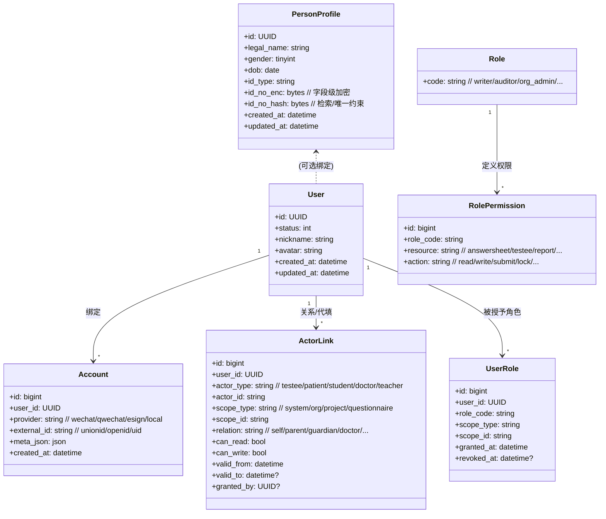
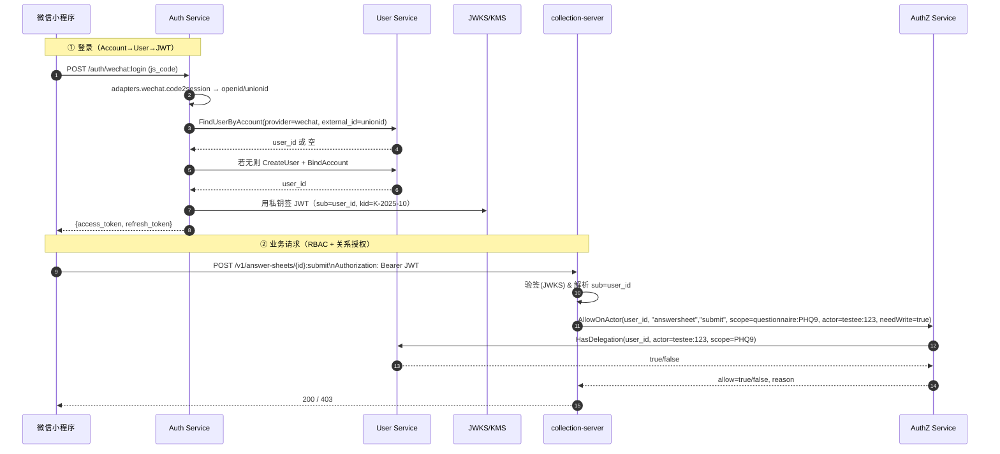

# iam-contracts

IAM（Identity & Access Management），是 User Service + Auth Service + AuthZ Service 的“对外契约”（OpenAPI/Proto、资源-动作表、错误码、JWKS 规范等）

## 整体架构

### 全局上下文（C4-Context）

```mermaid

flowchart LR
  classDef svc fill:#eef,stroke:#446,stroke-width:1px;
  classDef biz fill:#fefee0,stroke:#b9a,stroke-width:1px;
  classDef infra fill:#f8f8f8,stroke:#999,stroke-width:1px;
  classDef c fill:#fff,stroke:#666,stroke-width:1px;

  subgraph Clients[Clients]
    A1[WeChat 小程序]:::c
    A2[运营后台 Web]:::c
    A3[第三方应用]:::c
  end

  subgraph IAM[iam-platform（Monorepo 运行时边界）]
    US[User Service<br/>User/Account/ActorLink/PersonProfile]:::svc
    AS[Auth Service (AS)<br/>登录/JWT/Refresh/JWKS]:::svc
    PDP[AuthZ Service (PDP)<br/>RBAC + 关系授权判定]:::svc
  end

  subgraph Biz[业务域服务]
    B1[collection-server（量表测评）]:::biz
    B2[hospital-server（互联网医院）]:::biz
    B3[training-server（训练中心）]:::biz
  end

  subgraph Infra[共享基础设施]
    MQ[(Event Bus / Redis Stream / Kafka)]:::infra
    KMS[(KMS/密钥管理)]:::infra
    JWKS[(JWKS 公钥集)]:::infra
    RDB[(MySQL)]:::infra
    RED[(Redis)]:::infra
    O11y[(日志/指标/链路)]:::infra
  end

  %% 客户端登录到 AS
  A1 -- WeChat code / OAuth2+PKCE --> AS
  A2 -- OAuth2+PKCE --> AS
  A3 -- OAuth2（授权码/客户端凭据） --> AS
  AS -- Access/Refresh(JWT) --> A1

  %% 业务服务校验&鉴权
  B1 -- Bearer JWT --> AS
  B2 -- Bearer JWT --> AS
  B3 -- Bearer JWT --> AS

  B1 -- 鉴权请求 --> PDP
  B2 -- 鉴权请求 --> PDP
  B3 -- 鉴权请求 --> PDP
  PDP -- 关系授权查询 --> US

  %% 存储与密钥
  US --- RDB
  PDP --- RDB
  AS --- RDB
  AS --- RED
  PDP --- RED
  AS --- KMS
  AS --- JWKS

  %% 事件
  US -- 发布事件 --> MQ
  PDP -- 订阅失效事件 --> MQ


```

### 模型服务设计（核心数据/关系）



### 运行时上下文（调用链/时序）



### Monorepo 内部组件（服务与适配器）

```mermaid

flowchart TB
  classDef cmp fill:#fff,stroke:#333,stroke-width:1px;

  subgraph repo[iam-platform（Monorepo 根）]
    subgraph AuthService[services/auth-service]
      A1[adapters.wechat<br/>code2session / MP OA / webhook]:::cmp
      A2[adapters.qwechat / esign / localpwd]:::cmp
      A3[issuer<br/>JWT/Refresh 发行·旋转·黑名单]:::cmp
      A4[jwks provider<br/>kid轮换/公钥发布]:::cmp
      A5[http/grpc api]:::cmp
    end

    subgraph UserService[services/user-service]
      U1[user 聚合]:::cmp
      U2[account 绑定]:::cmp
      U3[user↔actorLink（scope/有效期/读写）]:::cmp
      U4[personProfile(可选)]:::cmp
      U5[http/grpc api]:::cmp
    end

    subgraph AuthZService[services/authz-service]
      Z1[rbac：roles / role_permissions 热加载]:::cmp
      Z2[delegation：调用 user-service HasDelegation]:::cmp
      Z3[decision：Allow / AllowOnActor]:::cmp
      Z4[cache：LRU+Redis，事件驱动失效]:::cmp
      Z5[http/grpc api]:::cmp
    end

    subgraph Libs[libs/（Monorepo 内共享库）]
      L1[authn-middleware<br/>JWT 验签（JWKS 缓存）]:::cmp
      L2[authz-client<br/>PDP SDK + 本地缓存]:::cmp
      L3[common：errors / dto / tracing / config]:::cmp
    end

    subgraph Infra[infra/]
      I1[helm / helmfile / compose]:::cmp
      I2[migrations / seeds]:::cmp
      I3[observability（otel/metrics/log）]:::cmp
    end
  end

  %% 连接
  A1 -- 账户映射 --> U2
  A2 -- 账户映射 --> U2
  Z2 -- 关系查询 --> U5
  L1 -- 被三服务与业务服务复用 --> L1
  L2 -- 被业务服务复用 --> Z5

```
