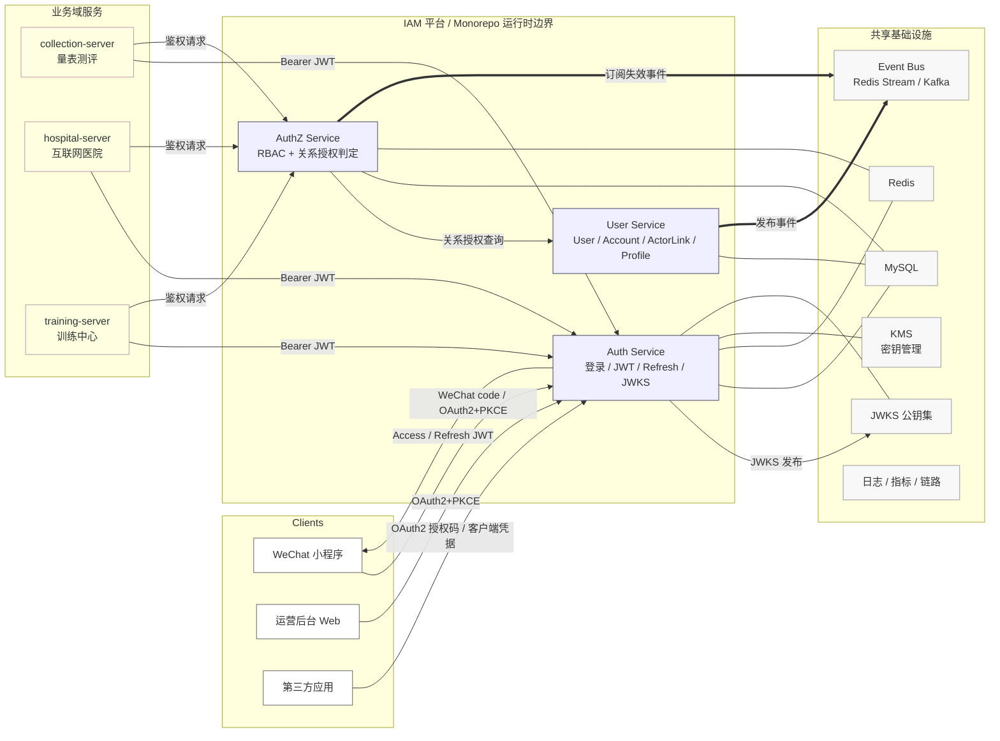
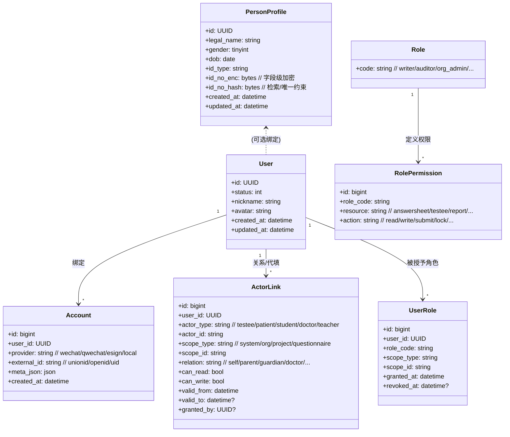
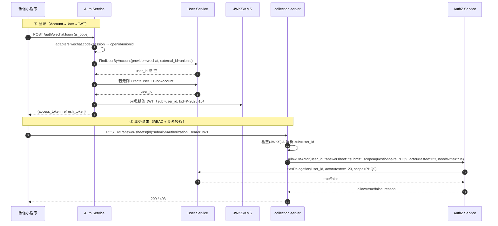
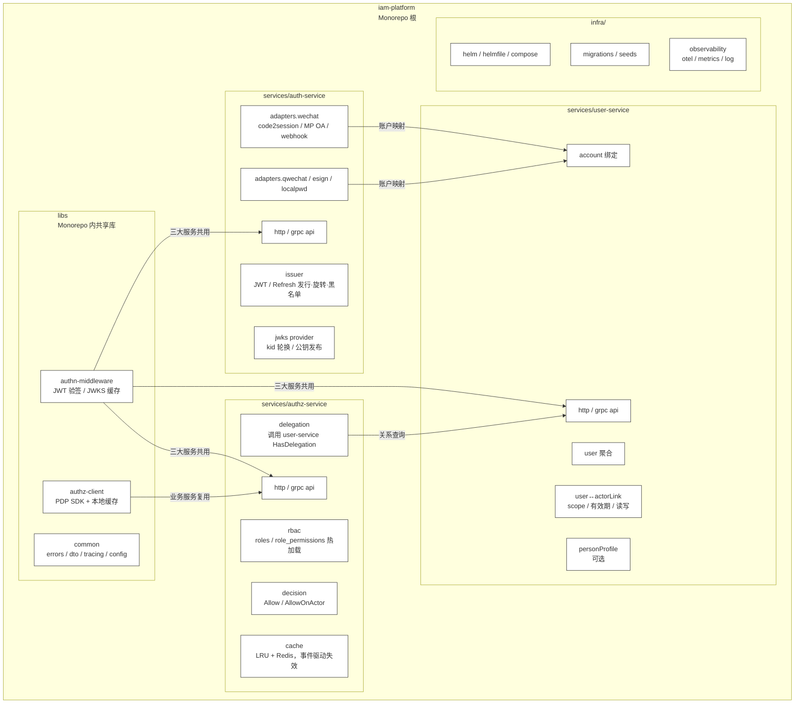

# iam-contracts

IAM（Identity & Access Management），是 User Service + Auth Service + AuthZ Service 的“对外契约”（OpenAPI/Proto、资源-动作表、错误码、JWKS 规范等）

## 整体架构

### 全局上下文（C4-Context）



### 模型服务设计（核心数据/关系）



### 运行时上下文（调用链/时序）



### Monorepo 内部组件（服务与适配器）



## 代码结构

以下以代码块形式展示项目的目录树，便于快速浏览仓库布局：

```text
iam-contracts/
├─ cmd/                # 可执行程序入口 (例如 cmd/apiserver)
├─ configs/            # 配置文件与证书 (yaml, env, mysql/redis 等)
├─ build/              # 构建/打包/infra 相关脚本与说明
├─ internal/           # 应用内部实现（不可被外部模块导入）
│  └─ apiserver/       # API server：路由、组装、domain、infra 适配器
├─ pkg/                # 可复用库（log/errors/database/util 等）
├─ proto/              # Protobuf / gRPC 定义与生成脚本（如存在）
├─ docs/               # 文档、设计说明、操作手册
├─ scripts/            # 开发与维护脚本
├─ Makefile
└─ go.mod / go.sum
```

简单约定：

- `internal/` 用于包含服务实现与业务逻辑（通常按六边形架构组织：ports/adapters/domain）。
- `pkg/` 提供可复用的库，尽量保持无全局状态，便于在 monorepo 内多服务复用。
- 配置中的敏感信息请使用 Vault / CI secrets 或环境变量注入，不要把明文凭证提交到仓库。

如需更细粒度的目录说明（比如每个包的职责与常见入口函数），我可以把此内容拆成 `docs/code-structure.md` 并在 README 中链接过去。
