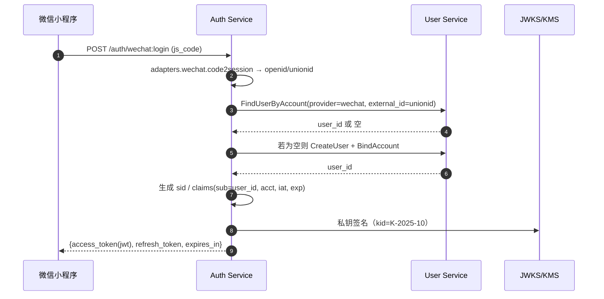
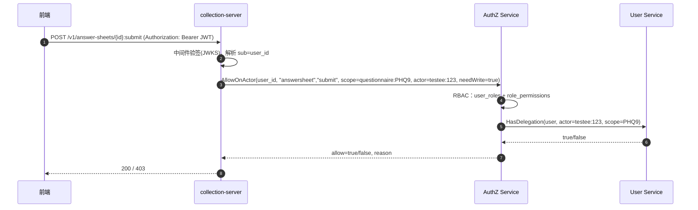

# iam-contracts

IAM（Identity & Access Management），是 User Service + Auth Service + AuthZ Service 的“对外契约”（OpenAPI/Proto、资源-动作表、错误码、JWKS 规范等）

## 整体架构

### 全局上下文（C4-Context）

```mermaid

flowchart LR
  subgraph Clients[Clients]
    A1[WeChat 小程序]:::c
    A2[运营后台 Web]:::c
    A3[第三方应用(可选)]:::c
  end

  subgraph Platform[IAM 平台层]
    US[User Service\n(User/Account/ActorLink/PersonProfile)]:::svc
    AS[Auth Service (AS)\n登录/签发JWT/Refresh/JWKS]:::svc
    PDP[AuthZ Service (PDP)\nRBAC + 关系授权判定]:::svc
  end

  subgraph Biz[业务域服务]
    B1[collection-server\n(量表测评)]:::biz
    B2[hospital-server\n(互联网医院)]:::biz
    B3[training-server\n(训练中心)]:::biz
  end

  subgraph Infra[共享基础设施]
    MQ[(Event Bus\nRedis Stream/Kafka)]:::infra
    KMS[(KMS/密钥管理)]:::infra
    JWKS[(JWKS 公钥集\n/.well-known/jwks.json)]:::infra
    RDB[(MySQL)]:::infra
    RED[(Redis)]:::infra
    O11y[(日志/指标/链路)]:::infra
  end

  A1-- OAuth2/OIDC 或 Wechat code -->AS
  A2-- OAuth2/OIDC 授权码+PKCE -->AS
  A3-- OAuth2 客户端凭据/授权码 -->AS
  AS-- JWT Access/Refresh -->A1
  AS-- JWKS 发布 -->JWKS

  B1-- Bearer JWT -->AS
  B2-- Bearer JWT -->AS
  B3-- Bearer JWT -->AS

  B1-- 鉴权请求 -->PDP
  B2-- 鉴权请求 -->PDP
  B3-- 鉴权请求 -->PDP

  PDP-- 关系授权查询 -->US

  US--- RDB
  PDP--- RDB
  AS--- RDB
  AS--- RED
  PDP--- RED

  AS--- KMS
  AS--- JWKS
  US== 事件发布 ==MQ
  PDP== 订阅失效 ==MQ

  classDef svc fill:#eef,stroke:#446;
  classDef biz fill:#efe,stroke:#393;
  classDef infra fill:#f8f8f8,stroke:#999;
  classDef c fill:#fff,stroke:#666;

```

### 平台与业务的容器/组件视图

```mermaid
flowchart TB
  subgraph Auth-Service[Auth Service]
    AS1[Adapters\n- WeChatApp/MP webhook\n- QWechat\n- ESign\n- LocalPwd]:::cmp
    AS2[Issuer\nJWT/Refresh 发行、旋转、黑名单]:::cmp
    AS3[JWKS Provider\nkid轮换/公钥发布]:::cmp
    AS4[Sessions & Device Risk]:::cmp
    AS5[HTTP/gRPC API]:::cmp
  end

  subgraph User-Service[User Service]
    US1[User 聚合]:::cmp
    US2[Account 绑定]:::cmp
    US3[User↔ActorLink\n(parent/guardian/doctor… + scope)]:::cmp
    US4[PersonProfile(可选)]:::cmp
    US5[HTTP/gRPC API]:::cmp
  end

  subgraph AuthZ-Service[PDP]
    P1[RBAC: roles/user_roles\nrole_permissions 热加载]:::cmp
    P2[Delegation: 调US的 HasDelegation]:::cmp
    P3[Decision Engine\nAllow/AllowOnActor]:::cmp
    P4[Cache(LRU+Redis)\n事件失效]:::cmp
    P5[HTTP/gRPC API]:::cmp
  end

  subgraph Biz[业务服务]
    C1[collection-server\nPEP中间件]:::cmp
    H1[hospital-server\nPEP中间件]:::cmp
    T1[training-server\nPEP中间件]:::cmp
  end

  C1--SDK-->P5
  H1--SDK-->P5
  T1--SDK-->P5
  AS5--JWKS-->Biz
  AS1--外部平台-->|
  AS5--调用-->US5
  P2--调用-->US5

  classDef cmp fill:#fff,stroke:#333;
```

### 时序 1：微信登录（Account→User→JWT）



### 时序 2：业务 API 鉴权（RBAC + 关系授权）

