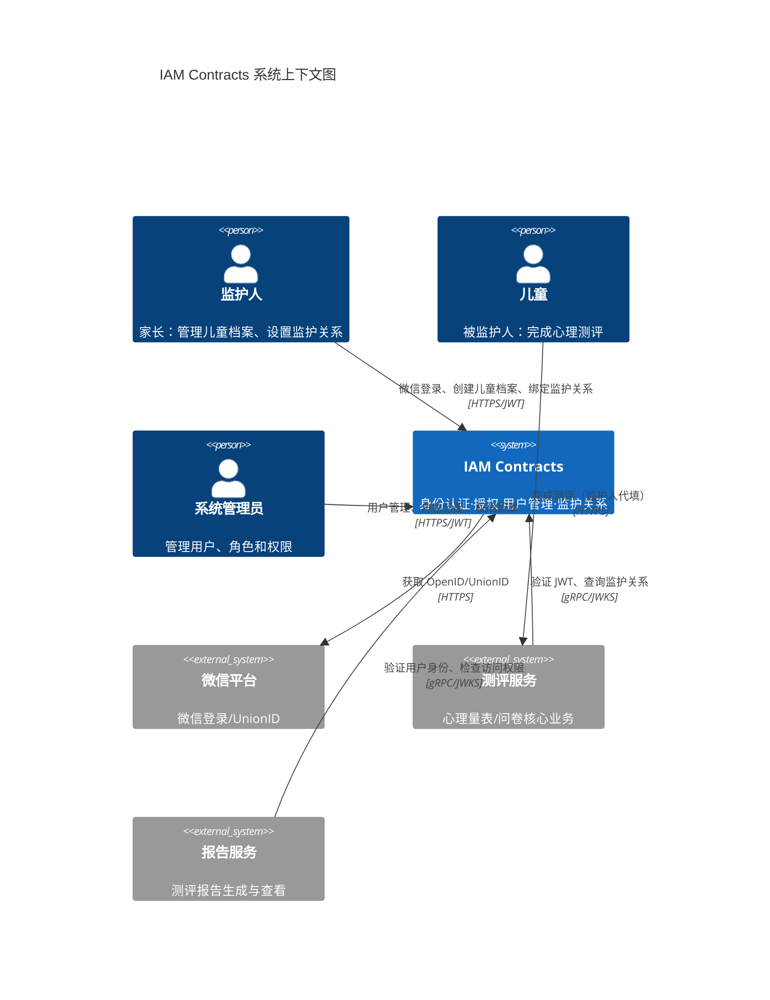
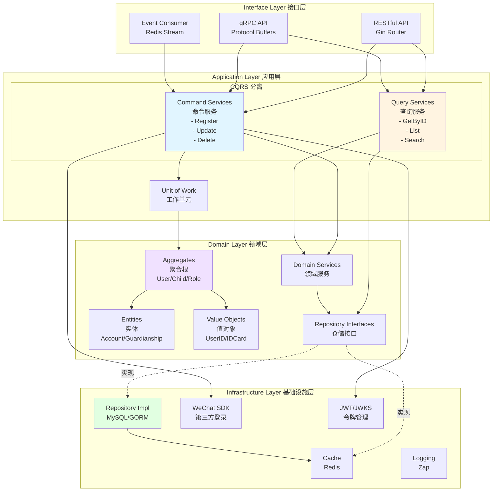
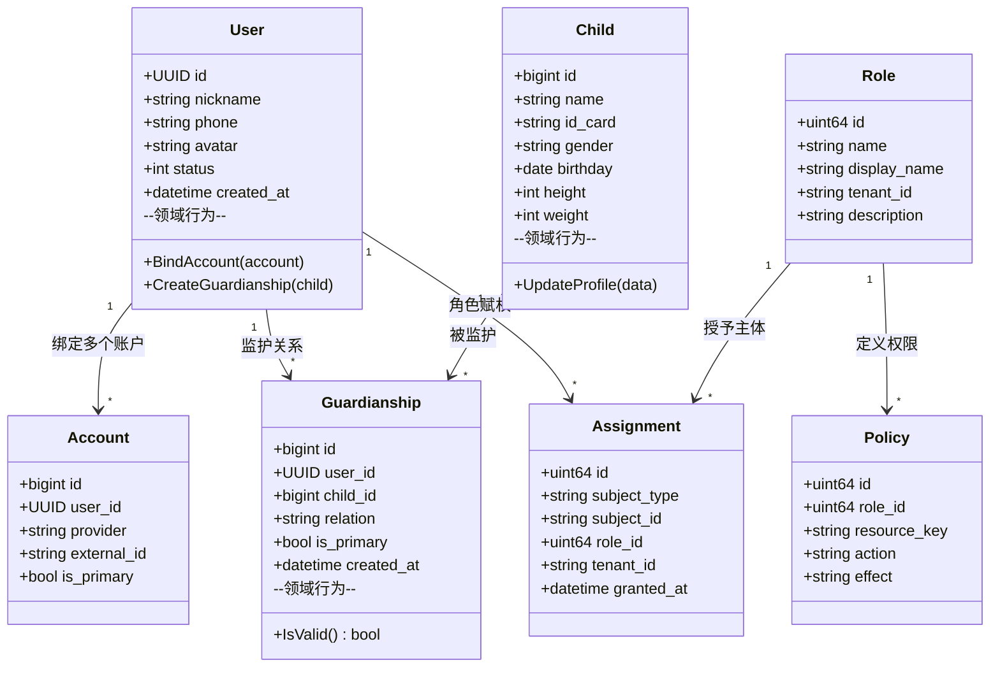
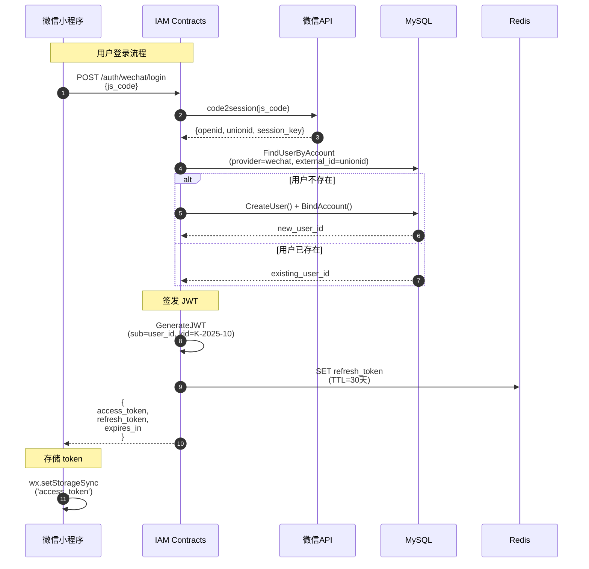
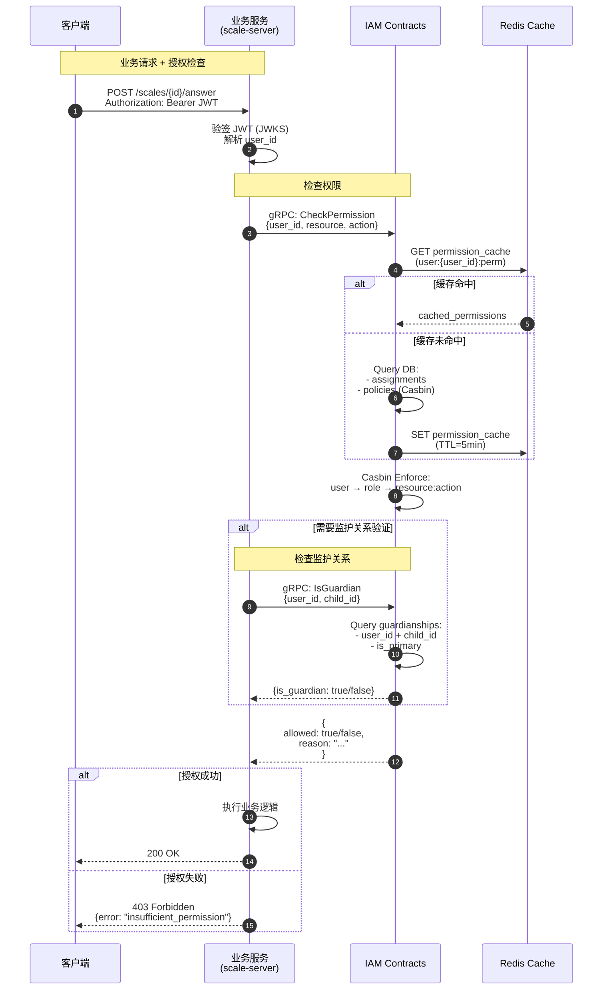
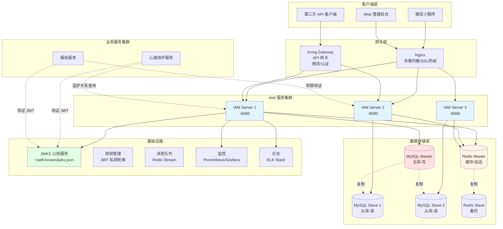

# IAM Contracts · 企业级身份与访问管理平台

[](https://go.dev/)
[](LICENSE)
[](docs/architecture-overview.md)

> 🔐 为心理健康测评平台提供统一的身份认证、细粒度授权、角色管理和监护关系管理能力

**IAM Contracts** 是一个基于六边形架构、领域驱动设计（DDD）和 CQRS 模式构建的企业级身份与访问管理系统，专为心理健康测评等医疗健康场景设计，支持多端登录、灵活的 RBAC 授权和复杂的监护人-儿童关系管理。

---

## 📋 目录

- [核心特性](#-核心特性)
- [快速开始](#-快速开始)
- [架构设计](#-架构设计)
- [项目结构](#-项目结构)
- [技术栈](#-技术栈)
- [文档导航](#-文档导航)
- [开发指南](#-开发指南)
- [贡献指南](#-贡献指南)
- [许可证](#-许可证)

---

## 🚀 核心特性

### 统一认证（Authentication）

- **多端支持**：微信小程序、Web 管理后台
- **多账户绑定**：支持微信 UnionID/OpenID、手机号、本地账号密码
- **JWT + JWKS**：标准 JWT 令牌机制，支持公钥验签和令牌验证
- **令牌管理**：Access Token、Refresh Token、会话管理

### 灵活授权（Authorization）

- **RBAC 授权**：基于角色的权限控制，支持资源和操作级细粒度权限
- **Casbin 引擎**：使用 Casbin 实现高性能权限决策
- **权限缓存**：Redis 缓存提升授权性能
- **CQRS 架构**：命令与查询分离，读写性能优化

### 监护关系管理

- **监护人-儿童绑定**：支持家长监护未成年人完成心理测评
- **关系验证**：完整的监护关系创建、查询、解除流程
- **数据隔离**：监护人仅可访问其监护儿童的数据
- **儿童档案**：独立的儿童信息管理（姓名、性别、生日、身份证等）

### 集成友好

- **HTTP/gRPC API**：提供 RESTful 和 gRPC 双协议支持
- **JWKS 端点**：业务服务可自行验签 JWT，无需每次调用 IAM
- **中间件支持**：提供 Go 语言认证授权中间件（dominguard）

---

## 🏁 快速开始

### 前置条件

- **Go**: 1.21 或更高版本
- **MySQL**: 8.0+
- **Redis**: 7.0+
- **Docker** (可选，用于本地开发环境)

### 本地开发

#### 1. 克隆仓库

```bash
git clone https://github.com/FangcunMount/iam-contracts.git
cd iam-contracts
```

#### 2. 安装依赖

```bash
# 下载 Go 依赖
make deps

# 安装开发工具（可选）
make install-tools
```

#### 3. 启动数据库（使用 Docker）

```bash
# 启动 MySQL 容器
make docker-mysql-up

# 或使用现有 MySQL 服务
# 确保 MySQL 8.0+ 正在运行
```

#### 4. 初始化数据库

数据库迁移在应用程序启动时自动执行。如需手动加载种子数据:

```bash
# 构建 seeddata 工具
make build-tools

# 加载种子数据（需要先启动数据库）
make db-seed DB_USER=root DB_PASSWORD=yourpassword

# 或直接使用 seeddata 工具
./tmp/seeddata --dsn "root:yourpassword@tcp(127.0.0.1:3306)/iam_contracts?parseTime=true&loc=Local"
```

**数据库迁移文件位置**: `internal/pkg/migration/migrations/`  
**种子数据配置文件**: `configs/seeddata.yaml`

**默认种子数据账户**:

- 系统管理员: `admin` / `Admin@123`
- 测试用户: `zhangsan` / `Pass@123`

⚠️ **安全提示**: 生产环境部署后请立即修改默认密码！

#### 5. 构建项目

```bash
# 构建 API Server
make build

# 查看构建版本
make version
```

#### 6. 启动 API Server

```bash
# 启动服务
make run

# 或使用开发模式（热更新）
make dev

# 查看服务状态
make status
```

#### 7. 验证服务

```bash
# 健康检查
curl http://localhost:9080/healthz
# 输出: {"status":"ok"}

# 测试登录（使用默认账户）
curl -X POST http://localhost:9080/api/v1/auth/login \
  -H "Content-Type: application/json" \
  -d '{"username":"admin","password":"admin123"}'

# 获取 JWKS 公钥
curl http://localhost:9080/.well-known/jwks.json
```

### 使用 Makefile

项目提供了常用的 Makefile 命令：

```bash
make help           # 查看所有可用命令
make build          # 编译二进制文件
make test           # 运行单元测试
make lint           # 代码静态检查
make docker-build   # 构建 Docker 镜像
```

---

## 🏛 架构设计

### 系统上下文（C4 Context）


```mermaid
C4Context
  title IAM Contracts 系统上下文图

  Person(guardian, "监护人", "家长：管理儿童档案、设置监护关系")
  Person(child, "儿童", "被监护人：完成心理测评")
  Person(admin, "系统管理员", "管理用户、角色和权限")

  System(iam, "IAM Contracts", "身份认证·授权·用户管理·监护关系")
  
  System_Ext(wechat, "微信平台", "微信登录/UnionID")
  System_Ext(scale, "测评服务", "心理量表/问卷核心业务")
  System_Ext(report, "报告服务", "测评报告生成与查看")

  Rel(guardian, iam, "微信登录、创建儿童档案、绑定监护关系", "HTTPS/JWT")
  Rel(admin, iam, "用户管理、角色分配、权限配置", "HTTPS/JWT")
  
  Rel(iam, wechat, "获取 OpenID/UnionID", "HTTPS")
  
  Rel(scale, iam, "验证 JWT、查询监护关系", "gRPC/JWKS")
  Rel(report, iam, "验证用户身份、检查访问权限", "gRPC/JWKS")
  Rel(child, scale, "完成测评（监护人代填）", "HTTPS")

  UpdateLayoutConfig($c4ShapeInRow="3", $c4BoundaryInRow="1")
```

### 整体架构（六边形架构 + DDD + CQRS）

IAM Contracts 采用 **六边形架构（Hexagonal Architecture）** + **领域驱动设计（DDD）** + **CQRS** 模式：


```mermaid
graph TB
    subgraph "Interface Layer 接口层"
        REST[RESTful API<br/>Gin Router]
        GRPC[gRPC API<br/>Protocol Buffers]
        EVENT[Event Consumer<br/>Redis Stream]
    end

    subgraph "Application Layer 应用层"
        subgraph "CQRS 分离"
            CMD[Command Services<br/>命令服务<br/>- Register<br/>- Update<br/>- Delete]
            QUERY[Query Services<br/>查询服务<br/>- GetByID<br/>- List<br/>- Search]
        end
        UOW[Unit of Work<br/>工作单元]
    end

    subgraph "Domain Layer 领域层"
        AGG[Aggregates<br/>聚合根<br/>User/Child/Role]
        ENTITY[Entities<br/>实体<br/>Account/Guardianship]
        VO[Value Objects<br/>值对象<br/>UserID/IDCard]
        DSVC[Domain Services<br/>领域服务]
        REPO_IF[Repository Interfaces<br/>仓储接口]
    end

    subgraph "Infrastructure Layer 基础设施层"
        REPO_IMPL[Repository Impl<br/>MySQL/GORM]
        CACHE[Cache<br/>Redis]
        WECHAT[WeChat SDK<br/>第三方登录]
        JWT[JWT/JWKS<br/>令牌管理]
        LOG[Logging<br/>Zap]
    end

    REST --> CMD
    REST --> QUERY
    GRPC --> CMD
    GRPC --> QUERY
    EVENT --> CMD
    
    CMD --> UOW
    QUERY --> REPO_IF
    
    UOW --> AGG
    CMD --> DSVC
    QUERY --> DSVC
    
    AGG --> ENTITY
    AGG --> VO
    DSVC --> REPO_IF
    
    REPO_IF -.实现.-> REPO_IMPL
    REPO_IF -.实现.-> CACHE
    
    REPO_IMPL --> CACHE
    CMD --> WECHAT
    CMD --> JWT

    style CMD fill:#e1f5ff
    style QUERY fill:#fff4e1
    style AGG fill:#f0e1ff
    style REPO_IMPL fill:#e1ffe1
```

### 核心领域模型


```mermaid
classDiagram
    class User {
        +UUID id
        +string nickname
        +string phone
        +string avatar
        +int status
        +datetime created_at
        --领域行为--
        +BindAccount(account)
        +CreateGuardianship(child)
    }

    class Account {
        +bigint id
        +UUID user_id
        +string provider
        +string external_id
        +bool is_primary
    }

    class Child {
        +bigint id
        +string name
        +string id_card
        +string gender
        +date birthday
        +int height
        +int weight
        --领域行为--
        +UpdateProfile(data)
    }

    class Guardianship {
        +bigint id
        +UUID user_id
        +bigint child_id
        +string relation
        +bool is_primary
        +datetime created_at
        --领域行为--
        +IsValid() bool
    }

    class Role {
        +uint64 id
        +string name
        +string display_name
        +string tenant_id
        +string description
    }

    class Assignment {
        +uint64 id
        +string subject_type
        +string subject_id
        +uint64 role_id
        +string tenant_id
        +datetime granted_at
    }

    class Policy {
        +uint64 id
        +uint64 role_id
        +string resource_key
        +string action
        +string effect
    }

    User "1" --> "*" Account : 绑定多个账户
    User "1" --> "*" Guardianship : 监护关系
    Child "1" --> "*" Guardianship : 被监护
    User "1" --> "*" Assignment : 角色赋权
    Role "1" --> "*" Policy : 定义权限
    Role "1" --> "*" Assignment : 授予主体
```

### CQRS 模式

项目实施了完整的 CQRS（Command Query Responsibility Segregation）架构：

- **Command Services（命令服务）**：处理所有写操作（创建、更新、删除），保证强一致性和事务完整性
- **Query Services（查询服务）**：处理所有读操作，优化查询性能，支持缓存和读副本

**示例**：

```go
// Command Service - 处理用户注册
type UserApplicationService interface {
    Register(ctx context.Context, cmd RegisterUserCommand) (*UserDTO, error)
}

// Query Service - 处理用户查询
type UserQueryApplicationService interface {
    GetByID(ctx context.Context, userID string) (*UserDTO, error)
    GetByPhone(ctx context.Context, phone string) (*UserDTO, error)
}
```

### 认证流程（微信小程序登录）


```mermaid
sequenceDiagram
    autonumber
    participant MP as 微信小程序
    participant IAM as IAM Contracts
    participant WX as 微信API
    participant DB as MySQL
    participant Redis as Redis

    Note over MP,IAM: 用户登录流程
    MP->>IAM: POST /auth/wechat/login<br/>{js_code}
    IAM->>WX: code2session(js_code)
    WX-->>IAM: {openid, unionid, session_key}
    
    IAM->>DB: FindUserByAccount<br/>(provider=wechat, external_id=unionid)
    
    alt 用户不存在
        IAM->>DB: CreateUser() + BindAccount()
        DB-->>IAM: new_user_id
    else 用户已存在
        DB-->>IAM: existing_user_id
    end
    
    Note over IAM: 签发 JWT
    IAM->>IAM: GenerateJWT<br/>(sub=user_id, kid=K-2025-10)
    IAM->>Redis: SET refresh_token<br/>(TTL=30天)
    
    IAM-->>MP: {<br/>  access_token,<br/>  refresh_token,<br/>  expires_in<br/>}
    
    Note over MP: 存储 token
    MP->>MP: wx.setStorageSync<br/>('access_token')
```

### 授权流程（RBAC + 监护关系验证）


```mermaid
sequenceDiagram
    autonumber
    participant Client as 客户端
    participant BizSvc as 业务服务<br/>(scale-server)
    participant IAM as IAM Contracts
    participant Cache as Redis Cache

    Note over Client,BizSvc: 业务请求 + 授权检查
    Client->>BizSvc: POST /scales/{id}/answer<br/>Authorization: Bearer JWT
    
    BizSvc->>BizSvc: 验签 JWT (JWKS)<br/>解析 user_id
    
    Note over BizSvc,IAM: 检查权限
    BizSvc->>IAM: gRPC: CheckPermission<br/>{user_id, resource, action}
    
    IAM->>Cache: GET permission_cache<br/>(user:{user_id}:perm)
    
    alt 缓存命中
        Cache-->>IAM: cached_permissions
    else 缓存未命中
        IAM->>IAM: Query DB:<br/>- assignments<br/>- policies (Casbin)
        IAM->>Cache: SET permission_cache<br/>(TTL=5min)
    end
    
    IAM->>IAM: Casbin Enforce:<br/>user → role → resource:action
    
    alt 需要监护关系验证
        Note over BizSvc,IAM: 检查监护关系
        BizSvc->>IAM: gRPC: IsGuardian<br/>{user_id, child_id}
        IAM->>IAM: Query guardianships:<br/>- user_id + child_id<br/>- is_primary
        IAM-->>BizSvc: {is_guardian: true/false}
    end
    
    IAM-->>BizSvc: {<br/>  allowed: true/false,<br/>  reason: "..."<br/>}
    
    alt 授权成功
        BizSvc->>BizSvc: 执行业务逻辑
        BizSvc-->>Client: 200 OK
    else 授权失败
        BizSvc-->>Client: 403 Forbidden<br/>{error: "insufficient_permission"}
    end
```

### 核心模块

1. **UC 模块（User Center）**：用户管理、账户绑定、儿童档案、监护关系
2. **AuthN 模块（Authentication）**：JWT 签发、JWKS 发布、微信登录、会话管理
3. **AuthZ 模块（Authorization）**：RBAC 决策（Casbin）、权限缓存、角色赋权

### 部署架构


```mermaid
graph TB
    subgraph "客户端层"
        MP[微信小程序]
        WEB[Web 管理后台]
        API_CLIENT[第三方 API 客户端]
    end

    subgraph "网关层"
        NGINX[Nginx<br/>负载均衡/SSL终结]
        KONG[Kong Gateway<br/>API 网关<br/>限流/认证]
    end

    subgraph "IAM 服务集群"
        IAM1[IAM Server 1<br/>:8080]
        IAM2[IAM Server 2<br/>:8080]
        IAM3[IAM Server 3<br/>:8080]
    end

    subgraph "业务服务集群"
        SCALE[心理测评服务]
        REPORT[报告服务]
    end

    subgraph "数据存储层"
        MYSQL_M[(MySQL Master<br/>主库-写)]
        MYSQL_S1[(MySQL Slave 1<br/>从库-读)]
        MYSQL_S2[(MySQL Slave 2<br/>从库-读)]
        
        REDIS_M[(Redis Master<br/>缓存/会话)]
        REDIS_S[(Redis Slave<br/>备份)]
    end

    subgraph "基础设施"
        JWKS[JWKS 公钥服务<br/>/.well-known/jwks.json]
        KMS[密钥管理<br/>JWT 私钥轮换]
        MQ[消息队列<br/>Redis Stream]
        MONITOR[监控<br/>Prometheus/Grafana]
        LOG[日志<br/>ELK Stack]
    end

    MP --> NGINX
    WEB --> NGINX
    API_CLIENT --> KONG
    
    NGINX --> IAM1
    NGINX --> IAM2
    NGINX --> IAM3
    KONG --> IAM1
    KONG --> IAM2
    
    IAM1 --> MYSQL_M
    IAM2 --> MYSQL_S1
    IAM3 --> MYSQL_S2
    
    IAM1 --> REDIS_M
    IAM2 --> REDIS_M
    IAM3 --> REDIS_M
    
    REDIS_M -.复制.-> REDIS_S
    MYSQL_M -.复制.-> MYSQL_S1
    MYSQL_M -.复制.-> MYSQL_S2
    
    IAM1 --> JWKS
    
    SCALE -.验证 JWT.-> JWKS
    REPORT -.验证 JWT.-> JWKS
    
    SCALE -.监护关系查询.-> IAM1
    REPORT -.权限验证.-> IAM2
    
    IAM1 --> MONITOR
    IAM1 --> LOG
    
    style IAM1 fill:#e1f5ff
    style IAM2 fill:#e1f5ff
    style IAM3 fill:#e1f5ff
    style MYSQL_M fill:#ffe1e1
    style REDIS_M fill:#fff4e1
    style JWKS fill:#e1ffe1
```

详细架构设计请参阅 [架构文档](#-文档导航)。

---

## 📁 项目结构

```text
iam-contracts/
├── cmd/                        # 可执行程序入口
│   └── apiserver/              # API Server 主程序
├── configs/                    # 配置文件
│   ├── apiserver.dev.yaml      # 开发环境主配置
│   ├── apiserver.prod.yaml     # 生产环境主配置
│   ├── casbin_model.conf       # Casbin 权限模型
│   └── env/                    # 环境变量配置
├── internal/                   # 内部应用代码（不对外暴露）
│   └── apiserver/
│       ├── modules/            # 业务模块
│       │   ├── uc/             # 用户中心（User/Child/Guardianship）
│       │   ├── authn/          # 认证模块（JWT/JWKS/WeChat）
│       │   └── authz/          # 授权模块（Role/Policy/Assignment）
│       ├── container/          # 依赖注入容器
│       └── routers.go          # 路由配置
├── pkg/                        # 可复用公共库
│   ├── log/                    # 日志库（Zap）
│   ├── errors/                 # 错误处理
│   ├── database/               # 数据库注册中心
│   ├── dominguard/             # 权限守卫中间件
│   └── auth/                   # JWT/JWKS 工具
├── api/                        # API 定义
│   ├── grpc/                   # gRPC Proto 文件
│   └── rest/                   # RESTful API OpenAPI 规范
├── docs/                       # 项目文档
│   ├── uc/                     # UC 模块文档
│   ├── authn/                  # 认证模块文档
│   ├── authz/                  # 授权模块文档
│   └── deploy/                 # 部署文档
├── build/docker/               # Docker 部署文件
├── scripts/                    # 开发运维脚本
│   ├── dev.sh                  # 开发环境启动
│   ├── sql/                    # 数据库脚本
│   ├── proto/                  # Proto 生成脚本
│   └── cert/                   # 证书生成脚本
└── Makefile                    # 构建自动化
```

**目录设计原则**：

- `internal/apiserver/{domain,application,infra,interface}/`：按照架构层划分目录，每层内部再根据业务模块（uc/authn/authz/idp）拆分
- `pkg/`：可复用库，无业务逻辑，便于跨服务复用
- `configs/`：配置文件，敏感信息通过环境变量注入

---

## 🛠 技术栈

| 类别 | 技术 | 说明 |
| ------ | ------ | ------ |
| **语言** | Go 1.21+ | 高性能、强类型、并发友好 |
| **Web 框架** | Gin | 轻量级 HTTP 路由框架 |
| **gRPC** | Google gRPC | 高性能 RPC 框架 |
| **数据库** | MySQL 8.0+ | 关系型数据库，支持事务和复杂查询 |
| **缓存** | Redis 7.0+ | 高性能缓存和会话管理 |
| **ORM** | GORM | Go 对象关系映射库 |
| **权限引擎** | Casbin | 灵活的访问控制框架 |
| **日志** | Zap | 高性能结构化日志 |
| **配置** | Viper | 多格式配置管理（YAML/ENV） |
| **JWT** | golang-jwt/jwt | JWT 签发与验签 |
| **认证** | 微信 SDK | 微信小程序登录 |
| **容器化** | Docker | Docker 部署 |
| **CI/CD** | GitHub Actions | 自动化构建与部署 |

---

## 📚 文档导航

完整的项目文档位于 `docs/` 目录：

| 文档 | 说明 |
| ------ | ------ |
| [**架构概览**](docs/architecture-overview.md) | 整体架构设计、C4 模型、技术栈、部署架构 |
| [**UC 模块设计**](docs/uc-architecture.md) | 用户中心详细设计、CQRS 实现、领域模型、数据库 Schema |
| [**认证模块设计**](docs/authn-architecture.md) | JWT 管理、JWKS 发布、密钥轮换、多端登录适配 |
| [**部署总览**](docs/DEPLOYMENT.md) | 多种部署方式、配置说明、监控管理 |
| [**Jenkins 部署**](docs/JENKINS_QUICKSTART.md) | Jenkins CI/CD 快速配置指南 |
| [**文档索引**](docs/README.md) | 所有文档的导航入口 |

### 快速链接

- [UC 模块](docs/uc/)：用户、儿童档案、监护关系管理
- [认证模块](docs/authn/)：JWT、JWKS、微信登录
- [授权模块](docs/authz/)：Casbin RBAC、角色赋权
- [部署指南](docs/deploy/)：数据库初始化、系统部署

---

## 🚀 生产环境部署

### GitHub Actions CI/CD 自动化部署（推荐）

项目使用 GitHub Actions 实现自动化构建和 Docker 部署：

```bash
# 触发自动部署
git push origin main
```

**工作流程**：

1. **cicd.yml**：代码推送到 main 分支自动触发
   - 编译 Go 二进制文件
   - 构建 Docker 镜像推送到 GHCR
   - SSH 连接服务器拉取最新镜像
   - 重启 Docker 容器
   - 健康检查验证部署成功

2. **db-ops.yml**：数据库操作
   - 每天凌晨 01:00 自动备份数据库
   - 支持手动触发备份、恢复、初始化

3. **server-check.yml**：每 30 分钟健康检查
   - Docker 容器状态
   - 服务响应检查
   - 自动告警

📖 **详细文档**：[GitHub Actions 工作流](.github/workflows/README.md)

### Docker 部署（生产环境）

```bash
# 拉取最新镜像
docker pull ghcr.io/fangcunmount/iam-contracts:latest

# 启动容器
docker run -d \
  --name iam-apiserver \
  -p 9080:8080 \
  -p 9444:9444 \
  --env-file .env \
  ghcr.io/fangcunmount/iam-contracts:latest

# 查看日志
docker logs -f iam-apiserver

# 停止服务
docker stop iam-apiserver
```

### 本地开发环境

```bash
# 使用 Air 热更新启动
./scripts/dev.sh

# 或使用 Make
make dev
```

---

## �👨‍💻 开发指南

### API 文档

启动服务后，访问以下端点获取 API 文档：

- **Swagger UI**: `http://localhost:8080/swagger/index.html`
- **JWKS 公钥**: `http://localhost:8080/.well-known/jwks.json`

### 添加新功能

遵循六边形架构的分层结构：

1. **Domain Layer**：定义实体、值对象、仓储接口
2. **Application Layer**：实现 Command Service 和 Query Service
3. **Infrastructure Layer**：实现仓储（MySQL/Redis）
4. **Interface Layer**：暴露 HTTP/gRPC API

### 运行测试

```bash
# 运行所有测试
make test

# 运行特定模块测试
go test ./internal/apiserver/domain/uc/...
go test ./internal/apiserver/application/authz/...

# 生成测试覆盖率报告
make test-coverage
```

### 代码规范

- 遵循 [Uber Go Style Guide](https://github.com/uber-go/guide/blob/master/style.md)
- 使用 `golangci-lint` 进行静态检查：`make lint`
- 提交前运行：`make fmt` 格式化代码

---

## 🤝 贡献指南

我们欢迎所有形式的贡献！

1. **Fork** 本仓库
2. 创建特性分支：`git checkout -b feature/amazing-feature`
3. 提交更改：`git commit -m 'Add amazing feature'`
4. 推送到分支：`git push origin feature/amazing-feature`
5. 提交 **Pull Request**

### 贡献类型

- 🐛 Bug 修复
- ✨ 新功能
- 📝 文档改进
- ♻️ 代码重构
- ✅ 测试覆盖

请确保：

- 所有测试通过：`make test`
- 代码通过 lint 检查：`make lint`
- 更新相关文档

---

## 📄 许可证

本项目采用 [MIT License](LICENSE) 开源协议。

---

## 📞 联系我们

- **项目维护者**: [fangcun-mount](https://github.com/fangcun-mount)
- **问题反馈**: [GitHub Issues](https://github.com/FangcunMount/iam-contracts/issues)

---
Built with ❤️ using Go and Hexagonal Architecture
