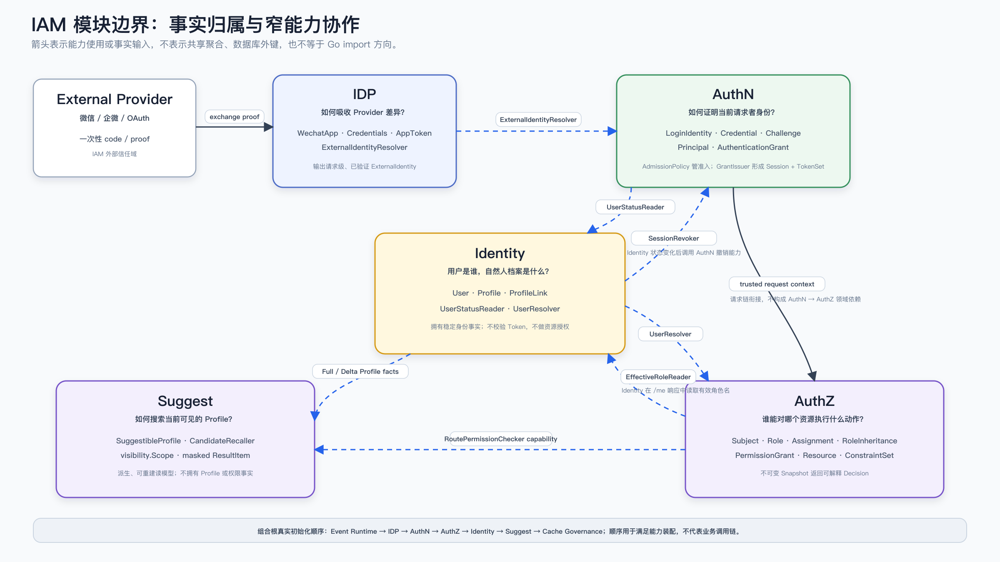

# IAM

IAM（Identity and Access Management，身份识别与访问管理）是一个面向业务系统接入的身份与访问管理服务。

它围绕“用户是谁、如何证明用户身份、用户能访问什么资源”三个核心问题，统一提供用户身份建模、账号认证、访问授权、第三方身份源接入、Profile 联想搜索读模型。
同时，它还提供 REST / gRPC / Go SDK 等多种接入方式，以便于业务系统接入和集成。

## 功能特性

IAM 可以拆解为三个核心模块和两个辅助模块。

### 核心模块

1. **Identity：用户身份与档案关系**

- 回答“系统中的用户是谁”、“用户与业务档案是什么关系”。
- 主要负责 User、Profile、ProfileLink 等身份关系模型。

2.**AuthN：认证**

- 回答“如何证明当前请求者是某个系统用户”。
- 主要负责账号体系、登录方式、凭证校验、Session、Token 签发与校验、JWKS、RefreshToken 等认证能力。

3.**AuthZ：授权**

- 回答“当前用户能否对某个资源执行某个操作”。
- 主要负责角色、资源、权限、角色绑定、策略判定、策略变更传播等授权能力。

### 辅助模块

1. **IDP：第三方身份源接入**

- 回答“如何接入外部身份提供方，并将外部身份映射为系统内账号或用户”。
- 主要服务于 AuthN，例如微信、小程序、公众号、企业微信、OAuth Provider 等身份源接入。

2.**Suggest：Profile 联想搜索读模型**

- 回答“如何根据关键词快速搜索候选用户档案”。
- 主要作为面向管理端、运营端或业务系统的辅助查询能力，不直接承担核心身份语义。

## 软件架构

### 分层与端口


[SVG 图源](docs/_images/architecture/layer-architecture.svg)

### 运行时与组合根


[SVG 图源](docs/_images/architecture/runtime-composition-lifecycle.svg)

| 层次 | 位置 | 职责 |
| --- | --- | --- |
| 进程入口 | [cmd/apiserver](cmd/apiserver) | iam-apiserver 服务入口 |
| 生命周期管理 | [internal/apiserver/process](internal/apiserver/process) | 配置、资源初始化、container、REST/gRPC、后台任务、优雅关闭 |
| 组合根 | [internal/apiserver/container](internal/apiserver/container) | 装配 AuthN、AuthZ、Identity、IDP、Suggest、Outbox 等模块 |
| REST 适配层 | [internal/apiserver/transport/rest](internal/apiserver/transport/rest) | HTTP 路由、中间件、DTO、错误映射、debug 接口、Suggest REST |
| gRPC 适配层 | [internal/apiserver/transport/grpc](internal/apiserver/transport/grpc) | Proto service 注册、interceptor、mapper |
| 应用层 | [internal/apiserver/application](internal/apiserver/application) | 用例编排、事务边界、命令/查询、跨模块协作 |
| 领域层 | [internal/apiserver/domain](internal/apiserver/domain) | 实体、值对象、领域服务、业务规则、端口定义 |
| 基础设施层 | [internal/apiserver/infra](internal/apiserver/infra) | MySQL、Redis、AuthZ 原生快照/内存角色图、JWT、Outbox、微信 API、Suggest Trie/Hash Runtime 等适配器 |
| SDK | [pkg/sdk](pkg/sdk) | Go 服务端接入 IAM 的产品化封装 |

**核心原则：**

```text
main 很薄；
process 管生命周期；
container 管组合装配；
transport 管协议适配；
application 管用例编排；
domain 管业务规则；
infra 管外部资源。
```

#### 模块边界



[SVG 图源](docs/_images/architecture/module-boundary.svg)

| 模块 | 边界 |
| --- | --- |
| AuthN | AuthN 负责认证态，负责 LoginIdentity、Credential、Session、Token、JWKS |
| AuthZ | AuthZ 负责访问权，负责 Subject、Role、Assignment、RoleInheritance、Resource Schema、PermissionGrant 与 ConstraintSet |
| Identity | Identity 负责用户和业务档案关系，负责 User、Profile、ProfileLink |
| IDP | IDP 负责外部身份源基础设施，负责微信、企微等外部身份源适配 |
| Suggest | Suggest 负责 Profile 联想搜索读模型，负责 Profile 联想搜索读模型 |

三个核心模块的事实所有权与协作边界见下图：


[SVG 图源](docs/_images/architecture/core-domain-model-v8.svg)

## 快速开始

### 依赖检查

运行 IAM 前，请确保本地环境已经安装以下依赖：

- Go 1.25+
- Make
- MySQL
- Redis
- Docker，可选，运行 API 契约校验时需要

### 构建

```bash
make deps
make build
```

### 运行

```bash
make run APISERVER_CONFIG=configs/apiserver.dev.yaml
```

### 健康检查

```bash
curl http://localhost:18081/health
curl http://localhost:18081/.well-known/jwks.json
```

### 测试

```bash
make test
```

常用质量检查：

```bash
make docs-hygiene
go test ./internal/pkg/architecture
go test ./pkg/sdk/...
```

涉及 REST 契约：

```bash
make docs-swagger
make api-validate
```

涉及 gRPC 契约：

```bash
make proto-gen
go test ./internal/apiserver/transport/grpc
```

涉及 Suggest：

```bash
go test ./internal/apiserver/domain/suggest/... \
  ./internal/apiserver/application/suggest/... \
  ./internal/apiserver/infra/suggest/... \
  ./internal/apiserver/infra/mysql/suggest/... \
  ./internal/apiserver/transport/rest/suggest/...
```

## 使用指南

IAM 支持 REST、gRPC 和 Go SDK 三种接入方式。

### REST API

REST API 适合 Web、App、管理后台、登录、HTTP 调试和 Suggest Profile autocomplete。

契约入口：

- [api/rest/README.md](api/rest/README.md)
- [api/rest/authn.v3.yaml](api/rest/authn.v3.yaml)
- [api/rest/authz.v4.yaml](api/rest/authz.v4.yaml)
- [api/rest/identity.v2.yaml](api/rest/identity.v2.yaml)
- [api/rest/idp.v2.yaml](api/rest/idp.v2.yaml)
- [api/rest/suggest.v2.yaml](api/rest/suggest.v2.yaml)

Suggest REST 重点接口：

```http
GET /api/v2/suggest/profile?k={keyword}&limit={limit}
```

响应语义：

```text
候选结果必须经过 ProfileAccessScope 过滤；
手机号形态关键词需要 AllowMobileSearch；
响应只返回 mobile_mask，不返回明文 mobile。
```

### gRPC API

gRPC 面向可信服务间调用，当前发布 v2 proto。

契约入口：

- [api/grpc/README.md](api/grpc/README.md)
- [api/grpc/iam/authn/v3/authn.proto](api/grpc/iam/authn/v3/authn.proto)
- [api/grpc/iam/authz/v4/authz.proto](api/grpc/iam/authz/v4/authz.proto)
- [api/grpc/iam/identity/v2/identity.proto](api/grpc/iam/identity/v2/identity.proto)
- [api/grpc/iam/idp/v2/idp.proto](api/grpc/iam/idp/v2/idp.proto)

### Go SDK

Go 服务端推荐通过官方 SDK 接入 IAM。

入口：

- [pkg/sdk/README.md](pkg/sdk/README.md)
- [pkg/sdk](pkg/sdk)

示例：

```go
package main

import (
    "context"
    "log"

    authnv3 "github.com/FangcunMount/iam/v5/api/grpc/iam/authn/v3"
    sdk "github.com/FangcunMount/iam/v5/pkg/sdk"
)

func main() {
    ctx := context.Background()

    client, err := sdk.NewClient(ctx, &sdk.Config{
        Endpoint: "localhost:8081",
    })
    if err != nil {
        log.Fatal(err)
    }
    defer client.Close()

    resp, err := client.Auth().VerifyToken(ctx, &authnv3.VerifyTokenRequest{
        AccessToken: "jwt-token",
    })
    if err != nil {
        log.Fatal(err)
    }

    log.Printf("valid=%v", resp.GetValid())
}
```

SDK 是接入产品层，不是业务层。

它封装 REST/gRPC/JWKS/mTLS/AuthZ Check 等接入复杂度，但不定义 IAM 业务规则。

## 文档导航

新版文档中心位于 [docs/README.md](docs/README.md)。

推荐入口：

| 你想了解 | 推荐阅读 |
| --- | --- |
| IAM 是什么，整体架构怎么分层 | [docs/00-概览/README.md](docs/00-概览/README.md) |
| 服务如何启动、装配和关闭 | [docs/01-运行时/README.md](docs/01-运行时/README.md) |
| User、Profile、ProfileLink 如何建模 | [docs/02-业务模块/01-Identity/README.md](docs/02-业务模块/01-Identity/README.md) |
| 登录、Session、Token、JWKS 如何工作 | [docs/02-业务模块/02-AuthN/README.md](docs/02-业务模块/02-AuthN/README.md) |
| 授权模型、Check、Outbox 如何工作 | [docs/02-业务模块/03-AuthZ/README.md](docs/02-业务模块/03-AuthZ/README.md) |
| IDP 与第三方身份源如何协作 | [docs/02-业务模块/04-IDP/README.md](docs/02-业务模块/04-IDP/README.md) |
| Suggest Profile 联想搜索读模型如何工作 | [docs/02-业务模块/05-Suggest/README.md](docs/02-业务模块/05-Suggest/README.md) |
| REST/gRPC/SDK 如何接入 | [docs/04-接口与SDK/README.md](docs/04-接口与SDK/README.md) |

```text
docs/
├── 00-概览/
├── 01-运行时/
├── 02-业务模块/
│   ├── 01-Identity/
│   ├── 02-AuthN/
│   ├── 03-AuthZ/
│   ├── 04-IDP/
│   └── 05-Suggest/
├── 03-基础设施/
├── 04-接口与SDK/
├── 05-工程质量与运维/
├── 06-专题设计/
├── _archive/
└── README.md
```

## 如何贡献

提交代码或文档时，请遵守以下规则。

### 保持分层边界

- domain 不依赖 infra/database；
- application 不依赖 transport/infra；
- transport 不直接访问 container 或全局配置；
- container 只做组合根，不处理请求；
- Suggest REST handler 不直接操作 Trie/Hash；
- Suggest domain 不依赖 infra/search。

### 同步机器契约

- 修改 REST 路由时同步 `api/rest`；
- 修改 Suggest REST 时同步 `api/rest/suggest.v2.yaml`；
- 修改 gRPC service/message 时同步 `api/grpc`；
- 修改 SDK 公开 API 时同步 `pkg/sdk` 文档和 compile test。

### 同步文档

- 代码行为变化时更新 `docs/`；
- Suggest 行为变化时同步 `docs/02-业务模块/05-Suggest` 和 `docs/06-专题设计` 中相关表达；
- 不从 `_archive` 复制当前事实；
- 不恢复旧目录作为 active 文档入口。

### 保护安全边界

- Suggest 查询必须经过 `ProfileAccessScope` 过滤；
- 不把 `ProfileLink` 写成 `ProfileAccessScope`；
- 不返回明文 mobile，只返回 `mobile_mask`；
- 降级时不能绕过权限直接查全局 MySQL。

### 运行验证

```bash
make docs-hygiene
go test ./internal/pkg/architecture
make api-validate
make proto-gen
go test ./pkg/sdk/...
go test ./internal/apiserver/domain/suggest/... \
  ./internal/apiserver/application/suggest/... \
  ./internal/apiserver/infra/suggest/... \
  ./internal/apiserver/infra/mysql/suggest/... \
  ./internal/apiserver/transport/rest/suggest/...
```

## 关于作者

本项目由 FangcunMount 维护。

## 许可证

本项目采用 Apache License 2.0 开源许可证，详见 [LICENSE](LICENSE)。
