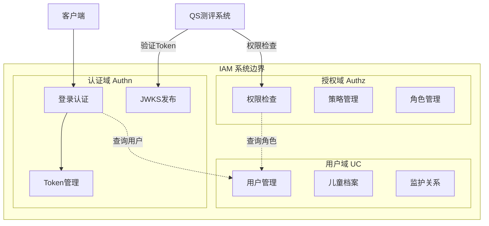
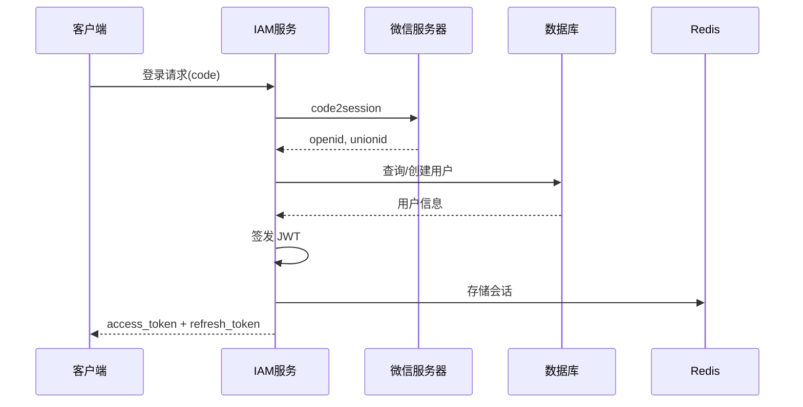
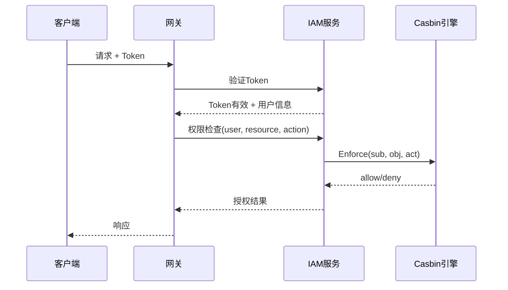

# IAM 系统架构总览

> 🎯 **核心定位**: 基于六边形架构 + DDD + CQRS 的企业级身份与访问管理平台

---

## 1. 系统定位

### 1.1 是什么

IAM (Identity & Access Management) 是为心理健康测评平台提供的统一身份认证与授权服务，支持：

- **统一认证**: 微信小程序、Web 管理后台多端登录
- **细粒度授权**: 基于 RBAC 的资源级权限控制
- **监护关系**: 家长监护未成年人完成心理测评

### 1.2 技术栈

| 层次 | 技术选型 | 说明 |
|------|---------|------|
| 语言 | Go 1.21+ | 高性能、强类型 |
| Web框架 | Gin | 轻量级 HTTP 框架 |
| 数据库 | MySQL 8.0 | 关系型存储 |
| 缓存 | Redis 7.0 | 会话、权限缓存 |
| 授权引擎 | Casbin | RBAC 策略引擎 |
| API | REST + gRPC | 双协议支持 |

---

## 2. 架构设计

### 2.1 六边形架构全景图

```text
┌─────────────────────────────────────────────────────────────────┐
│                        External World                            │
│  ┌──────────┐  ┌──────────┐  ┌──────────┐  ┌──────────┐        │
│  │  REST    │  │  gRPC    │  │  Event   │  │  CLI     │        │
│  │  API     │  │  API     │  │  Bus     │  │          │        │
│  └────┬─────┘  └────┬─────┘  └────┬─────┘  └────┬─────┘        │
│       │             │              │             │               │
│       │      Primary Adapters (Driving)          │               │
│       └─────────────┴──────────────┴─────────────┘               │
│                              │                                   │
│                              ▼                                   │
│       ┌──────────────────────────────────────────────┐          │
│       │            Application Layer                  │          │
│       │  ┌────────────────────────────────────────┐  │          │
│       │  │         Domain Layer (核心业务)         │  │          │
│       │  │  - Entities      - Value Objects       │  │          │
│       │  │  - Domain Services                     │  │          │
│       │  │  - Domain Ports                        │  │          │
│       │  └────────────────────────────────────────┘  │          │
│       └──────────────────────────────────────────────┘          │
│                              │                                   │
│       ┌──────────────────────┴───────────────────────┐          │
│       │         Secondary Adapters (Driven)          │          │
│       └──────────────────────┬───────────────────────┘          │
│  ┌────────┴──────┬──────────┴──────┬──────────┴──────┐         │
│  │   MySQL       │    Redis        │    External     │         │
│  │   Repository  │    Cache        │    Services     │         │
│  └───────────────┴─────────────────┴─────────────────┘         │
└─────────────────────────────────────────────────────────────────┘
```

### 2.2 领域划分



### 2.3 CQRS 模式

```text
┌─────────────────────────────────────────────────────────────┐
│                      Handler Layer                           │
├─────────────────────────────────────────────────────────────┤
│  UserHandler / AuthHandler / ChildHandler                    │
│       │ (写操作)                    │ (读操作)               │
│       ▼                             ▼                        │
│  ApplicationService            QueryService                  │
├─────────────────────────────────────────────────────────────┤
│                   Application Layer (CQRS)                   │
├─────────────────────────────────────────────────────────────┤
│  UserApplicationService          UserQueryApplicationService │
│  - Register()                    - GetByID()                 │
│  - UpdateProfile()               - GetByPhone()              │
│  - BindChild()                   - ListChildren()            │
├─────────────────────────────────────────────────────────────┤
│                      Domain Layer                            │
├─────────────────────────────────────────────────────────────┤
│  RegisterService                 QueryService (只读)         │
│  ProfileService                                              │
├─────────────────────────────────────────────────────────────┤
│                   Infrastructure Layer                       │
├─────────────────────────────────────────────────────────────┤
│  Repository (写)                 ReadRepository (读)         │
└─────────────────────────────────────────────────────────────┘
```

---

## 3. 核心流程

### 3.1 认证流程



### 3.2 授权流程



---

## 4. 代码结构

```text
iam-contracts/
├── cmd/                          # 入口
│   └── apiserver/                # API 服务入口
├── internal/                     # 内部实现
│   └── apiserver/
│       ├── domain/               # 领域层 ⭐
│       │   ├── authn/            # 认证域
│       │   ├── authz/            # 授权域
│       │   └── uc/               # 用户域
│       ├── application/          # 应用层
│       ├── infra/                # 基础设施层
│       └── interface/            # 接口层
├── pkg/                          # 公共包
│   ├── auth/                     # 认证工具
│   └── handler/                  # Handler基类
├── api/                          # API 定义
│   ├── grpc/                     # Proto 文件
│   └── rest/                     # OpenAPI 规范
└── docs/                         # 文档
```

---

## 5. 设计原则

| 原则 | 应用 |
|------|------|
| **依赖倒置** | 领域层定义端口，基础设施层实现 |
| **单一职责** | 每个聚合根只处理自己的业务规则 |
| **开闭原则** | 新增认证方式只需添加策略，不修改核心 |
| **接口隔离** | 细粒度的端口定义 |

---

## 6. 相关文档

| 文档 | 说明 |
|------|------|
| [核心概念术语](./02-核心概念术语.md) | 领域术语表 |
| [认证域设计](../01-认证域/README.md) | 认证模块详细设计 |
| [授权域设计](../02-授权域/README.md) | 授权模块详细设计 |
| [用户域设计](../03-用户域/README.md) | 用户模块详细设计 |
