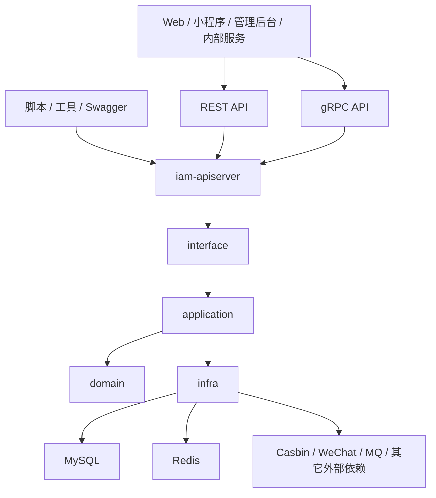
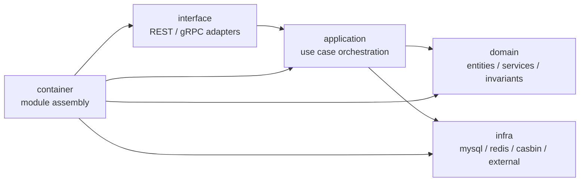
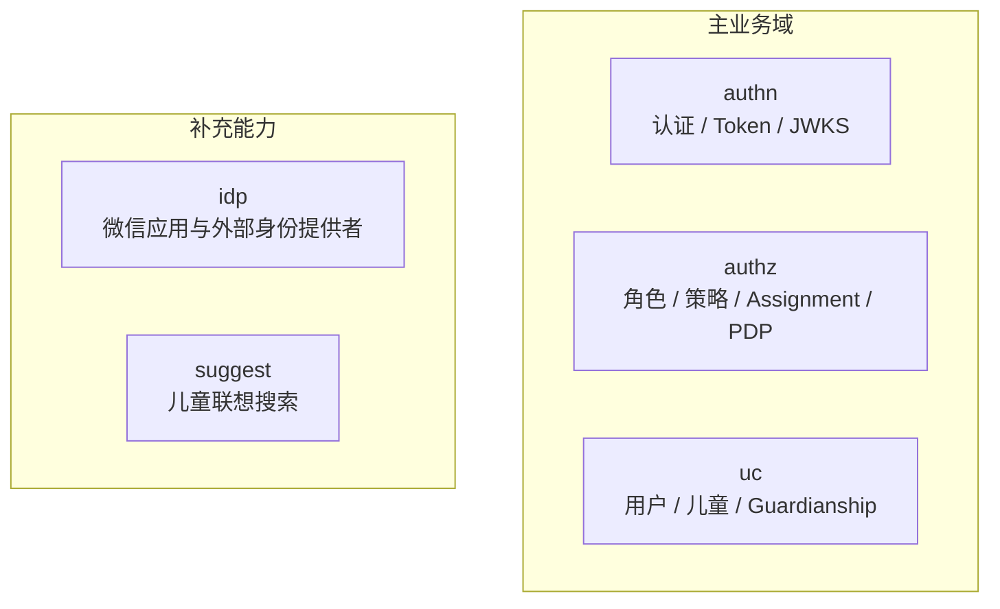
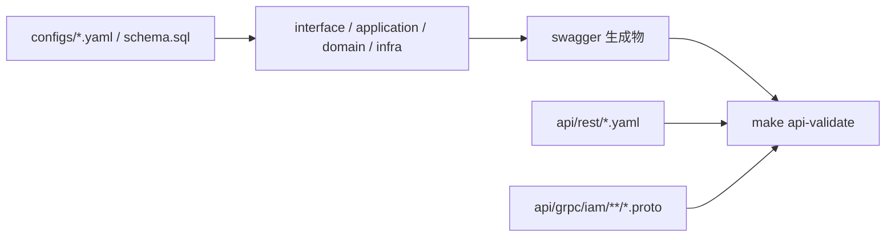

# IAM 系统架构总览

## 本文回答

本文只回答 4 件事：

1. 当前系统到底由什么主运行单元组成，对外暴露什么能力
2. 代码和模块今天是怎么组织的
3. 主业务域与补充能力如何划分
4. 契约、配置、校验链为什么构成了这套系统的事实来源

## 30 秒结论

> **一句话**：`iam-contracts` 当前是一个以 **`iam-apiserver` 单主进程** 为中心的 IAM 系统，REST / gRPC / JWKS / SDK 最终都围绕同一套 `interface -> application -> domain -> infra -> container` 组织；主业务域是 **`authn / authz / 用户域（代码目录 `uc`）`**，补充能力包括 **`idp / suggest`**；而 `api/rest`、`api/grpc`、`configs/*`、`make api-validate` 这条校验链，共同决定了“系统今天到底是什么”。

| 主题 | 当前答案 |
| ---- | ---- |
| 主运行单元 | `iam-apiserver`，同时承载 REST、gRPC、模块装配和主要业务能力 |
| 核心代码组织 | `internal/apiserver/{interface,application,domain,infra,container}` |
| 主业务域 | `authn`、`authz`、用户域（代码目录 `uc`） |
| 补充能力 | `idp`、`suggest` |
| 契约真值 | `api/rest/*.yaml`、`api/grpc/iam/**/*.proto` |
| 运行配置与验证 | `configs/*`、`internal/apiserver/docs/swagger.yaml`、`make api-validate` |

## 重点速查

| 关注点 | 当前答案 | 真实落点 |
| ---- | ---- | ---- |
| 进程入口 | 单主进程 `iam-apiserver` | [../../cmd/apiserver/apiserver.go](../../cmd/apiserver/apiserver.go) |
| REST / gRPC 暴露 | 都由同一进程承载 | [../../internal/apiserver/routers.go](../../internal/apiserver/routers.go)、[../../internal/apiserver/server.go](../../internal/apiserver/server.go) |
| 核心代码分层 | `interface / application / domain / infra / container` | [../../internal/apiserver/](../../internal/apiserver/) |
| 主业务域 | `authn / authz / 用户域（uc）` | [../../internal/apiserver/domain/authn](../../internal/apiserver/domain/authn)、[../../internal/apiserver/domain/authz](../../internal/apiserver/domain/authz)、[../../internal/apiserver/domain/uc](../../internal/apiserver/domain/uc) |
| 补充能力 | `idp / suggest` | [../../internal/apiserver/domain/idp](../../internal/apiserver/domain/idp)、[../../internal/apiserver/domain/suggest](../../internal/apiserver/domain/suggest) |
| REST 契约 | OpenAPI 文件 | [../../api/rest](../../api/rest) |
| gRPC 契约 | Proto 文件 | [../../api/grpc/iam](../../api/grpc/iam) |
| Swagger 生成物 | 从代码生成并参与比对 | [../../internal/apiserver/docs/swagger.yaml](../../internal/apiserver/docs/swagger.yaml) |
| 配置与 schema | 运行配置、ACL、MySQL schema | [../../configs](../../configs) |
| 契约校验链 | OpenAPI lint + swagger 对表 + route 对表 | `make api-validate`、[../../scripts/validate-openapi.sh](../../scripts/validate-openapi.sh) |

## 1. 当前系统到底由什么主运行单元组成，对外暴露什么能力

这一部分先回答“系统长什么样”，而不是先解释代码目录。

### 1.1 运行时总图


```mermaid
flowchart TB
    Client["Web / 小程序 / 管理后台 / 内部服务"]
    REST["REST API"]
    GRPC["gRPC API"]
    Tool["脚本 / 工具 / Swagger"]
    App["iam-apiserver"]
    Interface["interface"]
    Application["application"]
    Domain["domain"]
    Infra["infra"]
    MySQL["MySQL"]
    Redis["Redis"]
    External["Casbin / WeChat / MQ / 其它外部依赖"]

    Client --> REST
    Client --> GRPC
    Tool --> App
    REST --> App
    GRPC --> App
    App --> Interface --> Application --> Domain
    Application --> Infra
    Infra --> MySQL
    Infra --> Redis
    Infra --> External
```

**图意**：今天不是多个分散业务服务共同组成 IAM，而是一个中心进程承载主要对外能力；REST、gRPC、脚本和生成物最终都围绕同一套核心分层运转。

### 1.2 主运行单元：`iam-apiserver`

当前主入口在 [../../cmd/apiserver/apiserver.go](../../cmd/apiserver/apiserver.go)。

它至少承担了这些职责：

| 能力 | 当前承载方式 |
| ---- | ---- |
| REST 暴露 | 通过 Gin Router 注册 |
| gRPC 暴露 | 由同一进程启动 gRPC server 并注册服务 |
| Swagger | 由代码注释与生成物支撑 |
| 模块装配 | `container` 统一初始化 authn / authz / user（用户域） / idp / suggest |

### 1.3 对外暴露面今天包括什么

基于当前注册情况，可以把系统对外暴露面概括成：

| 面向 | 当前能力 |
| ---- | ---- |
| REST | authn、authz、identity、idp、suggest、健康检查、debug 路由 |
| gRPC | authn、jwks、authz、identity、idp |
| SDK | `pkg/sdk` 作为统一接入层 |
| JWKS | `/.well-known/jwks.json` |

对应运行时注册锚点：

- [../../internal/apiserver/routers.go](../../internal/apiserver/routers.go)
- [../../internal/apiserver/interface/authn/grpc/service.go](../../internal/apiserver/interface/authn/grpc/service.go)
- [../../internal/apiserver/interface/authz/grpc/service.go](../../internal/apiserver/interface/authz/grpc/service.go)
- [../../internal/apiserver/interface/uc/grpc/identity/service.go](../../internal/apiserver/interface/uc/grpc/identity/service.go)
- [../../internal/apiserver/interface/idp/grpc/service.go](../../internal/apiserver/interface/idp/grpc/service.go)

## 2. 代码和模块今天是怎么组织的

这一部分回答“如果要读代码，先抓哪条组织主线”。

### 2.1 分层关系图


```mermaid
flowchart LR
    Interface["interface<br/>REST / gRPC adapters"]
    Application["application<br/>use case orchestration"]
    Domain["domain<br/>entities / services / invariants"]
    Infra["infra<br/>mysql / redis / casbin / external"]
    Container["container<br/>module assembly"]

    Interface --> Application
    Application --> Domain
    Application --> Infra
    Container --> Interface
    Container --> Application
    Container --> Domain
    Container --> Infra
```

**图意**：日常读代码时，真正稳定的主线不是某个目录名字，而是 `interface -> application -> domain -> infra` 的依赖方向，再由 `container` 负责把模块装起来。

### 2.2 代码主目录

```text
iam-contracts/
├── cmd/
│   └── apiserver/                # 进程入口
├── internal/
│   └── apiserver/
│       ├── interface/            # REST / gRPC 适配层
│       ├── application/          # 用例编排层
│       ├── domain/               # 核心业务规则
│       ├── infra/                # MySQL / Redis / Casbin / 外部客户端
│       ├── container/            # 装配与依赖注入
│       └── docs/                 # swagger 生成物
├── api/
│   ├── rest/                     # OpenAPI 合同
│   └── grpc/                     # Proto 合同
├── configs/                      # 运行配置、ACL、schema
├── build/docker/                 # Docker 构建与 compose
├── scripts/                      # 校验、生成、开发脚本
└── docs/                         # prose 解释层
```

### 2.3 模块装配今天怎么读

如果要理解“模块怎么进进程”，更合适的读法是：

1. 从 [../../internal/apiserver/container/container.go](../../internal/apiserver/container/container.go) 看整体初始化顺序
2. 再看各 `*Module`：
   - [../../internal/apiserver/container/assembler/authn.go](../../internal/apiserver/container/assembler/authn.go)
   - [../../internal/apiserver/container/assembler/authz.go](../../internal/apiserver/container/assembler/authz.go)
   - [../../internal/apiserver/container/assembler/user.go](../../internal/apiserver/container/assembler/user.go)
   - [../../internal/apiserver/container/assembler/idp.go](../../internal/apiserver/container/assembler/idp.go)
   - [../../internal/apiserver/container/assembler/suggest.go](../../internal/apiserver/container/assembler/suggest.go)

**结论**：系统的“模块化”今天不是多个独立进程，而是一个进程里由 `container` 统一装配多块业务能力。

## 3. 主业务域与补充能力如何划分

这一部分先回答“系统到底在做哪几类事”。

### 3.1 领域地图


```mermaid
graph TB
    subgraph "主业务域"
        Authn["authn<br/>认证 / Token / JWKS"]
        Authz["authz<br/>角色 / 策略 / Assignment / PDP"]
        UC["uc<br/>用户 / 儿童 / Guardianship"]
    end

    subgraph "补充能力"
        IDP["idp<br/>微信应用与外部身份提供者"]
        Suggest["suggest<br/>儿童联想搜索"]
    end
```

### 3.2 主业务域

| 业务域 | 当前主要负责什么 |
| ---- | ---- |
| `authn` | 登录认证、Token 生命周期、JWKS 发布与轮换 |
| `authz` | 角色、资源、策略、Assignment、单次 PDP |
| `uc` | 用户、儿童、监护关系、身份生命周期 |

### 3.3 补充能力

| 能力 | 当前位置 | 当前阅读建议 |
| ---- | ---- | ---- |
| `idp` | `internal/apiserver/domain/idp` | 先看接口与代码，再回业务域与专题 |
| `suggest` | `internal/apiserver/domain/suggest` | 已有现状正文，可直接看 [../02-业务域/04-suggest-儿童联想搜索.md](../02-业务域/04-suggest-儿童联想搜索.md) |

**结论**：如果只想抓住系统主轴，先读 `authn / authz / 用户域（uc）`；`idp / suggest` 更适合作为补充能力理解。

## 4. 契约、配置、校验链为什么构成了这套系统的事实来源

这一部分回答“哪些地方是今天最可信的真值”。

### 4.1 真值关系图


```mermaid
flowchart LR
    Code["interface / application / domain / infra"]
    Swagger["swagger 生成物"]
    REST["api/rest/*.yaml"]
    GRPC["api/grpc/iam/**/*.proto"]
    Config["configs/*.yaml / schema.sql"]
    Verify["make api-validate"]

    Code --> Swagger
    Swagger --> Verify
    REST --> Verify
    GRPC --> Verify
    Config --> Code
```

**图意**：今天系统的“事实来源”不是单一文件，而是代码、机器契约、配置和校验链共同构成的。

### 4.2 机器契约层

| 类型 | 路径 |
| ---- | ---- |
| REST | `api/rest/authn.v1.yaml`、`authz.v1.yaml`、`identity.v1.yaml`、`idp.v1.yaml`、`suggest.v1.yaml` |
| gRPC | `api/grpc/iam/authn/v1/authn.proto`、`authz/v1/authz.proto`、`identity/v1/identity.proto`、`idp/v1/idp.proto` |
| 生成物 | `internal/apiserver/docs/swagger.yaml` |

### 4.3 配置与运行事实

| 类型 | 路径 |
| ---- | ---- |
| apiserver 配置 | `configs/apiserver.*.yaml` |
| gRPC ACL | `configs/grpc_acl.yaml` |
| Casbin 模型 | `configs/casbin_model.conf` |
| MySQL schema | `configs/mysql/schema.sql` |

### 4.4 校验链

当前已经存在一条真实可跑的校验链：

- `make docs-swagger`
- `make docs-reset`
- `make proto-gen`
- `make api-validate`

**结论**：总览层里的任何“接口”或“配置”判断，都不应脱离这些真值和校验链来讲。

## 继续往下读

| 文档 | 说明 |
| ---- | ---- |
| [README.md](./README.md) | 概览层入口 |
| [02-核心概念术语.md](./02-核心概念术语.md) | 统一术语口径 |
| [03-阅读路径&代码组织与事实来源.md](./03-阅读路径&代码组织与事实来源.md) | 阅读顺序与事实来源优先级 |
| [../01-运行时/README.md](../01-运行时/README.md) | 回到进程、注册与运行时边界 |
| [../02-业务域/README.md](../02-业务域/README.md) | 回到模块静态设计 |
| [../03-接口与集成/README.md](../03-接口与集成/README.md) | 回到契约与接入层 |
| [../05-专题分析/README.md](../05-专题分析/README.md) | 回到跨层主链与设计判断 |
