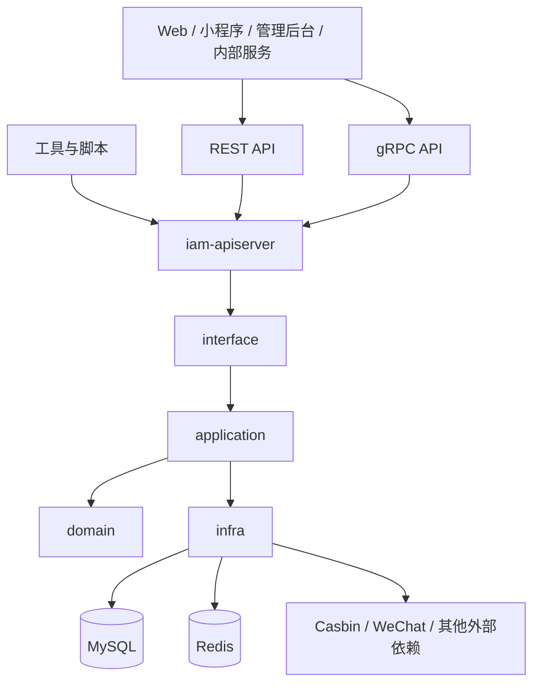
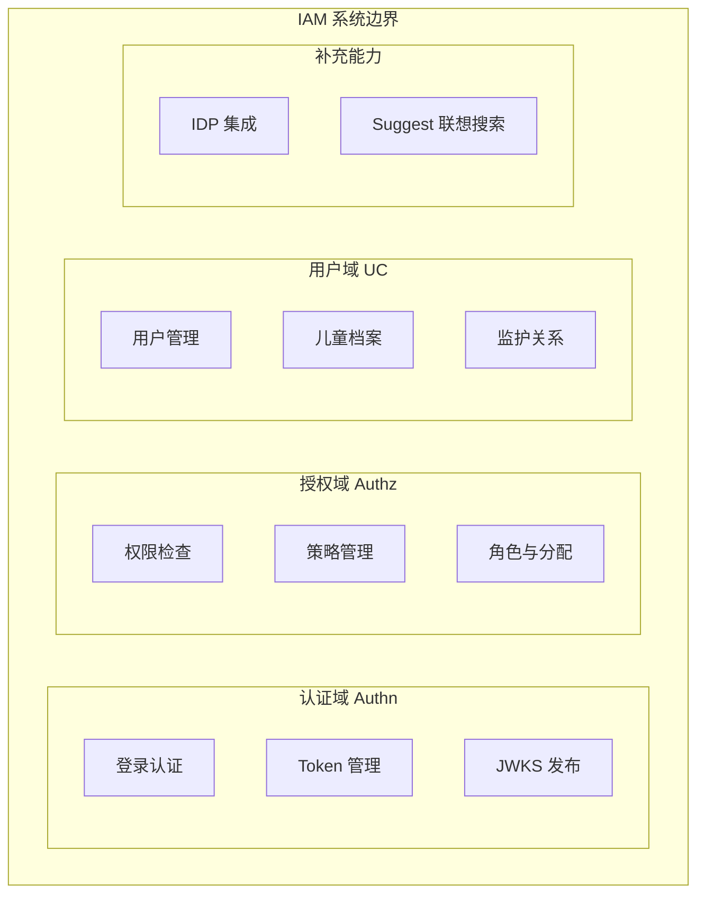

# IAM 系统架构总览

本文回答：`iam-contracts` 当前到底由哪些运行入口、核心分层、契约层和主业务域组成，以及读者从哪里验证这些说法。

## 30 秒结论

- 当前主运行单元是 `iam-apiserver`，入口在 `cmd/apiserver/apiserver.go`；它同时承载 REST、gRPC 和主要业务装配。
- 代码主分层是 `internal/apiserver/{interface,application,domain,infra}`，这是理解六边形架构和 DDD 落地的第一入口。
- 当前主业务域是 `authn`、`authz`、`uc`，另有 `idp`、`suggest` 等补充能力；`suggest` 已补现状版正文，`idp` 的解释层仍相对薄。
- `api/rest/*.yaml` 和 `api/grpc/**/*.proto` 是机器契约层，`internal/apiserver/docs/swagger.yaml` 是生成物；提交前可用 `make api-validate` 检查契约漂移。
- 运行配置和部署事实主要落在 `configs/*.yaml`、`build/docker/`、`scripts/`，不是只看概览文档。

## 重点速查

| 关注点 | 当前答案 | 真实落点 |
| ---- | ---- | ---- |
| 运行入口 | 单主进程 `iam-apiserver` | `cmd/apiserver/apiserver.go` |
| 核心代码分层 | interface / application / domain / infra | `internal/apiserver/` |
| 主业务域 | authn / authz / uc | `internal/apiserver/domain/{authn,authz,uc}` |
| 补充能力 | idp / suggest | `internal/apiserver/domain/{idp,suggest}` |
| REST 合同 | OpenAPI 3.1 文件 | `api/rest/*.yaml` |
| gRPC 合同 | Proto 文件 | `api/grpc/iam/**/*.proto` |
| Swagger 生成物 | 从代码生成并参与比对 | `internal/apiserver/docs/swagger.yaml` |
| 契约校验 | OpenAPI lint + swagger 对表 + route 对表 | `make api-validate`、`scripts/validate-openapi.sh` |
| 运行配置 | 开发/生产配置、ACL、schema | `configs/apiserver.*.yaml`、`configs/grpc_acl.yaml`、`configs/mysql/schema.sql` |

## 1. 系统定位

### 1.1 是什么

IAM (Identity & Access Management) 是为心理健康测评平台提供统一身份认证与访问控制能力的服务层，当前主要承担：

- **统一认证**：面向 Web、运营后台、小程序等场景提供登录、会话、JWT/JWKS 能力。
- **细粒度授权**：围绕角色、策略、资源与分配关系做权限判定。
- **身份与监护关系**：维护用户、儿童、监护关系等业务数据，并对外暴露 REST / gRPC 能力。

### 1.2 技术栈

| 层次 | 技术选型 | 说明 |
| ---- | ---- | ---- |
| 语言 | Go 1.21+ | 主实现语言 |
| Web 框架 | Gin | REST 接口层 |
| 数据库 | MySQL 8.0 | 关系型存储 |
| 缓存 | Redis 7.0 | 会话、缓存 |
| 授权引擎 | Casbin | 权限决策与策略执行 |
| API | REST + gRPC | 双协议对外能力 |

## 2. 系统形状

### 2.1 运行时总图


```mermaid
flowchart TB
    Client[Web / 小程序 / 管理后台 / 内部服务]
    Rest[REST API]
    Grpc[gRPC API]
    Tool[工具与脚本]
    App[iam-apiserver]
    Interface[interface]
    Application[application]
    Domain[domain]
    Infra[infra]
    MySQL[(MySQL)]
    Redis[(Redis)]
    External[Casbin / WeChat / 其他外部依赖]

    Client --> Rest
    Client --> Grpc
    Tool --> App
    Rest --> App
    Grpc --> App
    App --> Interface --> Application --> Domain
    Application --> Infra
    Infra --> MySQL
    Infra --> Redis
    Infra --> External
```

这个图刻意先回答三件事：

- 当前主运行单元是一个 `iam-apiserver` 进程，而不是多个业务服务拼起来的网格。
- REST、gRPC、工具脚本都围绕同一套 application / domain / infra 组织。
- 读者若要验证边界，应回到 `cmd/apiserver/apiserver.go`、`internal/apiserver/` 和 `api/` 契约层。

### 2.2 领域划分


```mermaid
graph TB
    subgraph "IAM 系统边界"
        subgraph "认证域 Authn"
            A1[登录认证]
            A2[Token 管理]
            A3[JWKS 发布]
        end

        subgraph "授权域 Authz"
            B1[权限检查]
            B2[策略管理]
            B3[角色与分配]
        end

        subgraph "用户域 UC"
            C1[用户管理]
            C2[儿童档案]
            C3[监护关系]
        end

        subgraph "补充能力"
            D1[IDP 集成]
            D2[Suggest 联想搜索]
        end
    end
```

当前 prose 文档主线仍集中在 `Authn / Authz / UC` 三个业务域；`Suggest` 已补到 [../02-业务域/04-suggest-儿童联想搜索.md](../02-业务域/04-suggest-儿童联想搜索.md)，`IDP` 目前仍主要回到 `api/` 和代码目录补证据。

### 2.3 契约层与解释层

| 层 | 主要回答什么 | 主要位置 |
| ---- | ---- | ---- |
| **解释层** | 为什么这样拆、边界在哪、链路怎么走 | `docs/` |
| **REST 契约层** | 路由、字段、响应、错误 | `api/rest/*.yaml` |
| **gRPC 契约层** | RPC、消息体、兼容性约束 | `api/grpc/iam/**/*.proto` |
| **生成物 / 比对层** | 代码实际暴露了什么、是否与契约漂移 | `internal/apiserver/docs/swagger.yaml`、`scripts/check-*.py` |

## 3. 代码结构

```text
iam-contracts/
├── cmd/
│   └── apiserver/                # 进程入口
├── internal/
│   └── apiserver/
│       ├── interface/            # REST / gRPC 适配层
│       ├── application/          # 用例编排层
│       ├── domain/               # 核心业务规则
│       ├── infra/                # MySQL / Redis / Casbin / 外部客户端
│       ├── container/            # 装配与依赖注入
│       └── docs/                 # swagger 生成物
├── api/
│   ├── rest/                     # OpenAPI 合同
│   └── grpc/                     # Proto 合同
├── configs/                      # 运行配置、ACL、schema
├── build/docker/                 # Docker 构建与 compose
├── scripts/                      # 校验、生成、开发脚本
└── docs/                         # prose 解释层
```

### 3.1 真实落点

| 关注点 | 路径 | 说明 |
| ---- | ---- | ---- |
| 进程入口 | `cmd/apiserver/apiserver.go` | 程序启动与 swagger 导入 |
| 认证接口层 | `internal/apiserver/interface/authn/` | REST / gRPC 入口 |
| 授权接口层 | `internal/apiserver/interface/authz/` | 权限相关入口 |
| 用户接口层 | `internal/apiserver/interface/uc/` | 用户、儿童、监护接口 |
| 域模型 | `internal/apiserver/domain/` | authn / authz / uc / idp / suggest |
| 应用服务 | `internal/apiserver/application/` | 用例级编排 |
| 基础设施 | `internal/apiserver/infra/` | mysql / redis / casbin / wechatapi / messaging |

## 4. 当前架构读法

### 4.1 六边形架构在本仓库里的位置

这套仓库的六边形架构，不应只停留在概念图上。当前更实用的读法是：

1. 从 `interface/` 看有哪些对外输入面。
2. 从 `application/` 看每个用例是怎么编排的。
3. 从 `domain/` 看聚合、实体、值对象和领域服务。
4. 从 `infra/` 看 MySQL、Redis、Casbin、Wechat 等适配器如何落地。

如果需要继续下钻，请读 [04-基础设施与运维/01-六边形架构实践.md](../04-基础设施与运维/01-六边形架构实践.md)。

### 4.2 CQRS 在本仓库中的位置

当前仓库确实把 CQRS 当作重要方法论，但在总览层里更重要的是理解它的**使用位置**，而不是背概念：

| 关注点 | 当前读法 |
| ---- | ---- |
| 写路径 | 通常由 interface -> application -> domain -> infra 完成 |
| 读路径 | 读模型、查询接口、批量读取能力更多体现在 application / infra 的职责划分上 |
| 更细设计 | 继续看 [04-基础设施与运维/02-CQRS模式实践.md](../04-基础设施与运维/02-CQRS模式实践.md) |

## 5. 契约与验证

### 5.1 机器契约入口

| 类型 | 路径 |
| ---- | ---- |
| REST | `api/rest/authn.v1.yaml`、`authz.v1.yaml`、`identity.v1.yaml`、`idp.v1.yaml`、`suggest.v1.yaml` |
| gRPC | `api/grpc/iam/authn/v1/authn.proto`、`identity/v1/identity.proto`、`idp/v1/idp.proto` |
| README | `api/README.md`、`api/rest/README.md`、`api/grpc/README.md` |

### 5.2 校验入口

当前仓库已经有一条真实可跑的契约校验链：

- `make docs-swagger`：从代码生成 `internal/apiserver/docs/swagger.yaml`
- `make docs-reset`：按规则从 swagger 回填 `api/rest` 路径
- `make proto-gen`：生成 protobuf 代码
- `make api-validate`：运行 spectral lint，并比对 swagger definitions / routes 与 `api/rest/*.yaml`

因此，总览文档中的任何接口层结论，都不应脱离这条校验链来表述。

## 6. 相关文档

| 文档 | 说明 |
| ---- | ---- |
| [README.md](./README.md) | 概览层入口与阅读方式 |
| [核心概念术语](./02-核心概念术语.md) | 领域术语表 |
| [阅读路径、代码组织与事实来源](./03-阅读路径、代码组织与事实来源.md) | 阅读顺序、代码定位与事实来源优先级 |
| [../01-运行时/01-服务入口、HTTP 与模块装配.md](../01-运行时/01-服务入口、HTTP 与模块装配.md) | `iam-apiserver` 启动链、HTTP 暴露面与模块装配 |
| [gRPC 与 mTLS](../01-运行时/02-gRPC与mTLS.md) | gRPC 运行时、安全与证书 |
| [../01-运行时/03-HTTP认证中间件与身份上下文.md](../01-运行时/03-HTTP认证中间件与身份上下文.md) | JWT 中间件、身份上下文与当前保护边界 |
| [../01-运行时/04-健康检查、debug 路由与降级启动边界.md](../01-运行时/04-健康检查、debug 路由与降级启动边界.md) | 探针、debug 路由与部分初始化边界 |
| [gRPC 契约与接入](../03-接口与集成/02-gRPC契约与接入.md) | Proto、metadata 与调用方式 |
| [认证、Token、JWKS](../02-业务域/01-authn-认证、Token、JWKS.md) | 认证域边界与主入口 |
| [角色、策略、资源、Assignment](../02-业务域/02-authz-角色、策略、资源、Assignment.md) | 授权域边界与主入口 |
| [用户、儿童、Guardianship](../02-业务域/03-user-用户、儿童、Guardianship.md) | 用户域边界与主入口 |
| [六边形架构实践](../04-基础设施与运维/01-六边形架构实践.md) | 分层与依赖方向 |
