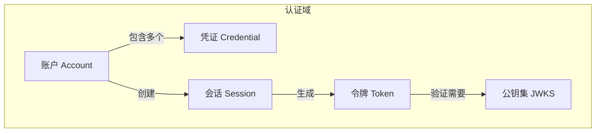
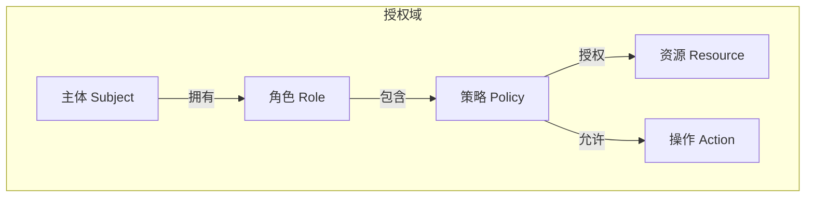
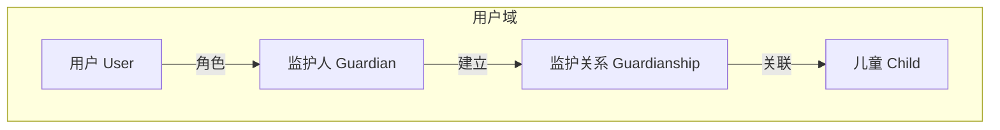
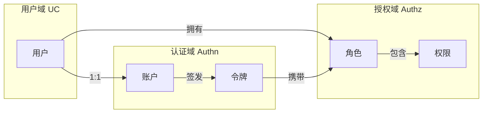

# 核心概念术语

> 📖 IAM 系统领域术语表与概念关系图

---

## 1. 领域术语

### 1.1 认证域 (Authn)

| 术语 | 英文 | 定义 |
|------|------|------|
| **账户** | Account | 用户的认证身份，包含多种凭证 |
| **凭证** | Credential | 认证凭据，如微信 OpenID、密码等 |
| **令牌** | Token | JWT 格式的访问凭证 |
| **访问令牌** | Access Token | 短期有效（15分钟），用于 API 访问 |
| **刷新令牌** | Refresh Token | 长期有效（7天），用于刷新访问令牌 |
| **会话** | Session | 用户的登录状态，存储在 Redis |
| **JWKS** | JSON Web Key Set | JWT 公钥集，业务服务可自行验签 |

### 1.2 授权域 (Authz)

| 术语 | 英文 | 定义 |
|------|------|------|
| **主体** | Subject | 请求权限的实体，通常是用户 |
| **资源** | Resource/Object | 被访问的对象，如 `user`、`child` |
| **操作** | Action | 对资源的操作，如 `read`、`write` |
| **角色** | Role | 权限的集合，如 `admin`、`guardian` |
| **策略** | Policy | 授权规则，定义谁可以做什么 |
| **RBAC** | Role-Based Access Control | 基于角色的访问控制 |

### 1.3 用户域 (UC)

| 术语 | 英文 | 定义 |
|------|------|------|
| **用户** | User | 系统中的成年用户 |
| **儿童** | Child | 未成年人档案，由监护人管理 |
| **监护人** | Guardian | 对儿童有监护权的用户 |
| **监护关系** | Guardianship | 监护人与儿童之间的绑定关系 |

---

## 2. 架构术语

### 2.1 六边形架构

| 术语 | 英文 | 定义 |
|------|------|------|
| **端口** | Port | 领域层定义的接口（输入/输出） |
| **适配器** | Adapter | 端口的具体实现 |
| **驱动适配器** | Driving Adapter | 调用应用的外部系统（如 REST API） |
| **被驱动适配器** | Driven Adapter | 被应用调用的外部系统（如数据库） |

### 2.2 DDD 概念

| 术语 | 英文 | 定义 |
|------|------|------|
| **聚合** | Aggregate | 一组相关对象的集合，有聚合根 |
| **聚合根** | Aggregate Root | 聚合的入口点，保证一致性 |
| **实体** | Entity | 有唯一标识的对象 |
| **值对象** | Value Object | 无标识，由属性定义的对象 |
| **领域服务** | Domain Service | 不属于任何实体的领域逻辑 |
| **领域事件** | Domain Event | 领域中发生的重要事件 |
| **仓储** | Repository | 聚合的持久化接口 |

### 2.3 CQRS

| 术语 | 英文 | 定义 |
|------|------|------|
| **命令** | Command | 改变系统状态的操作（写） |
| **查询** | Query | 不改变状态的读取操作 |
| **应用服务** | Application Service | 处理命令，编排领域对象 |
| **查询服务** | Query Service | 处理查询，可直接读数据库 |

---

## 3. 概念关系图

### 3.1 认证域概念关系

### 3.2 授权域概念关系

### 3.3 用户域概念关系

### 3.4 跨域关系

---

## 4. 缩写对照

| 缩写 | 全称 | 说明 |
|------|------|------|
| IAM | Identity & Access Management | 身份与访问管理 |
| UC | User Center | 用户中心 |
| Authn | Authentication | 认证 |
| Authz | Authorization | 授权 |
| JWT | JSON Web Token | JSON 网络令牌 |
| JWKS | JSON Web Key Set | JSON 网络密钥集 |
| RBAC | Role-Based Access Control | 基于角色的访问控制 |
| DDD | Domain-Driven Design | 领域驱动设计 |
| CQRS | Command Query Responsibility Segregation | 命令查询职责分离 |
