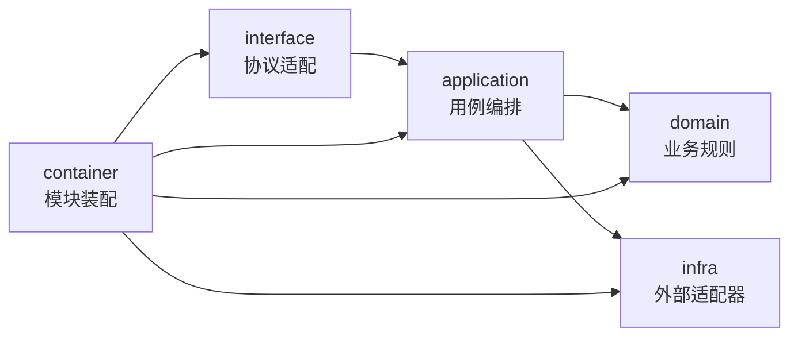
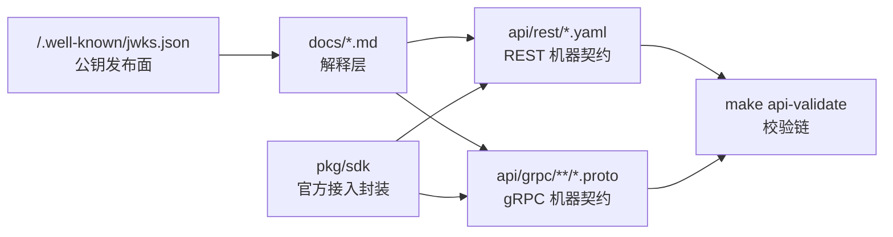

# 核心概念术语

## 本文回答

本文只回答 4 件事：

1. `iam-contracts` 当前最值得先记住的术语地图是什么
2. 认证、授权、用户域里的核心词各自是什么意思
3. 代码分层、契约、集成这些非业务术语今天应该怎么读
4. 哪些旧说法今天最容易造成误解，应该停止沿用

## 30 秒结论

> **一句话**：如果只先记住一件事，那么就记住 `iam-contracts` 今天是围绕 **`authn / authz / 用户域（代码目录 `uc`）`** 这三个主业务域组织起来的 IAM 系统；业务术语回答“系统在处理什么对象”，分层术语回答“代码放在哪一层”，契约术语回答“接口字段和接入方式以什么为准”，而旧说法最容易把“预留设计”误讲成“当前实现”。

| 术语层 | 最该先记住什么 |
| ---- | ---- |
| 业务域术语 | `authn` 看 `Account / Credential / Principal / Token / JWKS`；`authz` 看 `Role / Resource / PolicyRule / Assignment / PolicyVersion`；用户域（代码目录 `uc`）看 `User / Child / Guardianship` |
| 架构术语 | 当前更稳定的读法是 `interface -> application -> domain -> infra -> container` |
| 契约术语 | `api/rest/*.yaml` 和 `api/grpc/**/*.proto` 是机器契约层，`docs/` 负责解释，不替代契约 |
| 旧说法边界 | 不要把 `authz` 讲成完整授权平台，不要把 `uc` 讲成独立系统，不要把预留 claims / 预留事件流讲成已稳定落地 |

## 重点速查

| 如果你想回答的问题 | 先记住什么 | 深读哪里 |
| ---- | ---- | ---- |
| 认证域里的账户、凭据、Token、JWKS 分别是什么 | `Account / Credential / Principal / Token / JWKS` 是 5 个不同对象，不要混成“登录那一套” | [../02-业务域/01-authn-认证、Token、JWKS.md](../02-业务域/01-authn-认证、Token、JWKS.md) |
| 授权域里的 Role、PolicyRule、Assignment、Casbin 如何分工 | `Role / Resource / PolicyRule / Assignment` 是业务对象，`Casbin` 是执行引擎层 | [../02-业务域/02-authz-角色、策略、资源、Assignment.md](../02-业务域/02-authz-角色、策略、资源、Assignment.md) |
| 用户域里的 User、Child、Guardianship 如何协作 | `Guardianship` 是关系锚点，不要把用户域讲成完整家庭关系平台 | [../02-业务域/03-user-用户、儿童、Guardianship.md](../02-业务域/03-user-用户、儿童、Guardianship.md) |
| 当前代码分层和模块装配怎么读 | 先记 `interface -> application -> domain -> infra -> container` 这条依赖方向 | [./01-系统架构总览.md](./01-系统架构总览.md)、[../04-基础设施与运维/01-六边形架构实践.md](../04-基础设施与运维/01-六边形架构实践.md) |
| REST / gRPC / SDK / JWKS 在接入上分别是什么 | `docs` 解释、`api/` 约束、`sdk` 复用、`JWKS` 供本地验签 | [../03-接口与集成/README.md](../03-接口与集成/README.md) |

## 1. 如果只先记住一张术语地图，应该记住什么

先不要把这篇当成术语词典，而要先记住“这些词分属哪几组”。

```mermaid
graph TB
    IAM["iam-contracts"]

    IAM --> Authn["认证域 authn"]
    IAM --> Authz["授权域 authz"]
    IAM --> UC["用户域 uc"]
    IAM --> Layer["架构分层"]
    IAM --> Contract["契约与集成"]

    Authn --> A1["Account"]
    Authn --> A2["Credential"]
    Authn --> A3["Principal"]
    Authn --> A4["Token"]
    Authn --> A5["JWKS"]

    Authz --> Z1["Role"]
    Authz --> Z2["Resource"]
    Authz --> Z3["PolicyRule"]
    Authz --> Z4["Assignment"]
    Authz --> Z5["PolicyVersion"]
    Authz --> Z6["Casbin"]

    UC --> U1["User"]
    UC --> U2["Child"]
    UC --> U3["Guardianship"]
    UC --> U4["Relation"]
    UC --> U5["RevokedAt"]

    Layer --> L1["interface"]
    Layer --> L2["application"]
    Layer --> L3["domain"]
    Layer --> L4["infra"]
    Layer --> L5["container"]

    Contract --> C1["OpenAPI"]
    Contract --> C2["Proto"]
    Contract --> C3["SDK"]
    Contract --> C4["JWKS"]
    Contract --> C5["metadata"]
```

**图意**：大多数误解都不是因为“某个词本身太难”，而是因为把不同层的词混在一起讲。业务词回答“系统在处理什么”；架构词回答“代码在哪里”；契约词回答“对外字段和调用方式以什么为准”。

先抓这 3 个判断：

1. 业务域术语先按 `authn / authz / 用户域（uc）` 三组记，不要按接口名零散记
2. `interface / application / domain / infra / container` 是代码分层，不是业务对象
3. `OpenAPI / Proto / SDK / JWKS` 是契约与接入词，不要和领域模型词混讲

## 2. 认证、授权、用户域里的核心词各自是什么意思

这一部分只解释业务域术语，不展开代码分层。

### 2.1 认证域 `authn`

认证域今天最重要的结论是：**它负责把“凭据”判成“主体”，再把主体交给 Token 子系统消费。**

| 术语 | 当前更准确的含义 |
| ---- | ---- |
| `Account` | 可登录账户，是认证域里的账户锚点，不等于用户档案 |
| `Credential` | 认证材料，例如密码、手机 OTP、微信小程序登录材料 |
| `Principal` | 认证成功后的统一输出，后续由 Token 颁发链消费 |
| `Token` | 当前主要指访问令牌 JWT、刷新令牌，以及服务间服务令牌 |
| `JWKS` | 对外发布的公钥集合，供业务方本地验签 |
| `Authenticater` | 按认证场景挑策略并返回认证决策的组件 |

当前最容易讲过头的旧说法：

- 不应把当前实现讲成“以 Session 聚合为中心的完整认证平台”
- 不应把所有预留 Claims 都讲成今天稳定输出
- 不应把 `Verify`、`Refresh`、`Revoke` 这些生命周期动作和“登录认证判决”混成一个词

### 2.2 授权域 `authz`

授权域今天最重要的结论是：**它已经有管理链和单次判定链，但不应被讲成已经覆盖完整授权平台全家桶。**

| 术语 | 当前更准确的含义 |
| ---- | ---- |
| `Role` | 角色元数据与 Casbin 角色键的来源，不是内嵌权限树的大聚合 |
| `Resource` | 授权资源目录，维护资源键、动作集合和展示信息 |
| `Assignment` | 谁在某个租户下被赋予哪个角色的关系记录 |
| `PolicyRule` | 显式的 Casbin `p` 规则抽象：`sub / dom / obj / act` |
| `PolicyVersion` | 租户级策略版本，用于同步与刷新链的锚点 |
| `Casbin` | 当前授权规则的执行与持久化承载层之一 |

当前最容易讲过头的旧说法：

- 不应把 `authz` 讲成已覆盖批量判定、Explain、菜单树、复杂决策解释等完整平台能力
- 不应把 `PolicyRule` 讲成独立 DSL；当前更准确的说法是“对 Casbin `p` 规则的业务化包装”
- 不应在未核对装配的前提下，把 `RequireRole` / `RequirePermission` 讲成“一定全局生效”

### 2.3 用户域 `user(uc)`

用户域今天最重要的结论是：**它负责维护用户、儿童和监护关系这组三元对象，而不是一整套已经做完的复杂家庭关系系统。**

| 术语 | 当前更准确的含义 |
| ---- | ---- |
| `User` | 身份锚点，维护姓名、联系方式、状态等基础资料 |
| `Child` | 儿童档案对象，维护基础身份信息和部分档案字段 |
| `Guardianship` | 用户与儿童之间的关系记录 |
| `Relation` | 当前 `Guardianship` 的关系类型，如 `parent`、`self` |
| `RevokedAt` | 关系是否撤销的当前事实锚点 |

当前最容易讲过头的旧说法：

- 不应把用户域讲成已经有“主/次监护人、邀请码、最多 2 个监护人”的完整关系系统
- 不应把 `children/register` 讲成今天已经是原子闭环
- 不应把 `uc` 讲成独立系统；在当前仓库里，它就是用户域这组目录和能力

## 3. 代码分层和架构术语今天应该怎么读

这一部分回答“代码里这些词到底代表哪一层”，避免把模式名词讲成抽象空话。

```mermaid
flowchart LR
    Interface["interface<br/>协议适配"]
    Application["application<br/>用例编排"]
    Domain["domain<br/>业务规则"]
    Infra["infra<br/>外部适配器"]
    Container["container<br/>模块装配"]

    Interface --> Application
    Application --> Domain
    Application --> Infra
    Container --> Interface
    Container --> Application
    Container --> Domain
    Container --> Infra
```

**图意**：今天更值得坚持的说法是“先看真实依赖方向，再谈模式名词”。这些词有意义，但必须回到 `internal/apiserver/` 的真实目录和调用关系里。

| 术语 | 当前仓库里的读法 |
| ---- | ---- |
| `interface` | REST / gRPC 适配层，负责请求转换、参数校验、协议适配 |
| `application` | 用例编排层，协调领域对象与仓储/外部端口 |
| `domain` | 业务规则与领域模型所在层 |
| `infra` | MySQL、Redis、Casbin、JWT、外部客户端等适配器实现 |
| `container` | 模块装配、依赖注入与启动时 wiring |
| `assembler` | 具体模块的装配入口，例如 `authn`、`authz`、`user` 模块 |
| `UoW` | 当前用户域应用层里的 unit-of-work 抽象 |

今天更建议坚持的读法：

- 先看真实目录，再看模式术语
- `assembler` 不是额外业务层，而是 `container` 中负责具体模块 wiring 的装配点
- `UoW` 是局部事务抽象，不应被讲成整个系统统一的事务总线

## 4. 契约、集成和缩写这些非业务词今天分别代表什么

这一部分回答“对外字段和接入方式到底该信什么”，并顺手收口最常见缩写。

```mermaid
flowchart LR
    Docs["docs/*.md<br/>解释层"]
    REST["api/rest/*.yaml<br/>REST 机器契约"]
    GRPC["api/grpc/**/*.proto<br/>gRPC 机器契约"]
    SDK["pkg/sdk<br/>官方接入封装"]
    JWKS["/.well-known/jwks.json<br/>公钥发布面"]
    Verify["make api-validate<br/>校验链"]

    Docs --> REST
    Docs --> GRPC
    SDK --> GRPC
    SDK --> REST
    JWKS --> Docs
    REST --> Verify
    GRPC --> Verify
```

**图意**：`docs/` 用来解释，`api/` 用来约束，`sdk/` 用来复用接入复杂度，`JWKS` 用来支撑本地验签；它们不是同一层，也不要混成同一层。

### 4.1 契约与集成术语

| 术语 | 当前更准确的含义 |
| ---- | ---- |
| `OpenAPI` | `api/rest/*.yaml`，REST 机器契约层 |
| `Proto` | `api/grpc/**/*.proto`，gRPC 机器契约层 |
| `Swagger 生成物` | `internal/apiserver/docs/swagger.yaml`，从代码生成并参与比对 |
| `metadata` | gRPC 调用里的鉴权、租户等上下文字段承载方式之一 |
| `SDK` | `pkg/sdk`，官方集成侧复用层，不只是薄 client wrapper |
| `JWKS` | 业务方本地验证 JWT 的公钥发布面 |

### 4.2 常见缩写

| 缩写 | 当前含义 |
| ---- | ---- |
| `IAM` | Identity and Access Management |
| `Authn` | Authentication，认证 |
| `Authz` | Authorization，授权 |
| `UC` | User Center；在当前代码里主要体现为 `internal/apiserver/domain/uc` 这组目录 |
| `JWT` | JSON Web Token |
| `JWKS` | JSON Web Key Set |
| `DDD` | Domain-Driven Design |
| `CQRS` | Command Query Responsibility Segregation |

## 5. 哪些旧说法今天最容易造成误解

如果前面只看了一半，至少把这张表记住。

| 容易混淆的旧说法 | 今天更准确的说法 | 为什么 |
| ---- | ---- | ---- |
| `uc` 是额外独立系统 | `uc` 是当前仓库里的用户域 | 这是领域命名，不是第二套单独部署系统 |
| `authz` 已经是完整授权平台 | `authz` 当前以角色/策略/Assignment 管理链和单次 `Check` 为主 | 不能把未来扩展面讲成已完成 |
| `SDK` 就是一个 client wrapper | `SDK` 当前封装了 Token 生命周期、服务间认证、授权判定、身份查询等接入复杂度 | 对外消费面已明显重于“薄 client” |
| `docs` 本身就是接口真值 | `docs` 负责解释，字段与 RPC 仍以 OpenAPI / Proto 为准 | 避免 prose 和机器契约冲突时讲错 |
| 预留事件流就是已落地事件驱动 | 事件合同和运行时注册要分开说 | 预留接口不等于已形成稳定运行面 |

## 继续往下读

1. [系统架构总览](./01-系统架构总览.md)
2. [阅读路径、代码组织与事实来源](./03-阅读路径、代码组织与事实来源.md)
3. [认证、Token、JWKS](../02-业务域/01-authn-认证、Token、JWKS.md)
4. [角色、策略、资源、Assignment](../02-业务域/02-authz-角色、策略、资源、Assignment.md)
5. [用户、儿童、Guardianship](../02-业务域/03-user-用户、儿童、Guardianship.md)
