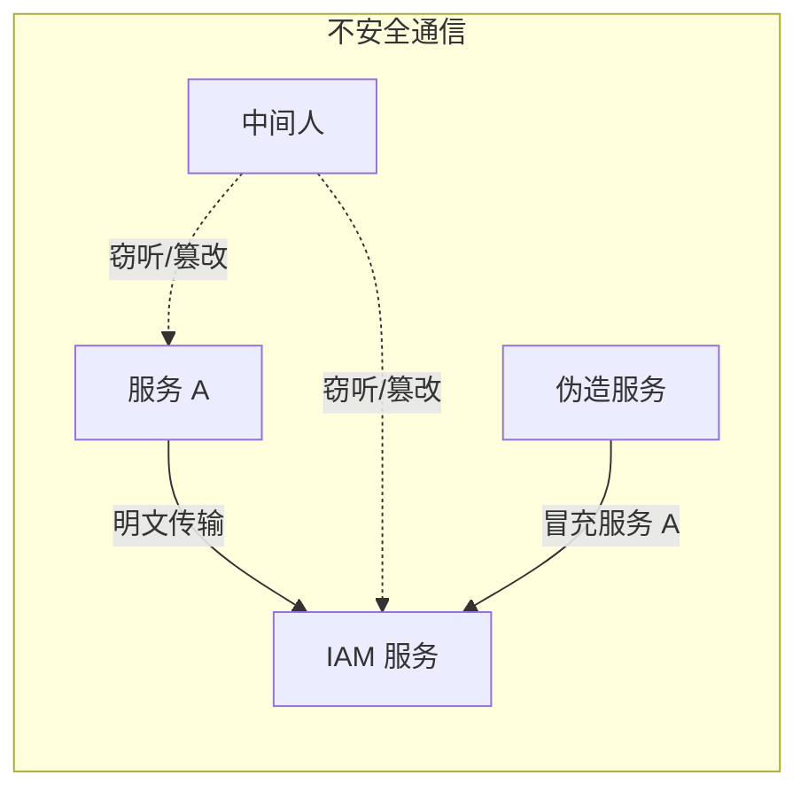
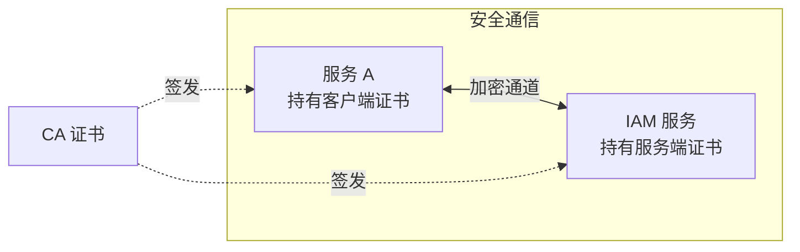
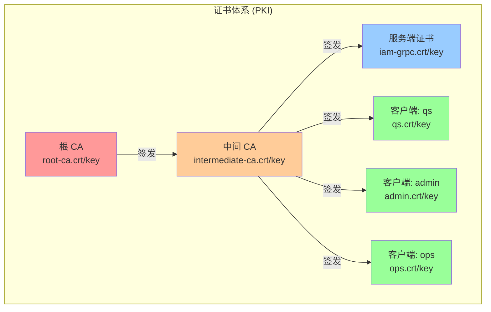
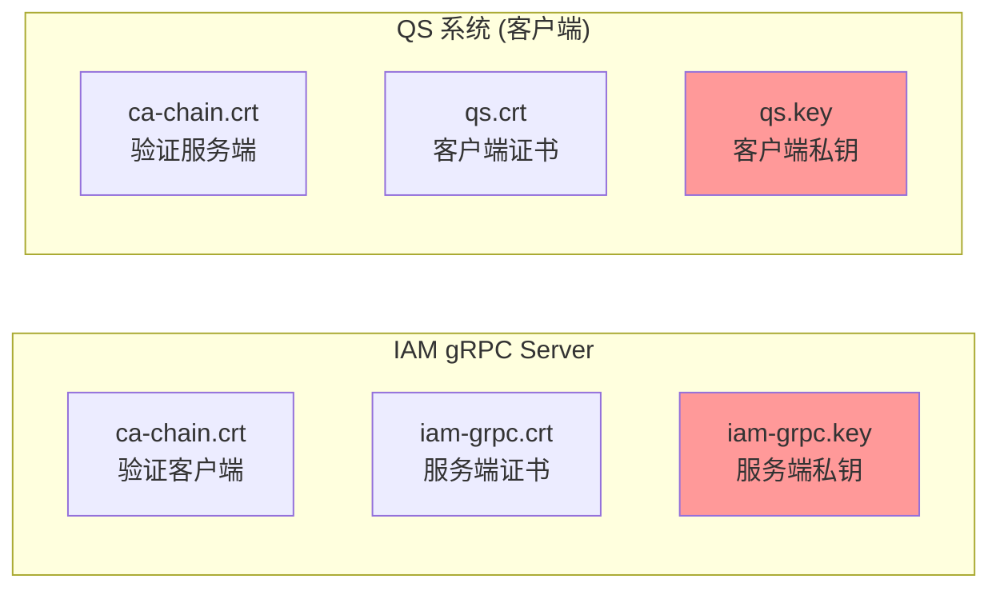
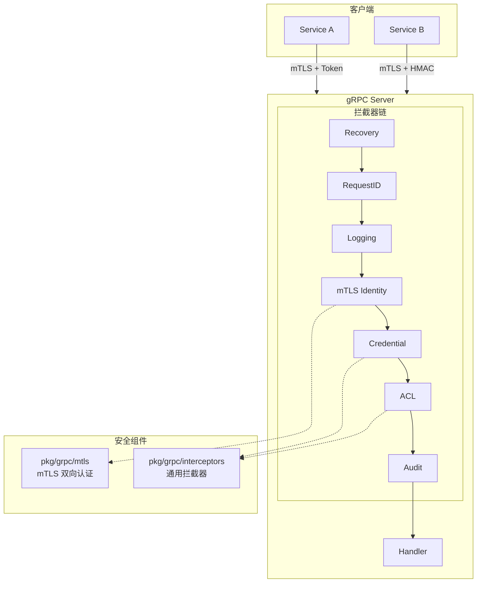
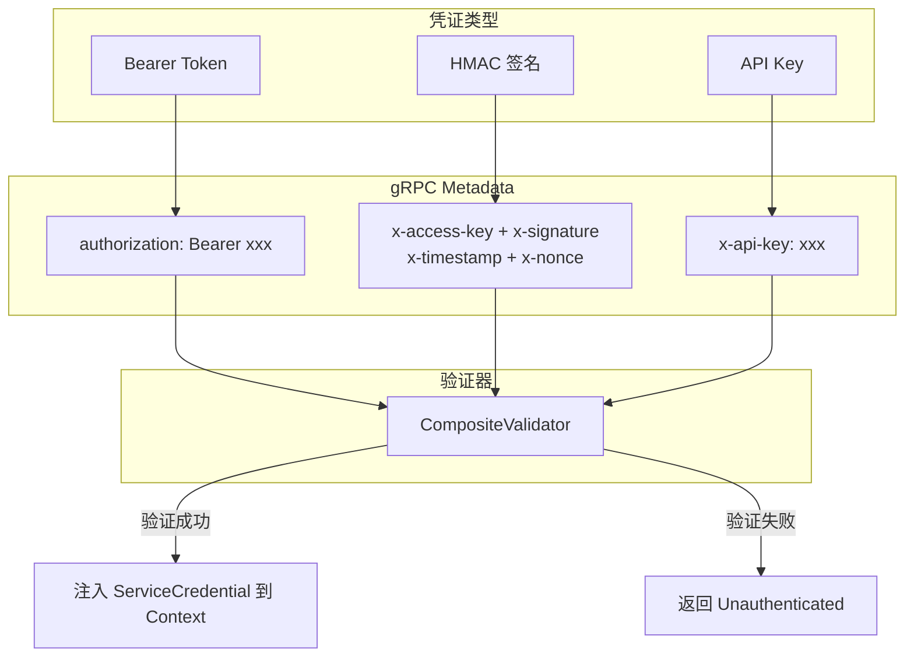
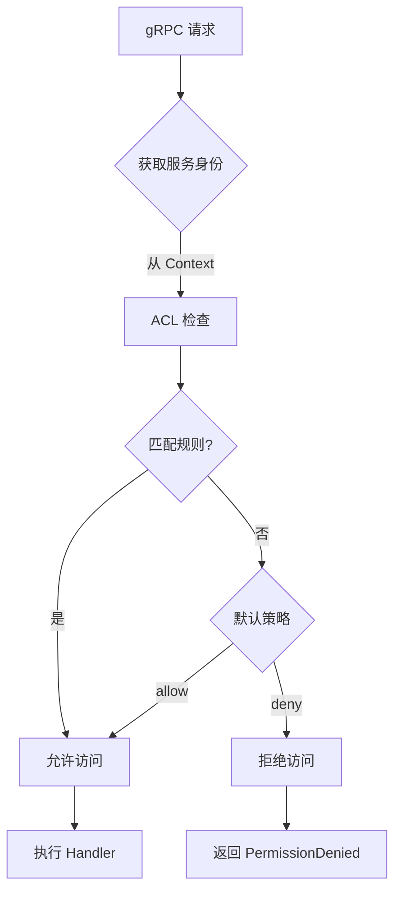

# gRPC 服务设计

本文档描述 IAM 系统中 gRPC 服务的架构设计、安全机制和使用方式。

## 1. 为什么需要证书/密钥？

### 1.1 问题背景

gRPC 服务之间的调用面临以下安全问题：



| 风险 | 描述 |
|------|------|
| **窃听** | 网络流量被截获，敏感数据泄露 |
| **篡改** | 请求/响应被中间人修改 |
| **冒充** | 恶意服务伪装成合法服务 |
| **重放** | 截获的请求被重复发送 |

### 1.2 mTLS 如何解决

mTLS（双向 TLS）通过证书解决上述问题：



| 证书类型 | 作用 | 持有者 |
|----------|------|--------|
| **CA 证书** | 信任锚点，签发其他证书 | 组织/团队 |
| **服务端证书** | 证明服务端身份，加密通信 | IAM gRPC Server |
| **客户端证书** | 证明客户端身份 | 调用方服务（如 QS） |

### 1.3 证书 vs 密钥

每个证书都包含两部分：

| 文件 | 内容 | 作用 | 能否公开 |
|------|------|------|----------|
| `.crt` | 公钥 + 身份信息 + CA 签名 | 发给对方验证身份 | ✅ 可以 |
| `.key` | 私钥 | 解密、签名 | ❌ 绝对保密 |

```text
┌─────────────────────────────────────┐
│           证书 (.crt)               │
├─────────────────────────────────────┤
│  Subject: CN=qs.svc, OU=QS          │  ← 身份信息
│  Public Key: (RSA 2048 bit)         │  ← 公钥
│  Issuer: IAM Intermediate CA        │  ← 签发者
│  Valid: 2024-01-01 ~ 2025-01-01     │  ← 有效期
│  Signature: (CA 的数字签名)          │  ← 防伪造
└─────────────────────────────────────┘

┌─────────────────────────────────────┐
│           私钥 (.key)               │
├─────────────────────────────────────┤
│  (RSA 2048 bit Private Key)         │  ← 绝对保密！
│  用于：                              │
│    - 解密对方用公钥加密的数据         │
│    - 对数据进行数字签名              │
└─────────────────────────────────────┘
```

## 2. 证书生成与使用

### 2.1 证书体系结构



为什么用两级 CA？

- **根 CA** 离线保存，极少使用，安全性最高
- **中间 CA** 日常签发证书，即使泄露也可撤销，不影响根 CA

### 2.2 生成证书

```bash
# 一键生成所有证书
make grpc-cert
```

生成的文件：

```text
configs/cert/grpc/
├── ca/
│   ├── root-ca.crt           # 根 CA 证书（公开）
│   ├── root-ca.key           # 根 CA 私钥（保密！）
│   ├── intermediate-ca.crt   # 中间 CA 证书（公开）
│   ├── intermediate-ca.key   # 中间 CA 私钥（保密！）
│   └── ca-chain.crt          # 证书链 = 中间CA + 根CA（用于验证）
├── server/
│   ├── iam-grpc.crt          # 服务端证书（公开）
│   ├── iam-grpc.key          # 服务端私钥（保密！）
│   └── iam-grpc-fullchain.crt
└── clients/
    ├── qs.crt / qs.key       # QS 系统的客户端证书
    ├── admin.crt / admin.key # Admin 工具的客户端证书
    └── ops.crt / ops.key     # Ops 工具的客户端证书
```

### 2.3 证书管理命令

| 命令 | 说明 |
|------|------|
| `make grpc-cert` | 生成所有证书 |
| `make grpc-cert-force` | 强制重新生成（会覆盖） |
| `make grpc-cert-verify` | 验证证书有效性 |
| `make grpc-cert-info` | 查看证书详细信息 |
| `make grpc-cert-clean` | 清理所有证书 |

### 2.4 谁需要哪些文件？



| 角色 | 需要的文件 | 用途 |
|------|-----------|------|
| **IAM Server** | `ca-chain.crt` | 验证客户端证书是否由可信 CA 签发 |
| | `iam-grpc.crt` | 向客户端证明自己是真正的 IAM 服务 |
| | `iam-grpc.key` | 解密客户端发来的数据 |
| **QS Client** | `ca-chain.crt` | 验证服务端证书是否由可信 CA 签发 |
| | `qs.crt` | 向服务端证明自己是 QS 系统 |
| | `qs.key` | 对请求签名，证明是自己发送的 |

## 3. 整体架构

### 3.1 代码结构

```text
pkg/grpc/                    # 通用组件（可被其他项目复用）
├── mtls/                    # mTLS 双向认证
│   ├── config.go           # TLS 配置构建器
│   ├── credentials.go      # 服务端/客户端凭证
│   └── identity.go         # 服务身份提取
└── interceptors/            # 通用拦截器
    ├── types.go            # ServiceIdentity, ServiceCredential 等类型
    ├── common.go           # Recovery/RequestID/Logging 拦截器
    ├── mtls.go             # mTLS 身份提取
    ├── credential.go       # 凭证验证
    ├── acl.go              # ACL 权限控制
    └── audit.go            # 审计日志

internal/pkg/grpc/           # IAM 特定实现
├── config.go               # 服务器配置定义
├── server.go               # Server 实现，集成所有组件
└── interceptors.go         # 集成 component-base 日志的拦截器
```

### 3.2 架构图



### 3.3 设计原则

- **分层设计**：`pkg/` 存放通用组件，`internal/` 存放业务特定集成
- **可插拔**：各安全机制可独立启用/禁用
- **链式拦截器**：安全逻辑通过拦截器链组合

## 4. 拦截器与安全机制

### 4.1 拦截器链顺序


| 拦截器 | 作用 |
|--------|------|
| Recovery | 捕获 panic，防止服务崩溃 |
| RequestID | 生成/传递请求 ID，支持链路追踪 |
| Logging | 记录请求/响应日志 |
| mTLS | 提取客户端证书身份 |
| Credential | 验证应用层凭证 (Token/HMAC/API Key) |
| ACL | 方法级访问控制 |
| Audit | 审计日志记录 |

### 4.2 mTLS 双向认证配置

关于 mTLS 的原理和证书生成，请参阅 [第 1-2 章](#1-为什么需要证书密钥)。

#### 服务端配置示例

```yaml
grpc:
  tls_cert_file: "/path/to/server.crt"
  tls_key_file: "/path/to/server.key"
  mtls:
    enabled: true
    ca_file: "/path/to/ca.crt"
    require_client_cert: true
    allowed_cns: ["service-a", "service-b"]  # 允许的证书 CN
    allowed_ous: ["platform-team"]            # 允许的组织单元
    min_tls_version: "1.2"
    enable_auto_reload: true                  # 证书热重载
```

**证书白名单**：支持 CN、OU、DNS SAN 三种维度过滤。

### 4.3 应用层凭证认证



在 mTLS 之上叠加应用层认证，支持三种方式：

| 类型 | 元数据键 | 格式 |
|------|----------|------|
| Bearer Token | `authorization` | `Bearer <token>` |
| HMAC 签名 | `x-access-key`, `x-signature`, `x-timestamp`, `x-nonce` | HMAC-SHA256 |
| API Key | `x-api-key` | 明文密钥 |

```yaml
grpc:
  auth:
    enabled: true
    enable_bearer: true
    enable_hmac: true
    enable_api_key: true
    hmac_timestamp_validity: 5m
    require_identity_match: true  # 要求凭证身份与 mTLS 身份一致
```

### 2.4 ACL 权限控制



基于服务身份的方法级访问控制：

```yaml
# configs/grpc_acl.yaml
default_policy: deny  # deny | allow

rules:
  - service_name: "service-a"
    methods:
      - "/iam.identity.v1.IdentityService/*"  # 允许所有方法
      - "/iam.authn.v1.AuthnService/Authenticate"
  
  - service_name: "service-b"
    methods:
      - "/iam.identity.v1.IdentityService/GetUser"
```

**通配符支持**：`*` 匹配服务下所有方法。

## 5. 配置详解

### 5.1 完整配置结构

```go
type Config struct {
    BindAddress  string        // 监听地址
    BindPort     int           // 监听端口
    MaxMsgSize   int           // 最大消息大小
    TLSCertFile  string        // 服务端证书
    TLSKeyFile   string        // 服务端私钥
    MTLS         MTLSConfig    // mTLS 配置
    Auth         AuthConfig    // 应用层认证配置
    ACL          ACLConfig     // ACL 配置
    Audit        AuditConfig   // 审计配置
    Insecure     bool          // 是否禁用 TLS
}
```

### 5.2 默认值

| 配置项 | 默认值 |
|--------|--------|
| BindPort | 9090 |
| MaxMsgSize | 4MB |
| MinTLSVersion | 1.2 |
| ACL DefaultPolicy | deny |
| HMAC TimestampValidity | 5 分钟 |

## 6. 使用示例

### 6.1 创建服务器

```go
import (
    "github.com/FangcunMount/iam-contracts/internal/pkg/grpc"
)

func main() {
    config := grpc.NewConfig()
    
    // 启用 mTLS
    config.Insecure = false
    config.TLSCertFile = "/path/to/server.crt"
    config.TLSKeyFile = "/path/to/server.key"
    config.MTLS.Enabled = true
    config.MTLS.CAFile = "/path/to/ca.crt"
    config.MTLS.AllowedCNs = []string{"trusted-service"}
    
    // 启用 ACL
    config.ACL.Enabled = true
    config.ACL.ConfigFile = "/path/to/acl.yaml"
    
    // 创建服务器
    server, err := config.Complete().New()
    if err != nil {
        log.Fatal(err)
    }
    
    // 注册服务
    server.RegisterService(&myService{})
    
    // 启动
    server.Run()
}
```

### 6.2 客户端接入

```go
import (
    "github.com/FangcunMount/iam-contracts/pkg/grpc/mtls"
    "google.golang.org/grpc"
    "google.golang.org/grpc/metadata"
)

func createClient() (*grpc.ClientConn, error) {
    // 配置 mTLS
    cfg := &mtls.Config{
        CertFile: "/path/to/client.crt",
        KeyFile:  "/path/to/client.key",
        CAFile:   "/path/to/ca.crt",
    }
    
    creds, err := mtls.NewClientCredentials(cfg)
    if err != nil {
        return nil, err
    }
    
    return grpc.Dial("server:9090", creds.GRPCDialOption())
}

// 调用时附加应用层凭证
func callWithCredential(ctx context.Context) {
    ctx = metadata.AppendToOutgoingContext(ctx,
        "authorization", "Bearer <token>",
    )
    // 或使用 HMAC
    ctx = metadata.AppendToOutgoingContext(ctx,
        "x-access-key", "my-access-key",
        "x-signature", "<hmac-signature>",
        "x-timestamp", "1234567890",
        "x-nonce", "random-nonce",
    )
}
```

## 7. 扩展指南

### 7.1 自定义凭证验证器

实现 `CredentialValidator` 接口：

```go
type CredentialValidator interface {
    Validate(ctx context.Context, cred *ServiceCredential) error
}
```

### 7.2 自定义审计日志

实现 `AuditLogger` 接口：

```go
type AuditLogger interface {
    LogAccess(ctx context.Context, event *AuditEvent) error
}
```

### 7.3 集成自定义日志

`internal/pkg/grpc/interceptors.go` 展示了如何集成 component-base 日志：

```go
func LoggingInterceptor() grpc.UnaryServerInterceptor {
    return interceptors.LoggingInterceptor(
        &customLogger{},
        interceptors.WithContextPreprocess(ensureTraceContext),
    )
}
```

## 8. 安全最佳实践

1. **生产环境必须启用 mTLS**：设置 `Insecure: false`
2. **使用证书白名单**：配置 `AllowedCNs` 或 `AllowedOUs`
3. **启用 ACL**：遵循最小权限原则
4. **开启审计日志**：便于安全审计和问题排查
5. **定期轮换证书**：利用自动重载功能实现无感知轮换
