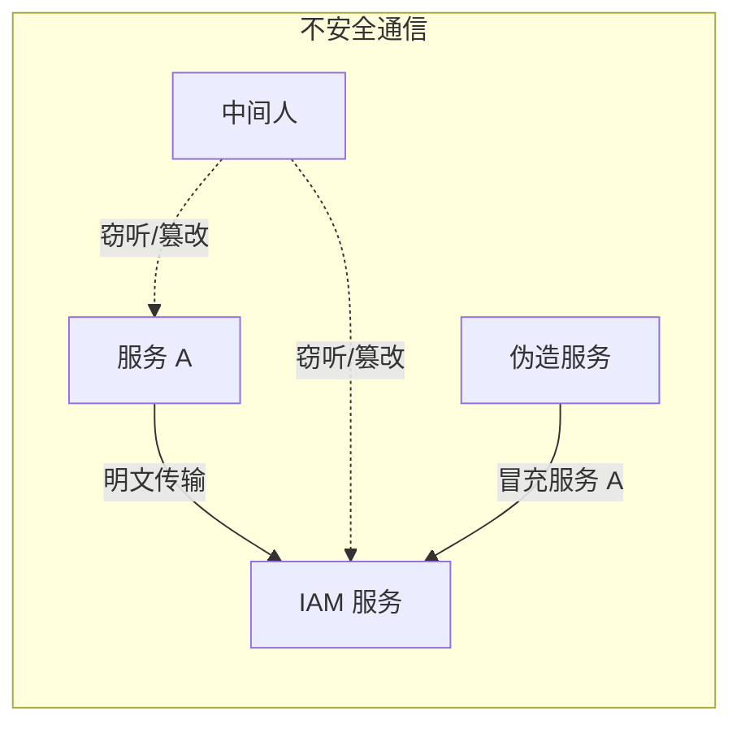
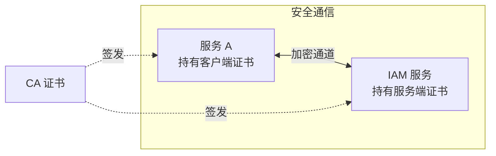
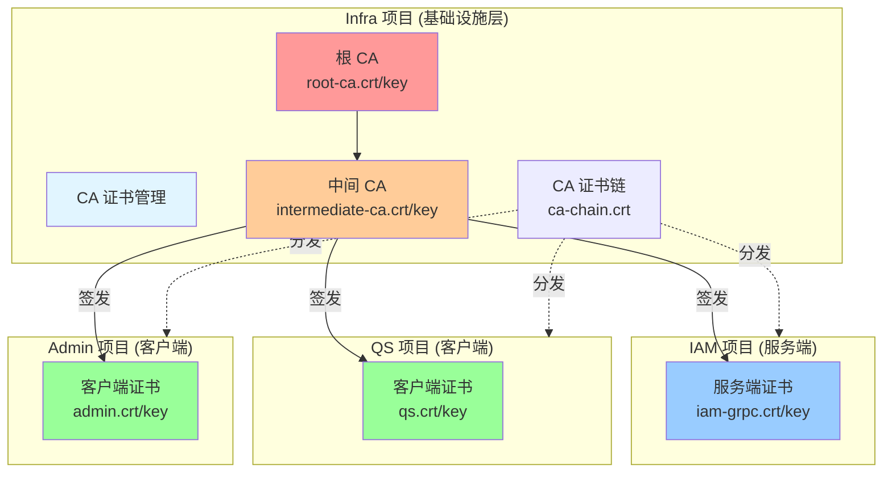
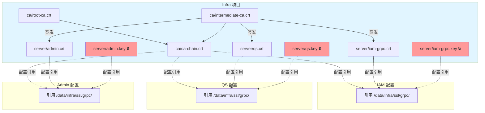
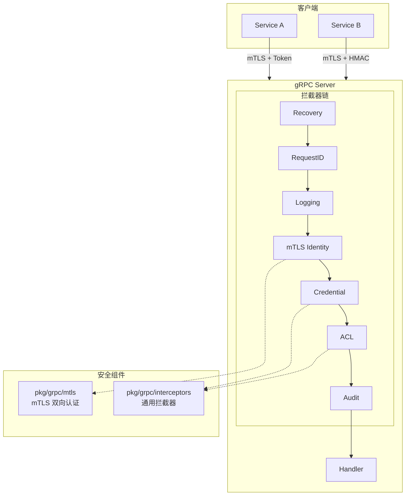
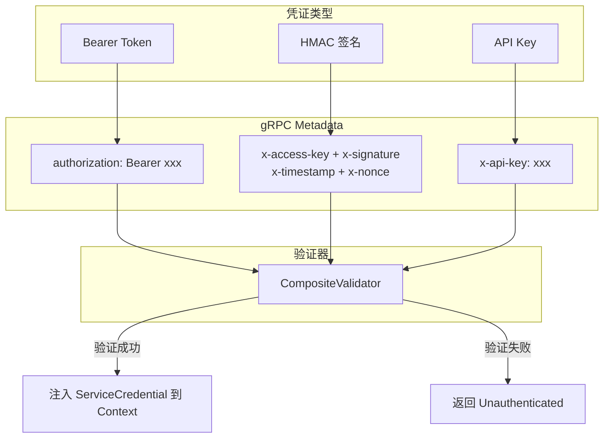
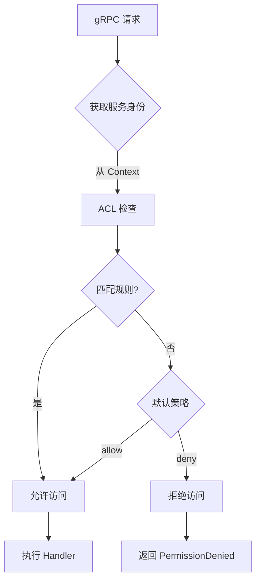

# gRPC 服务设计

本文档描述 IAM 系统如何使用 `component-base/pkg/grpc` 构建 gRPC 服务器，包括架构设计、安全机制和实践指南。

> **📢 重要说明**：本项目采用统一的 CA 证书管理架构
>
> - **CA 证书管理**：由运维统一维护（当前宿主机路径：`/data/ssl/iam-contracts/grpc/ca`）
> - **服务端证书**：各项目生成自己的服务端证书（如 `iam-grpc.crt`，路径 `/data/ssl/iam-contracts/grpc/server`）
> - **客户端证书**：各项目生成自己的客户端证书（如 `qs.crt`, `admin.crt`，路径 `/data/ssl/iam-contracts/grpc/clients`）
> - **安全原则**：私钥隔离，CA 集中管理，证书分散生成

## 🎯 快速理解

### 三层架构

```text
┌─────────────────────────────────────────────────────────┐
│  internal/pkg/grpc (IAM 特定实现)                        │
│  ├─ config.go      : 业务配置定义                        │
│  ├─ server.go      : 服务器组装逻辑                      │
│  └─ interceptors.go: 日志适配层                          │
└─────────────────────────────────────────────────────────┘
                          ↓ 使用
┌─────────────────────────────────────────────────────────┐
│  component-base/pkg/grpc (可复用组件)                    │
│  ├─ mtls/          : mTLS 双向认证                       │
│  └─ interceptors/  : 通用拦截器                          │
│     ├─ recovery    : Panic 恢复                          │
│     ├─ requestid   : 请求追踪                            │
│     ├─ logging     : 请求日志                            │
│     ├─ mtls        : mTLS 身份提取                       │
│     ├─ credential  : 凭证验证                            │
│     ├─ acl         : 权限控制                            │
│     └─ audit       : 审计日志                            │
└─────────────────────────────────────────────────────────┘
                          ↓ 基于
┌─────────────────────────────────────────────────────────┐
│  google.golang.org/grpc (底层框架)                       │
└─────────────────────────────────────────────────────────┘
```

### 核心理念

| 层级 | 职责 | 复用性 |
|-----|------|--------|
| **component-base** | 提供通用能力（mTLS、拦截器） | ✅ 跨项目复用 |
| **internal/pkg/grpc** | 集成业务日志、配置 | 📦 项目特定 |
| **业务代码** | 注册服务、处理请求 | 🎯 业务逻辑 |

---

## 1. 为什么需要证书/密钥？

### 1.1 问题背景

gRPC 服务之间的调用面临以下安全问题：



| 风险 | 描述 |
|------|------|
| **窃听** | 网络流量被截获，敏感数据泄露 |
| **篡改** | 请求/响应被中间人修改 |
| **冒充** | 恶意服务伪装成合法服务 |
| **重放** | 截获的请求被重复发送 |

### 1.2 mTLS 如何解决

mTLS（双向 TLS）通过证书解决上述问题：



| 证书类型 | 作用 | 持有者 |
|----------|------|--------|
| **CA 证书** | 信任锚点，签发其他证书 | 组织/团队 |
| **服务端证书** | 证明服务端身份，加密通信 | IAM gRPC Server |
| **客户端证书** | 证明客户端身份 | 调用方服务（如 QS） |

### 1.3 证书 vs 密钥

每个证书都包含两部分：

| 文件 | 内容 | 作用 | 能否公开 |
|------|------|------|----------|
| `.crt` | 公钥 + 身份信息 + CA 签名 | 发给对方验证身份 | ✅ 可以 |
| `.key` | 私钥 | 解密、签名 | ❌ 绝对保密 |

```text
┌─────────────────────────────────────┐
│           证书 (.crt)               │
├─────────────────────────────────────┤
│  Subject: CN=qs.svc, OU=QS          │  ← 身份信息
│  Public Key: (RSA 2048 bit)         │  ← 公钥
│  Issuer: IAM Intermediate CA        │  ← 签发者
│  Valid: 2024-01-01 ~ 2025-01-01     │  ← 有效期
│  Signature: (CA 的数字签名)          │  ← 防伪造
└─────────────────────────────────────┘

┌─────────────────────────────────────┐
│           私钥 (.key)               │
├─────────────────────────────────────┤
│  (RSA 2048 bit Private Key)         │  ← 绝对保密！
│  用于：                              │
│    - 解密对方用公钥加密的数据         │
│    - 对数据进行数字签名              │
└─────────────────────────────────────┘
```

## 2. 证书生成与使用

### 2.1 证书管理架构

**🏛️ 分层管理原则**：



**📄 职责划分**：

| 项目 | 职责 | 生成的文件 | 路径 |
|------|------|----------|---------|
| **infra** | CA 证书管理 | `root-ca.crt`, `intermediate-ca.crt`, `ca-chain.crt` | `/data/infra/ssl/grpc/` |
| **iam-contracts** | 服务端证书 | `iam-grpc.crt`, `iam-grpc.key` | `/data/ssl/iam-contracts/grpc/` |
| **qs** | 客户端证书 | `qs.crt`, `qs.key` | `/etc/qs/certs/` |
| **admin** | 客户端证书 | `admin.crt`, `admin.key` | `/etc/admin/certs/` |

**⚙️ 为什么用两级 CA？**

- **根 CA**：离线保存，极少使用，安全性最高
- **中间 CA**：日常签发证书，即使泄露也可撤销，不影响根 CA

### 2.2 快速开始

#### Step 1: 生成 CA 证书（infra 项目）

```bash
# 在 infra 项目中执行
cd /path/to/infra
./scripts/cert/generate-grpc-certs.sh generate-ca

# 生成结果：/data/infra/ssl/grpc/ca/
# ├── root-ca.crt        # 根 CA 证书
# ├── root-ca.key        # 根 CA 私钥 🔒
# ├── intermediate-ca.crt  # 中间 CA 证书
# ├── intermediate-ca.key  # 中间 CA 私钥 🔒
# └── ca-chain.crt      # CA 证书链 📦 分发给所有项目
```

**🔒 安全设置**：

```bash
# CA 私钥权限控制
chmod 600 /data/infra/ssl/grpc/ca/*.key
chown root:root /data/infra/ssl/grpc/ca/*.key
```

#### Step 2: 在 infra 项目为 IAM 生成服务端证书

```bash
# 在 infra 项目中执行
cd /path/to/infra
./scripts/cert/generate-grpc-certs.sh generate-server iam-grpc IAM iam-grpc.internal.example.com

# 生成结果：/data/infra/ssl/grpc/
# ├── ca/
# │   ├── root-ca.crt
# │   ├── intermediate-ca.crt
# │   └── ca-chain.crt      # CA 证书链
# └── server/
#     ├── iam-grpc.crt      # IAM 服务端证书
#     ├── iam-grpc.key      # IAM 服务端私钥 🔒
#     └── iam-grpc-fullchain.crt
```

#### Step 3: IAM 项目直接使用 infra 证书

```bash
# IAM 项目配置文件直接引用 infra 路径
# configs/apiserver.yaml
grpc:
  tls_cert_file: "/data/infra/ssl/grpc/server/iam-grpc.crt"
  tls_key_file: "/data/infra/ssl/grpc/server/iam-grpc.key"
  mtls:
    enabled: true
    ca_file: "/data/infra/ssl/grpc/ca/ca-chain.crt"
```

**✅ 约定的证书路径**：

```text
/data/infra/ssl/grpc/              # 所有项目统一使用
├── ca/
│   ├── root-ca.crt
│   ├── intermediate-ca.crt
│   └── ca-chain.crt               # ← IAM 引用
└── server/
    ├── iam-grpc.crt               # ← IAM 引用
    ├── iam-grpc.key               # ← IAM 引用 🔒
    ├── qs.crt                     # ← QS 引用
    ├── qs.key                     # ← QS 引用 🔒
    └── ...
```

**🔒 客户端证书管理**：

所有客户端证书由 infra 统一生成，各项目直接引用：

| 项目 | 证书生成命令 | 引用路径 |
|------|------------|----------|
| **qs** | `cd /path/to/infra && ./scripts/cert/generate-grpc-certs.sh generate-server qs QS` | `/data/infra/ssl/grpc/server/qs.{crt,key}` |
| **admin** | `cd /path/to/infra && ./scripts/cert/generate-grpc-certs.sh generate-server admin Admin` | `/data/infra/ssl/grpc/server/admin.{crt,key}` |
| **ops** | `cd /path/to/infra && ./scripts/cert/generate-grpc-certs.sh generate-server ops Ops` | `/data/infra/ssl/grpc/server/ops.{crt,key}` |

**⚠️ 重要原则**：

1. ✅ **CA 集中管理**：所有 CA 证书由 infra 项目统一管理，避免各项目重复创建
2. ✅ **证书分散生成**：各项目只生成自己的服务端/客户端证书
3. ✅ **私钥隔离**：每个项目的私钥（`*.key`）只保留在自己的服务器上
4. ❌ **禁止**：IAM 服务器不存储客户端私钥，避免单点泄漏风险

### 2.3 证书管理命令

#### Infra 项目命令（统一管理）

```bash
# 1. 生成 CA 证书（首次运行）
cd /path/to/infra
./scripts/cert/generate-grpc-certs.sh generate-ca

# 2. 为 IAM 生成服务端证书
./scripts/cert/generate-grpc-certs.sh generate-server iam-grpc IAM iam-grpc.internal.example.com

# 3. 为其他服务生成客户端证书
./scripts/cert/generate-grpc-certs.sh generate-server qs QS qs.internal.example.com
./scripts/cert/generate-grpc-certs.sh generate-server admin Admin admin.internal.example.com

# 验证证书
./scripts/cert/generate-grpc-certs.sh verify

# 查看证书信息
./scripts/cert/generate-grpc-certs.sh info
```

#### IAM 项目命令（已简化）

```bash
# IAM 项目不再维护证书生成脚本，直接使用 infra 生成的证书

# 验证证书
make grpc-cert-verify # 验证 /data/infra/ssl/grpc/server/iam-grpc.crt

# 查看证书信息
make grpc-cert-info   # 查看证书详情

# 测试 gRPC 连接
grpcurl -cert /data/infra/ssl/grpc/server/iam-grpc.crt \
        -key /data/infra/ssl/grpc/server/iam-grpc.key \
        -cacert /data/infra/ssl/grpc/ca/ca-chain.crt \
        localhost:9090 list
```

**📝 路径约定**：

- CA 证书链：`/data/infra/ssl/grpc/ca/ca-chain.crt`
- IAM 服务端证书：`/data/infra/ssl/grpc/server/iam-grpc.crt`
- IAM 服务端私钥：`/data/infra/ssl/grpc/server/iam-grpc.key`
- 所有项目配置文件直接引用这些路径

### 2.4 证书部署架构



### 证书路径约定

| 证书类型 | 统一路径 | 说明 |
|---------|---------|------|
| **CA 证书链** | `/data/infra/ssl/grpc/ca/ca-chain.crt` | 所有项目验证证书时引用 |
| **IAM 服务端证书** | `/data/infra/ssl/grpc/server/iam-grpc.crt` | IAM 配置文件引用 |
| **IAM 服务端私钥** | `/data/infra/ssl/grpc/server/iam-grpc.key` 🔒 | IAM 配置文件引用 |
| **QS 客户端证书** | `/data/infra/ssl/grpc/server/qs.crt` | QS 配置文件引用 |
| **QS 客户端私钥** | `/data/infra/ssl/grpc/server/qs.key` 🔒 | QS 配置文件引用 |
| **Admin 客户端证书** | `/data/infra/ssl/grpc/server/admin.crt` | Admin 配置文件引用 |
| **Admin 客户端私钥** | `/data/infra/ssl/grpc/server/admin.key` 🔒 | Admin 配置文件引用 |

**📌 各项目配置示例**：

```yaml
# IAM 项目 (configs/apiserver.yaml)
grpc:
  tls_cert_file: "/data/infra/ssl/grpc/server/iam-grpc.crt"
  tls_key_file: "/data/infra/ssl/grpc/server/iam-grpc.key"
  mtls:
    ca_file: "/data/infra/ssl/grpc/ca/ca-chain.crt"

# QS 项目 (configs/app.yaml)
iam_client:
  endpoint: "iam.example.com:9090"
  tls:
    cert_file: "/data/infra/ssl/grpc/server/qs.crt"
    key_file: "/data/infra/ssl/grpc/server/qs.key"
    ca_file: "/data/infra/ssl/grpc/ca/ca-chain.crt"
```

**🔒 安全最佳实践：**

1. **CA 集中管理**：所有项目使用同一个 CA，由 infra 项目统一维护
2. **证书分散生成**：各项目只生成自己的服务端/客户端证书，降低单点风险
3. **私钥隔离**：每个服务的私钥（`.key`）只保留在自己的服务器上，绝不传输
4. **CA 私钥保护**：`intermediate-ca.key` 只存在于 infra 项目服务器，权限 `600`
5. **自动化分发**：使用 Ansible、Vault 或 K8s Secrets 自动分发 `ca-chain.crt`
6. **权限控制**：`chmod 600 *.key` 确保私钥只有服务进程可读

---

## 3. 如何使用 component-base 构建 gRPC 服务器

### 3.1 设计思路

IAM 项目的 gRPC 服务器构建遵循以下原则：

1. **复用 component-base 的通用能力**
   - mTLS 双向认证（`component-base/pkg/grpc/mtls`）
   - 标准拦截器（`component-base/pkg/grpc/interceptors`）

2. **在 internal/pkg/grpc 中做项目特定集成**
   - 定义业务配置结构（`config.go`）
   - 组装服务器和拦截器链（`server.go`）
   - 适配业务日志系统（`interceptors.go`）

3. **业务代码只需关注服务实现**
   - 实现 gRPC service interface
   - 注册到服务器即可运行

### 3.2 目录结构

```text
iam-contracts/
├── internal/pkg/grpc/              # IAM 特定的 gRPC 集成
│   ├── config.go                  # 配置结构定义
│   ├── server.go                  # 服务器构建逻辑
│   └── interceptors.go            # 日志适配器
│
└── 依赖 component-base/pkg/grpc/
    ├── mtls/                      # mTLS 双向认证（可复用）
    │   ├── config.go             # TLS 配置
    │   ├── credentials.go        # 服务端/客户端凭证
    │   └── identity.go           # 身份提取
    └── interceptors/              # 通用拦截器（可复用）
        ├── types.go              # 接口定义
        ├── common.go             # Recovery/RequestID/Logging
        ├── mtls.go               # mTLS 身份提取
        ├── credential.go         # 凭证验证
        ├── acl.go                # ACL 权限控制
        └── audit.go              # 审计日志
```

### 3.3 步骤一：定义配置结构 (config.go)

```go
// internal/pkg/grpc/config.go
package grpc

import "time"

// Config GRPC 服务器配置
type Config struct {
    BindAddress string
    BindPort    int
    MaxMsgSize  int
    
    // TLS 配置
    TLSCertFile string
    TLSKeyFile  string
    
    // mTLS 配置（使用 component-base 的能力）
    MTLS MTLSConfig
    
    // 应用层认证配置
    Auth AuthConfig
    
    // ACL 权限控制
    ACL ACLConfig
    
    // 审计日志
    Audit AuditConfig
    
    EnableReflection  bool
    EnableHealthCheck bool
    Insecure          bool
}

// MTLSConfig mTLS 配置（映射到 component-base/pkg/grpc/mtls.Config）
type MTLSConfig struct {
    Enabled           bool
    CAFile            string
    AllowedCNs        []string      // 客户端证书白名单
    AllowedOUs        []string
    AllowedSANs       []string
    MinTLSVersion     string        // "1.2", "1.3"
    EnableAutoReload  bool          // 证书热重载
    ReloadInterval    time.Duration
}

// AuthConfig 应用层认证配置
type AuthConfig struct {
    Enabled                bool
    EnableBearer           bool
    EnableHMAC             bool
    EnableAPIKey           bool
    HMACTimestampValidity  time.Duration
    RequireIdentityMatch   bool  // 要求凭证身份与 mTLS 身份一致
}

// ACLConfig ACL 配置
type ACLConfig struct {
    Enabled       bool
    ConfigFile    string  // ACL 规则文件路径
    DefaultPolicy string  // "allow" | "deny"
}

// AuditConfig 审计配置
type AuditConfig struct {
    Enabled    bool
    OutputPath string
}
```

### 3.4 步骤二：适配业务日志 (interceptors.go)

```go
// internal/pkg/grpc/interceptors.go
package grpc

import (
    "context"
    "google.golang.org/grpc"
    
    "github.com/FangcunMount/component-base/pkg/grpc/interceptors"
    "github.com/FangcunMount/component-base/pkg/log"
    "github.com/FangcunMount/component-base/pkg/util/idutil"
)

// LoggingInterceptor 返回集成 component-base 日志的拦截器
func LoggingInterceptor() grpc.UnaryServerInterceptor {
    return interceptors.LoggingInterceptor(
        &componentBaseLogger{},  // 适配器
        interceptors.WithLogResponse(true),
        interceptors.WithMaxResponseLen(300),
        interceptors.WithContextPreprocess(ensureTraceContext),
    )
}

// RecoveryInterceptor 返回集成 component-base 日志的恢复拦截器
func RecoveryInterceptor() grpc.UnaryServerInterceptor {
    return interceptors.RecoveryInterceptor(
        interceptors.WithRecoveryLogger(&componentBaseLogger{}),
        interceptors.WithRecoveryContextPreprocess(ensureTraceContext),
    )
}

// RequestIDInterceptor 返回集成 component-base 的请求ID拦截器
func RequestIDInterceptor() grpc.UnaryServerInterceptor {
    return interceptors.RequestIDInterceptor(
        interceptors.WithRequestIDGenerator(idutil.NewRequestID),
        interceptors.WithMetadataInjector(func(ctx context.Context, requestID string) context.Context {
            return log.WithRequestID(ctx, requestID)
        }),
    )
}

// componentBaseLogger 适配 component-base 日志到 InterceptorLogger 接口
type componentBaseLogger struct{}

func (l *componentBaseLogger) LogInfo(msg string, fields map[string]interface{}) {
    log.Infow(msg, mapToLogFields(fields)...)
}

func (l *componentBaseLogger) LogError(msg string, fields map[string]interface{}) {
    log.Errorw(msg, mapToLogFields(fields)...)
}

func (l *componentBaseLogger) LogWarn(msg string, fields map[string]interface{}) {
    log.Warnw(msg, mapToLogFields(fields)...)
}

// ensureTraceContext 确保上下文中有 trace 信息
func ensureTraceContext(ctx context.Context) context.Context {
    if log.GetRequestID(ctx) == "" {
        return log.WithRequestID(ctx, idutil.NewRequestID())
    }
    return ctx
}

// mapToLogFields 将 map 转换为 log.Field
func mapToLogFields(m map[string]interface{}) []log.Field {
    fields := make([]log.Field, 0, len(m))
    for k, v := range m {
        fields = append(fields, log.Any(k, v))
    }
    return fields
}
```

### 3.5 步骤三：组装服务器 (server.go)

```go
// internal/pkg/grpc/server.go
package grpc

import (
    "fmt"
    "net"
    
    "google.golang.org/grpc"
    "google.golang.org/grpc/credentials"
    "google.golang.org/grpc/health"
    healthpb "google.golang.org/grpc/health/grpc_health_v1"
    "google.golang.org/grpc/reflection"
    
    basemtls "github.com/FangcunMount/component-base/pkg/grpc/mtls"
    "github.com/FangcunMount/component-base/pkg/grpc/interceptors"
    "github.com/FangcunMount/component-base/pkg/log"
)

// Server GRPC 服务器结构体
type Server struct {
    *grpc.Server
    config      *Config
    services    []Service
    mtlsCreds   *basemtls.ServerCredentials
    acl         *interceptors.ServiceACL
}

// Service GRPC 服务接口
type Service interface {
    RegisterService(*grpc.Server)
}

// NewServer 创建新的 GRPC 服务器
func NewServer(config *Config) (*Server, error) {
    var serverOpts []grpc.ServerOption
    var mtlsCreds *basemtls.ServerCredentials
    var acl *interceptors.ServiceACL
    
    // 1. 加载 ACL 配置（需要在构建拦截器之前）
    if config.ACL.Enabled && config.ACL.ConfigFile != "" {
        loadedACL, err := loadACLConfig(config.ACL.ConfigFile, config.ACL.DefaultPolicy)
        if err != nil {
            return nil, fmt.Errorf("failed to load ACL config: %w", err)
        }
        acl = loadedACL
        log.Infof("ACL enabled: %s", config.ACL.ConfigFile)
    }
    
    // 2. 构建拦截器链（使用 component-base 的拦截器）
    unaryInterceptors := buildUnaryInterceptors(config, acl)
    streamInterceptors := buildStreamInterceptors(config, acl)
    
    serverOpts = append(serverOpts, 
        grpc.ChainUnaryInterceptor(unaryInterceptors...),
        grpc.ChainStreamInterceptor(streamInterceptors...),
    )
    
    // 3. 配置消息大小限制
    if config.MaxMsgSize > 0 {
        serverOpts = append(serverOpts,
            grpc.MaxRecvMsgSize(config.MaxMsgSize),
            grpc.MaxSendMsgSize(config.MaxMsgSize),
        )
    }
    
    // 4. 配置 mTLS（使用 component-base/pkg/grpc/mtls）
    if !config.Insecure && config.MTLS.Enabled {
        mtlsCfg := &basemtls.Config{
            CertFile:          config.TLSCertFile,
            KeyFile:           config.TLSKeyFile,
            CAFile:            config.MTLS.CAFile,
            RequireClientCert: true,
            AllowedCNs:        config.MTLS.AllowedCNs,
            AllowedOUs:        config.MTLS.AllowedOUs,
            AllowedDNSSANs:    config.MTLS.AllowedSANs,
            MinVersion:        parseTLSVersion(config.MTLS.MinTLSVersion),
            EnableAutoReload:  config.MTLS.EnableAutoReload,
            ReloadInterval:    config.MTLS.ReloadInterval,
        }
        
        creds, err := basemtls.NewServerCredentials(mtlsCfg)
        if err != nil {
            return nil, fmt.Errorf("failed to create mTLS credentials: %w", err)
        }
        
        mtlsCreds = creds
        serverOpts = append(serverOpts, grpc.Creds(creds.TransportCredentials()))
        log.Infof("mTLS enabled with CA: %s", config.MTLS.CAFile)
    } else if !config.Insecure {
        // 单向 TLS
        creds, err := credentials.NewServerTLSFromFile(config.TLSCertFile, config.TLSKeyFile)
        if err != nil {
            return nil, fmt.Errorf("failed to load TLS credentials: %w", err)
        }
        serverOpts = append(serverOpts, grpc.Creds(creds))
        log.Info("TLS enabled (one-way)")
    }
    
    // 5. 创建 gRPC 服务器
    grpcServer := grpc.NewServer(serverOpts...)
    
    // 6. 注册健康检查
    if config.EnableHealthCheck {
        healthpb.RegisterHealthServer(grpcServer, health.NewServer())
    }
    
    // 7. 注册反射服务（开发环境）
    if config.EnableReflection {
        reflection.Register(grpcServer)
    }
    
    return &Server{
        Server:    grpcServer,
        config:    config,
        mtlsCreds: mtlsCreds,
        acl:       acl,
    }, nil
}

// buildUnaryInterceptors 构建一元拦截器链
func buildUnaryInterceptors(config *Config, acl *interceptors.ServiceACL) []grpc.UnaryServerInterceptor {
    var interceptorChain []grpc.UnaryServerInterceptor
    
    // 1. Recovery（最外层，捕获所有 panic）
    interceptorChain = append(interceptorChain, RecoveryInterceptor())
    
    // 2. RequestID（生成请求 ID）
    interceptorChain = append(interceptorChain, RequestIDInterceptor())
    
    // 3. Logging（记录请求日志）
    interceptorChain = append(interceptorChain, LoggingInterceptor())
    
    // 4. mTLS Identity（提取客户端身份）
    if config.MTLS.Enabled {
        interceptorChain = append(interceptorChain, 
            interceptors.MTLSIdentityInterceptor())
    }
    
    // 5. Credential Validation（应用层凭证验证）
    if config.Auth.Enabled {
        validators := buildCredentialValidators(config.Auth)
        interceptorChain = append(interceptorChain,
            interceptors.CredentialInterceptor(validators...))
    }
    
    // 6. ACL（权限控制）
    if config.ACL.Enabled && acl != nil {
        interceptorChain = append(interceptorChain,
            interceptors.ACLInterceptor(acl))
    }
    
    // 7. Audit（审计日志）
    if config.Audit.Enabled {
        auditor := newAuditor(config.Audit)
        interceptorChain = append(interceptorChain,
            interceptors.AuditInterceptor(auditor))
    }
    
    return interceptorChain
}

// RegisterService 注册服务
func (s *Server) RegisterService(svc Service) {
    s.services = append(s.services, svc)
    svc.RegisterService(s.Server)
}

// Run 启动服务器
func (s *Server) Run() error {
    addr := fmt.Sprintf("%s:%d", s.config.BindAddress, s.config.BindPort)
    lis, err := net.Listen("tcp", addr)
    if err != nil {
        return fmt.Errorf("failed to listen: %w", err)
    }
    
    log.Infof("gRPC server listening on %s", addr)
    return s.Serve(lis)
}
```

### 3.6 步骤四：业务代码使用示例

```go
// cmd/apiserver/apiserver.go
package main

import (
    "time"
    
    grpcpkg "github.com/FangcunMount/iam-contracts/internal/pkg/grpc"
    authnv1 "github.com/FangcunMount/iam-contracts/api/grpc/iam/authn/v1"
)

func main() {
    // 1. 创建配置
    config := &grpcpkg.Config{
        BindAddress: "0.0.0.0",
        BindPort:    9090,
        MaxMsgSize:  4 * 1024 * 1024,
        
        // mTLS 配置
        Insecure:    false,
        TLSCertFile: "/data/ssl/iam-contracts/grpc/server/iam-grpc.crt",
        TLSKeyFile:  "/data/ssl/iam-contracts/grpc/server/iam-grpc.key",
        MTLS: grpcpkg.MTLSConfig{
            Enabled:          true,
            CAFile:           "/data/ssl/iam-contracts/grpc/ca/ca-chain.crt",
            AllowedCNs:       []string{"qs", "admin", "ops"},
            MinTLSVersion:    "1.2",
            EnableAutoReload: true,
            ReloadInterval:   5 * time.Minute,
        },
        
        // 应用层认证
        Auth: grpcpkg.AuthConfig{
            Enabled:      true,
            EnableBearer: true,
            EnableHMAC:   true,
        },
        
        // ACL 权限控制
        ACL: grpcpkg.ACLConfig{
            Enabled:       true,
            ConfigFile:    "/etc/iam/grpc_acl.yaml",
            DefaultPolicy: "deny",
        },
        
        // 审计日志
        Audit: grpcpkg.AuditConfig{
            Enabled:    true,
            OutputPath: "/var/log/iam/audit.log",
        },
        
        EnableReflection:  true,
        EnableHealthCheck: true,
    }
    
    // 2. 创建服务器（自动集成所有 component-base 能力）
    server, err := grpcpkg.NewServer(config)
    if err != nil {
        log.Fatalf("Failed to create server: %v", err)
    }
    
    // 3. 注册业务服务
    server.RegisterService(&AuthnServiceImpl{})
    server.RegisterService(&IdentityServiceImpl{})
    
    // 4. 启动服务器
    if err := server.Run(); err != nil {
        log.Fatalf("Failed to run server: %v", err)
    }
}

// AuthnServiceImpl 业务服务实现
type AuthnServiceImpl struct {
    authnv1.UnimplementedAuthServiceServer
}

func (s *AuthnServiceImpl) RegisterService(server *grpc.Server) {
    authnv1.RegisterAuthServiceServer(server, s)
}
```

### 3.7 核心优势

| 优势 | 说明 |
|-----|------|
| **开箱即用** | 引入 component-base，配置即可使用 |
| **高度复用** | mTLS、拦截器可在多个项目间共享 |
| **灵活集成** | 通过适配器模式集成业务日志 |
| **可插拔设计** | 每个安全机制可独立启用/禁用 |
| **配置驱动** | 所有能力通过配置控制，无需修改代码 |

### 3.8 其他项目如何复用

1. **引入依赖**

   ```bash
   go get github.com/FangcunMount/component-base
   ```

2. **复制 internal/pkg/grpc 目录**
   - 修改 `config.go` 中的业务配置
   - 修改 `interceptors.go` 中的日志适配
   - 保持 `server.go` 的组装逻辑

3. **使用方式完全相同**
   - 配置 → 创建服务器 → 注册服务 → 启动

---

## 4. 拦截器链与安全机制

### 4.1 拦截器链架构图



### 4.2 拦截器执行顺序


| 拦截器 | 作用 |
|--------|------|
| Recovery | 捕获 panic，防止服务崩溃 |
| RequestID | 生成/传递请求 ID，支持链路追踪 |
| Logging | 记录请求/响应日志 |
| mTLS | 提取客户端证书身份 |
| Credential | 验证应用层凭证 (Token/HMAC/API Key) |
| ACL | 方法级访问控制 |
| Audit | 审计日志记录 |

### 4.3 mTLS 双向认证配置

关于 mTLS 的原理和证书生成，请参阅 [第 1-2 章](#1-为什么需要证书密钥)。

**component-base 提供的能力：**

- ✅ 自动加载和验证证书
- ✅ 证书热重载（生产环境证书更新）
- ✅ 客户端证书白名单过滤
- ✅ 提取客户端身份到 Context

#### 服务端配置示例

```yaml
grpc:
  tls_cert_file: "/path/to/server.crt"
  tls_key_file: "/path/to/server.key"
  mtls:
    enabled: true
    ca_file: "/path/to/ca.crt"
    require_client_cert: true
    allowed_cns: ["service-a", "service-b"]  # 允许的证书 CN
    allowed_ous: ["platform-team"]            # 允许的组织单元
    min_tls_version: "1.2"
    enable_auto_reload: true                  # 证书热重载
```

**证书白名单**：支持 CN、OU、DNS SAN 三种维度过滤。

### 4.4 应用层凭证认证

**component-base 提供的能力：**

- ✅ 组合验证器模式（支持多种凭证类型）
- ✅ Bearer Token / HMAC / API Key 内置支持
- ✅ 可扩展自定义验证器



在 mTLS 之上叠加应用层认证，支持三种方式：

| 类型 | 元数据键 | 格式 |
|------|----------|------|
| Bearer Token | `authorization` | `Bearer <token>` |
| HMAC 签名 | `x-access-key`, `x-signature`, `x-timestamp`, `x-nonce` | HMAC-SHA256 |
| API Key | `x-api-key` | 明文密钥 |

```yaml
grpc:
  auth:
    enabled: true
    enable_bearer: true
    enable_hmac: true
    enable_api_key: true
    hmac_timestamp_validity: 5m
    require_identity_match: true  # 要求凭证身份与 mTLS 身份一致
```

### 4.5 ACL 权限控制

**component-base 提供的能力：**

- ✅ 基于服务身份的方法级访问控制
- ✅ YAML 配置驱动的 ACL 规则
- ✅ 支持方法通配符匹配
- ✅ 默认策略（allow/deny）可配置



基于服务身份的方法级访问控制：

```yaml
# configs/grpc_acl.yaml
default_policy: deny  # deny | allow

rules:
  - service_name: "service-a"
    methods:
      - "/iam.identity.v1.IdentityService/*"  # 允许所有方法
      - "/iam.authn.v1.AuthnService/Authenticate"
  
  - service_name: "service-b"
    methods:
      - "/iam.identity.v1.IdentityService/GetUser"
```

**通配符支持**：`*` 匹配服务下所有方法。

## 5. 完整配置参考

### 5.1 配置结构说明

```yaml
# configs/apiserver.yaml
grpc:
  bind_address: "0.0.0.0"
  bind_port: 9090
  max_msg_size: 4194304  # 4MB
  
  # TLS 配置（直接引用 infra 生成的证书）
  tls_cert_file: "/data/infra/ssl/grpc/server/iam-grpc.crt"
  tls_key_file: "/data/infra/ssl/grpc/server/iam-grpc.key"
  
  # mTLS 双向认证
  mtls:
    enabled: true
    ca_file: "/data/infra/ssl/grpc/ca/ca-chain.crt"
    allowed_cns: ["qs", "admin", "ops"]  # 客户端证书白名单
    allowed_ous: ["platform-team"]
    min_tls_version: "1.2"
    enable_auto_reload: true
    reload_interval: "5m"
  
  # 应用层认证
  auth:
    enabled: true
    enable_bearer: true
    enable_hmac: true
    enable_api_key: false
    hmac_timestamp_validity: "5m"
    require_identity_match: true  # 要求凭证身份与 mTLS 身份一致
  
  # ACL 权限控制
  acl:
    enabled: true
    config_file: "/etc/iam/grpc_acl.yaml"
    default_policy: "deny"
  
  # 审计日志
  audit:
    enabled: true
    output_path: "/var/log/iam/grpc-audit.log"
  
  enable_reflection: true   # 开发环境启用
  enable_health_check: true
  insecure: false
```

### 5.2 默认值

| 配置项 | 默认值 | 说明 |
|--------|--------|------|
| BindPort | 9090 | gRPC 监听端口 |
| MaxMsgSize | 4MB | 最大消息大小 |
| MinTLSVersion | 1.2 | 最低 TLS 版本 |
| ACL DefaultPolicy | deny | ACL 默认拒绝 |
| HMAC TimestampValidity | 5m | HMAC 时间戳有效期 |
| ReloadInterval | 5m | 证书重载检查间隔 |

---

## 6. 客户端接入指南

### 6.1 使用 IAM SDK（推荐）

```go
import sdk "github.com/FangcunMount/iam-contracts/pkg/sdk"

// 创建客户端（SDK 自动处理 mTLS）
client, err := sdk.NewClient(ctx, &sdk.Config{
    Endpoint: "iam.example.com:9090",
    TLS: &sdk.TLSConfig{
        Enabled:  true,
        CACert:   "/data/infra/ssl/grpc/ca/ca-chain.crt",
        CertFile: "/data/infra/ssl/grpc/server/qs.crt",
        KeyFile:  "/data/infra/ssl/grpc/server/qs.key",
    },
})

// 使用客户端
user, err := client.Identity().GetUser(ctx, userID)
```

### 6.2 手动创建客户端

```go
import (
    basemtls "github.com/FangcunMount/component-base/pkg/grpc/mtls"
    "google.golang.org/grpc"
    "google.golang.org/grpc/metadata"
)

// 1. 配置 mTLS
func createClient() (*grpc.ClientConn, error) {
    cfg := &basemtls.Config{
        CertFile: "/data/infra/ssl/grpc/server/qs.crt",
        KeyFile:  "/data/infra/ssl/grpc/server/qs.key",
        CAFile:   "/data/infra/ssl/grpc/ca/ca-chain.crt",
    }
    
    creds, err := basemtls.NewClientCredentials(cfg)
    if err != nil {
        return nil, err
    }
    
    return grpc.Dial("iam.example.com:9090", creds.GRPCDialOption())
}

// 2. 附加应用层凭证（可选）
func callWithToken(ctx context.Context, client MyServiceClient) {
    ctx = metadata.AppendToOutgoingContext(ctx,
        "authorization", "Bearer eyJhbGciOiJSUzI1...",
    )
    resp, err := client.MyMethod(ctx, &MyRequest{})
}

// 3. 使用 HMAC 签名（可选）
func callWithHMAC(ctx context.Context, client MyServiceClient) {
    timestamp := time.Now().Unix()
    nonce := generateNonce()
    signature := generateHMAC(accessKey, secretKey, timestamp, nonce)
    
    ctx = metadata.AppendToOutgoingContext(ctx,
        "x-access-key", accessKey,
        "x-signature", signature,
        "x-timestamp", fmt.Sprintf("%d", timestamp),
        "x-nonce", nonce,
    )
    resp, err := client.MyMethod(ctx, &MyRequest{})
}
```

---

## 7. 扩展开发指南

### 7.1 自定义凭证验证器

```go
// 实现 CredentialValidator 接口
type CustomValidator struct {
    db *Database
}

func (v *CustomValidator) Validate(ctx context.Context, cred *interceptors.ServiceCredential) error {
    // 从数据库验证凭证
    valid, err := v.db.CheckCredential(cred.Type, cred.Value)
    if err != nil {
        return err
    }
    if !valid {
        return fmt.Errorf("invalid credential")
    }
    return nil
}

// 注册到拦截器
validators := []interceptors.CredentialValidator{
    &CustomValidator{db: myDB},
}
interceptorChain = append(interceptorChain,
    interceptors.CredentialInterceptor(validators...))
```

### 7.2 自定义审计日志

```go
// 实现 AuditLogger 接口
type KafkaAuditor struct {
    producer *kafka.Producer
}

func (a *KafkaAuditor) LogAccess(ctx context.Context, event *interceptors.AuditEvent) error {
    // 发送到 Kafka
    data, _ := json.Marshal(event)
    return a.producer.Send("audit-topic", data)
}

// 使用自定义审计器
auditor := &KafkaAuditor{producer: myProducer}
interceptorChain = append(interceptorChain,
    interceptors.AuditInterceptor(auditor))
```

### 7.3 集成其他日志系统

```go
// 适配 zap 日志
type ZapLogger struct {
    logger *zap.Logger
}

func (l *ZapLogger) LogInfo(msg string, fields map[string]interface{}) {
    zapFields := make([]zap.Field, 0, len(fields))
    for k, v := range fields {
        zapFields = append(zapFields, zap.Any(k, v))
    }
    l.logger.Info(msg, zapFields...)
}

// 使用自定义 logger
interceptors.LoggingInterceptor(&ZapLogger{logger: myZapLogger})
```

---

## 8. 生产环境最佳实践

### 8.1 安全配置

| 实践 | 说明 | 配置 |
|-----|------|------|
| **必须启用 mTLS** | 生产环境禁止使用不安全连接 | `Insecure: false` |
| **证书白名单** | 限制可连接的客户端 | `AllowedCNs: ["trusted-services"]` |
| **最小权限原则** | 使用 ACL 严格控制方法访问 | `DefaultPolicy: "deny"` |
| **应用层认证** | mTLS 之上叠加 Token/HMAC | `Auth.Enabled: true` |
| **审计日志** | 记录所有敏感操作 | `Audit.Enabled: true` |

### 8.2 可靠性配置

| 实践 | 说明 | 配置 |
|-----|------|------|
| **证书热重载** | 避免证书更新重启服务 | `EnableAutoReload: true` |
| **消息大小限制** | 防止大消息攻击 | `MaxMsgSize: 4MB` |
| **连接管理** | 防止连接泄漏 | `MaxConnectionAge: 30m` |
| **健康检查** | 支持 K8s 探活 | `EnableHealthCheck: true` |

### 8.3 可观测性

| 实践 | 说明 |
|-----|------|
| **请求 ID** | 每个请求生成唯一 ID，支持链路追踪 |
| **结构化日志** | 使用 component-base 日志，统一格式 |
| **审计日志** | 记录谁在什么时间调用了什么方法 |
| **指标采集** | 集成 Prometheus（可扩展） |

### 8.4 开发环境配置

```yaml
# 开发环境可以放宽限制，便于调试
grpc:
  insecure: false  # 仍然建议启用 TLS
  mtls:
    enabled: true
    allowed_cns: ["*"]  # 允许所有证书（仅开发环境）
  
  acl:
    enabled: true
    default_policy: "allow"  # 默认允许（仅开发环境）
  
  enable_reflection: true    # 启用反射（支持 grpcurl）
  enable_health_check: true
```

---

## 9. 故障排查

### 9.1 常见错误

| 错误 | 原因 | 解决方案 |
|-----|------|---------|
| `transport: authentication handshake failed` | 证书问题 | 检查证书路径、有效期、CN 白名单 |
| `rpc error: code = PermissionDenied` | ACL 拒绝 | 检查 ACL 配置，确认服务在白名单 |
| `rpc error: code = Unauthenticated` | 凭证验证失败 | 检查 Token/HMAC 是否正确 |
| `failed to load ACL config` | ACL 文件错误 | 检查 YAML 格式和文件路径 |

### 9.2 调试工具

```bash
# 1. 使用 grpcurl 测试服务（需要启用 reflection）
grpcurl -plaintext localhost:9090 list

# 2. 使用客户端证书调用
grpcurl \
  -cert /path/to/client.crt \
  -key /path/to/client.key \
  -cacert /path/to/ca.crt \
  -d '{"user_id": "123"}' \
  iam.example.com:9090 \
  iam.identity.v1.IdentityService/GetUser

# 3. 检查证书
openssl x509 -in server.crt -noout -text
openssl verify -CAfile ca-chain.crt server.crt

# 4. 查看日志
tail -f /var/log/iam/grpc-audit.log
```

---

## 10. 总结与参考

### 10.1 核心价值

| 价值 | 说明 |
|-----|------|
| 🔒 **安全** | mTLS + 应用层认证 + ACL 三层防护 |
| 🔄 **复用** | component-base 可在多个项目间共享 |
| ⚙️ **灵活** | 所有功能可独立启用/禁用 |
| 📊 **可观测** | 完整的日志、审计、追踪能力 |
| 🚀 **简单** | 配置驱动，业务代码只需关注服务实现 |

### 10.2 相关文档

| 文档 | 说明 |
|-----|------|
| [IAM SDK 文档](../../pkg/sdk/docs/README.md) | 客户端 SDK 使用指南 |
| [QS 接入指南](./04-qs接入iam指南.md) | 完整的接入实践 |
| [核心概念术语](./02-核心概念术语.md) | 领域术语表 |
| [系统架构总览](./01-系统架构总览.md) | IAM 整体架构 |

### 10.3 示例代码位置

| 代码 | 位置 |
|-----|------|
| 服务器实现 | `internal/pkg/grpc/server.go` |
| 配置定义 | `internal/pkg/grpc/config.go` |
| 日志适配 | `internal/pkg/grpc/interceptors.go` |
| ACL 配置 | `configs/grpc_acl.yaml` |
| 证书生成 | `scripts/cert/generate-grpc-certs.sh` |
