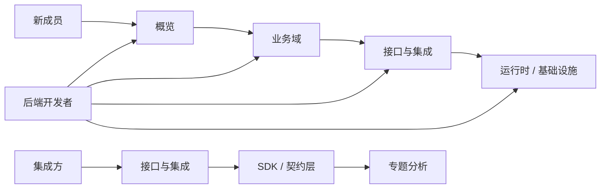
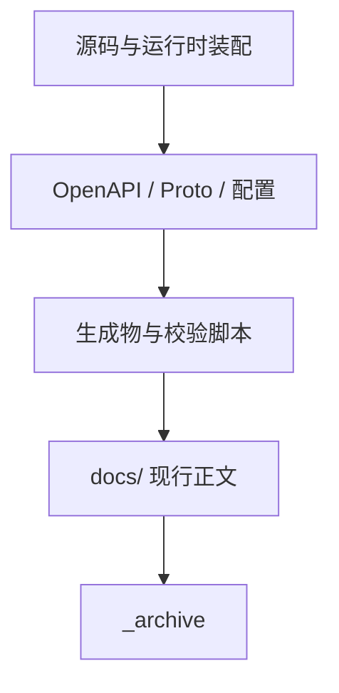

# 阅读路径、代码组织与事实来源

## 本文回答

本文只回答 5 件事：

1. 不同读者今天应该按什么顺序读这套文档
2. 如果只先维护最重要的一组文档，应该先碰哪几篇
3. 代码目录今天怎么快速定位
4. 当 prose、契约与代码冲突时应该信什么
5. 什么时候应该离开概览层，去看运行时、业务域、接口层或专题层

## 30 秒结论

- 新读者先按 `概览 -> 业务域 -> 接口与集成 -> 运行时 / 基础设施` 读，不要一上来就钻 `api/` 或历史目录。
- 维护者要先记住 3 条路径：
  - 运行入口：`cmd/apiserver/`
  - 主业务分层：`internal/apiserver/{interface,application,domain,infra}`
  - 机器契约层：`api/rest/*.yaml`、`api/grpc/**/*.proto`
- 当 prose 文档和代码、契约冲突时，优先级是：`源码与装配 > OpenAPI / Proto / 配置 > 生成物与校验脚本 > docs/ 现行正文 > _archive`。
- 如果只先维护最核心文档，优先维护 `系统架构总览 + authn/authz/用户域 正文 + 接口与集成层`，不要先平均修全部运维细节。

## 重点速查

| 关注点 | 当前答案 | 先看哪里 |
| ---- | ---- | ---- |
| 新成员怎么入门？ | 先建心智模型，再看业务域主轴 | [01-系统架构总览.md](./01-系统架构总览.md)、[02-核心概念术语.md](./02-核心概念术语.md)、[../02-业务域/README.md](../02-业务域/README.md) |
| 后端开发者怎么定位代码？ | 先看 `cmd/`、`internal/apiserver/`、`api/` 三层 | `cmd/apiserver/`、`internal/apiserver/`、`api/` |
| 集成方先看什么？ | 先看接口与集成层，再回契约层和 SDK | [../03-接口与集成/README.md](../03-接口与集成/README.md)、[../../pkg/sdk/docs/README.md](../../pkg/sdk/docs/README.md) |
| 只先维护最关键的文档，应先碰哪些？ | `00-概览/01`、`02-业务域/{authn,authz,user}`、`03-接口与集成/README` | 见下文“核心维护路径” |
| 如果当前文档和旧稿冲突怎么办？ | 先信现行正文；若仍有疑问，再回源码与契约核对；不要直接信 `_archive` | [../_archive/README.md](../_archive/README.md) |

## 1. 不同读者今天应该按什么顺序读这套文档

这一部分只保留“怎么选入口”的方法，不再重复根 [文档中心 README](../README.md) 里的完整逐篇阅读清单。

**图意**：不同读者的第一站不一样，但稳定的主轴只有两条: 一条是“概览到业务域”，一条是“接口与集成到契约层”。不要从 `_archive` 或生成物开始建立第一层心智模型。

| 读者 | 先抓哪条主轴 | 然后去哪一层 | 完整清单 |
| ---- | ---- | ---- | ---- |
| 新成员 | `系统架构总览 -> 核心概念术语` | `02-业务域` | [文档中心 README 的“新成员入门”](../README.md#新成员入门) |
| 后端开发者 | `概览 -> 业务域` | `03-接口与集成 -> 01-运行时 -> 04-基础设施与运维` | [文档中心 README 的“后端开发者”](../README.md#后端开发者) |
| 集成方 | `03-接口与集成` | `SDK / 专题分析 / 契约层` | [文档中心 README 的“集成方”](../README.md#集成方) |

## 2. 如果只先维护最重要的一组文档，应该先碰哪几篇

如果只先维护最值得维护的一组文档，建议按下面顺序：

1. [系统架构总览](./01-系统架构总览.md)
2. [认证、Token、JWKS](../02-业务域/01-authn-认证、Token、JWKS.md)
3. [角色、策略、资源、Assignment](../02-业务域/02-authz-角色、策略、资源、Assignment.md)
4. [用户、儿童、Guardianship](../02-业务域/03-user-用户、儿童、Guardianship.md)
5. [接口与集成 README](../03-接口与集成/README.md)
6. [REST 契约与接入](../03-接口与集成/01-REST契约与接入.md)
7. [gRPC 契约与接入](../03-接口与集成/02-gRPC契约与接入.md)

原因很直接：

- `authn / authz / 用户域（uc）` 是 IAM 的主业务轴。
- `03-接口与集成` 直接决定外部系统如何消费这些能力。
- `01-运行时`、`04-基础设施与运维` 很重要，但更偏承载方式和交付方式，可以略后于主轴维护。

## 3. 代码目录今天怎么快速定位

这一部分只回答“遇到问题先去哪个目录找”，不重复解释每层的设计细节。

| 路径 | 当前角色 | 先回答什么问题 |
| ---- | ---- | ---- |
| `cmd/apiserver/` | 进程入口 | 服务怎么启动、main 在哪 |
| `internal/apiserver/interface/` | REST / gRPC 适配层 | 今天到底暴露了哪些接口 |
| `internal/apiserver/application/` | 用例编排层 | 请求进入后怎么编排领域对象 |
| `internal/apiserver/domain/` | 业务规则层 | 认证、授权、用户域当前怎么建模 |
| `internal/apiserver/infra/` | MySQL / Redis / Casbin / 外部客户端 | 持久化和外部依赖怎么落地 |
| `internal/apiserver/container/` | 装配与依赖注入 | 运行时到底装了哪些模块 |
| `api/rest/` | REST/OpenAPI 合同 | 路径、字段、错误语义怎么定义 |
| `api/grpc/` | gRPC/Proto 合同 | RPC、消息体、metadata 怎么定义 |
| `pkg/sdk/` | 官方集成 SDK | 调用方能直接复用哪些接入能力 |
| `configs/` | 配置、ACL、schema | 端口、证书、数据库基线与运行参数 |
| `build/docker/`、`scripts/` | 交付与校验 | 容器、脚本、契约校验入口在哪里 |

## 4. 当 prose、契约与代码冲突时应该信什么

当几份资料冲突时，按下面顺序判断：

**图意**：`docs/` 负责解释，不负责推翻代码和机器契约；`_archive` 只保留历史信息，不再参与当前事实判断。

1. 源码与运行时装配  
   例：`cmd/apiserver/`、`internal/apiserver/`、`pkg/`
2. 机器契约与配置  
   例：`api/rest/*.yaml`、`api/grpc/**/*.proto`、`configs/*.yaml`
3. 生成物与校验脚本  
   例：`internal/apiserver/docs/swagger.yaml`、`make api-validate`
4. `docs/` 现行正文
5. `docs/_archive/` 历史文档

更直接地说：

- 接口字段、错误语义、RPC 名称，优先看 `api/`
- 真实运行行为和装配边界，优先看 `internal/apiserver/`
- `_archive` 只负责保留旧设计和旧稿，不默认代表当前实现

## 5. 什么时候应该离开概览层，去看其他层

| 层 | 该什么时候读 |
| ---- | ---- |
| [01-运行时](../01-运行时/README.md) | 需要确认 gRPC、mTLS、健康检查、装配链时 |
| [02-业务域](../02-业务域/README.md) | 需要确认 `authn / authz / 用户域（uc） / suggest` 当前能力时 |
| [03-接口与集成](../03-接口与集成/README.md) | 需要确认 REST / gRPC / SDK 接入方式与边界时 |
| [04-基础设施与运维](../04-基础设施与运维/README.md) | 需要确认六边形、CQRS、Makefile、端口、证书、迁移时 |
| [05-专题分析](../05-专题分析/README.md) | 需要追完整主链和设计取舍时 |

## 继续往下读

1. [系统架构总览](./01-系统架构总览.md)
2. [业务域 README](../02-业务域/README.md)
3. [接口与集成 README](../03-接口与集成/README.md)
4. [文档中心 README](../README.md)
