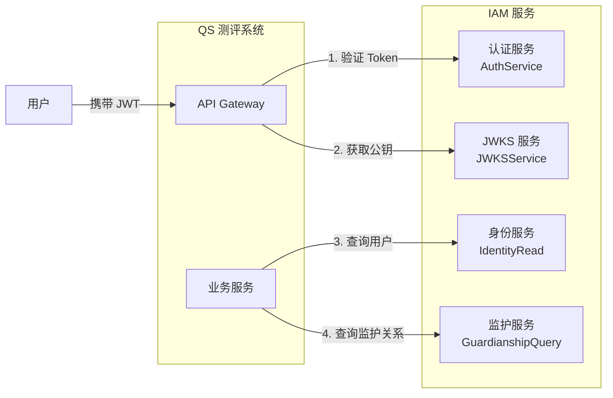
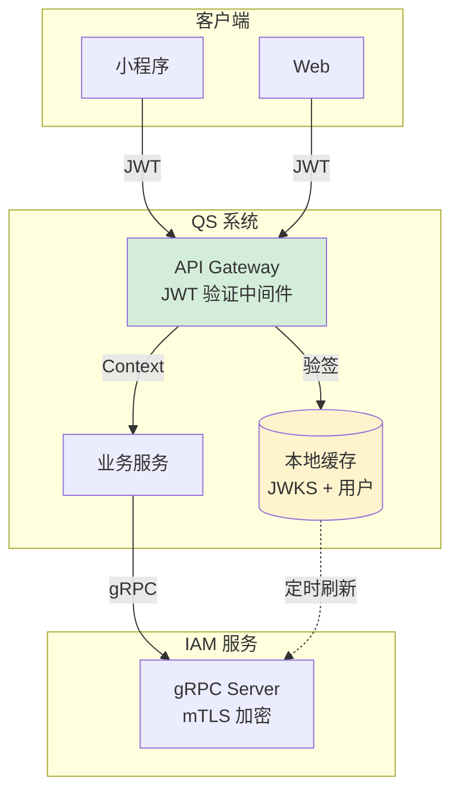

# QS 接入 IAM 实践指南

> 面向 QS（心理健康测评系统）的完整接入指南，涵盖准备工作、接入步骤、代码示例与验收清单。

## 1. 接入概述

### 1.1 QS 需要 IAM 做什么？



| 能力 | 说明 | 调用方式 |
|------|------|----------|
| **Token 验证** | 验证用户的 JWT 是否有效 | gRPC 或本地 JWKS 验签 |
| **JWKS 获取** | 获取公钥用于本地验签 | gRPC 或 HTTP |
| **用户查询** | 获取用户基本信息 | gRPC |
| **监护关系查询** | 查询用户与儿童的监护关系 | gRPC |

### 1.2 推荐架构



**关键设计决策**：

1. **JWT 本地验签**：QS 缓存 JWKS 公钥，在 Gateway 层本地验签，避免每次请求都调用 IAM
2. **gRPC + mTLS**：服务间通信使用 mTLS 双向认证，确保安全
3. **数据缓存**：高频查询（如用户信息）可在 QS 侧缓存，减少对 IAM 的依赖

## 2. 准备工作

### 2.1 获取 mTLS 证书

QS 作为 IAM gRPC 的客户端，需要以下证书文件：

| 文件 | 说明 | 获取方式 |
|------|------|----------|
| `ca-chain.crt` | CA 证书链 | IAM 团队提供 |
| `qs.crt` | QS 客户端证书 | IAM 团队签发 |
| `qs.key` | QS 客户端私钥 | 生成后妥善保管 |

**开发环境**：使用 IAM 项目生成的测试证书

```bash
# 在 IAM 项目目录执行
make grpc-cert

# 证书位置
configs/cert/grpc/ca/ca-chain.crt      # CA 证书链
configs/cert/grpc/clients/qs.crt       # QS 客户端证书
configs/cert/grpc/clients/qs.key       # QS 客户端私钥
```

**生产环境**：联系 IAM 团队申请正式证书

### 2.2 配置信息

向 IAM 团队获取以下配置：

```yaml
# QS 配置示例
iam:
  # gRPC 连接配置
  grpc:
    address: "iam-grpc.internal.example.com:9090"
    timeout: 5s
    retry_max: 3
    
    # mTLS 证书路径
    tls:
      ca_file: "/etc/qs/certs/ca-chain.crt"
      cert_file: "/etc/qs/certs/qs.crt"
      key_file: "/etc/qs/certs/qs.key"
  
  # JWT 验证配置
  jwt:
    issuer: "https://iam.example.com"
    audience: "qs"
    algorithms: ["RS256", "ES256"]
    clock_skew: 60s
  
  # JWKS 配置
  jwks:
    refresh_interval: 5m
    cache_ttl: 30m
    
  # 功能开关（灰度用）
  enabled: true
  grpc_enabled: true
  jwks_enabled: true
```

### 2.3 依赖引入

#### Go 项目

```bash
# 添加 IAM gRPC 客户端依赖
go get github.com/FangcunMount/iam-contracts@latest
```

```go
import (
    authnv1 "github.com/FangcunMount/iam-contracts/api/grpc/iam/authn/v1"
    identityv1 "github.com/FangcunMount/iam-contracts/api/grpc/iam/identity/v1"
    "github.com/FangcunMount/iam-contracts/pkg/grpc/mtls"
)
```

#### 其他语言

从 proto 文件生成客户端代码：

```bash
# proto 文件位置
api/grpc/iam/authn/v1/authn.proto
api/grpc/iam/identity/v1/identity.proto
```

## 3. 接入步骤

### 3.1 步骤一：创建 gRPC 客户端

```go
package iam

import (
    "context"
    "time"
    
    "google.golang.org/grpc"
    "google.golang.org/grpc/keepalive"
    
    authnv1 "github.com/FangcunMount/iam-contracts/api/grpc/iam/authn/v1"
    identityv1 "github.com/FangcunMount/iam-contracts/api/grpc/iam/identity/v1"
    "github.com/FangcunMount/iam-contracts/pkg/grpc/mtls"
)

// Client IAM 客户端
type Client struct {
    conn               *grpc.ClientConn
    Auth               authnv1.AuthServiceClient
    JWKS               authnv1.JWKSServiceClient
    Identity           identityv1.IdentityReadClient
    GuardianshipQuery  identityv1.GuardianshipQueryClient
}

// Config 客户端配置
type Config struct {
    Address  string
    CAFile   string
    CertFile string
    KeyFile  string
    Timeout  time.Duration
}

// NewClient 创建 IAM 客户端
func NewClient(cfg *Config) (*Client, error) {
    // 配置 mTLS
    tlsCfg := &mtls.Config{
        CertFile: cfg.CertFile,
        KeyFile:  cfg.KeyFile,
        CAFile:   cfg.CAFile,
    }
    
    creds, err := mtls.NewClientCredentials(tlsCfg)
    if err != nil {
        return nil, fmt.Errorf("failed to create mTLS credentials: %w", err)
    }
    
    // 创建连接
    conn, err := grpc.Dial(
        cfg.Address,
        creds.GRPCDialOption(),
        grpc.WithKeepaliveParams(keepalive.ClientParameters{
            Time:                30 * time.Second,
            Timeout:             10 * time.Second,
            PermitWithoutStream: true,
        }),
        // 添加拦截器：超时、重试、链路追踪
        grpc.WithUnaryInterceptor(
            grpc_middleware.ChainUnaryClient(
                grpc_retry.UnaryClientInterceptor(
                    grpc_retry.WithMax(3),
                    grpc_retry.WithBackoff(grpc_retry.BackoffExponential(100*time.Millisecond)),
                ),
                otelgrpc.UnaryClientInterceptor(),
            ),
        ),
    )
    if err != nil {
        return nil, fmt.Errorf("failed to connect to IAM: %w", err)
    }
    
    return &Client{
        conn:              conn,
        Auth:              authnv1.NewAuthServiceClient(conn),
        JWKS:              authnv1.NewJWKSServiceClient(conn),
        Identity:          identityv1.NewIdentityReadClient(conn),
        GuardianshipQuery: identityv1.NewGuardianshipQueryClient(conn),
    }, nil
}

// Close 关闭连接
func (c *Client) Close() error {
    return c.conn.Close()
}
```

### 3.2 步骤二：实现 JWKS 缓存

```go
package jwks

import (
    "context"
    "sync"
    "time"
    
    "github.com/lestrrat-go/jwx/v2/jwk"
)

// Cache JWKS 缓存
type Cache struct {
    iamClient    *iam.Client
    keySet       jwk.Set
    mu           sync.RWMutex
    refreshInterval time.Duration
    stopCh       chan struct{}
}

// NewCache 创建 JWKS 缓存
func NewCache(client *iam.Client, refreshInterval time.Duration) *Cache {
    return &Cache{
        iamClient:       client,
        refreshInterval: refreshInterval,
        stopCh:          make(chan struct{}),
    }
}

// Start 启动定时刷新
func (c *Cache) Start(ctx context.Context) error {
    // 立即加载一次
    if err := c.refresh(ctx); err != nil {
        return fmt.Errorf("initial JWKS fetch failed: %w", err)
    }
    
    // 启动定时刷新
    go c.refreshLoop(ctx)
    return nil
}

// GetKeySet 获取当前公钥集
func (c *Cache) GetKeySet() jwk.Set {
    c.mu.RLock()
    defer c.mu.RUnlock()
    return c.keySet
}

// GetKey 根据 kid 获取公钥
func (c *Cache) GetKey(kid string) (jwk.Key, bool) {
    keySet := c.GetKeySet()
    if keySet == nil {
        return nil, false
    }
    
    key, found := keySet.LookupKeyID(kid)
    if !found {
        // 尝试快速刷新
        _ = c.refresh(context.Background())
        key, found = c.GetKeySet().LookupKeyID(kid)
    }
    return key, found
}

func (c *Cache) refresh(ctx context.Context) error {
    resp, err := c.iamClient.JWKS.GetJWKS(ctx, &authnv1.GetJWKSRequest{})
    if err != nil {
        return err
    }
    
    keySet, err := jwk.Parse(resp.Jwks)
    if err != nil {
        return err
    }
    
    c.mu.Lock()
    c.keySet = keySet
    c.mu.Unlock()
    
    return nil
}

func (c *Cache) refreshLoop(ctx context.Context) {
    ticker := time.NewTicker(c.refreshInterval)
    defer ticker.Stop()
    
    for {
        select {
        case <-ticker.C:
            if err := c.refresh(ctx); err != nil {
                log.Errorf("JWKS refresh failed: %v", err)
            }
        case <-ctx.Done():
            return
        case <-c.stopCh:
            return
        }
    }
}
```

### 3.3 步骤三：JWT 验证中间件

```go
package middleware

import (
    "context"
    "strings"
    "time"
    
    "github.com/gin-gonic/gin"
    "github.com/lestrrat-go/jwx/v2/jwt"
)

// JWTConfig JWT 验证配置
type JWTConfig struct {
    Issuer     string
    Audience   string
    Algorithms []string
    ClockSkew  time.Duration
    JWKSCache  *jwks.Cache
}

// JWTMiddleware JWT 验证中间件
func JWTMiddleware(cfg *JWTConfig) gin.HandlerFunc {
    return func(c *gin.Context) {
        // 1. 提取 Token
        authHeader := c.GetHeader("Authorization")
        if authHeader == "" {
            c.AbortWithStatusJSON(401, gin.H{"error": "missing authorization header"})
            return
        }
        
        parts := strings.SplitN(authHeader, " ", 2)
        if len(parts) != 2 || strings.ToLower(parts[0]) != "bearer" {
            c.AbortWithStatusJSON(401, gin.H{"error": "invalid authorization format"})
            return
        }
        tokenString := parts[1]
        
        // 2. 解析并验证 Token
        keySet := cfg.JWKSCache.GetKeySet()
        if keySet == nil {
            c.AbortWithStatusJSON(503, gin.H{"error": "JWKS not available"})
            return
        }
        
        token, err := jwt.Parse(
            []byte(tokenString),
            jwt.WithKeySet(keySet),
            jwt.WithIssuer(cfg.Issuer),
            jwt.WithAudience(cfg.Audience),
            jwt.WithAcceptableSkew(cfg.ClockSkew),
        )
        if err != nil {
            c.AbortWithStatusJSON(401, gin.H{"error": "invalid token", "detail": err.Error()})
            return
        }
        
        // 3. 提取 Claims 并注入 Context
        userID, _ := token.Get("user_id")
        tenantID, _ := token.Get("tenant_id")
        roles, _ := token.Get("roles")
        
        ctx := c.Request.Context()
        ctx = context.WithValue(ctx, "user_id", userID)
        ctx = context.WithValue(ctx, "tenant_id", tenantID)
        ctx = context.WithValue(ctx, "roles", roles)
        ctx = context.WithValue(ctx, "token_claims", token)
        
        c.Request = c.Request.WithContext(ctx)
        c.Next()
    }
}
```

### 3.4 步骤四：调用身份查询服务

```go
package service

import (
    "context"
    
    identityv1 "github.com/FangcunMount/iam-contracts/api/grpc/iam/identity/v1"
)

// UserService 用户服务
type UserService struct {
    iamClient *iam.Client
}

// GetUser 获取用户信息
func (s *UserService) GetUser(ctx context.Context, userID string) (*identityv1.User, error) {
    resp, err := s.iamClient.Identity.GetUser(ctx, &identityv1.GetUserRequest{
        UserId: userID,
    })
    if err != nil {
        return nil, fmt.Errorf("failed to get user: %w", err)
    }
    return resp.User, nil
}

// BatchGetUsers 批量获取用户
func (s *UserService) BatchGetUsers(ctx context.Context, userIDs []string) ([]*identityv1.User, error) {
    resp, err := s.iamClient.Identity.BatchGetUsers(ctx, &identityv1.BatchGetUsersRequest{
        UserIds: userIDs,
    })
    if err != nil {
        return nil, fmt.Errorf("failed to batch get users: %w", err)
    }
    return resp.Users, nil
}

// ListChildren 获取用户的儿童列表
func (s *UserService) ListChildren(ctx context.Context, userID string) ([]*identityv1.ChildEdge, error) {
    resp, err := s.iamClient.GuardianshipQuery.ListChildren(ctx, &identityv1.ListChildrenRequest{
        UserId: userID,
    })
    if err != nil {
        return nil, fmt.Errorf("failed to list children: %w", err)
    }
    return resp.Items, nil
}

// IsGuardian 检查用户是否为儿童的监护人
func (s *UserService) IsGuardian(ctx context.Context, userID, childID string) (bool, error) {
    resp, err := s.iamClient.GuardianshipQuery.IsGuardian(ctx, &identityv1.IsGuardianRequest{
        UserId:  userID,
        ChildId: childID,
    })
    if err != nil {
        return false, fmt.Errorf("failed to check guardianship: %w", err)
    }
    return resp.IsGuardian, nil
}
```

## 4. gRPC 接口参考

### 4.1 认证服务 (AuthService)

| 方法 | 说明 | 使用场景 |
|------|------|----------|
| `VerifyToken` | 远程验证 Token | 不适用本地验签时 |
| `RefreshToken` | 刷新 Token | 一般由前端直接调用 IAM |
| `RevokeToken` | 吊销 Token | 用户登出时 |

### 4.2 JWKS 服务 (JWKSService)

| 方法 | 说明 | 使用场景 |
|------|------|----------|
| `GetJWKS` | 获取公钥集 | 定时拉取，本地缓存 |

### 4.3 身份只读服务 (IdentityRead)

| 方法 | 说明 | 使用场景 |
|------|------|----------|
| `GetUser` | 获取单个用户 | 获取用户详情 |
| `BatchGetUsers` | 批量获取用户 | 列表页展示 |
| `SearchUsers` | 搜索用户 | 后台管理搜索 |
| `GetChild` | 获取儿童信息 | 测评前获取档案 |
| `BatchGetChildren` | 批量获取儿童 | 列表展示 |

### 4.4 监护关系查询 (GuardianshipQuery)

| 方法 | 说明 | 使用场景 |
|------|------|----------|
| `IsGuardian` | 验证监护关系 | **核心接口**：测评前校验 |
| `ListChildren` | 获取用户的儿童列表 | 展示可测评的儿童 |
| `ListGuardians` | 获取儿童的监护人 | 报告推送 |

## 5. 错误处理

### 5.1 gRPC 错误码映射

| gRPC 状态码 | HTTP 状态码 | 说明 | QS 处理方式 |
|-------------|-------------|------|-------------|
| `OK` | 200 | 成功 | 正常处理 |
| `NOT_FOUND` | 404 | 用户/儿童不存在 | 提示"用户不存在" |
| `PERMISSION_DENIED` | 403 | 无权限 | 提示"无权访问" |
| `UNAUTHENTICATED` | 401 | 认证失败 | 跳转登录 |
| `INVALID_ARGUMENT` | 400 | 参数错误 | 检查请求参数 |
| `UNAVAILABLE` | 503 | 服务不可用 | 重试或降级 |
| `DEADLINE_EXCEEDED` | 504 | 超时 | 重试 |

### 5.2 降级策略

```go
// 当 IAM 不可用时的降级处理
func (s *UserService) GetUserWithFallback(ctx context.Context, userID string) (*User, error) {
    // 1. 先查本地缓存
    if user, ok := s.cache.Get(userID); ok {
        return user, nil
    }
    
    // 2. 调用 IAM
    user, err := s.GetUser(ctx, userID)
    if err != nil {
        // 3. 检查是否可降级
        if isUnavailable(err) && s.config.AllowDegradation {
            log.Warnf("IAM unavailable, using cached data for user %s", userID)
            return s.getCachedOrDefault(userID)
        }
        return nil, err
    }
    
    // 4. 更新缓存
    s.cache.Set(userID, user, 5*time.Minute)
    return user, nil
}
```

## 6. 可观测性

### 6.1 指标 (Metrics)

```go
// 推荐采集的指标
var (
    // gRPC 调用
    iamGRPCRequestsTotal = prometheus.NewCounterVec(
        prometheus.CounterOpts{
            Name: "qs_iam_grpc_requests_total",
            Help: "Total IAM gRPC requests",
        },
        []string{"method", "status"},
    )
    
    iamGRPCLatency = prometheus.NewHistogramVec(
        prometheus.HistogramOpts{
            Name:    "qs_iam_grpc_latency_seconds",
            Help:    "IAM gRPC request latency",
            Buckets: []float64{0.01, 0.05, 0.1, 0.25, 0.5, 1},
        },
        []string{"method"},
    )
    
    // JWKS
    jwksRefreshTotal = prometheus.NewCounter(
        prometheus.CounterOpts{
            Name: "qs_jwks_refresh_total",
            Help: "Total JWKS refresh attempts",
        },
    )
    
    jwksRefreshErrors = prometheus.NewCounter(
        prometheus.CounterOpts{
            Name: "qs_jwks_refresh_errors_total",
            Help: "Total JWKS refresh errors",
        },
    )
    
    // JWT 验证
    jwtValidationTotal = prometheus.NewCounterVec(
        prometheus.CounterOpts{
            Name: "qs_jwt_validation_total",
            Help: "Total JWT validations",
        },
        []string{"result"}, // success, expired, invalid_signature, etc.
    )
)
```

### 6.2 日志

```go
// 结构化日志字段
log.WithFields(log.Fields{
    "trace_id":   ctx.Value("trace_id"),
    "user_id":    userID,
    "method":     "IdentityRead.GetUser",
    "latency_ms": latency.Milliseconds(),
    "status":     status.Code(err).String(),
}).Info("IAM gRPC call")
```

### 6.3 链路追踪

```go
// 在 gRPC 客户端添加 OpenTelemetry 拦截器
grpc.WithUnaryInterceptor(otelgrpc.UnaryClientInterceptor())
```

## 7. 验收清单

### 7.1 环境准备

- [ ] 获取 mTLS 证书（ca-chain.crt, qs.crt, qs.key）
- [ ] 配置 IAM gRPC 地址
- [ ] 配置 JWT 验证参数（issuer, audience）

### 7.2 功能验证

- [ ] gRPC 连接：`grpcurl` 可成功调用 IAM
- [ ] JWKS 获取：定时刷新正常，缓存生效
- [ ] JWT 验证：合法 Token 通过，过期 Token 拒绝
- [ ] 用户查询：`GetUser`、`BatchGetUsers` 正常
- [ ] 监护关系：`IsGuardian`、`ListChildren` 正常

### 7.3 安全验证

- [ ] mTLS 证书验证：无证书或错误证书无法连接
- [ ] 私钥权限：`chmod 600 qs.key`
- [ ] 证书路径：不在代码仓库，使用 Secrets 管理

### 7.4 可靠性验证

- [ ] 超时处理：IAM 超时时返回错误，不阻塞
- [ ] 重试机制：临时失败自动重试
- [ ] 降级策略：IAM 不可用时有备选方案
- [ ] 熔断机制：连续失败后暂停调用

### 7.5 可观测性

- [ ] 指标采集：gRPC 调用成功率/延迟、JWKS 刷新
- [ ] 日志输出：包含 trace_id、user_id、耗时
- [ ] 告警配置：IAM 调用失败率 > 1% 告警

### 7.6 灰度发布

- [ ] 功能开关：`iam.enabled` 可关闭 IAM 集成
- [ ] 回滚方案：回滚后系统可正常运行
- [ ] 演练验证：在预发环境验证全流程

## 8. 常见问题

### Q1: mTLS 连接失败

```text
rpc error: code = Unavailable desc = connection error: 
desc = "transport: authentication handshake failed: tls: bad certificate"
```

**检查**：

1. 证书文件路径是否正确
2. 证书是否过期：`openssl x509 -in qs.crt -noout -dates`
3. 证书 CN 是否在 IAM 白名单

### Q2: JWKS 刷新失败

**处理**：

1. 使用上一次成功的 JWKS 继续服务
2. 设置告警阈值，连续 3 次失败告警
3. 检查 IAM gRPC 服务状态

### Q3: Token 验证失败

| 错误 | 原因 | 处理 |
|------|------|------|
| `token expired` | Token 已过期 | 前端刷新 Token |
| `invalid signature` | 签名不匹配 | 检查 JWKS 是否最新 |
| `invalid issuer` | issuer 不匹配 | 检查配置 |
| `invalid audience` | audience 不匹配 | 检查配置 |

### Q4: 监护关系查询返回空

**可能原因**：

1. 用户与儿童未建立监护关系
2. 监护关系已被撤销
3. 传入的 user_id 或 child_id 不正确

## 9. 联系方式

| 事项 | 联系方式 |
|------|----------|
| 证书申请 | IAM 团队 / 运维团队 |
| API 问题 | IAM 开发团队 |
| 紧急故障 | On-Call 值班 |

## 10. 相关文档

| 文档 | 说明 |
|------|------|
| [gRPC 服务设计](./04-grpc服务设计.md) | mTLS 和拦截器详解 |
| [核心概念术语](./02-核心概念术语.md) | 领域术语表 |
| [系统架构总览](./01-系统架构总览.md) | IAM 整体架构 |
