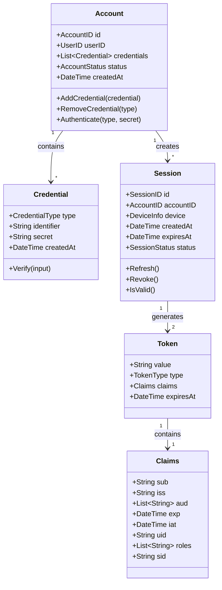
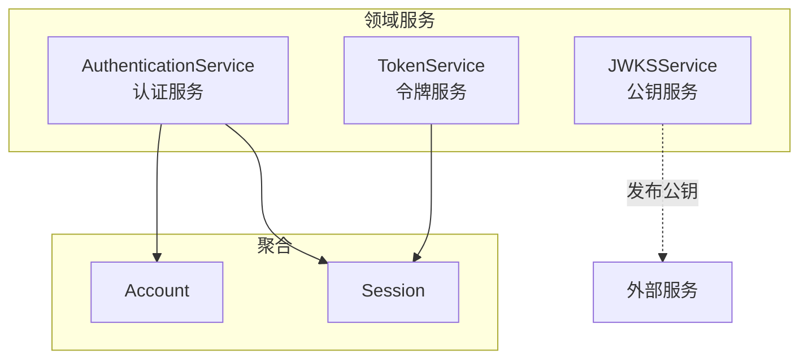

# 认证域领域模型设计

> 🎯 **核心结论**: 采用 Account 聚合根管理多凭证，Session 聚合根管理会话生命周期

---

## 1. 设计概述

### 1.1 领域边界

```text
┌─────────────────────────────────────────────────────────────┐
│                       认证域 (Authn)                         │
├─────────────────────────────────────────────────────────────┤
│  职责: 身份认证、Token 管理、会话管理、JWKS 发布             │
│  不负责: 用户档案管理、权限策略管理                          │
└─────────────────────────────────────────────────────────────┘
```

### 1.2 聚合划分

| 聚合 | 聚合根 | 职责 |
|------|--------|------|
| 账户聚合 | Account | 管理用户认证凭证 |
| 会话聚合 | Session | 管理登录会话生命周期 |

---

## 2. 领域模型

### 2.1 聚合关系图



### 2.2 Account 聚合根

```go
// 伪代码: Account 聚合根
// 源码: internal/apiserver/domain/authn/entity/account.go

type Account struct {
    ID          AccountID       // 账户唯一标识
    UserID      UserID          // 关联用户ID
    Credentials []Credential    // 凭证列表
    Status      AccountStatus   // 账户状态
    CreatedAt   time.Time
    UpdatedAt   time.Time
}

// 添加凭证
func (a *Account) AddCredential(cred Credential) error {
    // 业务规则: 同类型凭证只能有一个
    if a.hasCredentialType(cred.Type) {
        return ErrCredentialTypeExists
    }
    a.Credentials = append(a.Credentials, cred)
    return nil
}

// 认证
func (a *Account) Authenticate(credType CredentialType, secret string) error {
    cred := a.findCredential(credType)
    if cred == nil {
        return ErrCredentialNotFound
    }
    return cred.Verify(secret)
}
```

### 2.3 Credential 值对象

```go
// 伪代码: Credential 值对象
// 源码: internal/apiserver/domain/authn/valueobject/credential.go

type CredentialType string

const (
    CredentialTypeWeChatUnionID CredentialType = "wechat_unionid"
    CredentialTypeWeChatOpenID  CredentialType = "wechat_openid"
    CredentialTypePhone         CredentialType = "phone"
    CredentialTypePassword      CredentialType = "password"
)

type Credential struct {
    Type       CredentialType  // 凭证类型
    Identifier string          // 标识符 (unionid/phone等)
    Secret     string          // 密钥 (密码哈希值)
    CreatedAt  time.Time
}

func (c *Credential) Verify(input string) error {
    switch c.Type {
    case CredentialTypePassword:
        return bcrypt.CompareHashAndPassword([]byte(c.Secret), []byte(input))
    case CredentialTypeWeChatUnionID, CredentialTypeWeChatOpenID:
        if c.Identifier != input {
            return ErrCredentialMismatch
        }
        return nil
    default:
        return ErrUnsupportedCredentialType
    }
}
```

### 2.4 Session 聚合根

```go
// 伪代码: Session 聚合根
// 源码: internal/apiserver/domain/authn/entity/session.go

type Session struct {
    ID        SessionID      // 会话ID
    AccountID AccountID      // 账户ID
    Device    DeviceInfo     // 设备信息
    Status    SessionStatus  // 会话状态
    CreatedAt time.Time
    ExpiresAt time.Time
}

type SessionStatus string

const (
    SessionStatusActive  SessionStatus = "active"
    SessionStatusExpired SessionStatus = "expired"
    SessionStatusRevoked SessionStatus = "revoked"
)

// 刷新会话
func (s *Session) Refresh(duration time.Duration) error {
    if s.Status != SessionStatusActive {
        return ErrSessionInactive
    }
    s.ExpiresAt = time.Now().Add(duration)
    return nil
}

// 吊销会话
func (s *Session) Revoke() {
    s.Status = SessionStatusRevoked
}

// 检查有效性
func (s *Session) IsValid() bool {
    return s.Status == SessionStatusActive && time.Now().Before(s.ExpiresAt)
}
```

### 2.5 Token 值对象

```go
// 伪代码: Token 值对象
// 源码: internal/apiserver/domain/authn/valueobject/token.go

type TokenType string

const (
    TokenTypeAccess  TokenType = "access"
    TokenTypeRefresh TokenType = "refresh"
)

type Token struct {
    Value     string
    Type      TokenType
    Claims    Claims
    ExpiresAt time.Time
}

type Claims struct {
    // 标准 JWT Claims
    Subject   string    `json:"sub"`   // 主题 (用户ID)
    Issuer    string    `json:"iss"`   // 签发者
    Audience  []string  `json:"aud"`   // 受众
    ExpiresAt time.Time `json:"exp"`   // 过期时间
    IssuedAt  time.Time `json:"iat"`   // 签发时间
    
    // 自定义 Claims
    UserID    string   `json:"uid"`    // 用户ID
    Roles     []string `json:"roles"`  // 角色列表
    SessionID string   `json:"sid"`    // 会话ID
}
```

---

## 3. 领域服务

### 3.1 服务划分



### 3.2 AuthenticationService

```go
// 伪代码: 认证领域服务
// 源码: internal/apiserver/domain/authn/service/authentication_service.go

type AuthenticationService struct {
    accountRepo  AccountRepository
    sessionRepo  SessionRepository
    strategies   map[CredentialType]AuthStrategy
}

// 认证入口
func (s *AuthenticationService) Authenticate(ctx context.Context, req AuthRequest) (*Session, error) {
    // 1. 获取认证策略
    strategy := s.strategies[req.CredentialType]
    
    // 2. 执行认证
    account, err := strategy.Authenticate(ctx, req)
    if err != nil {
        return nil, err
    }
    
    // 3. 创建会话
    session := NewSession(account.ID, req.Device)
    
    // 4. 持久化
    if err := s.sessionRepo.Save(ctx, session); err != nil {
        return nil, err
    }
    
    return session, nil
}
```

### 3.3 TokenService

```go
// 伪代码: 令牌领域服务
// 源码: internal/apiserver/domain/authn/service/token_service.go

type TokenService struct {
    privateKey  *rsa.PrivateKey
    keyID       string
    issuer      string
}

// 生成令牌对
func (s *TokenService) GenerateTokenPair(session *Session, user *User) (*TokenPair, error) {
    claims := Claims{
        Subject:   session.AccountID.String(),
        Issuer:    s.issuer,
        UserID:    user.ID.String(),
        Roles:     user.Roles,
        SessionID: session.ID.String(),
    }
    
    accessToken := s.generateToken(claims, TokenTypeAccess, 15*time.Minute)
    refreshToken := s.generateToken(claims, TokenTypeRefresh, 7*24*time.Hour)
    
    return &TokenPair{
        AccessToken:  accessToken,
        RefreshToken: refreshToken,
    }, nil
}
```

---

## 4. 端口定义

### 4.1 仓储端口

```go
// 伪代码: 仓储端口
// 源码: internal/apiserver/domain/authn/port/repository.go

type AccountRepository interface {
    FindByID(ctx context.Context, id AccountID) (*Account, error)
    FindByCredential(ctx context.Context, credType CredentialType, identifier string) (*Account, error)
    Save(ctx context.Context, account *Account) error
}

type SessionRepository interface {
    FindByID(ctx context.Context, id SessionID) (*Session, error)
    FindByAccountID(ctx context.Context, accountID AccountID) ([]*Session, error)
    Save(ctx context.Context, session *Session) error
    Delete(ctx context.Context, id SessionID) error
}
```

### 4.2 外部服务端口

```go
// 伪代码: 外部服务端口
// 源码: internal/apiserver/domain/authn/port/wechat_client.go

type WeChatClient interface {
    Code2Session(ctx context.Context, code string) (*WeChatSession, error)
}

type WeChatSession struct {
    OpenID     string
    UnionID    string
    SessionKey string
}
```

---

## 5. 源码索引

| 组件 | 路径 | 说明 |
|------|------|------|
| **聚合根** | | |
| Account | `domain/authn/entity/account.go` | 账户聚合根 |
| Session | `domain/authn/entity/session.go` | 会话聚合根 |
| **值对象** | | |
| Credential | `domain/authn/valueobject/credential.go` | 凭证值对象 |
| Token | `domain/authn/valueobject/token.go` | 令牌值对象 |
| Claims | `domain/authn/valueobject/claims.go` | Claims值对象 |
| **领域服务** | | |
| AuthenticationService | `domain/authn/service/authentication_service.go` | 认证服务 |
| TokenService | `domain/authn/service/token_service.go` | 令牌服务 |
| **端口** | | |
| AccountRepository | `domain/authn/port/repository.go` | 账户仓储端口 |
| SessionRepository | `domain/authn/port/repository.go` | 会话仓储端口 |
| WeChatClient | `domain/authn/port/wechat_client.go` | 微信客户端端口 |
