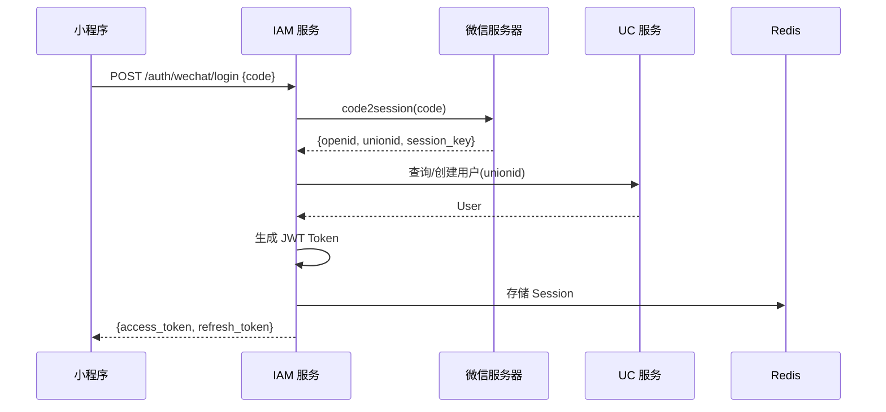
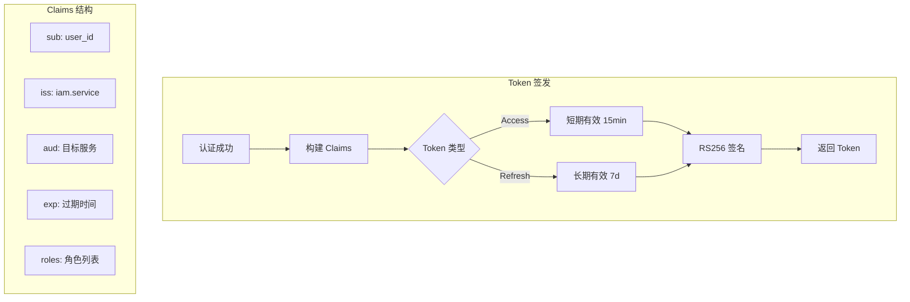
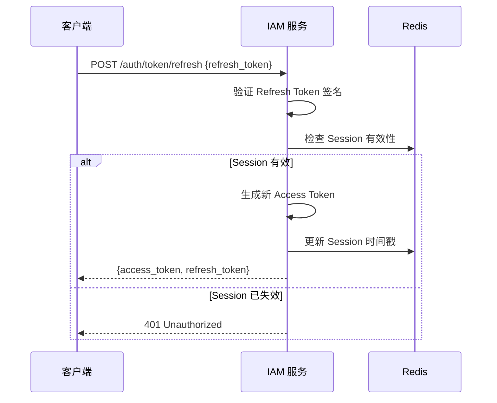
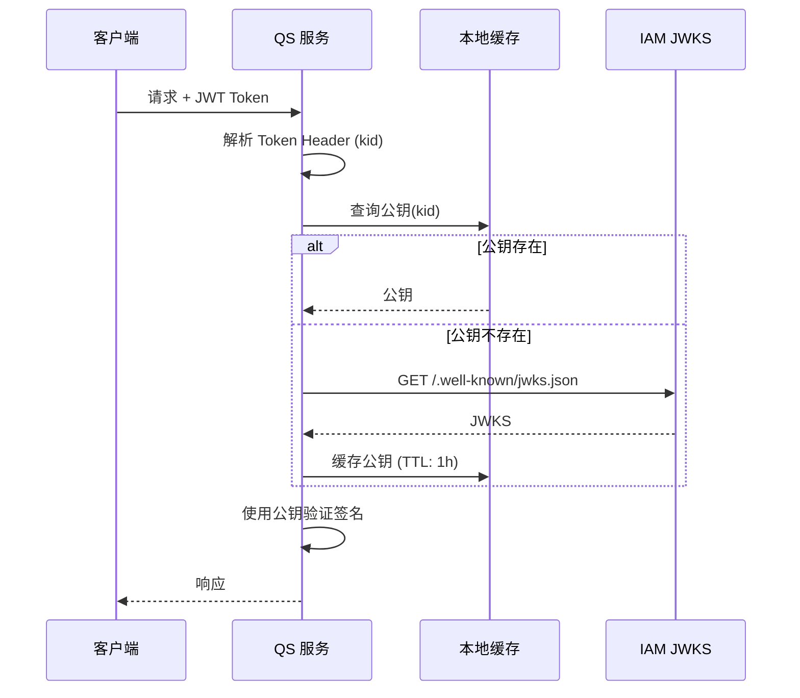

# 认证流程设计

> 🎯 **核心结论**: 采用策略模式支持多渠道登录，RS256 签名的 JWT 支持业务服务自验证

---

## 1. 设计概述

### 1.1 解决什么问题

| 问题 | 解决方案 |
|------|---------|
| 多渠道登录（微信、密码等） | 策略模式，统一认证接口 |
| Token 验证性能 | JWKS 公钥发布，业务服务本地验证 |
| Token 安全性 | RS256 非对称签名 + 短期有效 + Refresh 机制 |
| 会话管理 | Redis 存储活跃会话，支持强制登出 |

### 1.2 设计思想

```text
┌──────────────────────────────────────────────────────────┐
│                    设计原则应用                           │
├──────────────────────────────────────────────────────────┤
│  策略模式     →  多认证渠道（微信/密码/OAuth）           │
│  工厂模式     →  Token 生成（Access/Refresh）            │
│  单一职责     →  认证、签发、验证分离                    │
│  依赖倒置     →  领域层定义端口，基础设施实现            │
└──────────────────────────────────────────────────────────┘
```

---

## 2. 认证流程

### 2.1 微信小程序登录



**关键代码路径:**

```go
// 伪代码: 微信登录策略
// 源码: internal/apiserver/domain/authn/service/wechat_strategy.go

type WeChatLoginStrategy struct {
    wechatClient port.WeChatClient
    userService  port.UserQueryService
}

func (s *WeChatLoginStrategy) Authenticate(ctx context.Context, req LoginRequest) (*Account, error) {
    // 1. 调用微信获取 OpenID/UnionID
    wxSession, err := s.wechatClient.Code2Session(ctx, req.Code)
    
    // 2. 查询或创建用户
    user, err := s.userService.GetOrCreateByUnionID(ctx, wxSession.UnionID)
    
    // 3. 构建账户聚合
    return account.NewFromWeChatSession(user, wxSession), nil
}
```

### 2.2 Token 签发流程



**Token Claims 结构:**

```go
// 伪代码: JWT Claims
// 源码: internal/apiserver/domain/authn/valueobject/claims.go

type Claims struct {
    // 标准 Claims
    Subject   string    `json:"sub"`   // 用户ID
    Issuer    string    `json:"iss"`   // 签发者
    Audience  []string  `json:"aud"`   // 受众
    ExpiresAt time.Time `json:"exp"`   // 过期时间
    IssuedAt  time.Time `json:"iat"`   // 签发时间
    
    // 自定义 Claims
    UserID    string   `json:"uid"`    // 用户ID
    Roles     []string `json:"roles"`  // 角色列表
    SessionID string   `json:"sid"`    // 会话ID
}
```

### 2.3 Token 刷新流程



---

## 3. JWKS 公钥发布

### 3.1 设计目标

```text
┌─────────────────────────────────────────────────────────┐
│                    JWKS 设计目标                         │
├─────────────────────────────────────────────────────────┤
│  1. 业务服务可本地验证 Token，无需每次调用 IAM          │
│  2. 支持密钥轮换，平滑过渡                               │
│  3. 遵循 RFC 7517 JWKS 标准                              │
└─────────────────────────────────────────────────────────┘
```

### 3.2 JWKS 端点

```text
GET /.well-known/jwks.json

响应:
{
  "keys": [
    {
      "kty": "RSA",
      "kid": "key-2024-01",      // 密钥ID，对应 Token Header
      "use": "sig",
      "alg": "RS256",
      "n": "base64url(modulus)",
      "e": "base64url(exponent)"
    },
    {
      "kty": "RSA",
      "kid": "key-2023-12",      // 旧密钥，支持过渡期验证
      ...
    }
  ]
}
```

### 3.3 业务服务验证流程



---

## 4. 密钥轮换

### 4.1 轮换策略

```text
时间线:
──────────────────────────────────────────────────────────>
    T0              T1              T2              T3
    │               │               │               │
    │<── Key A ────>│               │               │
    │               │<── Key B ────>│               │
    │               │               │<── Key C ────>│
                    │               │
                    过渡期          过渡期
                    (A+B 并存)      (B+C 并存)
```

### 4.2 轮换流程

```go
// 伪代码: 密钥轮换
// 源码: internal/apiserver/domain/authn/service/key_rotation.go

func (s *KeyRotationService) Rotate(ctx context.Context) error {
    // 1. 生成新密钥对
    newKey, err := s.keyGenerator.GenerateRSAKey()
    
    // 2. 将新密钥设为 Active
    s.keyStore.SetActiveKey(newKey)
    
    // 3. 旧密钥移入 Passive 列表 (仍可验证)
    s.keyStore.MarkAsPassive(oldKey)
    
    // 4. 删除超过保留期的旧密钥
    s.keyStore.PurgeExpired(retentionPeriod)
    
    return nil
}
```

---

## 5. 源码索引

| 组件 | 路径 | 说明 |
|------|------|------|
| **认证策略** | | |
| 微信登录 | `domain/authn/service/wechat_strategy.go` | 微信认证实现 |
| 密码登录 | `domain/authn/service/password_strategy.go` | 密码认证实现 |
| **Token 服务** | | |
| Token 签发 | `domain/authn/service/token_service.go` | JWT 生成 |
| Claims 定义 | `domain/authn/valueobject/claims.go` | Claims 值对象 |
| **JWKS 服务** | | |
| JWKS 生成 | `domain/authn/service/jwks_service.go` | 公钥集生成 |
| 密钥轮换 | `domain/authn/service/key_rotation.go` | 密钥管理 |
| **会话管理** | | |
| 会话存储 | `infra/authn/redis/session_store.go` | Redis 实现 |

---

## 6. 配置项

```yaml
# configs/apiserver.yaml
authn:
  jwt:
    algorithm: RS256
    access_token_ttl: 15m
    refresh_token_ttl: 168h     # 7 days
    issuer: "iam.service"
    
  jwks:
    cache_ttl: 1h               # 公钥缓存时间
    key_rotation_period: 720h   # 30 days
    key_retention_period: 48h   # 旧密钥保留时间
    
  session:
    redis_prefix: "iam:session:"
    max_concurrent: 5           # 最大并发会话数
```
