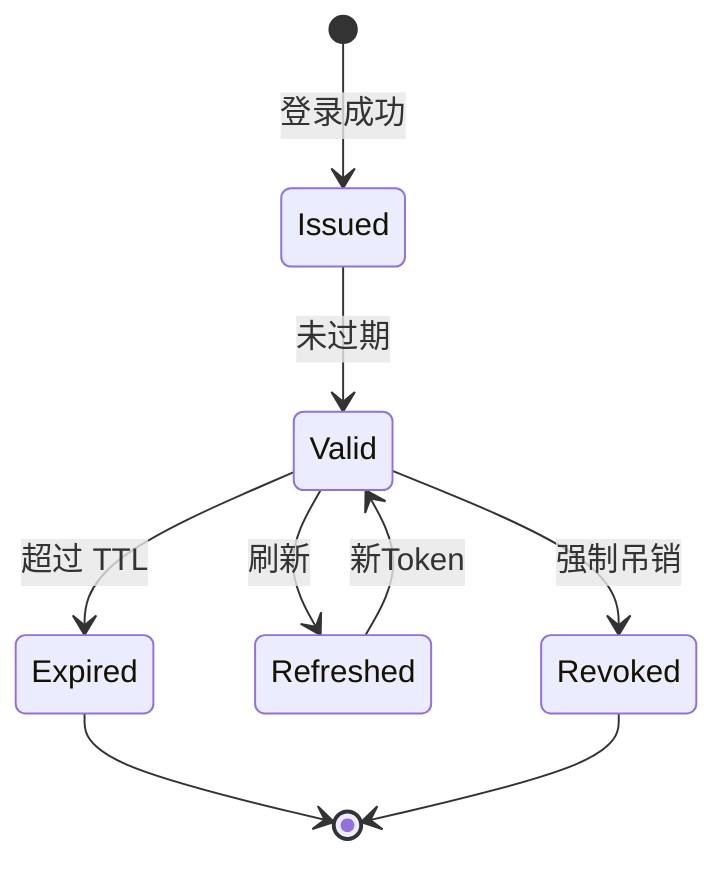
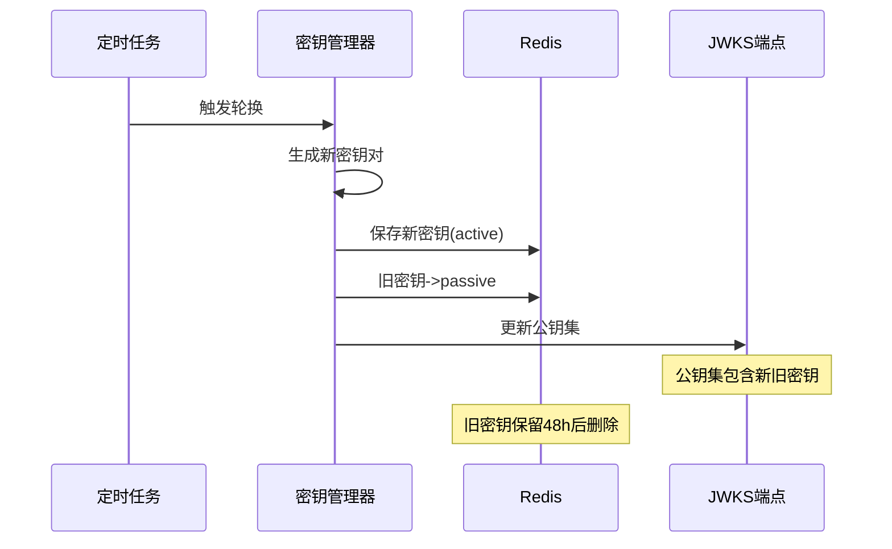
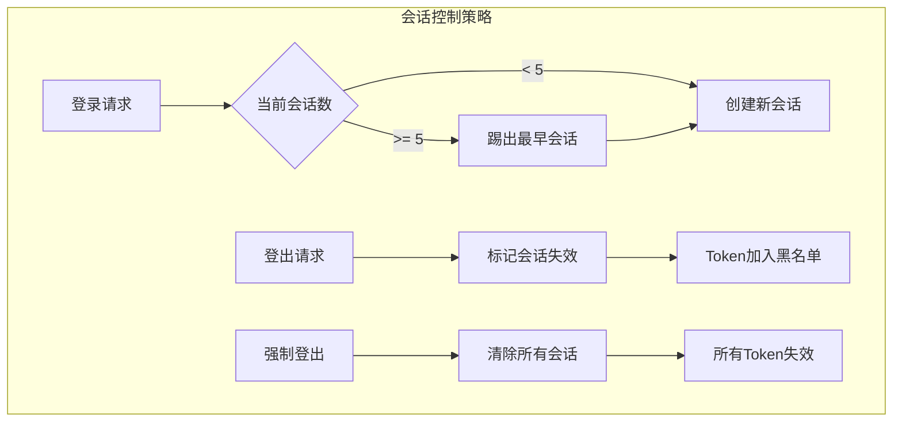

# 认证安全机制设计

> 🎯 **核心结论**: 采用 RS256 非对称签名 + 密钥轮换 + 会话黑名单实现安全认证

---

## 1. 安全架构

### 1.1 安全层次

```text
┌─────────────────────────────────────────────────────────────┐
│                      安全机制分层                            │
├─────────────────────────────────────────────────────────────┤
│  L4: 会话管理    │  会话超时、强制登出、并发控制            │
├─────────────────────────────────────────────────────────────┤
│  L3: Token安全   │  RS256签名、短期有效、刷新机制            │
├─────────────────────────────────────────────────────────────┤
│  L2: 凭证安全    │  密码哈希、防重放攻击                     │
├─────────────────────────────────────────────────────────────┤
│  L1: 传输安全    │  HTTPS、TLS 1.3                          │
└─────────────────────────────────────────────────────────────┘
```

### 1.2 安全特性

| 特性 | 实现方式 | 防护目标 |
|------|---------|---------|
| **JWT 签名** | RS256 非对称加密 | 令牌伪造 |
| **密钥轮换** | 定期自动轮换 | 密钥泄露 |
| **密码存储** | BCrypt 哈希 | 明文泄露 |
| **会话管理** | Redis + 黑名单 | 令牌盗用 |
| **速率限制** | 滑动窗口计数 | 暴力破解 |

---

## 2. JWT 安全

### 2.1 签名算法选择

```text
┌─────────────────────────────────────────────────────────────┐
│                    算法对比                                  │
├──────────┬─────────────────────┬────────────────────────────┤
│  算法     │  特点               │  适用场景                  │
├──────────┼─────────────────────┼────────────────────────────┤
│  HS256   │  对称加密，共享密钥  │  单体应用，密钥需安全传输   │
│  RS256 ✓ │  非对称，公私钥分离  │  微服务，业务可自行验签     │
│  ES256   │  椭圆曲线，签名更短  │  移动端，带宽敏感场景       │
└──────────┴─────────────────────┴────────────────────────────┘

选择 RS256 的理由：
1. 业务服务只需公钥即可验证，无需访问 IAM
2. 私钥仅 IAM 持有，安全性更高
3. 支持 JWKS 标准，密钥轮换透明
```

### 2.2 Token 生命周期



### 2.3 Token 配置

```yaml
# 伪代码: Token 配置
# 源码: configs/apiserver.yaml

jwt:
  algorithm: RS256
  access_token:
    ttl: 15m              # 短期有效，降低泄露风险
  refresh_token:
    ttl: 168h             # 7天，提升用户体验
  issuer: "iam.service"
  audience:
    - "qs.service"        # 测评系统
    - "admin.service"     # 管理后台
```

---

## 3. 密钥管理

### 3.1 密钥轮换流程



### 3.2 多密钥并存

```text
时间线示意:
━━━━━━━━━━━━━━━━━━━━━━━━━━━━━━━━━━━━━━━━━━━━━━━━━━━━━━━━━━━━>

T1              T2              T3              T4
│               │               │               │
│<── Key-A(签发) ──>│               │               │
│               │<── Key-B(签发) ──>│               │
│               │               │<── Key-C(签发) ──>│
│               │               │
│<────── Key-A(验证) ─────>│               │
│               │<────── Key-B(验证) ─────>│
│               │               │<────── Key-C(验证) ─────>│

说明:
- 签发: 只用最新密钥签发新Token
- 验证: 新旧密钥都可验证
- 过渡期: 48小时，保证已签发Token仍可验证
```

### 3.3 JWKS 端点

```go
// 伪代码: JWKS 响应
// 源码: internal/apiserver/domain/authn/service/jwks_service.go

type JWKS struct {
    Keys []JWK `json:"keys"`
}

type JWK struct {
    Kty string `json:"kty"`  // "RSA"
    Kid string `json:"kid"`  // 密钥ID，对应Token Header
    Use string `json:"use"`  // "sig"
    Alg string `json:"alg"`  // "RS256"
    N   string `json:"n"`    // RSA modulus (Base64URL)
    E   string `json:"e"`    // RSA exponent (Base64URL)
}

// GET /.well-known/jwks.json
func (s *JWKSService) GetJWKS() *JWKS {
    keys := []JWK{}
    
    // 添加活跃密钥
    keys = append(keys, s.activeKey.ToJWK())
    
    // 添加过渡期密钥
    for _, key := range s.passiveKeys {
        keys = append(keys, key.ToJWK())
    }
    
    return &JWKS{Keys: keys}
}
```

---

## 4. 密码安全

### 4.1 密码哈希

```go
// 伪代码: 密码哈希
// 源码: internal/apiserver/infra/authn/password_hasher.go

const (
    bcryptCost = 12  // 2^12 = 4096 轮迭代
)

func HashPassword(password string) (string, error) {
    // 使用 BCrypt，自动加盐
    hash, err := bcrypt.GenerateFromPassword([]byte(password), bcryptCost)
    return string(hash), err
}

func VerifyPassword(password, hash string) error {
    return bcrypt.CompareHashAndPassword([]byte(hash), []byte(password))
}
```

### 4.2 密码策略

| 策略 | 要求 |
|------|------|
| 最小长度 | 8 字符 |
| 复杂度 | 包含大小写字母 + 数字 |
| 历史记录 | 不能使用最近 5 次密码 |
| 过期时间 | 90 天（可选） |

---

## 5. 会话安全

### 5.1 会话存储结构

```text
Redis Key 设计:

iam:session:{session_id}
├── account_id    # 账户ID
├── device        # 设备信息
├── created_at    # 创建时间
├── expires_at    # 过期时间
└── status        # 状态

iam:account:{account_id}:sessions
└── Set<session_id>  # 账户的所有会话

iam:token:blacklist:{jti}
└── TTL = token剩余有效期
```

### 5.2 会话控制



### 5.3 Token 吊销

```go
// 伪代码: Token 吊销
// 源码: internal/apiserver/infra/authn/token_blacklist.go

type TokenBlacklist interface {
    Add(ctx context.Context, jti string, expiresAt time.Time) error
    IsBlacklisted(ctx context.Context, jti string) (bool, error)
}

// 验证 Token 时检查黑名单
func (s *TokenValidator) Validate(token string) (*Claims, error) {
    claims, err := s.parseAndVerify(token)
    if err != nil {
        return nil, err
    }
    
    // 检查黑名单
    if blacklisted, _ := s.blacklist.IsBlacklisted(ctx, claims.JTI); blacklisted {
        return nil, ErrTokenRevoked
    }
    
    return claims, nil
}
```

---

## 6. 防护机制

### 6.1 速率限制

```go
// 伪代码: 速率限制
// 源码: internal/apiserver/infra/middleware/rate_limit.go

type RateLimiter struct {
    redis  *redis.Client
    limit  int           // 限制次数
    window time.Duration // 时间窗口
}

// 滑动窗口计数
func (r *RateLimiter) Allow(key string) (bool, error) {
    now := time.Now().UnixNano()
    windowStart := now - r.window.Nanoseconds()
    
    pipe := r.redis.Pipeline()
    // 移除窗口外的记录
    pipe.ZRemRangeByScore(key, "0", strconv.FormatInt(windowStart, 10))
    // 添加当前请求
    pipe.ZAdd(key, &redis.Z{Score: float64(now), Member: now})
    // 计算窗口内请求数
    pipe.ZCard(key)
    // 设置过期时间
    pipe.Expire(key, r.window)
    
    results, _ := pipe.Exec()
    count := results[2].(*redis.IntCmd).Val()
    
    return count <= int64(r.limit), nil
}
```

### 6.2 限制配置

| 端点 | 限制 | 窗口 |
|------|------|------|
| 登录 | 5 次 | 1 分钟 |
| Token 刷新 | 10 次 | 1 分钟 |
| 密码重置 | 3 次 | 10 分钟 |

### 6.3 防重放攻击

```go
// 伪代码: Nonce 防重放
// 源码: internal/apiserver/infra/authn/nonce_validator.go

type NonceValidator struct {
    redis *redis.Client
    ttl   time.Duration
}

func (v *NonceValidator) Validate(nonce string, timestamp int64) error {
    // 1. 检查时间戳是否在允许范围内
    now := time.Now().Unix()
    if abs(now-timestamp) > 300 { // 5分钟
        return ErrTimestampExpired
    }
    
    // 2. 检查 nonce 是否已使用
    key := fmt.Sprintf("nonce:%s", nonce)
    exists, _ := v.redis.SetNX(key, "1", v.ttl).Result()
    if !exists {
        return ErrNonceReused
    }
    
    return nil
}
```

---

## 7. 配置汇总

```yaml
# 安全相关配置
# 源码: configs/apiserver.yaml

security:
  jwt:
    algorithm: RS256
    access_token_ttl: 15m
    refresh_token_ttl: 168h
    
  key_rotation:
    enabled: true
    period: 720h          # 30天
    retention: 48h        # 旧密钥保留时间
    
  password:
    bcrypt_cost: 12
    min_length: 8
    require_uppercase: true
    require_number: true
    
  session:
    max_concurrent: 5
    idle_timeout: 30m
    absolute_timeout: 24h
    
  rate_limit:
    login:
      limit: 5
      window: 1m
    token_refresh:
      limit: 10
      window: 1m
```

---

## 8. 源码索引

| 组件 | 路径 | 说明 |
|------|------|------|
| **密钥管理** | | |
| KeyManager | `domain/authn/service/key_manager.go` | 密钥生命周期管理 |
| JWKSService | `domain/authn/service/jwks_service.go` | JWKS 端点服务 |
| **密码安全** | | |
| PasswordHasher | `infra/authn/password_hasher.go` | BCrypt 哈希 |
| PasswordValidator | `domain/authn/service/password_validator.go` | 密码策略验证 |
| **会话管理** | | |
| SessionStore | `infra/authn/redis/session_store.go` | Redis 会话存储 |
| TokenBlacklist | `infra/authn/token_blacklist.go` | Token 黑名单 |
| **防护机制** | | |
| RateLimiter | `infra/middleware/rate_limit.go` | 速率限制 |
| NonceValidator | `infra/authn/nonce_validator.go` | Nonce 验证 |
