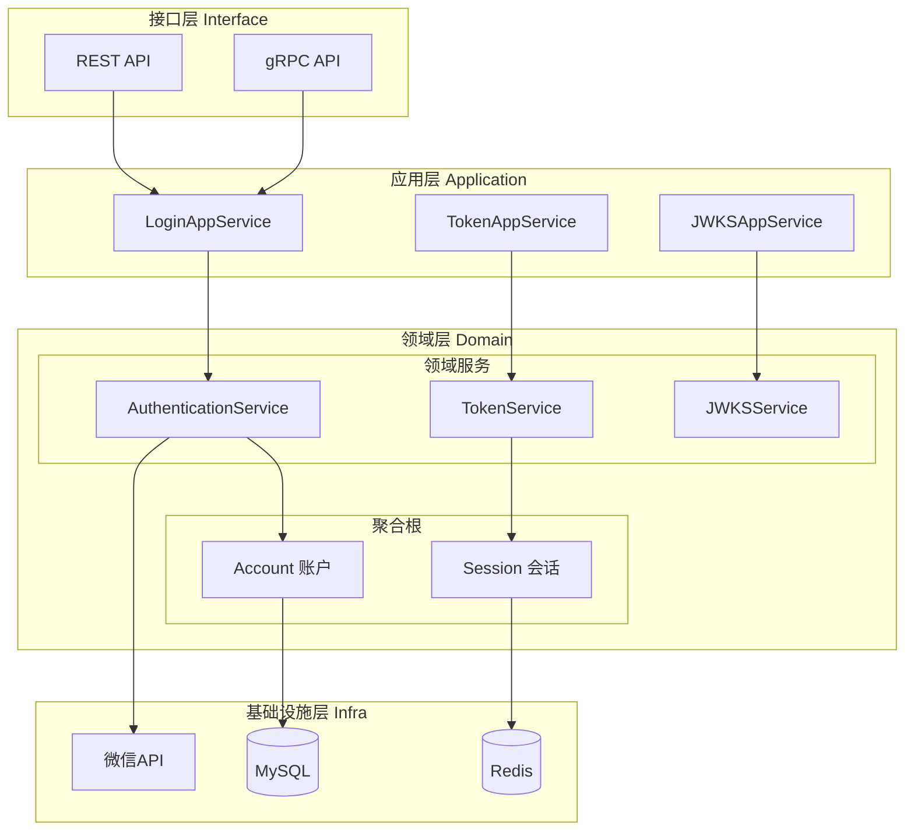
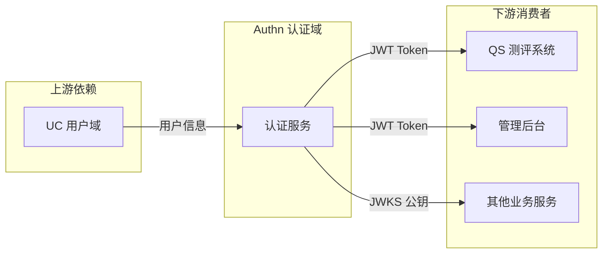

# 认证域 (Authn) 架构设计

> 🔐 负责用户身份认证、JWT Token 管理、JWKS 公钥发布

---

## 📊 架构全景图



---

## 🎯 核心职责

| 职责 | 说明 | 设计文档 |
|------|------|---------|
| **身份认证** | 微信/密码多渠道登录 | [认证流程设计](./02-认证流程设计.md) |
| **Token 管理** | JWT 签发、刷新、吊销 | [认证流程设计](./02-认证流程设计.md) |
| **JWKS 发布** | 公钥集发布，支持业务自验证 | [认证流程设计](./02-认证流程设计.md) |
| **会话管理** | 多设备登录、强制登出 | [安全机制设计](./03-安全机制设计.md) |

---

## 🏗️ 设计思想

### 策略模式 - 多渠道认证

```text
┌─────────────────────────────────────────────────────────┐
│                  AuthenticationService                   │
│                         │                                │
│         ┌───────────────┼───────────────┐               │
│         ▼               ▼               ▼               │
│  ┌─────────────┐ ┌─────────────┐ ┌─────────────┐       │
│  │WeChatStrategy│ │PasswordStrategy│ │OAuthStrategy│       │
│  └─────────────┘ └─────────────┘ └─────────────┘       │
│         │               │               │               │
│         └───────────────┴───────────────┘               │
│                         │                                │
│                         ▼                                │
│                  Account 聚合                            │
└─────────────────────────────────────────────────────────┘

设计模式: Strategy Pattern
开闭原则: 新增认证方式只需添加新策略，无需修改核心逻辑
```

### 工厂模式 - Token 生成

```go
// 伪代码: Token 工厂
// 源码: internal/apiserver/domain/authn/service/token_service.go

type TokenFactory interface {
    CreateAccessToken(claims Claims) (Token, error)
    CreateRefreshToken(claims Claims) (Token, error)
}

// 实现支持不同签名算法
type RS256TokenFactory struct { privateKey *rsa.PrivateKey }
type HS256TokenFactory struct { secret []byte }
```

---

## 📁 代码结构

```text
internal/apiserver/
├── domain/authn/                    # 认证领域
│   ├── entity/
│   │   ├── account.go              # 账户聚合根
│   │   ├── credential.go           # 凭证实体
│   │   └── session.go              # 会话实体
│   ├── valueobject/
│   │   ├── token.go                # Token 值对象
│   │   ├── claims.go               # Claims 值对象
│   │   └── auth_type.go            # 认证类型枚举
│   ├── service/
│   │   ├── authentication.go       # 认证领域服务
│   │   ├── token_service.go        # Token 领域服务
│   │   └── jwks_service.go         # JWKS 领域服务
│   ├── port/
│   │   ├── repository.go           # 仓储端口
│   │   └── wechat_client.go        # 微信客户端端口
│   └── event/
│       ├── login_succeeded.go      # 登录成功事件
│       └── token_revoked.go        # Token 吊销事件
│
├── application/authn/               # 认证应用层
│   ├── login_app_service.go        # 登录应用服务
│   ├── token_app_service.go        # Token 应用服务
│   └── dto/                        # 数据传输对象
│
└── infra/authn/                     # 认证基础设施
    ├── repository/                  # 仓储实现
    ├── wechat/                      # 微信 SDK 适配器
    └── redis/                       # Redis 会话存储
```

---

## 🔗 上下游关系



| 关系 | 服务 | 说明 |
|------|------|------|
| **依赖** | UC 域 | 获取用户信息用于 Token Claims |
| **被依赖** | QS 系统 | 通过 JWKS 验证 Token |
| **被依赖** | 管理后台 | 使用 Token 进行 API 认证 |

---

## 📚 详细设计文档

| 文档 | 内容 | 阅读时间 |
|------|------|---------|
| [领域模型设计](./01-领域模型设计.md) | 聚合根、实体、值对象定义 | 10 min |
| [认证流程设计](./02-认证流程设计.md) | 登录、Token、JWKS 流程 | 15 min |
| [安全机制设计](./03-安全机制设计.md) | 加密、防护、密钥管理 | 10 min |

---

## 🔑 关键决策

| 决策 | 选择 | 理由 |
|------|------|------|
| JWT 签名算法 | RS256 | 非对称加密，业务服务可自验证 |
| Token 存储 | Redis | 高性能、支持 TTL、便于集群 |
| 密钥管理 | 定期轮换 | 安全最佳实践 |
| 认证策略 | 策略模式 | 易扩展新认证方式 |
