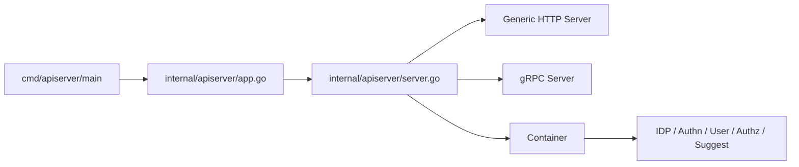

# 服务入口、HTTP 与模块装配

## 本文回答

本文只回答 5 件事：

1. `iam-apiserver` 是怎么从入口走到运行态的
2. `PrepareRun()` 今天到底做了什么
3. 模块初始化顺序与容错方式今天怎么读
4. HTTP 暴露面今天包括什么
5. 路由与认证中间件的真实关系是什么

## 30 秒结论

- 当前只有一个主运行单元：`iam-apiserver`；`main()` 在 [../../cmd/apiserver/apiserver.go](../../cmd/apiserver/apiserver.go)，它会进入 [../../internal/apiserver/app.go](../../internal/apiserver/app.go) 创建 CLI 应用并最终运行 `Run(cfg)`。
- `createAPIServer()` 会同时构建 HTTP 服务器、gRPC 服务器和数据库管理器；`PrepareRun()` 再初始化数据库、EventBus、容器、路由、gRPC 服务和后台调度器。
- 容器初始化顺序是：`IDP -> Authn -> User -> Authz -> Suggest`；单个模块初始化失败会记录 warning，但不会立刻让整个进程退出。
- HTTP 路由由集中式 [../../internal/apiserver/routers.go](../../internal/apiserver/routers.go) 注册，当前主分组是：`authn`、`authz`、`idp`、`identity(user)`、`suggest`，另外还有 `/health`、`/ping`、`/debug/*`、`/swagger`、`/openapi`。
- 当前 `user`、`authz`、`suggest` 和 `/api/v1/admin/*` 都会消费中央创建的 JWT 中间件；`authn` 以公开登录/JWKS 为主，`idp` 当前仍没有在 router 层统一挂上 `AuthRequired()`。

## 重点速查

| 关注点 | 当前答案 | 真实落点 |
| ---- | ---- | ---- |
| `main` 入口 | `apiserver.NewApp(\"iam-apiserver\").Run()` | [../../cmd/apiserver/apiserver.go](../../cmd/apiserver/apiserver.go) |
| CLI / 配置装载 | `options -> config.CreateConfigFromOptions -> Run(cfg)` | [../../internal/apiserver/app.go](../../internal/apiserver/app.go) |
| 创建服务器 | 同时创建 Generic HTTP Server 与 gRPC Server | [../../internal/apiserver/server.go](../../internal/apiserver/server.go) |
| 容器初始化 | `NewContainer(...).Initialize()` | [../../internal/apiserver/container/container.go](../../internal/apiserver/container/container.go) |
| 模块初始化顺序 | `IDP -> Authn -> User -> Authz -> Suggest` | [../../internal/apiserver/container/container.go](../../internal/apiserver/container/container.go) |
| 路由注册 | `NewRouter(container).RegisterRoutes(engine)` | [../../internal/apiserver/routers.go](../../internal/apiserver/routers.go) |
| 基础路由 | `/health`、`/ping`、`/debug/*`、`/swagger`、`/openapi`、`/api/v1/public/info` | [../../internal/apiserver/routers.go](../../internal/apiserver/routers.go) |
| 用户模块路由 | `/api/v1/identity/*` | [../../internal/apiserver/interface/uc/restful/router.go](../../internal/apiserver/interface/uc/restful/router.go) |
| 授权模块路由 | `/api/v1/authz/*` | [../../internal/apiserver/interface/authz/restful/router.go](../../internal/apiserver/interface/authz/restful/router.go) |
| IDP 模块路由 | `/api/v1/idp/*` | [../../internal/apiserver/interface/idp/restful/router.go](../../internal/apiserver/interface/idp/restful/router.go) |
| Suggest 路由 | `/api/v1/suggest/child` | [../../internal/apiserver/interface/suggest/restful/handler.go](../../internal/apiserver/interface/suggest/restful/handler.go) |

## 1. `iam-apiserver` 是怎么从入口走到运行态的

### 1.1 入口到运行

当前启动链可压缩成下面 5 步：

1. `cmd/apiserver/apiserver.go` 调用 `apiserver.NewApp("iam-apiserver").Run()`
2. `internal/apiserver/app.go` 创建 CLI 应用、初始化日志、读取 options
3. `config.CreateConfigFromOptions(opts)` 组装运行配置
4. `Run(cfg)` 内部创建 `apiServer`
5. `PrepareRun().Run()` 分别启动 HTTP 与 gRPC，并接入优雅关闭

### 1.2 当前进程模型

当前最关键的运行时认识是：

- `iam-apiserver` 不是“只承载 REST”的单面进程
- HTTP 与 gRPC 共用同一套容器和模块装配
- 模块初始化与路由注册都发生在 `PrepareRun()`

## 2. `PrepareRun()` 今天到底做了什么

[../../internal/apiserver/server.go](../../internal/apiserver/server.go) 当前 `PrepareRun()` 的主动作是：

1. 初始化数据库管理器，拿到 MySQL 和 Redis
2. 读取 IDP 加密密钥
3. 按配置尝试创建 EventBus
4. 构建 `container.Container`
5. 调用 `container.Initialize()`
6. 创建 Router 并注册 HTTP 路由
7. 注册 gRPC 服务
8. 如果认证模块提供了密钥轮换调度器，则异步启动
9. 安装优雅关闭回调，负责停止调度器、停止 suggest 更新任务、关闭数据库、关闭 HTTP / gRPC 服务

这说明运行时装配不是“main 里手写每个 handler”，而是：

- 容器负责模块装配
- Router 负责 HTTP 暴露面
- gRPC 注册单独走 `registerGRPCServices()`

## 3. 模块初始化顺序与容错方式今天怎么读

### 3.1 初始化顺序

[../../internal/apiserver/container/container.go](../../internal/apiserver/container/container.go) 当前顺序是：

1. `initIDPModule()`
2. `initAuthModule()`
3. `initUserModule()`
4. `initAuthzModule()`
5. `initSuggestModule()`

这个顺序不是随便排的：

- `IDP` 先起，因为 `authn` 可能依赖它的微信能力
- `authn` 再起，因为 router 里的中央 JWT 中间件依赖 `TokenService`
- `suggest` 最后起，因为它更像补充读侧能力

### 3.2 当前容错边界

容器初始化失败时，当前策略是：

- 记录 warning
- 汇总错误
- 尽量让进程继续跑

这意味着今天更准确的口径是：

- “系统支持部分模块降级启动”
- 不是“任一模块失败都会阻止整个进程启动”

## 4. HTTP 暴露面今天包括什么

### 4.1 基础路由

[../../internal/apiserver/routers.go](../../internal/apiserver/routers.go) 当前无条件注册：

| 路由 | 当前作用 |
| ---- | ---- |
| `/health` | 简单健康检查 |
| `/ping` | 连通性测试 |
| `/debug/routes` | 列出当前已注册路由 |
| `/debug/modules` | 查看容器和模块状态 |
| `/openapi/*` | 静态 OpenAPI 文件 |
| `/swagger/*` | Swagger UI |
| `/api/v1/public/info` | 对外公开的服务信息 |

### 4.2 模块路由

当前中央 router 会按模块注册：

| 模块 | 路由前缀 | 当前说明 |
| ---- | ---- | ---- |
| `authn` | `/api/v1/authn` | 登录、刷新、登出、verify、accounts、JWKS 管理 |
| `authz` | `/api/v1/authz` | 角色、策略、资源、Assignment 管理面与单次 PDP |
| `idp` | `/api/v1/idp` | 微信应用管理与令牌相关接口 |
| `user` | `/api/v1/identity` | me、children、guardianship 等身份接口 |
| `suggest` | `/api/v1/suggest` | 联想搜索接口 |
| `admin` | `/api/v1/admin` | 当前仍是 placeholder 路由 |

另外，JWKS 公开端点在 `authn` 模块里额外挂了：

- `/.well-known/jwks.json`
- `/api/v1/.well-known/jwks.json`

## 5. 路由与认证中间件的真实关系是什么

中央 router 当前只在拿到 `AuthnModule.TokenService` 时创建 `JWTAuthMiddleware`。

随后它把这个中间件用在：

- `user` 模块：作为 `Dependencies.AuthMiddleware` 注入，并对 `/api/v1/identity` 整组生效
- `authz` 模块：作为 `Dependencies.AuthMiddleware` 注入，并对 `/api/v1/authz` 整组生效（`/health` 例外）
- `suggest` 模块：作为 `Dependencies.AuthMiddleware` 注入，并对 `/api/v1/suggest` 生效
- `/api/v1/admin`：如果中间件存在，则整组挂 `AuthRequired()`

当前没有统一挂上的：

- `authn`
- `idp`

这不是“设计上一定不需要认证”，只是当前 router 层的真实状态。

## 6. 当前保证与风险边界

### 已实现

- 单进程承载 HTTP 与 gRPC
- 容器化模块装配
- 集中式 HTTP 路由注册
- 部分模块失败时的降级启动
- JWT 中间件的中央创建与注入
- `user / authz / suggest / admin` 这几组运行面都已接入同一套中央 JWT 中间件

### 待补证据

- 不同环境下 HTTP 绑定地址与更细的公开暴露策略，应结合配置与部署层继续核对

### 规划改造

- 如果未来要把 `authz` 的统一保护或更多运行时面再拆分，应在本层单独区分“当前 router 实现”和“未来统一接入方案”

## 继续往下读

1. [02-gRPC与mTLS.md](./02-gRPC与mTLS.md)
2. [03-HTTP认证中间件与身份上下文.md](./03-HTTP认证中间件与身份上下文.md)
3. [../03-接口与集成/README.md](../03-接口与集成/README.md)
4. [../04-基础设施与运维/04-端口、证书与数据库迁移.md](../04-基础设施与运维/04-端口、证书与数据库迁移.md)
