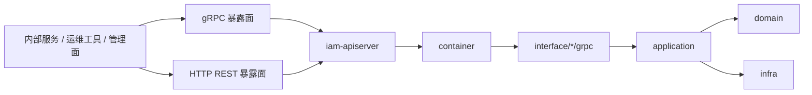

# gRPC 与 mTLS

## 本文回答

本文只回答 5 件事：

1. gRPC 在当前运行时里到底扮演什么角色
2. 它是怎么被组装、启动并注册进进程的
3. 当前拦截器与安全链是怎么叠加的
4. dev / prod 今天到底开了哪些安全开关
5. 它和健康检查、契约层、其他运行面应该怎么分工

## 30 秒结论

- gRPC 不是独立服务，而是 `iam-apiserver` 进程内的一块运行面；启动、注册和关闭都在 [../../internal/apiserver/server.go](../../internal/apiserver/server.go)。
- 当前 gRPC 运行时最值得先记住的是 4 件事：注册了哪些服务、拦截器链怎么排、dev/prod 到底开了哪些安全开关、健康检查如何暴露。
- 当前实际注册的服务只有 `AuthService`、`JWKSService`、`IdentityRead`、`GuardianshipQuery`、`GuardianshipCommand`、`IdentityLifecycle`、`IDPService`；没有注册就不能讲成“当前已暴露”。
- dev / prod 当前都启用了 `mTLS` 和审计；`auth` 仍关闭，`ACL` 只在 prod 开启。
- gRPC 契约与 metadata 约定看 [../03-接口与集成/02-gRPC契约与接入.md](../03-接口与集成/02-gRPC契约与接入.md)；健康检查、debug 路由和降级启动边界看 [04-健康检查、debug 路由与降级启动边界.md](./04-健康检查、debug 路由与降级启动边界.md)。

## 重点速查

| 关注点 | 当前答案 | 真实落点 |
| ---- | ---- | ---- |
| 进程入口 | `iam-apiserver` 进程同时启动 HTTP 和 gRPC | [../../cmd/apiserver/apiserver.go](../../cmd/apiserver/apiserver.go)、[../../internal/apiserver/server.go](../../internal/apiserver/server.go) |
| gRPC 服务器封装 | 项目级 gRPC 基础设施封装 | [../../internal/pkg/grpc/server.go](../../internal/pkg/grpc/server.go)、[../../internal/pkg/grpc/config.go](../../internal/pkg/grpc/config.go) |
| 服务注册 | 在 `registerGRPCServices()` 中聚合注册 | [../../internal/apiserver/server.go](../../internal/apiserver/server.go) |
| 认证域 gRPC | `AuthService`、`JWKSService` | [../../internal/apiserver/interface/authn/grpc/service.go](../../internal/apiserver/interface/authn/grpc/service.go) |
| 用户域 gRPC | `IdentityRead`、`Guardianship*`、`IdentityLifecycle` | [../../internal/apiserver/interface/uc/grpc/identity/service.go](../../internal/apiserver/interface/uc/grpc/identity/service.go) |
| IDP gRPC | `IDPService` | [../../internal/apiserver/interface/idp/grpc/service.go](../../internal/apiserver/interface/idp/grpc/service.go) |
| dev/prod 安全口径 | 两边都开 `mTLS`，`auth` 仍关闭，`ACL` 只在 prod 打开 | [../../configs/apiserver.dev.yaml](../../configs/apiserver.dev.yaml)、[../../configs/apiserver.prod.yaml](../../configs/apiserver.prod.yaml) |
| ACL 合同 | 方法级 ACL 配置，不是 proto 合同 | [../../configs/grpc_acl.yaml](../../configs/grpc_acl.yaml) |
| 健康检查与降级启动 | gRPC health、独立 HTTP 探针、部分初始化仍继续启动 | [../../internal/pkg/grpc/server.go](../../internal/pkg/grpc/server.go)、[../../internal/apiserver/server.go](../../internal/apiserver/server.go)、[./04-健康检查、debug 路由与降级启动边界.md](./04-健康检查、debug 路由与降级启动边界.md) |

## 1. gRPC 在当前运行时里到底扮演什么角色

gRPC 在当前仓库中属于**运行时通信面**，不是独立服务。

这意味着读 gRPC 运行时时，最重要的不是某一个 `proto` 文件，而是：

1. 进程怎么把 gRPC 服务器启动起来。
2. 进程把哪些服务注册进去了。
3. 服务器层叠加了哪些安全和治理机制。

## 2. 它是怎么被组装、启动并注册进进程的

### 2.1 入口链路

| 步骤 | 路径 | 说明 |
| ---- | ---- | ---- |
| 程序入口 | [../../cmd/apiserver/apiserver.go](../../cmd/apiserver/apiserver.go) | 启动 `iam-apiserver` |
| 创建 API Server | [../../internal/apiserver/server.go](../../internal/apiserver/server.go) | `createAPIServer()` 同时创建 HTTP 与 gRPC 服务器 |
| 构建 gRPC 服务器 | [../../internal/apiserver/server.go](../../internal/apiserver/server.go) | `buildGRPCServer()` -> `grpcConfig.Complete().New()` |
| gRPC 基础设施封装 | [../../internal/pkg/grpc/server.go](../../internal/pkg/grpc/server.go) | `NewServer()`、拦截器链、mTLS、ACL、健康检查 |
| 注册业务服务 | [../../internal/apiserver/server.go](../../internal/apiserver/server.go) | `registerGRPCServices()` |

### 2.2 实际注册的服务

当前代码实际注册了这些 gRPC 服务：

| 模块 | 服务 |
| ---- | ---- |
| Authn | `AuthService`、`JWKSService` |
| UC / Identity | `IdentityRead`、`GuardianshipQuery`、`GuardianshipCommand`、`IdentityLifecycle` |
| IDP | `IDPService` |

说明：

- 这一表是根据当前 `Register*Server(...)` 的真实调用整理的。
- 如果 `proto` 里存在但当前没有 `Register...Server(...)`，不能把它写成“当前运行时已暴露”。

## 3. 当前拦截器与安全链是怎么叠加的

### 3.1 当前一元拦截器链

根据 [../../internal/pkg/grpc/server.go](../../internal/pkg/grpc/server.go)，当前一元拦截器链的顺序是：

1. Recovery
2. RequestID
3. Logging
4. mTLS 身份提取（启用 mTLS 时）
5. 应用层凭证验证（启用 Auth 时）
6. ACL（启用 ACL 时）
7. Audit（启用 Audit 时）

### 3.2 当前流式拦截器链

流式链路当前包括：

1. Logging
2. mTLS
3. Credential
4. ACL
5. Audit

### 3.3 当前安全分层

| 层 | 作用 | 位置 |
| ---- | ---- | ---- |
| 传输层 | TLS / mTLS | `component-base/pkg/grpc/mtls` + `internal/pkg/grpc/server.go` |
| 身份提取 | 从证书读取客户端身份 | `component-base/pkg/grpc/interceptors` |
| 应用层认证 | Bearer / HMAC / API Key | `internal/pkg/grpc/server.go` 中 CredentialInterceptor 装配 |
| 方法级权限控制 | 基于 ACL 文件控制 method 访问 | [../../configs/grpc_acl.yaml](../../configs/grpc_acl.yaml) |
| 审计与日志 | 请求日志、审计日志、RequestID | `internal/pkg/grpc/interceptors.go`、`server.go` |

## 4. dev / prod 今天到底开了哪些安全开关

### 4.1 dev / prod 对照

| 环境 | gRPC 端口 | HTTP 健康检查端口 | mTLS | Auth | ACL | Audit |
| ---- | ---- | ---- | ---- | ---- | ---- | ---- |
| dev | `19091` | `19092` | 开 | 关 | 关 | 开 |
| prod | `9090` | `9091` | 开 | 关 | 开 | 开 |

这张表比长段配置解释更重要，因为它直接回答了今天最容易被误讲的 3 个问题：

1. gRPC 运行面不是“默认裸跑”，而是 dev / prod 都启用了 mTLS。
2. 应用层 `auth` 当前还没有在这条链上打开，不能讲成“gRPC 已经叠加 bearer / hmac / api key 认证”。
3. `ACL` 不是所有环境都启用，当前只有 prod 打开。

### 4.2 ACL 合同

[../../configs/grpc_acl.yaml](../../configs/grpc_acl.yaml) 当前承载：

- 默认策略
- 调用方 `service_name`
- 允许访问的方法列表
- 可选的 HMAC / API Key / IP 白名单

注意：

- 这份 ACL 文件是**运行时权限配置**，不是 `proto` 合同。
- 文档表述应以当前已注册和可调用的方法为准，不应凭设计意图扩写。
- 它回答的是“谁在运行时可以调用哪个方法”，不是“系统外部承诺提供哪些 RPC”。

## 5. 它和健康检查、契约层、其他运行面应该怎么分工

gRPC 这篇的重点是“服务如何启动与保护”，不是把整个运行面杂糅进一篇里。

| 暴露面 | 位置 | 说明 |
| ---- | ---- | ---- |
| gRPC 服务端口 | gRPC 配置 `bind-port` | 内部服务间调用 |
| gRPC Health | `grpc.health.v1.Health` | 标准 gRPC 健康检查 |
| HTTP `/healthz` | `healthz-port` | 不需要 mTLS，便于探针 |
| HTTP `/readyz` | `healthz-port` | 就绪探针 |
| HTTP `/livez` | `healthz-port` | 存活探针 |

另外两类容易和 gRPC 混在一起的话题已经拆出去单独说：

- HTTP `/health`、`/ping`、`/debug/routes`、`/debug/modules`
- MySQL / Redis / EventBus / 容器初始化失败后，进程为什么还会继续启动

统一看 [04-健康检查、debug 路由与降级启动边界.md](./04-健康检查、debug 路由与降级启动边界.md)。

## 6. 当前保证与风险边界

### 已实现

- 项目级 gRPC 服务器封装
- mTLS、ACL、审计、RequestID、健康检查装配
- Authn / UC / IDP 三类 gRPC 服务注册
- dev/prod 配置分离

### 待补证据

- 不同调用方在真实生产环境中的证书发放与轮换流程，还需要与 infra 项目或运维脚本联合核对

### 规划改造

- 如未来要把 gRPC 运行面从 `iam-apiserver` 中再拆成独立进程，应在此文与部署文档中明确区分“当前架构”和“规划架构”

## 继续往下读

| 文档 | 说明 |
| ---- | ---- |
| [../03-接口与集成/02-gRPC契约与接入.md](../03-接口与集成/02-gRPC契约与接入.md) | gRPC 合同、接入方式、metadata 约定 |
| [04-健康检查、debug 路由与降级启动边界.md](./04-健康检查、debug 路由与降级启动边界.md) | 探针、debug 路由、部分初始化与降级启动边界 |
| [../00-概览/01-系统架构总览.md](../00-概览/01-系统架构总览.md) | 系统级总览 |
| [../../api/grpc/README.md](../../api/grpc/README.md) | `proto` 与调用契约入口 |
| [../04-基础设施与运维/04-端口、证书与数据库迁移.md](../04-基础设施与运维/04-端口、证书与数据库迁移.md) | 端口、证书、迁移与 Docker 入口 |
