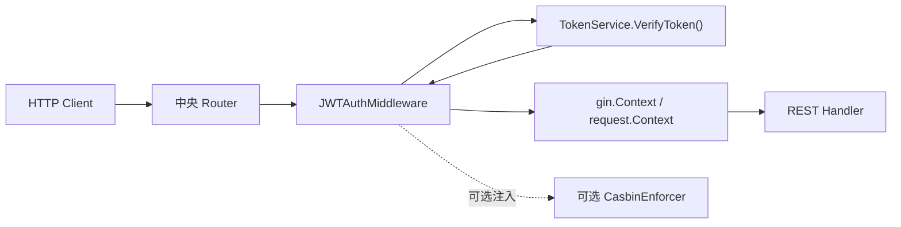
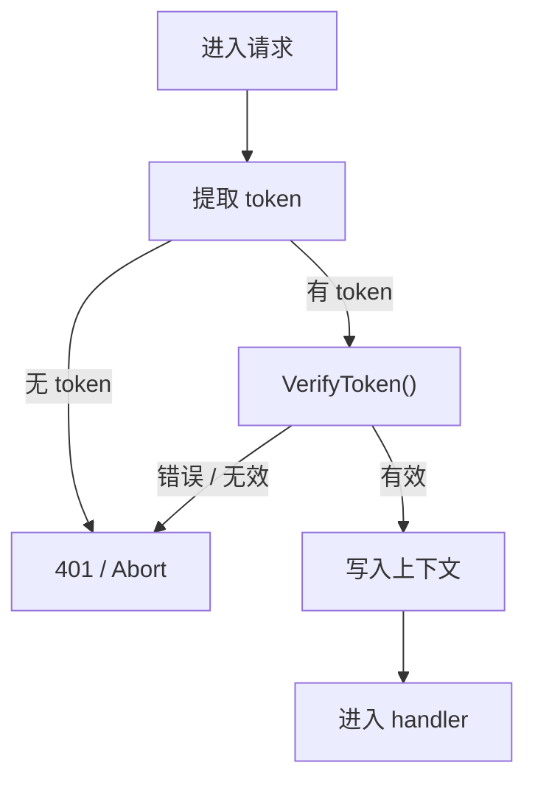
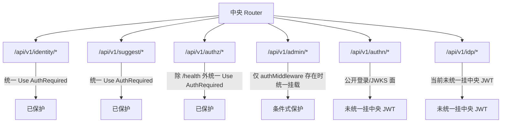

# HTTP认证中间件与身份上下文

## 本文回答

本文只回答 4 件事：

1. `iam-contracts` 的 HTTP JWT 中间件在运行时到底扮演什么角色
2. `AuthRequired()` 和 `AuthOptional()` 今天分别会做什么，不会做什么
3. 哪些 HTTP 路由今天真的用了这套中间件，哪些还没有统一纳入
4. `RequireRole / RequirePermission` 与 Casbin 的关系是什么，什么时候才能成立

## 30 秒结论

> **一句话**：当前 HTTP 认证中间件是 `JWTAuthMiddleware`，它的核心职责只有两件事: **取 token 并调用 `TokenService.VerifyToken()` 验证**，然后把最基础的身份字段写入 `gin.Context` / `request.Context`；它今天确实保护了 `identity`、`suggest`、`authz` 管理面和条件式 `admin` 路由，但这种保护仍是**条件式启用**的，而 `RequireRole / RequirePermission` 只有在 `AuthzModule.CasbinAdapter` 也被注入时才真正可用。

| 主题 | 当前答案 |
| ---- | ---- |
| 中间件核心 | `JWTAuthMiddleware` |
| token 提取顺序 | `Authorization` Header -> query `token` -> cookie `access_token` |
| 验证入口 | `AuthnModule.TokenService.VerifyToken()` |
| 成功后写入上下文 | `claims`、`user_id`、`account_id`、`token_id`；`request.Context` 只写 `user_id` |
| 当前明确受保护的面 | `/api/v1/identity/*`、`/api/v1/suggest/*`、`/api/v1/authz/*`（除 `/health`）、条件式 `/api/v1/admin/*` |
| Casbin 依赖 | `RequireRole / RequirePermission` 需要先注入 `CasbinEnforcer` |

## 重点速查

| 关注点 | 当前答案 | 真实落点 |
| ---- | ---- | ---- |
| 中间件实现 | `JWTAuthMiddleware` | [../../internal/pkg/middleware/authn/jwt_middleware.go](../../internal/pkg/middleware/authn/jwt_middleware.go) |
| 上下文字段常量 | `user_id / account_id / token_id / claims` | [../../internal/pkg/middleware/authn/context_keys.go](../../internal/pkg/middleware/authn/context_keys.go) |
| 中央创建位置 | Router 根据 `AuthnModule.TokenService` 创建 | [../../internal/apiserver/routers.go](../../internal/apiserver/routers.go) |
| 用户域受保护路由 | `/api/v1/identity/*` | [../../internal/apiserver/interface/uc/restful/router.go](../../internal/apiserver/interface/uc/restful/router.go) |
| Suggest 受保护路由 | `/api/v1/suggest/child` | [../../internal/apiserver/interface/suggest/restful/handler.go](../../internal/apiserver/interface/suggest/restful/handler.go) |
| Authz 受保护路由 | `/api/v1/authz/*`（`/health` 公开） | [../../internal/apiserver/interface/authz/restful/router.go](../../internal/apiserver/interface/authz/restful/router.go) |
| 条件式 admin 路由 | `/api/v1/admin/*` | [../../internal/apiserver/routers.go](../../internal/apiserver/routers.go) |
| 当前未统一挂 JWT 的模块 | `authn / idp` | [../../internal/apiserver/routers.go](../../internal/apiserver/routers.go) |

## 1. HTTP JWT 中间件在运行时到底扮演什么角色

先不要把它讲成“认证中心”。它只是认证链在 HTTP 请求面上的消费层。

**图意**：这层不负责“登录怎么发生”，也不负责“Token 怎么签发”；它负责的是在 HTTP 请求进入 handler 之前，把 token 验掉，并把最基础的身份信息塞进上下文。

### 1.1 中央 router 今天怎么创建它

中央 router 的创建逻辑很直接：

1. 如果 `r.container.AuthnModule` 和 `TokenService` 都存在，就创建 `JWTAuthMiddleware`
2. 如果 `AuthzModule.CasbinAdapter` 也存在，就一并注入为 `CasbinEnforcer`
3. 再把这套中间件分发给 `user`、`suggest`、`authz` 和条件式 `admin` 路由

这里最重要的边界是：**中间件不是全局无条件存在的**。如果 `AuthnModule` 没初始化成功，router 不会阻止这些路由注册，而是退回到 no-op 或不挂中间件的路径。

### 1.2 这层和业务认证文档的分工

| 问题 | 该看哪里 |
| ---- | ---- |
| 登录请求如何变成 `Principal` | [../05-专题分析/01-认证链路：从登录请求到 Token 与 JWKS.md](../05-专题分析/01-认证链路：从登录请求到 Token 与 JWKS.md) |
| Token 如何签发、刷新、撤销、JWKS 如何轮换 | [../02-业务域/01-authn-认证&Token&JWKS.md](../02-业务域/01-authn-认证&Token&JWKS.md) |
| HTTP 请求里 token 如何被消费 | 本文 |

**结论**：这篇回答的是“运行时消费面”，不是“认证业务模型”。

## 2. `AuthRequired()` 和 `AuthOptional()` 今天分别会做什么

### 2.1 `AuthRequired()` 的主链

**图意**：`AuthRequired()` 今天就是一条很短的链: 取 token、调用 `VerifyToken()`、失败则拒绝、成功则注入上下文。

### 2.2 token 提取顺序

当前提取顺序是：

1. `Authorization` Header
2. query 参数 `token`
3. cookie `access_token`

对 Header，它同时接受：

- `Bearer <token>`
- 直接传 token 字符串

### 2.3 验证失败时会发生什么

`AuthRequired()` 在这些情况下直接 `Abort()`：

- 没拿到 token
- `VerifyToken()` 返回错误
- `VerifyToken()` 返回 `resp == nil`
- `resp.Valid == false`

失败响应走统一 `core.WriteResponse(...)`，并记录必要日志。

### 2.4 验证成功后，今天到底写了哪些上下文

| 位置 | 当前写入内容 |
| ---- | ---- |
| `request.Context` | `user_id` |
| `gin.Context` | `claims` |
| `gin.Context` | `user_id` |
| `gin.Context` | `account_id` |
| `gin.Context` | `token_id` |

这里最容易讲错的边界有两个：

- 当前 `request.Context` 里只稳定写入了 `user_id`，没有把 `account_id`、`token_id` 同步写进去
- helper 虽然有 `GetCurrentSessionID()` 这类口子，但 `AuthRequired()` 今天并没有写入 `session_id`

### 2.5 `AuthOptional()` 今天的语义

`AuthOptional()` 和 `AuthRequired()` 共用同一套 token 提取与验证逻辑，但它的口径是：

- 没 token，直接放行
- token 无效，也放行
- 只有验证成功时，才补写同样的身份上下文

当前中央 router 没把 `AuthOptional()` 用在现行主路由上，但这个能力已经存在。

## 3. 哪些 HTTP 路由今天真的用了这套中间件

这一节不再泛泛说“哪些模块需要认证”，只看今天真实注册进进程的路由。

**图意**：今天的保护面是“按路由组显式使用中间件”，不是全局自动推断。

### 3.1 当前明确挂上 `AuthRequired()` 的

| 路由组 | 当前状态 |
| ---- | ---- |
| `/api/v1/identity/*` | 已在 `api := engine.Group(\"/api/v1/identity\")` 后统一 `Use(deps.AuthMiddleware)` |
| `/api/v1/suggest/*` | 已在 `group := engine.Group(\"/api/v1/suggest\")` 后统一 `Use(deps.AuthMiddleware)` |
| `/api/v1/authz/*` | `/health` 公开，其余子路由在 `g := authzGroup.Group(\"\")` 后统一 `Use(authMw)` |
| `/api/v1/admin/*` | 仅在中央已创建 `authMiddleware` 时统一挂上 |

### 3.2 当前没有统一挂上的

| 路由组 | 当前状态 |
| ---- | ---- |
| `/api/v1/authn/*` | 公开登录、账号与 JWKS 面，没有统一挂中央 JWT 中间件 |
| `/api/v1/idp/*` | router 层未统一挂中央 JWT 中间件 |

### 3.3 条件式保护今天是什么意思

如果认证模块没初始化成功，当前 router 的行为不是“阻止这些路由注册”，而是：

- `user` 模块收到一个 no-op 中间件，仍会注册
- `suggest` 模块收到一个 no-op 中间件，仍会注册
- `authz` 模块若中间件为空，会回退到 `c.Next()` 的放行占位
- `/api/v1/admin/*` 不会挂认证中间件

所以今天更准确的说法是：**这套 HTTP JWT 保护是条件式启用的，不是绝对全局强制的。**

## 4. `RequireRole / RequirePermission` 与 Casbin 的关系是什么

这一节只讲“中间件如何消费 Casbin”，不重复展开授权业务模型。

### 4.1 什么时候它们才成立

`RequireRole()` / `RequirePermission()` 要成立，至少要同时满足：

1. 请求先经过 `AuthRequired()`，上下文里已有 `user_id`
2. 创建 `JWTAuthMiddleware` 时注入了 `CasbinEnforcer`

如果 `m.casbin == nil`，当前行为不是静默放行，而是直接返回 `Authorization engine not configured`。

### 4.2 `RequireRole()` 今天怎么判

它会：

1. 从上下文取 `user_id`
2. 组装 `sub = "user:<user_id>"`
3. 读取租户，缺省回退 `dom = "default"`
4. 调 `GetRolesForUser(ctx, sub, dom)`
5. 把传入角色名映射成 `role:<name>` 再比对

### 4.3 `RequirePermission()` 今天怎么判

它会：

1. 从上下文取 `user_id`
2. 组装 `sub = "user:<user_id>"`
3. 读取租户，缺省回退 `dom = "default"`
4. 调 `Enforce(ctx, sub, dom, resourceObj, action)`

### 4.4 这层当前最容易讲错的边界

| 容易讲错的说法 | 今天更准确的说法 |
| ---- | ---- |
| HTTP 中间件已经全局自动接通 Casbin 授权 | 只有显式注入 Casbin 且显式 `Use(RequireRole / RequirePermission)` 的路由才成立 |
| 没有 Casbin 时会默认放行 | 当前没有 Casbin 会直接报错 |
| `RequireRole` 自己会完成 JWT 验证 | 它依赖前面的 `AuthRequired()`，不替代认证 |

## 5. 当前保证与风险边界

### 已实现

- JWT token 的统一提取与校验
- `claims / user_id / account_id / token_id` 上下文注入
- `AuthRequired()` 与 `AuthOptional()` 两种中间件风格
- `RequireRole()` / `RequirePermission()` 在 Casbin 注入后可用

### 待补证据

- 更完整的上下文消费点，还应继续沿具体 handler 和 application 服务核对
- 不同业务面在认证模块缺失时是否应继续允许 no-op 挂载，需要结合产品意图再确认

### 规划改造

- 如果未来需要更细粒度的 HTTP 权限治理，如批量判定、Explain 或菜单模型，通常应在业务侧或专门授权层扩展，而不是继续把责任压进 JWT 中间件

## 继续往下读

1. [01-服务入口&HTTP 与模块装配.md](./01-服务入口&HTTP 与模块装配.md)
2. [../03-接口与集成/03-授权接入与边界.md](../03-接口与集成/03-授权接入与边界.md)
3. [../03-接口与集成/04-身份接入与监护关系边界.md](../03-接口与集成/04-身份接入与监护关系边界.md)
4. [../02-业务域/01-authn-认证&Token&JWKS.md](../02-业务域/01-authn-认证&Token&JWKS.md)
