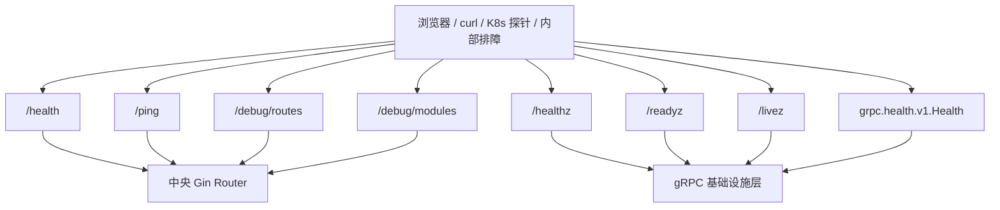
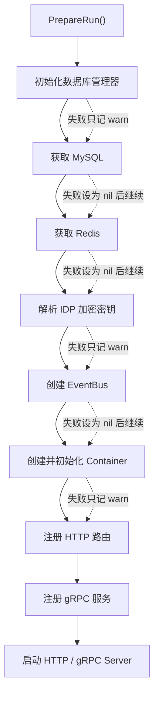

# 健康检查、debug 路由与降级启动边界

## 本文回答

本文只回答 4 件事：

1. `iam-contracts` 今天到底暴露了哪些健康检查和调试入口
2. 为什么这些入口在业务模块不完整时仍可能存在
3. `PrepareRun()` 今天所谓的“降级启动”到底是什么意思
4. “进程活着”“服务就绪”“路由已注册”“模块已初始化”分别能证明什么，不能证明什么

## 30 秒结论

> **一句话**：当前运行时把“探针”和“业务可用性”刻意拆开了看：`/health`、`/ping`、`/debug/routes`、`/debug/modules` 由中央 router 先注册，`grpc.health.v1.Health` 与 `/healthz` `/readyz` `/livez` 由 gRPC 基础设施暴露，而 `PrepareRun()` 对 MySQL、Redis、EventBus、容器初始化失败大多只记 `warn` 后继续启动，所以**进程活着不等于业务模块已完整就绪**。

| 主题 | 当前答案 |
| ---- | ---- |
| HTTP 基础探针 | `/health`、`/ping` |
| HTTP 调试入口 | `/debug/routes`、`/debug/modules` |
| gRPC 健康面 | `grpc.health.v1.Health` |
| 独立 HTTP 探针 | `/healthz`、`/readyz`、`/livez` |
| 启动策略 | 多数依赖初始化失败只记 warning，继续注册路由和服务 |
| 最大边界 | “进程启动成功”不等于“所有模块都已可用” |

## 重点速查

| 关注点 | 当前答案 | 真实落点 |
| ---- | ---- | ---- |
| HTTP 基础探针 | `/health`、`/ping` | [../../internal/apiserver/routers.go](../../internal/apiserver/routers.go) |
| debug 路由 | `/debug/routes`、`/debug/modules` | [../../internal/apiserver/routers.go](../../internal/apiserver/routers.go) |
| gRPC 健康检查 | `grpc.health.v1.Health` | [../../internal/pkg/grpc/server.go](../../internal/pkg/grpc/server.go) |
| 独立 HTTP 探针 | `/healthz`、`/readyz`、`/livez` | [../../internal/pkg/grpc/server.go](../../internal/pkg/grpc/server.go) |
| 降级启动入口 | `PrepareRun()` 里多处 `Warnf(...); continue` | [../../internal/apiserver/server.go](../../internal/apiserver/server.go) |
| 模块状态快照 | `container_initialized` + `modules.*` | [../../internal/apiserver/routers.go](../../internal/apiserver/routers.go) |

## 1. 今天到底有哪些健康检查和调试入口，它们各自回答什么

先不要把这些端点混成“一组健康检查”。它们回答的问题并不一样。

**图意**：当前有两类运行面。一类是中央 router 先注册的 HTTP 基础端点；另一类是 gRPC 基础设施自带的健康检查面。它们都可能先于业务模块完整就绪而存在。

### 1.1 HTTP 基础探针与调试入口

中央 router 在业务模块之前就注册了这些基础端点：

- `/health`
- `/ping`
- `/debug/routes`
- `/debug/modules`
- `/openapi/*`
- `/swagger/*`
- `/api/v1/public/info`

这组端点更接近“进程基础可观测面”，而不是“业务模块已就绪”的证明。

### 1.2 gRPC 健康检查与独立 HTTP 探针

如果 `EnableHealthCheck` 打开，`internal/pkg/grpc/server.go` 会同时提供：

- 标准 gRPC 健康检查：`grpc.health.v1.Health`
- 独立 HTTP 探针：
  - `/healthz`
  - `/readyz`
  - `/livez`

它们都建立在 gRPC `health.Server` 这套状态之上，但语义仍然不同。

### 1.3 各入口分别回答什么

| 入口 | 它能回答什么 | 它不能回答什么 |
| ---- | ---- | ---- |
| `/health` | HTTP 进程和中央 router 当前可响应 | 不能证明某个业务 handler 一定可用 |
| `/ping` | 最基础的连通性 | 不能证明依赖或模块已初始化 |
| `/debug/routes` | 当前进程里哪些 HTTP 路由已经注册进 `gin.Engine` | 不能证明这些路由背后的业务依赖一定完整 |
| `/debug/modules` | `container` 和主要模块对象是否初始化出来 | 不能证明模块内部依赖已全部健康 |
| `grpc.health.v1.Health` | gRPC 服务器对外标记的服务状态 | 不等价于每个业务依赖都健康 |
| `/healthz` | gRPC 整体健康状态是否为 `SERVING` | 不能证明 HTTP 业务链完全可用 |
| `/readyz` | gRPC 整体是否可被视为 `READY` | 不等价于数据库、Redis、EventBus 都已联通 |
| `/livez` | 进程是否还活着 | 几乎不证明业务准备状态 |

## 2. 为什么这些入口在业务模块不完整时仍可能存在

这一点的关键不是“端点特殊”，而是**注册顺序**。

### 2.1 中央 router 先注册基础端点，再尝试装业务模块

`RegisterRoutes()` 的顺序是：

1. 先保存 `engine`
2. 先调用 `registerBaseRoutes(engine)`
3. 再看 `container` 是否存在
4. 再尝试给 `authn / authz / idp / user / suggest` 注册模块路由

这意味着即便 `container` 为空，基础探针和 debug 路由仍会存在。

### 2.2 gRPC 健康检查属于基础设施层，不依赖业务域注册顺序

`grpc.health.v1.Health` 和 `/healthz` `/readyz` `/livez` 是在 `internal/pkg/grpc/server.go` 创建 gRPC 服务器时注册/暴露的。  
它们依赖的是 gRPC 基础设施和 health server，而不是某个具体业务域必须先完成初始化。

**结论**：今天这些探针先天更偏“运行时基础面”，不应被讲成“业务域 readiness 面”。

## 3. `PrepareRun()` 今天所谓的“降级启动”到底是什么意思

这部分最容易被误讲。当前系统的启动口径不是“任何依赖失败就立刻退出”，而是更接近“尽量启动，把失败留在 warning 里”。

**图意**：`PrepareRun()` 今天优先保证“进程尽量起来”，而不是“依赖必须全齐才允许启动”。

### 3.1 当前哪些初始化失败会被降级处理

| 初始化项 | 当前行为 |
| ---- | ---- |
| `dbManager.Initialize()` 失败 | 记录 warning，继续 |
| 获取 MySQL 连接失败 | 记 warning，`mysqlDB = nil`，继续 |
| 获取 Redis 失败 | 记 warning，`cacheClient = nil`，继续 |
| 解析 IDP 加密密钥失败 | 记 warning，继续 |
| 创建 EventBus 失败 | 记 warning，`eventBus = nil`，继续 |
| `container.Initialize()` 失败 | 记 warning，继续 |

### 3.2 降级启动之后，运行面还会发生什么

| 运行面 | 当前行为 |
| ---- | ---- |
| HTTP 基础路由 | 仍会注册 |
| 模块路由 | 取决于 `container` 和各模块对象是否存在 |
| gRPC 服务注册 | `grpcServer` 或 `container` 为空时会跳过 |
| 进程启动 | HTTP / gRPC 仍会尝试启动 |

### 3.3 “部分可用”今天更准确地是什么意思

当前更准确的说法是：

- 进程可能能响应 `/health`、`/ping`、`/debug/routes`
- gRPC 健康检查也可能已经是 `SERVING`
- 但部分业务模块、部分路由或部分下游依赖仍可能不可用

所以“部分可用”不等于“系统行为可预测且完整”，它只是“运行面仍然被拉起来了”。

## 4. 应该如何解释“活着”“就绪”“已注册”“已初始化”

如果只想带走一张表，就看这一张。

| 观察结果 | 今天更准确的解释 |
| ---- | ---- |
| `/livez = 200` | 进程活着 |
| `/healthz = 200` | gRPC health 当前为 `SERVING` |
| `/readyz = 200` | gRPC 基础设施认为当前可接流量 |
| `/debug/routes` 里能看到某条路由 | 这条 HTTP 路由已经被注册进当前进程 |
| `/debug/modules` 里某模块为 `true` | 对应模块对象已经初始化出来 |
| `container_initialized = true` | 容器对象存在 |

这些结果**都不能单独证明**：

- MySQL / Redis / EventBus 一定完全可用
- 每个 handler 的业务依赖一定完整
- 路由背后的业务逻辑一定已经准备好

## 5. 当前保证与风险边界

### 已实现

- HTTP 基础探针与 debug 路由
- gRPC 标准健康检查
- 独立 HTTP `/healthz` `/readyz` `/livez`
- 运行时在依赖不完整时继续启动的降级策略

### 待补证据

- 各业务模块在“部分初始化”状态下，哪些 handler 真正还能稳定工作，还需要逐模块核对
- `READY` 与真实业务 readiness 是否应继续细分，当前仍没有更细粒度定义

### 规划改造

- 如果未来希望把“进程启动成功”和“业务完全就绪”严格分离，应补更明确的 readiness 语义，而不是只依赖当前这组基础探针

## 继续往下读

1. [01-服务入口&HTTP 与模块装配.md](./01-服务入口&HTTP 与模块装配.md)
2. [02-gRPC与mTLS.md](./02-gRPC与mTLS.md)
3. [03-HTTP认证中间件与身份上下文.md](./03-HTTP认证中间件与身份上下文.md)
4. [../03-接口与集成/01-REST契约与接入.md](../03-接口与集成/01-REST契约与接入.md)
