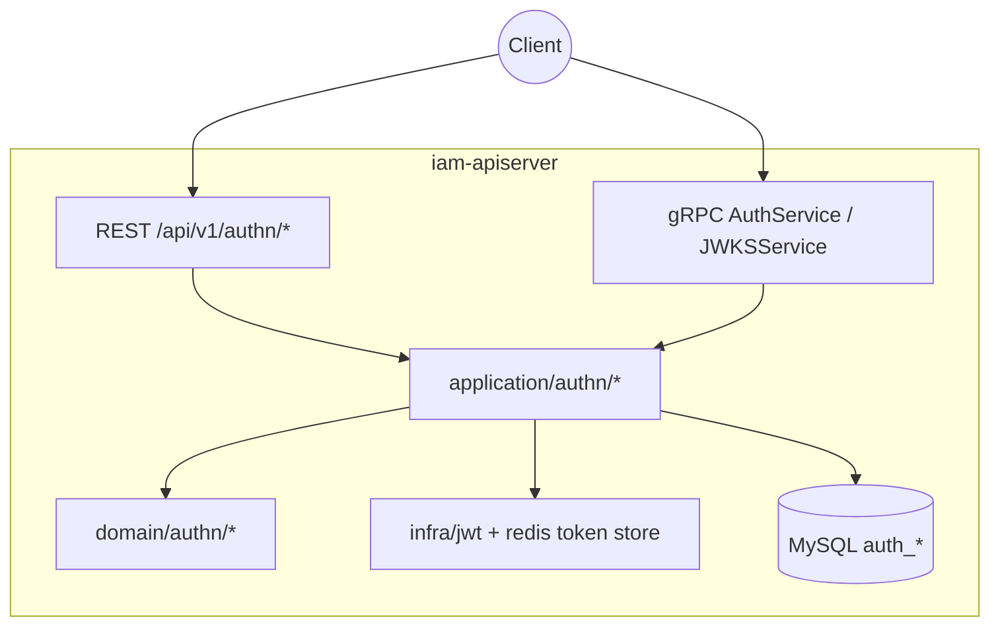
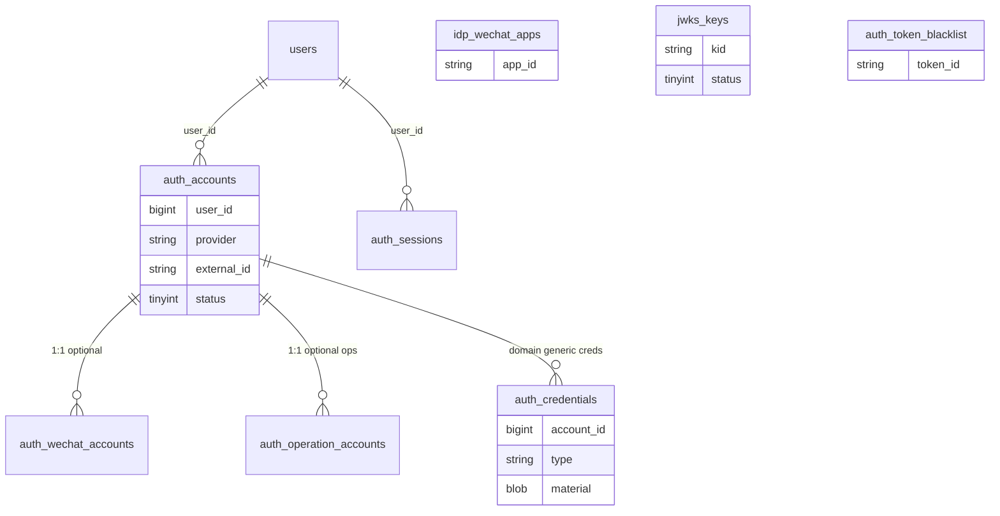
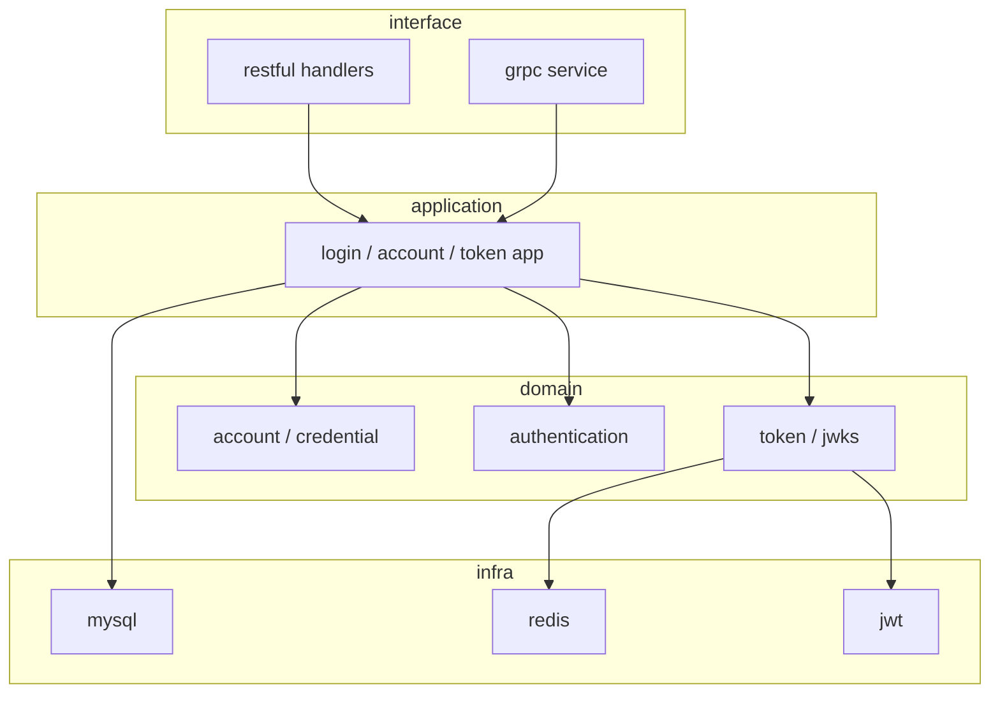
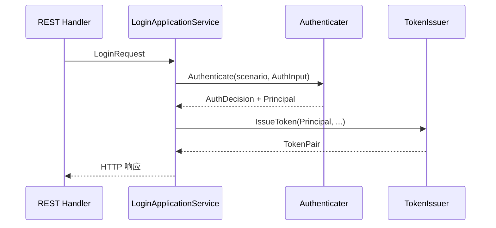

# 认证、Token、JWKS

本文回答：认证域（`authn`）如何建立「可登录账户 → 认证决策 → Token/JWKS」闭环，以及与用户域、授权域的边界。

**阅读维度**：Why = 多场景登录与可轮换密钥；What = Account/Credential/Principal/Token/JWKS；Where = `iam-apiserver` 的 REST/gRPC；Verify = `api/rest/authn.v1.yaml`、`api/grpc/iam/authn/v1/authn.proto`、`configs/`、`auth_*` 表。

---

## 30 秒了解系统

- 主轴对象：**Account / Credential / Authenticater / Principal / Token / JWKS**；登录成功产出 **Principal**，再经 **TokenIssuer** 颁发 **Access JWT（RS256）+ Refresh（Redis）**。
- **REST** 暴露登录、刷新、校验、账户与 JWKS；**gRPC** 暴露 `VerifyToken`、`RefreshToken`、`Revoke*`、`GetJWKS` 等；**`IssueServiceToken` 当前固定返回 `codes.Unimplemented`**（见 [`interface/authn/grpc/service.go`](../../internal/apiserver/interface/authn/grpc/service.go)），非「待确认」。
- **不负责**：独立 Session 聚合、在 JWT 内承载完整授权上下文（授权见 [02-authz](./02-authz-角色、策略、资源、Assignment.md)）。
- **领域事件 / `configs/events.yaml`**：**N/A**（本仓库无统一事件清单文件）。

| 对照 | 登录与账户 | Token / JWKS |
| ---- | ---------- | ------------ |
| 主存储 | `auth_accounts`、凭据（`auth_credentials` / `auth_operation_accounts` 等，见下） | `jwks_keys`、`auth_token_blacklist`、Redis refresh |
| 对外 | REST `/api/v1/authn/*` | `/.well-known/jwks.json`、gRPC `GetJWKS` |
| Verify | [`api/rest/authn.v1.yaml`](../../api/rest/authn.v1.yaml) | [`authn.proto`](../../api/grpc/iam/authn/v1/authn.proto) |

### 模块边界

#### 负责

- 账户与凭据生命周期、按场景的认证策略（`Authenticater`）、Token 颁发/校验/撤销、JWKS 发布与密钥轮换。

#### 不负责

- 用户档案与监护：见 [03-user-用户、儿童、Guardianship.md](./03-user-用户、儿童、Guardianship.md)。
- 角色、策略、Casbin：见 [02-authz-角色、策略、资源、Assignment.md](./02-authz-角色、策略、资源、Assignment.md)。

#### 依赖

- 用户 ID 等与用户域衔接（`Principal.UserID`）；不反向依赖 authz。

### 运行时示意图

仅 **`iam-apiserver`**。

---

## 模型与服务

### 数据关系（概念 ER）

**与 `schema.sql` + 代码 PO 对齐**：[`configs/mysql/schema.sql`](../../configs/mysql/schema.sql) 中可核对 `auth_accounts`、`auth_wechat_accounts`、`auth_operation_accounts`（运营后台用户名+密码哈希）、`auth_sessions`、`auth_token_blacklist`、`jwks_keys`、`idp_wechat_apps`。**通用凭据**在仓储层映射为表 **`auth_credentials`**（见 [`infra/mysql/credential/po.go`](../../internal/apiserver/infra/mysql/credential/po.go) 的 `TableName`）；密码策略 `FindPasswordCredential` 走该表。若你本地的 `schema.sql` 快照尚未包含 `auth_credentials`，以实际迁移/数据库为准。微信场景下 **`idp_wechat_apps.app_id`** 与 **`auth_wechat_accounts.app_id`** 逻辑对齐（非外键约束，登录时查配置用）。Refresh 令牌材料主要在 **Redis**（及可选 `auth_sessions` 行），不在此 ER 展开。

### 认证场景与入口（可对照代码）

领域枚举见 [`domain/authn/authentication/types.go`](../../internal/apiserver/domain/authn/authentication/types.go) 的 `Scenario` / `AMR`。REST 侧按 `method` 分发（[`interface/authn/restful/handler/auth.go`](../../internal/apiserver/interface/authn/restful/handler/auth.go)），应用层在 `prepareAuthentication` 中按请求字段推断场景（[`application/authn/login/services_impl.go`](../../internal/apiserver/application/authn/login/services_impl.go)）。

| REST `method` | `authentication.Scenario` | `credentials` JSON（[`request/auth.go`](../../internal/apiserver/interface/authn/restful/request/auth.go)） |
| ------------- | --------------------------- | --------------------------------------------------------------------------- |
| `password` | `AuthPassword` | `username`、`password`，可选 `tenant_id` |
| `phone_otp` | `AuthPhoneOTP` | `phone`（E.164）、`otp_code` |
| `wechat` | `AuthWxMinip` | `app_id`、`code`（→ 应用层 `WechatAppID`/`WechatJSCode`，依赖 IDP/`idp_wechat_apps`） |
| `wecom` | `AuthWecom` | `corp_id`、`auth_code` |

| 入口 | `AuthJWTToken` |
| ---- | ---------------- |
| 应用 DTO | [`login.LoginRequest`](../../internal/apiserver/application/authn/login/services.go) 使用 `AuthType=jwt_token` 且填 `JWTToken`；**当前 REST `LoginRequest.Validate` 未包含该 method**，多为内部/gRPC 预留。 |

**说明**：`prepareAuthentication` 若同时满足多组字段会**后写覆盖** `scenario`；单次请求只应走一种登录方式。

### 分层依赖

### 领域模型与领域服务

**限界上下文**：证明「谁在什么租户下完成了哪种认证」，并颁发可验证的访问凭证；不实现业务授权。下表与上文「认证场景」互补：表讲**对象**，场景表讲**入口**。

| 概念 | 职责 |
| ---- | ---- |
| `Account` | 可登录账户锚点，关联 `UserID` 等 |
| `Credential` | 密码/OTP/OAuth 等材料存储与状态 |
| `Principal` | 认证成功输出，供 Token 颁发消费 |
| `Token` | Access JWT + Refresh；黑名单与轮换 |
| `JWKS` | 公钥生命周期 `active/grace/retired` |

**长叙事**（逐步请求、中间件、错误码）：见 [05-专题分析/01-认证链路…](../05-专题分析/01-认证链路：从登录请求到 Token 与 JWKS.md)，本篇不重复贴长流程。

### 应用服务设计

| 用例 | 职责一句 | 锚点 |
| ---- | -------- | ---- |
| 登录 | 场景推断 → `Authenticate` → `IssueToken` | [`application/authn/login/services_impl.go`](../../internal/apiserver/application/authn/login/services_impl.go) |
| 刷新 | 校验 refresh、轮换、签发新对 | [`domain/authn/token/refresher.go`](../../internal/apiserver/domain/authn/token/refresher.go) |
| 校验 | 验签、过期、黑名单 | [`domain/authn/token/verifyer.go`](../../internal/apiserver/domain/authn/token/verifyer.go) |
| JWKS | 对外发布与密钥轮换 | [`assembler/authn.go`](../../internal/apiserver/container/assembler/authn.go)、[`key_rotation_cron_scheduler.go`](../../internal/apiserver/infra/scheduler/key_rotation_cron_scheduler.go) |

---

## 核心设计

### 核心主链：从登录到 TokenPair

**结论**：`REST Handler → LoginApplicationService → Authenticater → Principal → TokenIssuer → JWT + Redis refresh`。下图省略 Handler 与 Application 的逐行调用，只保留**领域主链**；真实编排见 [`services_impl.go`](../../internal/apiserver/application/authn/login/services_impl.go)（`Authenticate` 后 `IssueToken`）。

### 核心安全：JWT 与 JWKS

**结论**：Access **RS256**，Header **`kid`**；业务方用 JWKS 本地验签；密钥三态与轮换见 [`jwks/key.go`](../../internal/apiserver/domain/authn/jwks/key.go)。

### 核心集成：REST 与 gRPC

**结论**：对外能力以 proto 与 [`interface/authn/grpc/service.go`](../../internal/apiserver/interface/authn/grpc/service.go) 为准。

| RPC | 当前行为（可 grep 验证） |
| --- | ------------------------ |
| `VerifyToken` / `RefreshToken` / `RevokeToken` / `RevokeRefreshToken` / `GetJWKS` | 依赖装配；未注入依赖时返回 `Unimplemented` |
| `IssueServiceToken` | **始终** `codes.Unimplemented`（`issue service token not supported`） |

### 核心配置

装配时通过 **viper** 读取（见 [`container/assembler/authn.go`](../../internal/apiserver/container/assembler/authn.go)），未在 yaml 中写出时走代码内**默认值**。

| 配置键 | 含义 | 默认（当 viper 为空/0） |
| ------ | ---- | ------------------------ |
| `auth.jwt_issuer` | Access JWT `iss` | 未配置时为空字符串（仍签发；校验方是否校验 `iss` 自定） |
| `auth.access_token_ttl` | Access 有效期 | **15 分钟** |
| `auth.refresh_token_ttl` | Refresh 有效期 | **7 天** |
| `jwks.keys_dir` | PEM 私钥目录 | 空则按工作目录解析（启动日志会 warn） |
| `jwks.auto_init` | 无 active key 时是否自动生成 | 与 `migration.autoseed`、`app.mode == development` 一起参与自动建钥判断 |
| `app.mode` | 运行模式 | 参与 JWKS 自动初始化分支 |

YAML 里另有 **gRPC 服务端 `grpc.auth`**（mTLS、API Key 等）与 **业务 JWT TTL** 不是同一命名空间；调 JWT 颁发请认准上表 `auth.*` 与装配代码。

| 路径 | 作用 |
| ---- | ---- |
| [`configs/apiserver*.yaml`](../../configs/) | 运行时与环境相关项（含 `jwks`、`grpc`、`idp.encryption-key` 等） |
| [`configs/keys/README.md`](../../configs/keys/README.md) | 私钥目录与 `jwks.auto_init` 说明 |

---

## 边界与注意事项

- **无 Session 聚合**；**JWT Claims 不承诺完整授权上下文**。
- **`RequireRole`/`RequirePermission`** 属授权中间件：见 [02-authz](./02-authz-角色、策略、资源、Assignment.md) 与 [`jwt_middleware.go`](../../internal/pkg/middleware/authn/jwt_middleware.go)。
- 长链路叙事：见 [05-专题分析/01-认证链路：从登录请求到 Token 与 JWKS.md](../05-专题分析/01-认证链路：从登录请求到 Token 与 JWKS.md)。

---

## 代码锚点索引

| 关注点 | 路径 | 说明 |
| ------ | ---- | ---- |
| 装配 | `internal/apiserver/container/assembler/authn.go` | `AuthnModule`、TTL、JWKS、Token 领域服务 |
| 场景枚举 | `internal/apiserver/domain/authn/authentication/types.go` | `Scenario` / `AMR` |
| REST | `internal/apiserver/interface/authn/restful/router.go` | 路由 |
| REST 登录分发 | `internal/apiserver/interface/authn/restful/handler/auth.go` | `method` → 各登录分支 |
| gRPC | `internal/apiserver/interface/authn/grpc/service.go` | 含 `IssueServiceToken` 桩 |
| 凭据表映射 | `internal/apiserver/infra/mysql/credential/po.go` | `auth_credentials` |
| 合同 | `api/rest/authn.v1.yaml`、`api/grpc/iam/authn/v1/authn.proto` | Verify |
