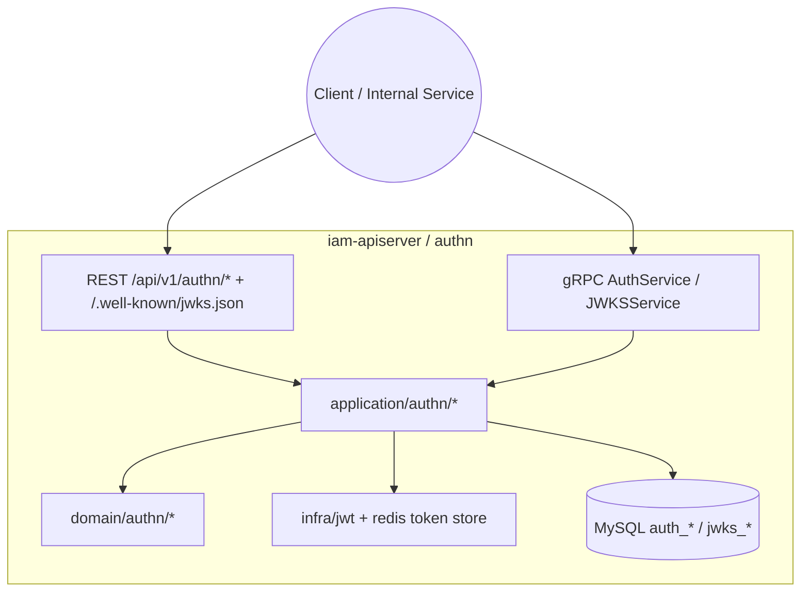
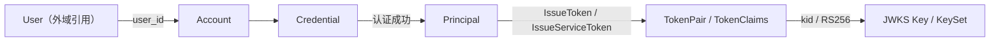
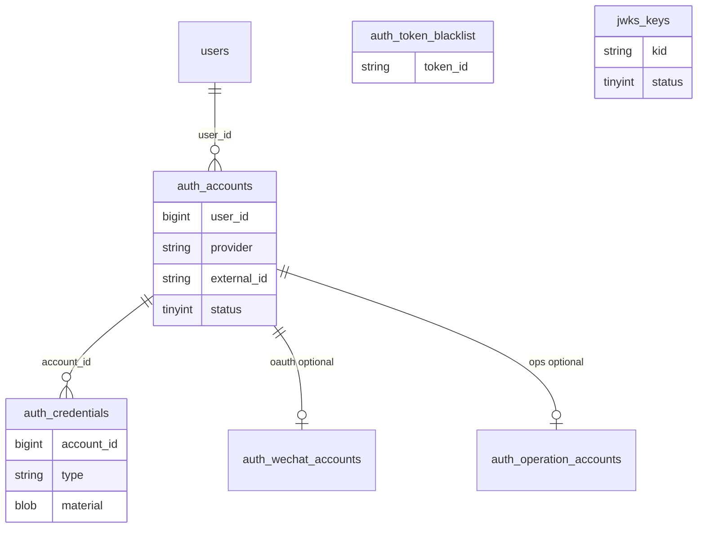
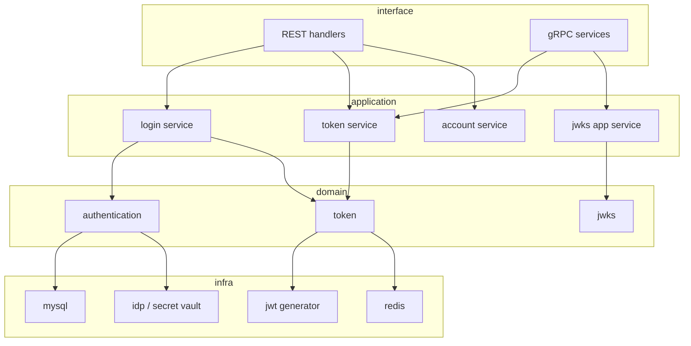

# 认证、Token、JWKS

本文回答：认证域（`authn`）今天负责什么、不负责什么；它在 `iam-apiserver` 中如何组织 `Account / Credential / Principal / Token / JWKS` 这组对象；以及当前对外暴露面、配置与真实代码落点分别是什么。

**阅读维度**：Why = 多场景登录与可轮换密钥；What = `Account / Credential / Principal / Token / JWKS`；Where = `iam-apiserver` 的 REST / gRPC / 装配；Verify = `api/rest/authn.v1.yaml`、`api/grpc/iam/authn/v1/authn.proto`、`configs/`、`auth_*` / `jwks_*` 存储。

---

## 30 秒了解系统

- `authn` 的主问题只有两个：先把“凭据”判成“主体”，再把“主体”变成“可验证、可轮换、可撤销”的 token 集。
- 模块内最重要的对象是：`Account / Credential / Authenticater / Principal / Token / JWKS`。
- 登录成功先产出 **`Principal`**，再由 **`TokenIssuer`** 颁发 **Access JWT + Refresh Token**；服务间还可签发 **Service Token**。
- 对外暴露面包括：REST 登录/刷新/校验/JWKS、gRPC `VerifyToken/RefreshToken/Revoke*/IssueServiceToken/GetJWKS`。
- `authn` 不负责角色策略，不负责监护关系，也不承诺在 JWT 内承载完整授权上下文。
- 统一事件清单：**N/A**。当前仓库没有 `configs/events.yaml` 这种统一事件真值文件；若要讲事件，应直接回链源码。

| 主题 | 当前答案 |
| ---- | ---- |
| 认证中心 | `Authenticater` + 多证认证策略 |
| token 设计 | Access JWT、Refresh Token、Service Token |
| 公钥发布 | `/.well-known/jwks.json` + gRPC `GetJWKS` |
| 主存储 | `auth_accounts`、`auth_credentials`、`auth_token_blacklist`、`jwks_keys`、Redis refresh |
| 真实契约 | [`api/rest/authn.v1.yaml`](../../api/rest/authn.v1.yaml)、[`api/grpc/iam/authn/v1/authn.proto`](../../api/grpc/iam/authn/v1/authn.proto) |

### 模块边界

#### 负责

- 账户与凭据生命周期
- 密码 / OTP / 微信 / 企微等认证判决
- `Principal` 到 Access / Refresh / Service Token 的签发与生命周期
- Access 验签、Refresh 轮换、黑名单撤销
- JWKS 发布、初始 key 建立与轮换调度

#### 不负责

- 用户档案、儿童、监护关系：见 [03-user-用户、儿童、Guardianship.md](./03-user-用户、儿童、Guardianship.md)
- 角色、策略、Assignment、Casbin：见 [02-authz-角色、策略、资源、Assignment.md](./02-authz-角色、策略、资源、Assignment.md)
- HTTP 请求里的 JWT 消费与上下文注入：见 [../01-运行时/03-HTTP认证中间件与身份上下文.md](../01-运行时/03-HTTP认证中间件与身份上下文.md)
- 登录长链、Token 生命周期时序、JWKS 轮换运行面：见 [../05-专题分析/01-认证链路：从登录请求到 Token 与 JWKS.md](../05-专题分析/01-认证链路：从登录请求到 Token 与 JWKS.md)

#### 依赖

- 与用户域通过 `Principal.UserID` 衔接，但不反向依赖 `authz`
- 微信 / 企微等场景依赖 IDP 和应用配置
- Token 子系统依赖 JWKS、JWT、Redis

### 运行时示意图

`authn` 只运行在 **`iam-apiserver`** 中。

**图意**：`authn` 不是单独进程，而是 `iam-apiserver` 里的一组模块能力；REST、gRPC、JWT、Redis、MySQL 最终都围绕这组领域对象协作。

---

## 模型与服务

### 模型关系图

这张图只回答“静态对象如何协作”，不展开登录时序。

**图意**：`Account / Credential` 是认证输入侧，`Principal` 是认证输出侧，`Token / JWKS` 是凭证发布与验签侧。`User` 是外域引用，不是 `authn` 自己的聚合。

### 数据关系（概念 ER）

与当前存储和仓储映射对齐：

- `auth_accounts`
- `auth_credentials`
- `auth_operation_accounts`
- `auth_wechat_accounts`
- `auth_token_blacklist`
- `jwks_keys`
- Redis refresh token store

**说明**：

- `auth_credentials` 的仓储映射见 [`infra/mysql/credential/po.go`](../../internal/apiserver/infra/mysql/credential/po.go)
- 微信应用配置与 OAuth 绑定的逻辑关联仍要结合 `idp_wechat_apps`
- refresh token 主要落在 Redis，不在这张 ER 里展开

### 领域模型与领域服务

**限界上下文**：`authn` 负责证明“谁在什么租户下，以何种方式完成了认证”，并给出后续可消费的 token；它不负责业务授权判定。

| 概念 | 职责 | 与相邻概念的关系 |
| ---- | ---- | ---- |
| `Account` | 可登录账户锚点 | 指向外域 `UserID`，关联多种凭据 |
| `Credential` | 密码、OTP、OAuth 等认证材料 | 被 `Authenticater` 消费 |
| `Authenticater` | 认证判决中心 | 根据场景组装策略并返回 `AuthDecision` |
| `Principal` | 认证成功后的统一主体 | 被 `TokenIssuer` 消费 |
| `TokenIssuer` | 颁发 Access / Refresh / Service Token | 依赖 JWT 生成器与 TokenStore |
| `TokenRefresher` | 用 refresh 恢复主体并轮换新 pair | 依赖 Redis TokenStore |
| `TokenVerifyer` | 验签、过期、黑名单检查 | 依赖 JWT 生成器与 TokenStore |
| `JWKS` | 公钥发布与轮换对象 | 支撑 Access / Service Token 验签 |

### 应用服务设计

| 用例 | 职责一句 | 锚点 |
| ---- | ---- | ---- |
| 登录 | 场景推断、认证判决、成功后签发 token pair | [`application/authn/login/services_impl.go`](../../internal/apiserver/application/authn/login/services_impl.go) |
| Token 生命周期 | 服务化暴露 `IssueServiceToken / Verify / Refresh / Revoke*` | [`application/authn/token/services_impl.go`](../../internal/apiserver/application/authn/token/services_impl.go) |
| JWKS 发布与管理 | 构建可发布 key set、管理 key 生命周期、触发轮换 | [`application/authn/jwks`](../../internal/apiserver/application/authn/jwks) |
| 账户管理 | 账户注册、档案修改、绑定与启停等 | [`application/authn/account`](../../internal/apiserver/application/authn/account) |

---

## 核心设计

### 核心认证模型：先产出 `Principal`，再进入 token 子系统

**结论**：`authn` 的领域边界很清楚，认证链本身不直接等于 token 生命周期；它先产出 `Principal`，再由 token 领域服务决定如何签发和轮换凭证。

| 入口方法 | 当前场景常量 | 当前实现 |
| ---- | ---- | ---- |
| `password` | `AuthPassword` | 已实现 |
| `phone_otp` | `AuthPhoneOTP` | 已实现 |
| `wechat` | `AuthWxMinip` | 已实现 |
| `wecom` | `AuthWecom` | 已实现 |
| `jwt_token` | `AuthJWTToken` | 应用层保留，REST 公开登录入口未接纳 |

**设计边界**：

- `prepareAuthentication()` 负责把输入整理成 `AuthInput`
- `Authenticater.Authenticate()` 负责真正的认证判决
- 认证成功后才进入 `TokenIssuer`

长链路时序不在这里重复，统一看 [../05-专题分析/01-认证链路：从登录请求到 Token 与 JWKS.md](../05-专题分析/01-认证链路：从登录请求到 Token 与 JWKS.md)。

### 核心凭证模型：Access / Refresh / Service 三类 token 分工不同

**结论**：当前 token 子系统不是单一“JWT 签发器”，而是三类凭证共同组成的生命周期系统。

| 类型 | 当前作用 | 当前承载方式 |
| ---- | ---- | ---- |
| Access Token | 资源访问凭证 | RS256 JWT，Header 带 `kid`，由 JWKS 验签 |
| Refresh Token | 换新 token pair | Redis 持久化，刷新时恢复主体并删旧 |
| Service Token | 服务间调用凭证 | 通过 gRPC `IssueServiceToken` 签发，仍走 JWT + JWKS 体系 |

**最重要的静态判断**：

- `VerifyToken`、`RefreshToken`、`RevokeToken`、`RevokeRefreshToken`、`IssueServiceToken` 都已经进入 `TokenApplicationService`
- service token 不再是“文档里有、服务端没实现”的状态

### 核心公钥模型：JWKS 不是附属接口，而是 token 体系的一部分

**结论**：当前 Access / Service Token 的可验证性依赖 JWKS；因此 `JWKS` 属于 `authn` 模块本体，而不是对外附属页面。

| 组件 | 职责 |
| ---- | ---- |
| `KeyManager` | 管理密钥状态与生命周期 |
| `KeySetBuilder` | 组装对外发布的 key set |
| `KeyPublishAppService` | 生成 `JWKS + ETag + LastModified` |
| 轮换调度器 | 启动后定时检查和轮换 key |

这篇只强调静态关系；启动初始化和轮换运行面细节见专题文。

### 核心对外暴露：REST / gRPC / 公开 JWKS 三条面

**结论**：`authn` 当前不是只有“登录 REST”，而是有三条明确暴露面。

| 面向 | 当前能力 |
| ---- | ---- |
| REST | `/api/v1/authn/login`、`/refresh_token`、`/logout`、`/verify`、账户管理、JWKS 管理 |
| gRPC | `VerifyToken / RefreshToken / RevokeToken / RevokeRefreshToken / IssueServiceToken / GetJWKS` |
| 公开端点 | `/.well-known/jwks.json` 与 `/api/v1/.well-known/jwks.json` |

**当前边界必须讲清**：

- `authn` 路由组当前没有统一挂中央 JWT 中间件
- 账户管理端点和 JWKS 管理端点在 router 层也没有单独补管理员中间件
- 所以“这些端点按设计应受保护”不能直接表述成“当前已统一受保护”

### 核心配置：真正影响 `authn` 行为的是哪组键

**结论**：`authn` 的运行事实主要受 `auth.*` 和 `jwks.*` 影响，别把 gRPC transport 层配置和业务 JWT 配置混在一起讲。

| 配置键 | 含义 | 默认值或当前口径 |
| ------ | ---- | ---------------- |
| `auth.jwt_issuer` | Access / Service Token 的 `iss` | 未配置时为空字符串 |
| `auth.access_token_ttl` | Access TTL | 默认 15 分钟 |
| `auth.refresh_token_ttl` | Refresh TTL | 默认 7 天 |
| `jwks.keys_dir` | 私钥目录 | 未配置时按工作目录解析 |
| `jwks.auto_init` | 无 active key 时自动初始化 | 可参与自动建钥判断 |
| `migration.autoseed` | 影响是否自动建初始 key | 与 `jwks.auto_init`、`app.mode=development` 一起生效 |
| `app.mode` | 运行模式 | `development` 会参与 JWKS 自动初始化逻辑 |

---

## 边界与注意事项

- `authn` 不应被讲成 Session 聚合中心；当前核心仍是账户、凭据、Token、JWKS。
- JWT claims 不承诺承载完整授权上下文；授权看 [02-authz-角色、策略、资源、Assignment.md](./02-authz-角色、策略、资源、Assignment.md)。
- `authn` 的 REST 管理端点当前在 router 层未统一挂认证/管理员保护，这应明确写成现状，而不是设计意图。
- `jwt_token` 场景今天属于应用层保留能力，不是公开 REST 登录方式。
- 统一事件清单：**N/A**。若后续补异步事件，应以源码为准，而不是先在 prose 中虚构 `topic`。

---

## 代码锚点索引

| 关注点 | 路径 | 说明 |
| ------ | ---- | ---- |
| 模块装配 | `internal/apiserver/container/assembler/authn.go` | `AuthnModule`、TTL、JWKS、Token 领域服务 |
| 认证场景枚举 | `internal/apiserver/domain/authn/authentication/types.go` | `Scenario` / `AMR` |
| 认证判决中心 | `internal/apiserver/domain/authn/authentication/authenticater.go` | 多证认证策略入口 |
| REST 路由 | `internal/apiserver/interface/authn/restful/router.go` | 登录、账户、JWKS 路由 |
| REST 登录分发 | `internal/apiserver/interface/authn/restful/handler/auth.go` | `method` → 各登录分支 |
| gRPC 服务 | `internal/apiserver/interface/authn/grpc/service.go` | `Verify/Refresh/Revoke/IssueServiceToken/GetJWKS` |
| Token 应用层 | `internal/apiserver/application/authn/token/services_impl.go` | 服务化 token 生命周期入口 |
| Token 领域层 | `internal/apiserver/domain/authn/token` | `Issuer / Refresher / Verifyer` |
| JWKS 应用/领域层 | `internal/apiserver/application/authn/jwks`、`internal/apiserver/domain/authn/jwks` | 发布、管理、轮换 |
| 凭据表映射 | `internal/apiserver/infra/mysql/credential/po.go` | `auth_credentials` |
| 真值契约 | `api/rest/authn.v1.yaml`、`api/grpc/iam/authn/v1/authn.proto` | 对外契约与 RPC 名称 |
