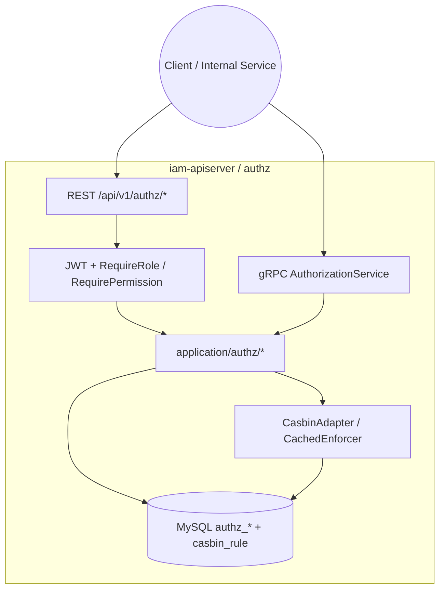
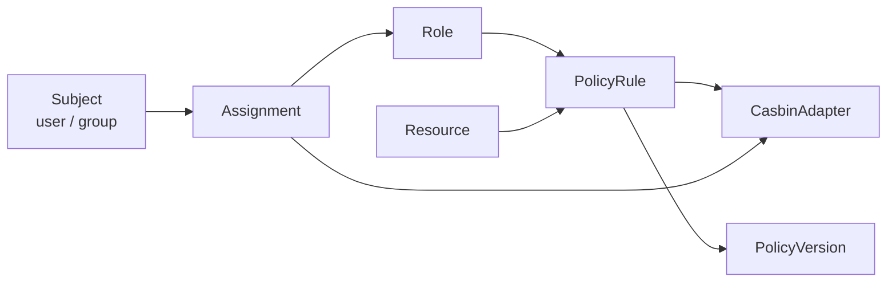
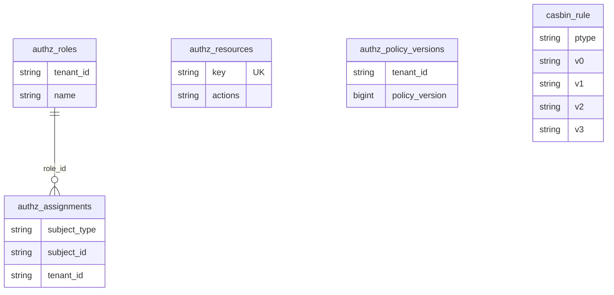
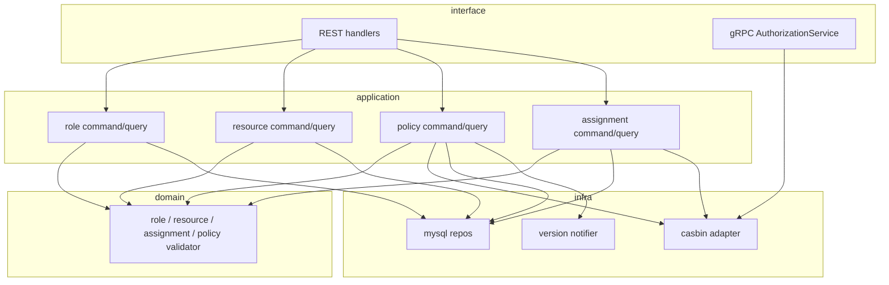

# 角色、策略、资源、Assignment

本文回答：授权域（`authz`）今天负责什么、不负责什么；它在 `iam-apiserver` 中如何组织 `Role / Resource / PolicyRule / Assignment / Casbin` 这组对象；以及当前对外暴露面、存储、配置与真实代码落点分别是什么。

**阅读维度**：Why = 租户内 RBAC + 可审计的策略版本；What = `Role / Resource / Assignment / PolicyRule / PolicyVersion / Casbin`；Where = `iam-apiserver` 的 REST / gRPC / Gin 中间件；Verify = OpenAPI、proto、[`configs/casbin_model.conf`](../../configs/casbin_model.conf)、`authz_*` 表与 `casbin_rule`。

---

## 30 秒了解系统

- `authz` 的主问题只有两个：先把角色、资源、策略、Assignment 这组业务对象管理好，再把它们汇总成 Casbin 可执行的判定规则。
- 模块内最重要的对象是：`Role / Resource / PolicyRule / Assignment / PolicyVersion / CasbinAdapter`。
- 当前既有管理面，也有单次 PDP：REST `POST /api/v1/authz/check`、gRPC `AuthorizationService.Check`、HTTP 中间件 `RequireRole / RequirePermission` 都已经是现状能力。
- 存储不是单一一套：业务元数据主要在 `authz_*` 表，执行规则主要在 `casbin_rule`，策略版本在 `authz_policy_versions`。
- `authz` 不负责登录与 Token，不负责用户档案与监护关系，也不等于“完整授权平台全家桶”。
- 统一事件清单：**N/A**。本仓库没有 `configs/events.yaml`；若提到版本通知 topic，应直接回链源码。

| 主题 | 当前答案 |
| ---- | ---- |
| 管理对象 | `Role / Resource / PolicyRule / Assignment` |
| 判定引擎 | Casbin `p/g` + `Enforce` |
| 主存储 | `authz_roles`、`authz_resources`、`authz_assignments`、`authz_policy_versions`、`casbin_rule` |
| 对外暴露 | REST 管理面 + REST `check` + gRPC `Check` + `RequireRole / RequirePermission` |
| 真实契约 | [`api/rest/authz.v1.yaml`](../../api/rest/authz.v1.yaml)、[`api/grpc/iam/authz/v1/authz.proto`](../../api/grpc/iam/authz/v1/authz.proto) |

### 模块边界

#### 负责

- 租户内角色、资源目录、策略规则、主体到角色分配的建模
- Casbin `p` / `g` 规则写入与单次判定能力
- 租户级策略版本递增与可选版本通知
- 对外暴露 REST 管理面、REST PDP、gRPC PDP 和 HTTP 运行时权限中间件入口

#### 不负责

- 登录、Token、JWKS：见 [01-authn-认证&Token&JWKS.md](./01-authn-认证&Token&JWKS.md)
- 用户、儿童、监护关系：见 [03-user-用户&儿童&Guardianship.md](./03-user-用户&儿童&Guardianship.md)
- gRPC 传输层 mTLS、服务端 ACL：见 [../01-运行时/02-gRPC与mTLS.md](../01-运行时/02-gRPC与mTLS.md)
- 更复杂的批量 PDP、Explain、菜单树等“授权平台全家桶”能力：今天都不应包装成现状

#### 依赖

- 依赖 `authn` 的 JWT 校验和身份上下文，主体通常来自 `user:<id>`
- 与 user 域没有聚合级依赖，只依赖主体键约定
- 版本通知依赖 EventBus 是否装配；未装配时主流程仍成立

### 运行时示意图

`authz` 只运行在 **`iam-apiserver`** 中。

**图意**：`authz` 不是独立服务，而是 `iam-apiserver` 里的一组模块能力；管理面、PDP、运行时中间件最终都复用同一个 Casbin 适配器。

---

## 模型与服务

### 模型关系图

这张图只回答“静态对象如何协作”，不展开管理链与判定链的完整时序。

**图意**：`Role / Resource / PolicyRule / Assignment` 是业务对象；Casbin 是执行引擎；`PolicyVersion` 是管理和同步锚点，而不是执行引擎的一部分。

### 数据关系（概念 ER）

当前最重要的事实有 3 条：

- `authz_resources` 没有 `tenant_id`，资源键 `key` 全局唯一
- `authz_roles` / `authz_assignments` 带 `tenant_id`
- Casbin 规则单独落在 `casbin_rule`

### 领域模型与领域服务

**限界上下文**：`authz` 负责回答“某主体在某租户下是否可以对某资源执行某动作”，并维护支持这个判定所需的角色、资源、策略和分配数据。

| 概念 | 职责 | 与相邻概念的关系 |
| ---- | ---- | ---- |
| `Role` | 租户内角色元数据 | `Key()` 产出 Casbin 侧 `role:<name>` |
| `Resource` | 资源目录与动作集合 | 参与策略规则构造 |
| `PolicyRule` | 角色对资源动作的允许规则 | 变成 Casbin `p` |
| `Assignment` | 主体与角色绑定关系 | 变成 Casbin `g` |
| `PolicyVersion` | 租户策略版本 | 用于同步和审计，不直接参与 `Enforce` |
| `CasbinAdapter` | 授权执行与规则写入端口 | 被管理面、PDP、中间件复用 |

### 应用服务设计

| 用例 | 职责一句 | 锚点 |
| ---- | ---- | ---- |
| 角色管理 | 角色 CRUD 与查询 | [`application/authz/role/`](../../internal/apiserver/application/authz/role/) |
| 资源管理 | 资源 CRUD 与动作校验 | [`application/authz/resource/`](../../internal/apiserver/application/authz/resource/) |
| 策略管理 | 写入 / 删除 Casbin `p` 规则，递增版本，可选发版本通知 | [`application/authz/policy/command_service.go`](../../internal/apiserver/application/authz/policy/command_service.go) |
| 分配管理 | 写入 / 删除 assignment，并同步 Casbin `g` 规则 | [`application/authz/assignment/command_service.go`](../../internal/apiserver/application/authz/assignment/command_service.go) |
| 单次 PDP | 对 `(subject, domain, object, action)` 执行 `Enforce` | [`interface/authz/restful/handler/check.go`](../../internal/apiserver/interface/authz/restful/handler/check.go)、[`interface/authz/grpc/service.go`](../../internal/apiserver/interface/authz/grpc/service.go) |

---

## 核心设计

### 核心授权模型：业务对象和执行引擎是两层，不是一层

**结论**：`authz` 不是“只有 Casbin”；它先用 `Role / Resource / PolicyRule / Assignment` 组织业务事实，再把这些事实投射成 Casbin `p/g` 规则做执行。

| 层 | 当前职责 |
| ---- | ---- |
| 业务对象层 | Role、Resource、PolicyRule、Assignment、PolicyVersion |
| 执行引擎层 | Casbin `p/g` + `Enforce` |
| 运行时消费层 | REST `check`、gRPC `Check`、`RequireRole / RequirePermission` |

**设计边界**：

- `PolicyRule` 不是单独 DSL 引擎，而是 Casbin `p` 规则的业务化包装
- `Assignment` 不是抽象“权限树”，而是主体到角色的绑定关系
- 角色的真正执行键不是数据库 ID，而是 `role:<name>`

### 核心双写模式：Policy 和 Assignment 都是“双面数据”，但顺序不同

**结论**：当前 `authz` 的管理写链不是统一单事务模型，而是“业务表 + Casbin”双面维护，其中策略和 Assignment 的写入顺序并不相同。

| 写入对象 | 当前顺序 | 回滚策略 |
| ---- | ---- | ---- |
| Policy | 先写 Casbin `p`，再递增 `authz_policy_versions`，再可选发通知 | 版本递增失败时回滚 Casbin |
| Assignment Grant | 先写 `authz_assignments`，再写 Casbin `g` | Casbin 失败时删除刚插入的 assignment |
| Assignment Revoke | 当前有两条路径，先后顺序不同 | 只有 best-effort 回滚 |

这一条只需要在模块文里点明模式，不需要把完整时序在这里重复展开；长时序见 [../05-专题分析/02-授权判定链路--角色&策略&资源&Assignment&Casbin.md](../05-专题分析/02-授权判定链路--角色&策略&资源&Assignment&Casbin.md)。

### 核心判定模型：今天的 PDP 以单次 `Check` 为中心

**结论**：当前 `authz` 已经有 REST PDP、gRPC PDP 和运行时中间件消费面，但它们共同回答的是“单次 allow/deny”，不是更复杂的批量解释型平台能力。

| 面向 | 当前能力 |
| ---- | ---- |
| REST PDP | `POST /api/v1/authz/check` |
| gRPC PDP | `AuthorizationService.Check` |
| 运行时中间件 | `RequireRole`、`RequirePermission` |

**当前边界必须讲清**：

- REST `check` 可以显式传主体，也可以回退当前用户
- gRPC `Check` 要求调用方显式给齐四元组
- `RequireRole / RequirePermission` 依赖 Casbin 已注入，且前面已经过 `AuthRequired()`

### 核心路由与保护：管理面和 PDP 共享同一条认证入口，但不是全局强制

**结论**：`/api/v1/authz/*` 现在已经是“管理面 + PDP”同组路由，除 `/health` 外都会走注入的 `AuthMiddleware`；但在认证模块缺失时，router 仍可能回退到放行占位。

| 路由面 | 当前状态 |
| ---- | ---- |
| `/api/v1/authz/health` | 公开 |
| 角色 / 资源 / 策略 / Assignment 管理面 | 走 `AuthMiddleware` |
| `POST /api/v1/authz/check` | 走 `AuthMiddleware` |

所以今天更准确的说法是：**标准装配路径下已受保护，但不是任何降级场景都能保证统一受保护。**

### 核心装配与配置：Casbin 模型、适配器和版本通知决定 `authz` 的运行形态

**结论**：真正决定 `authz` 运行形态的，不是 prose 描述，而是装配代码、Casbin 模型文件和可选版本通知器。

| 项 | 说明 |
| ---- | ---- |
| Casbin 模型路径 | `assembler/authz.go` 中固定使用 `configs/casbin_model.conf` |
| 适配器 | `infra/casbin` 下 `gorm-adapter` + `CachedEnforcer` |
| gRPC 注册 | `AuthzModule.GRPCService.Register` |
| 版本通知 | `versionNotifier != nil` 时才会发布 `iam.authz.policy_version` |

| 文件 | 作用 |
| ---- | ---- |
| [`configs/casbin_model.conf`](../../configs/casbin_model.conf) | 判定语义真源 |
| [`configs/grpc_acl.yaml`](../../configs/grpc_acl.yaml) | gRPC 服务端 ACL；与 Casbin PDP 不是同一层 |
| [`api/rest/authz.v1.yaml`](../../api/rest/authz.v1.yaml) | REST 合同 |
| [`api/grpc/iam/authz/v1/authz.proto`](../../api/grpc/iam/authz/v1/authz.proto) | gRPC 合同 |

---

## 边界与注意事项

- `authz` 今天已经有完整的“管理面 + 单次 PDP”能力，但还不能讲成完整授权平台全家桶。
- 策略版本通知 topic `iam.authz.policy_version` 只有发布侧；消费闭环需要结合部署和下游代码继续核对。
- 路由保护依赖 `authn` 中间件与 Casbin 装配，不能把设计意图包装成无条件现状。
- `tenant_id / user_id` 的默认值、`changed_by / granted_by` 的合同与运行时来源漂移，统一看 [../03-接口与集成/03-授权接入与边界.md](../03-接口与集成/03-授权接入与边界.md)。
- Policy/Assignment 的长时序、PDP 使用路径和版本传播链，统一看 [../05-专题分析/02-授权判定链路--角色&策略&资源&Assignment&Casbin.md](../05-专题分析/02-授权判定链路--角色&策略&资源&Assignment&Casbin.md)。

---

## 代码锚点索引

| 关注点 | 路径 | 说明 |
| ------ | ---- | ---- |
| 模块装配 | `internal/apiserver/container/assembler/authz.go` | `AuthzModule`、Casbin 模型路径、应用服务装配 |
| REST 路由 | `internal/apiserver/interface/authz/restful/router.go` | `/health` 公开；其余挂 `AuthMiddleware` |
| REST PDP | `internal/apiserver/interface/authz/restful/handler/check.go` | `POST /check` |
| gRPC PDP | `internal/apiserver/interface/authz/grpc/service.go` | `AuthorizationService.Check` |
| Policy 写入 | `internal/apiserver/application/authz/policy/command_service.go` | `p` 规则 + 版本递增 + 可选通知 |
| Assignment 写入 | `internal/apiserver/application/authz/assignment/command_service.go` | assignment + Casbin `g` 双写 |
| Casbin 实现 | `internal/apiserver/infra/casbin/` | `CachedEnforcer`、规则装载、执行 |
| 中间件消费 | `internal/pkg/middleware/authn/jwt_middleware.go` | `RequireRole / RequirePermission` |
| 版本通知 | `internal/apiserver/infra/messaging/version_notifier.go` | topic `iam.authz.policy_version` |
| 域模型 | `internal/apiserver/domain/authz/` | `role / resource / assignment / policy` |
| SDK 消费面 | `pkg/sdk/authz/client.go` | 对外单次 PDP 调用 |
