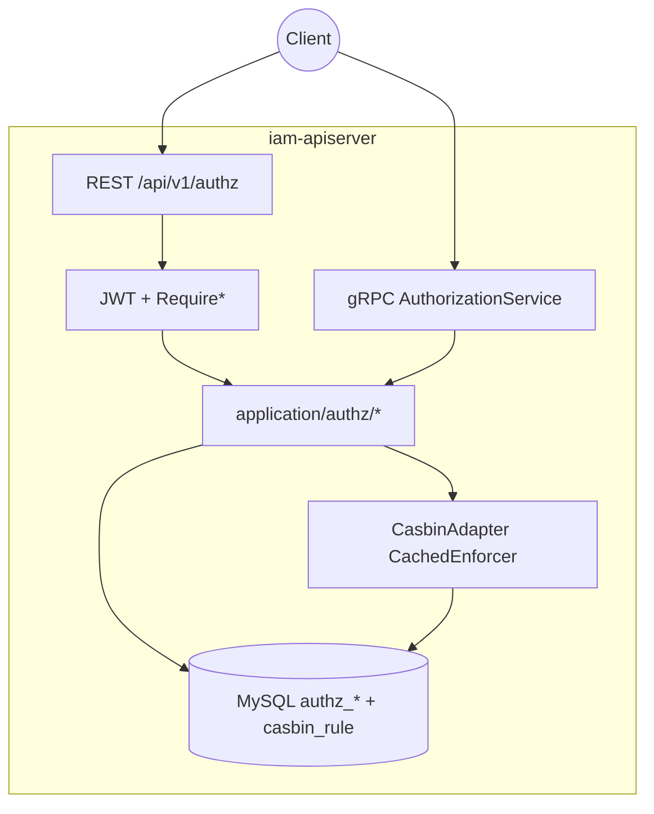
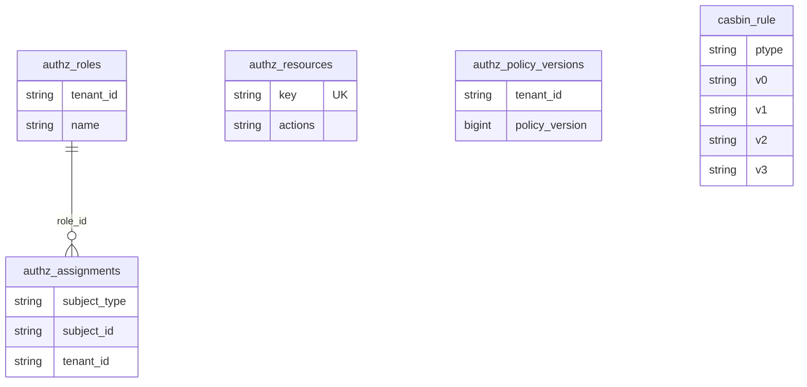
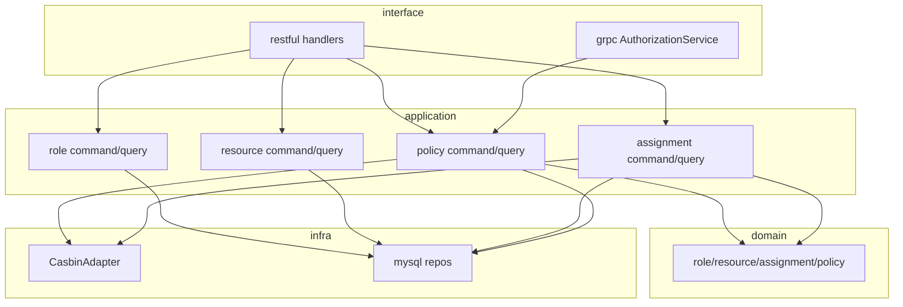
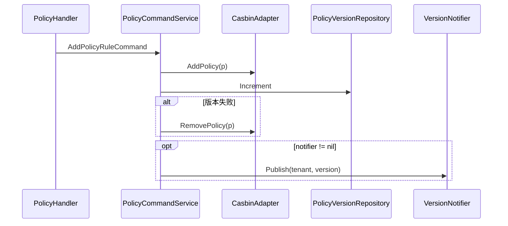
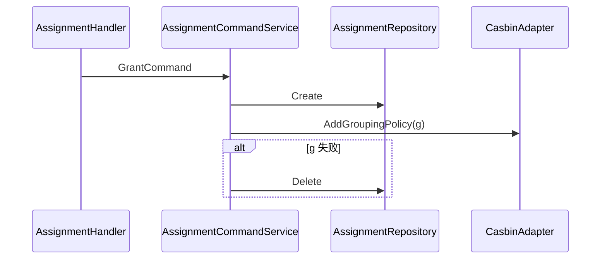

# 角色、策略、资源、Assignment

本文回答：授权域（`authz`）在 IAM 中解决什么问题、**MySQL 元数据**与 **Casbin 规则**如何双写对齐、**管理链**与 **PDP 判定链**如何落地，以及如何对照代码与契约验证。

**阅读维度**：Why = 租户内 RBAC + 可审计的策略版本；What = Role / Resource / Assignment / Policy（`p`）/ Grouping（`g`）与 Casbin；Where = `iam-apiserver` 的 REST/gRPC、Gin 中间件；Verify = OpenAPI、proto、[`configs/casbin_model.conf`](../../configs/casbin_model.conf)、`casbin_rule` 与 `authz_*` 表。

---

## 30 秒了解系统

- **管理面**：角色、资源目录、**策略规则**（角色 × 资源键 × 动作 → Casbin **`p`**）、**赋权**（主体 → 角色 → Casbin **`g`**）；策略变更递增 **`authz_policy_versions`**，可选发消息主题 **`iam.authz.policy_version`**（[`infra/messaging/version_notifier.go`](../../internal/apiserver/infra/messaging/version_notifier.go)）。
- **判定面**：REST **`POST /api/v1/authz/check`**、gRPC **`AuthorizationService.Check`**、路由中间件 **`RequireRole` / `RequirePermission`**（[`jwt_middleware.go`](../../internal/pkg/middleware/authn/jwt_middleware.go)），底层均为 **`CasbinAdapter.Enforce`**（或 `GetRolesForUser`）。
- **规则真源**：`configs/casbin_model.conf` + 持久化表 **`casbin_rule`**（`gorm-adapter`）；业务表 **`authz_roles` / `authz_resources` / `authz_assignments`** 存元数据，与 Casbin `p`/`g` **同步维护**。
- **JWT**：`/api/v1/authz/*` 除 **`GET /health`** 外走与业务 API 一致的 **AuthMiddleware**；若未注入 **`CasbinAdapter`**，`Require*` 与 PDP 显式返回 **不可用**（不静默放行）。
- **领域事件**：本仓库**无** [`configs/events.yaml`](../../configs/events.yaml)；策略版本 **Topic** 见上，订阅闭环 **N/A** 时需自行核对部署。

| 对照 | 管理面 | 判定面 |
| ---- | ------ | ------ |
| 入口 | REST `/api/v1/authz/*`（除 health） | `/check`、gRPC `Check`、`Require*` |
| 持久化 | `authz_*` + `casbin_rule` | 同一 `CachedEnforcer` / `Enforce` |
| 典型调用方 | 控制台、运维 | 网关、BFF、服务间 PDP |

### 模块边界

#### 负责

- 租户内角色、资源目录、策略（`p`）与主体—角色分配（`g`）的建模与持久化。
- 单次 allow 判定；策略版本递增与可选版本通知。

#### 不负责

- 登录、Token、JWKS：见 [01-authn](./01-authn-认证、Token、JWKS.md)。
- 用户档案、监护业务：见 [03-user](./03-user-用户、儿童、Guardianship.md)。
- 进程级 gRPC mTLS / 服务端 ACL：见 [01-运行时](../01-运行时/README.md) 与 [`configs/grpc_acl.yaml`](../../configs/grpc_acl.yaml)。

#### 依赖

- `AuthnModule` 的 JWT 校验与上下文；主体来自 `user:<id>`、`tenant_id`（缺省见中间件）。
- 与 user 域无聚合级依赖；主体键为 **`user:` / `group:`** 等约定。

### 运行时示意图

仅 **`iam-apiserver`**；无独立 worker。

---

## 模型与服务

### 数据关系（概念 ER）

与 [`configs/mysql/schema.sql`](../../configs/mysql/schema.sql) 中 Module 3 一致；**`authz_resources` 无 `tenant_id` 字段**，资源键 **`key` 全局唯一**（目录/动作元数据）；**`authz_roles` / `authz_assignments`** 带 **`tenant_id`**。Casbin 规则落在 **`casbin_rule`**（`ptype`=`p`/`g`，列 `v0`…`v5` 存 sub/dom/obj/act 等）。

**说明**：`p` 规则 **`sub`** 为角色键（`role:<name>`），**`dom`** 为租户；**`g`** 把 **`user:`/`group:`** 主体接到 **`role:...`**。详见 [`domain/authz/policy/rule.go`](../../internal/apiserver/domain/authz/policy/rule.go)、[`domain/authz/role/role.go`](../../internal/apiserver/domain/authz/role/role.go)（`Key()` → `role:`+`Name`）。

### 主体与键约定（对照代码）

| 概念 | 格式 | 锚点 |
| ---- | ---- | ---- |
| 用户主体 | `user:<user_id>` | `check.go` `resolveSubject`、中间件 `Require*` |
| 组主体 | `group:<id>` | `SubjectTypeGroup` |
| 角色（Casbin `p.sub` / `g` 右侧） | `role:<role.Name>` | `Role.Key()` |
| 租户域 `dom` | 字符串；Gin 缺省 **`default`** | `jwt_middleware.tenantIDFromGin` |

### 分层依赖（运行时）

### 领域模型与领域服务

**限界上下文**：同一租户下「主体是否可对资源执行动作」；不承载菜单 UI、不内置批量 PDP 产品。

| 概念 | 职责 |
| ---- | ---- |
| `Role` | 租户内角色；`Key()` 为 Casbin 侧角色标识 |
| `Resource` | 资源键与 `actions` JSON（校验动作合法性） |
| `Assignment` | 主体与角色绑定；驱动 `g` |
| `PolicyRule` | `p` 四元组（角色为 sub） |
| `PolicyVersion` | 租户策略版本行（审计/同步） |

### 应用服务设计

| 方向 | 职责 | 锚点 |
| ---- | ---- | ---- |
| 角色 | CRUD | [`application/authz/role/`](../../internal/apiserver/application/authz/role/) |
| 资源 | CRUD、动作校验 | [`application/authz/resource/`](../../internal/apiserver/application/authz/resource/) |
| 策略 | 增删 `p`、版本递增、可选通知 | [`policy/command_service.go`](../../internal/apiserver/application/authz/policy/command_service.go)、[`policy/query_service.go`](../../internal/apiserver/application/authz/policy/query_service.go) |
| 赋权 | Grant/Revoke、`g` 双写 | [`assignment/command_service.go`](../../internal/apiserver/application/authz/assignment/command_service.go) |
| PDP | `Enforce` | [`handler/check.go`](../../internal/apiserver/interface/authz/restful/handler/check.go)、[`grpc/service.go`](../../internal/apiserver/interface/authz/grpc/service.go) |

---

## 核心设计

### Casbin 模型与 Matcher

**结论**：[`configs/casbin_model.conf`](../../configs/casbin_model.conf) 定义 `r = sub, dom, obj, act`，`p = sub, dom, obj, act`，`g = _, _, _`，**Matcher** 含 **`g(r.sub, p.sub, r.dom)`**（用户继承角色）、**`keyMatch(r.obj, p.obj)`**、**`regexMatch(r.act, p.act)`**。改模型会改变语义，须与存量 `casbin_rule` 一并评估。

### 核心数据流：策略变更（`p` + 版本）

**结论**：先 **`AddPolicy`**，再 **`authz_policy_versions` 递增**；版本写失败则 **回滚 Casbin**（见 [`AddPolicyRule`](../../internal/apiserver/application/authz/policy/command_service.go)）。

### 核心数据流：赋权（DB + `g`）

**结论**：**先写 `authz_assignments`**，再 **`AddGroupingPolicy`**；Casbin 失败则 **删除刚插入的 assignment**（[`Grant`](../../internal/apiserver/application/authz/assignment/command_service.go)）。**Revoke** 先删库再删 `g`。

### 核心判定：PDP

**结论**：HTTP `POST /authz/check` 从 **JWT** 或请求体 **`subject_type` + `subject_id`** 解析 `sub`（[`handler/check.go`](../../internal/apiserver/interface/authz/restful/handler/check.go)）；gRPC `Check` 要求 **显式传入 `Subject`/`Domain`/`Object`/`Action`**（[`grpc/service.go`](../../internal/apiserver/interface/authz/grpc/service.go)）；`casbin == nil` 时 HTTP 返回 **500**、gRPC 返回 **`Unavailable`**。

### 核心集成：中间件

**结论**：`RequireRole` 使用 **`GetRolesForUser`** 与 `role:<name>` 集合比较；`RequirePermission` 使用 **`Enforce(sub, dom, resourceObj, action)`**；`casbin == nil` 时 **500**（[`jwt_middleware.go`](../../internal/pkg/middleware/authn/jwt_middleware.go)）。

### 装配与配置

| 项 | 说明 |
| ---- | ---- |
| Casbin 模型路径 | [`assembler/authz.go`](../../internal/apiserver/container/assembler/authz.go) 内写死 **`configs/casbin_model.conf`**（相对进程工作目录） |
| 适配器 | [`infra/casbin`](../../internal/apiserver/infra/casbin/)：`gorm-adapter` + **`CachedEnforcer`**，`EnableAutoSave(true)` |
| gRPC 注册 | [`server.go`](../../internal/apiserver/server.go)：`AuthzModule.GRPCService.Register` |

| 文件 | 作用 |
| ---- | ---- |
| [`configs/casbin_model.conf`](../../configs/casbin_model.conf) | Matcher 真源 |
| [`configs/grpc_acl.yaml`](../../configs/grpc_acl.yaml) | gRPC 服务端 ACL（若启用；与 Casbin PDP 不同层） |
| [`api/rest/authz.v1.yaml`](../../api/rest/authz.v1.yaml) | REST 合同 |
| [`api/grpc/iam/authz/v1/authz.proto`](../../api/grpc/iam/authz/v1/authz.proto) | gRPC 合同 |

---

## 边界与注意事项

- 租户/操作者默认值、`changed_by`/`granted_by` 漂移：见 [03-授权接入与边界.md](../03-接口与集成/03-授权接入与边界.md)。
- **双写、版本传播、与 PDP 长链路**：见 [05-专题分析/02-授权判定链路…](../05-专题分析/02-授权判定链路：角色、策略、资源、Assignment、Casbin.md)。

---

## 代码锚点索引

| 关注点 | 路径 | 说明 |
| ------ | ---- | ---- |
| 装配 | `internal/apiserver/container/assembler/authz.go` | `AuthzModule`、模型路径、CasbinAdapter 注入 |
| REST 路由 | `internal/apiserver/interface/authz/restful/router.go` | `/health` 免鉴权；其余挂 `AuthMiddleware` |
| REST PDP | `internal/apiserver/interface/authz/restful/handler/check.go` | `POST /check` |
| gRPC | `internal/apiserver/interface/authz/grpc/service.go` | `AuthorizationService.Check` |
| gRPC 注册 | `internal/apiserver/server.go` | `Register` |
| 中间件 | `internal/pkg/middleware/authn/jwt_middleware.go` | `RequireRole` / `RequirePermission` |
| Casbin 实现 | `internal/apiserver/infra/casbin/` | Adapter、`Enforce`、LoadPolicy |
| 版本通知 | `internal/apiserver/infra/messaging/version_notifier.go` | Topic `iam.authz.policy_version` |
| 域规则 | `internal/apiserver/domain/authz/policy/rule.go` | `PolicyRule` / `GroupingRule` |
| 客户端 SDK | `pkg/sdk/authz/client.go` | 远端 PDP 调用 |
