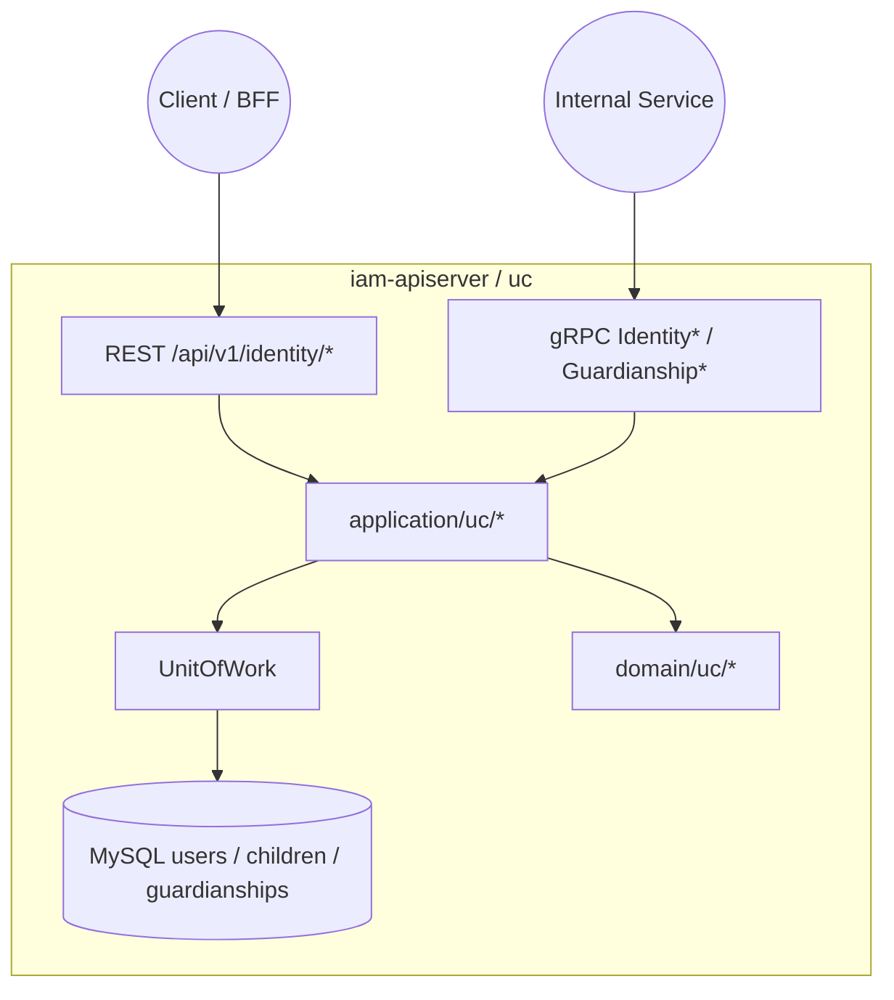
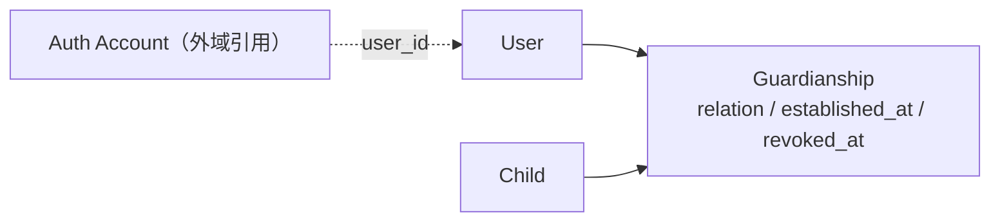
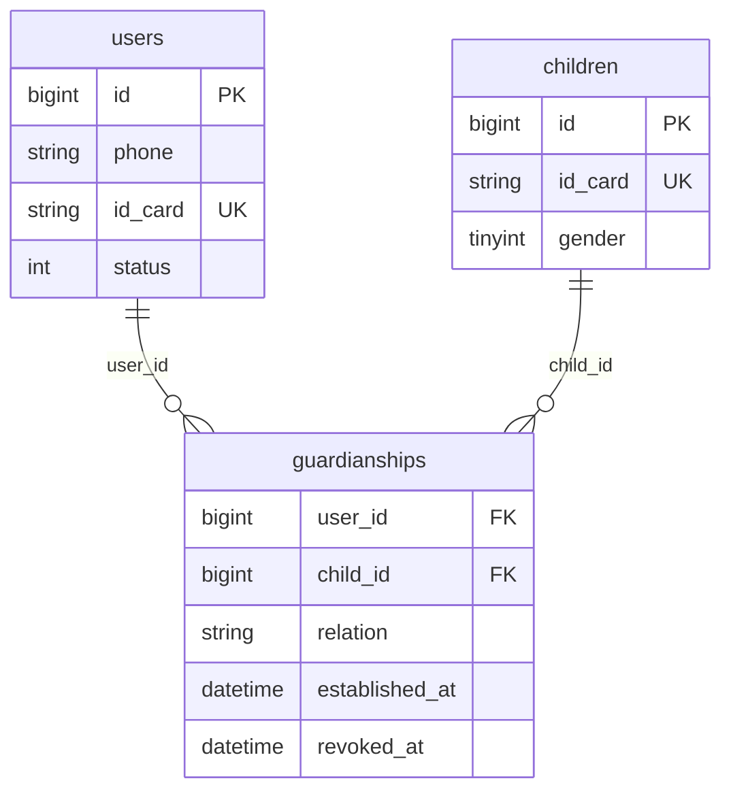
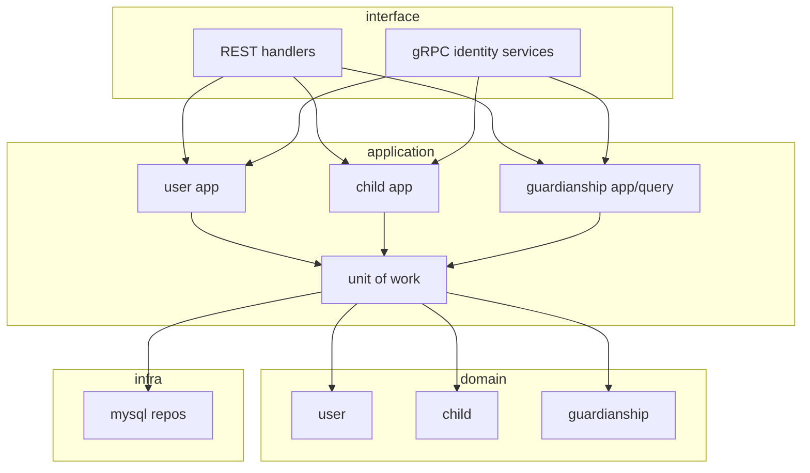
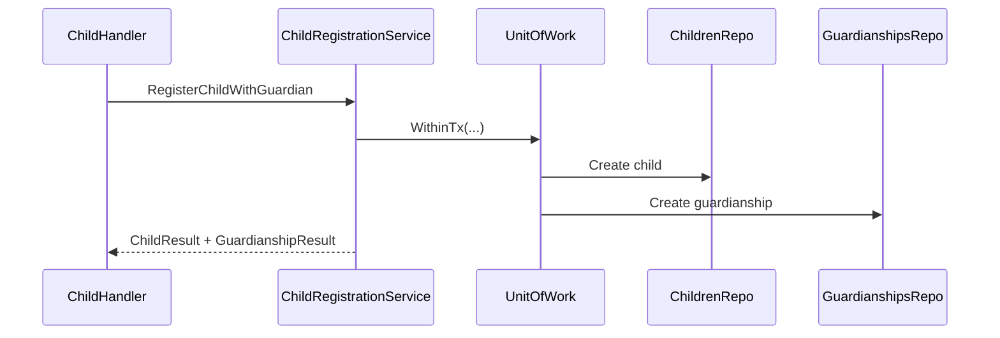

# 用户、儿童、Guardianship

本文回答：用户域（代码目录 `uc`）今天负责什么、不负责什么；它在 `iam-apiserver` 中如何组织 `User / Child / Guardianship` 这组对象；以及当前 REST / gRPC 暴露面、存储与真实代码落点分别是什么。

**阅读维度**：Why = 身份与关系事实；What = `User / Child / Guardianship`；Where = `iam-apiserver` 的 `interface/uc`；Verify = [`api/rest/identity.v1.yaml`](../../api/rest/identity.v1.yaml)、[`api/grpc/iam/identity/v1/identity.proto`](../../api/grpc/iam/identity/v1/identity.proto)、[`configs/mysql/schema.sql`](../../configs/mysql/schema.sql) 中 `users / children / guardianships`。

---

## 30 秒了解系统

- 用户域的主问题只有两个：先维护“人”和“儿童”这两类身份对象，再维护“谁和哪个儿童是什么关系”的 `Guardianship`。
- 模块内最重要的对象是：`User / Child / Guardianship`。
- 当前用户域既有 REST，也有 gRPC：REST 偏“当前登录用户上下文”，gRPC 偏“服务间显式传 ID”。
- `children/register` 的当前真实写链已经收口为单事务组合用例，是原子闭环。
- 查询与访问控制大多先从 guardianship 关系出发，再回查 child 或 user。
- 统一事件清单：**N/A**。本仓库没有 `configs/events.yaml`；当前对外 identity 合同也不再保留事件订阅型 gRPC。

| 主题 | 当前答案 |
| ---- | ---- |
| 核心对象 | `User`、`Child`、`Guardianship` |
| 主存储 | `users`、`children`、`guardianships` |
| 典型 REST | `/api/v1/identity/me`、`/me/children`、`/children/register`、`/guardians/grant` |
| 典型 gRPC | `IdentityRead`、`GuardianshipQuery`、`GuardianshipCommand`、`IdentityLifecycle` |
| 真实契约 | [`api/rest/identity.v1.yaml`](../../api/rest/identity.v1.yaml)、[`api/grpc/iam/identity/v1/identity.proto`](../../api/grpc/iam/identity/v1/identity.proto) |

### 模块边界

#### 负责

- 用户资料与状态维护
- 儿童档案创建、更新、查询
- 用户与儿童之间监护关系的创建、撤销与查询
- 服务间用户/儿童/监护关系读写 RPC

#### 不负责

- 登录、Token、JWKS：见 [01-authn-认证&Token&JWKS.md](./01-authn-认证&Token&JWKS.md)
- 角色、策略、PDP：见 [02-authz-角色&策略&资源&Assignment.md](./02-authz-角色&策略&资源&Assignment.md)
- HTTP JWT 中间件与 gRPC 传输安全：见 [../01-运行时/README.md](../01-运行时/README.md)

#### 依赖

- REST 依赖 `AuthMiddleware` 注入当前用户上下文
- 与 authz 无聚合级依赖
- 与 authn 的耦合主要体现在 `auth_accounts.user_id -> users.id`

### 运行时示意图

`uc` 只运行在 **`iam-apiserver`** 中。

**图意**：用户域没有拆成独立子进程；REST 和 gRPC 共用同一套应用服务、领域模型和 MySQL 存储。

---

## 模型与服务

### 模型关系图

这张图只回答“静态对象如何协作”，不展开建档与查询时序。

**图意**：当前用户域不是“Child 直接挂在 User 下”，而是通过 `Guardianship` 这层关系对象把两者连起来。`authn` 通过 `user_id` 引到 `User`，但 `User` 仍属于用户域本体。

### 数据关系（概念 ER）

当前最重要的事实有 3 条：

- `guardianships.user_id -> users.id`
- `guardianships.child_id -> children.id`
- `(user_id, child_id)` 有唯一约束

### 领域模型与领域服务

**限界上下文**：用户域负责维护“谁是谁”“哪个儿童是谁”“谁与哪个儿童有何关系”。它不是认证域，也不是授权域。

| 概念 | 职责 | 与相邻概念的关系 |
| ---- | ---- | ---- |
| `User` | 用户档案与状态锚点 | 可被 `authn` 账户引用 |
| `Child` | 儿童身份对象与档案字段 | 被 `Guardianship` 引用 |
| `Guardianship` | 监护关系对象 | 把 `User` 与 `Child` 连起来，并记录 `relation / established_at / revoked_at` |

当前 `Guardianship` 模型已经支持：

- `relation`
- `established_at`
- `revoked_at`

但当前代码里**没有**这些机制：

- 主监护人 / 次监护人
- 邀请码 / 待接受状态
- 最多两个监护人
- 更重的关系规则编排

### 应用服务设计

| 子域 | 命令 / 查询（节选） | 锚点 |
| ---- | ------------------ | ---- |
| User | `UserApplicationService`、`UserProfile`、`UserStatus`、`UserQuery` | [`application/uc/user/`](../../internal/apiserver/application/uc/user/) |
| Child | `Register`、`ChildProfile`、`ChildQuery` | [`application/uc/child/`](../../internal/apiserver/application/uc/child/) |
| Guardianship | `AddGuardian`、`RemoveGuardian`、`ListChildrenByUserID`、`IsGuardian` | [`application/uc/guardianship/`](../../internal/apiserver/application/uc/guardianship/) |

---

## 核心设计

### 核心对象模型：`Guardianship` 是关系锚点，不是附属字段

**结论**：当前用户域最关键的设计不是 `User` 或 `Child` 本身，而是把关系独立建模为 `Guardianship`。后面的查询、判定、撤销几乎都围绕这张关系表展开。

| 对象 | 当前作用 |
| ---- | ---- |
| `User` | 监护主体、身份锚点 |
| `Child` | 被监护对象 |
| `Guardianship` | 关系事实、访问前提、撤销锚点 |

这意味着今天更准确的说法是：

- “我的孩子”不是 `User.children` 直接展开
- “能不能看某个 child”本质上先看 guardianship 是否存在

### 核心写模型：`children/register` 已收口为单事务

**结论**：`children/register` 当前已经是一个原子闭环，由组合用例在同一个 `UnitOfWork` 事务内完成 child + guardianship 创建。

当前顺序是：

1. 在同一事务里创建 `Child`
2. 在同一事务里建立 `Guardianship`
3. 返回聚合后的 child + guardianship 响应

**设计边界**：

- 如果第二步失败，`child` 可能已经落库
- 所以今天不能讲成“注册儿童并授监护已经是单事务闭环”

长链路和风险细节统一看 [../05-专题分析/03-监护关系链路--用户&儿童&Guardianship 的协作.md](../05-专题分析/03-监护关系链路--用户&儿童&Guardianship 的协作.md)。

### 核心查询模型：关系查询先于 child / user 详情查询

**结论**：当前大多数查询和访问控制都先读 guardianship，再去查 child 或 user。

| 场景 | 当前主入口 |
| ---- | ---- |
| “我的孩子” | `guardQuery.ListChildrenByUserID(...)` 后再查 child |
| “我能不能看这个 child” | `guardQuery.GetByUserIDAndChildID(...)` |
| “某 user 是否是某 child 的监护人” | `guardQuery.IsGuardian(...)` |
| “列出某个 child 的监护人” | `guardQuery.ListGuardiansByChildID(...)` |

所以这组能力今天更像“关系优先的查询模型”，不是单独的 child 读模型。

### 核心 gRPC 设计：读、写、生命周期拆成 4 个服务

**结论**：gRPC 这层不是一个单一 `IdentityService`，而是按用途拆成 4 个服务。

| Proto 服务 | 当前用途 |
| ---------- | -------- |
| `IdentityRead` | 用户 / 儿童读取 |
| `GuardianshipQuery` | 监护关系查询 |
| `GuardianshipCommand` | 监护关系写操作 |
| `IdentityLifecycle` | 用户生命周期管理 |

这条拆分本身就是模块设计的一部分，因为它反映了“读 / 写 / 生命周期”三个面向并不完全相同。

### 核心边界：`revoked_at` 支持写模型，但还没统一进入读链和判定链

**结论**：当前写模型支持通过 `revoked_at` 软撤销关系，但 repo 查询和判定入口仍未统一过滤。

| 方法 | 当前是否显式过滤 `revoked_at` |
| ---- | ---- |
| `FindByUserIDAndChildID` | 是 |
| `FindByUserID` | 是 |
| `FindByChildID` | 是 |
| `IsGuardian` | 是 |

这意味着今天更准确的说法是：

- 模型上已经有“撤销关系”
- 公共查询链和判定链默认已经统一收口到 active-only，历史语义要走显式 `IncludingRevoked` 路径

---

## 边界与注意事项

- `GET /identity/guardians` 现在已经注册到 router；详见 [../03-接口与集成/04-身份接入与监护关系边界.md](../03-接口与集成/04-身份接入与监护关系边界.md)。
- `children/register` 现在已经收口为单事务组合用例；运行时细节统一在专题层继续展开。
- 旧设计稿中的邀请码、主/次监护人、复杂家庭关系规则，都不是当前代码的默认事实。
- 当前 identity proto / SDK / ACL / README 已同步移除未实现但可见的占位 RPC。

---

## 代码锚点索引

| 关注点 | 路径 | 说明 |
| ------ | ---- | ---- |
| 模块装配 | `internal/apiserver/container/assembler/user.go` | `UserModule`、UoW、REST handler、gRPC 聚合 |
| REST 路由 | `internal/apiserver/interface/uc/restful/router.go` | `/api/v1/identity` 路由组 |
| REST child 写链 | `internal/apiserver/interface/uc/restful/handler/child.go` | `children/register` 单事务组合用例入口 |
| REST guardianship | `internal/apiserver/interface/uc/restful/handler/guardianship.go` | `grant` 与 `list` |
| gRPC 聚合 | `internal/apiserver/interface/uc/grpc/identity/service.go` | 4 个服务注册 |
| 领域模型 | `internal/apiserver/domain/uc/` | `user / child / guardianship` |
| guardianship 仓储 | `internal/apiserver/infra/mysql/guardianship/repo.go` | active-only 默认查询与历史查询分流 |
| 真值契约 | `api/rest/identity.v1.yaml`、`api/grpc/iam/identity/v1/identity.proto` | REST / gRPC 合同 |
