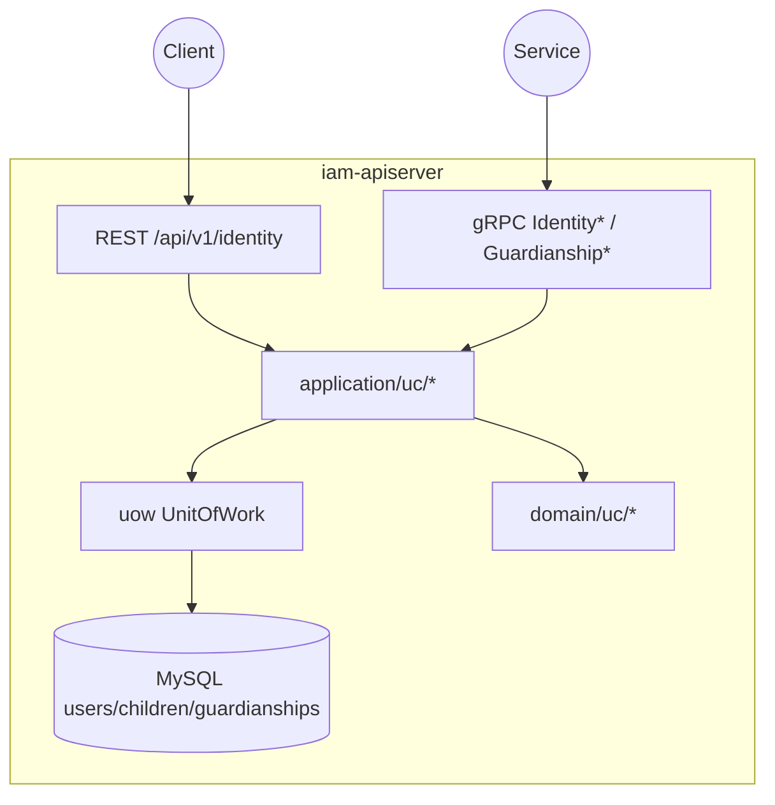
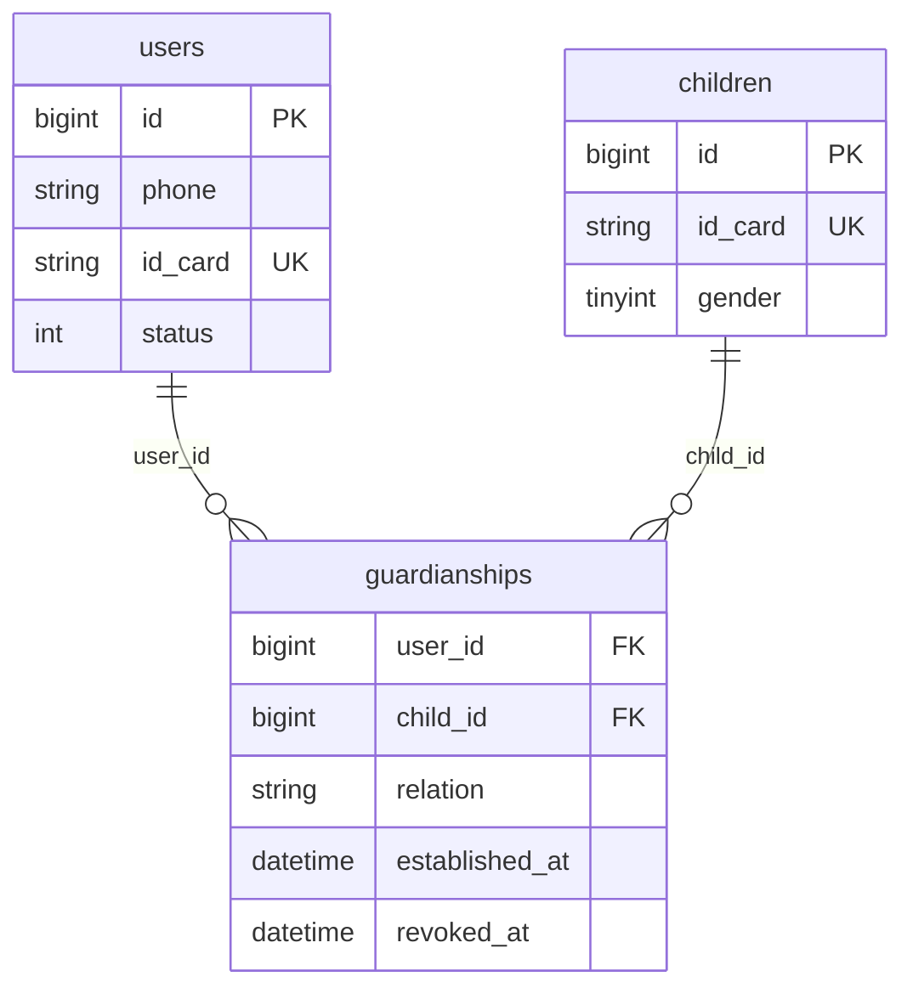
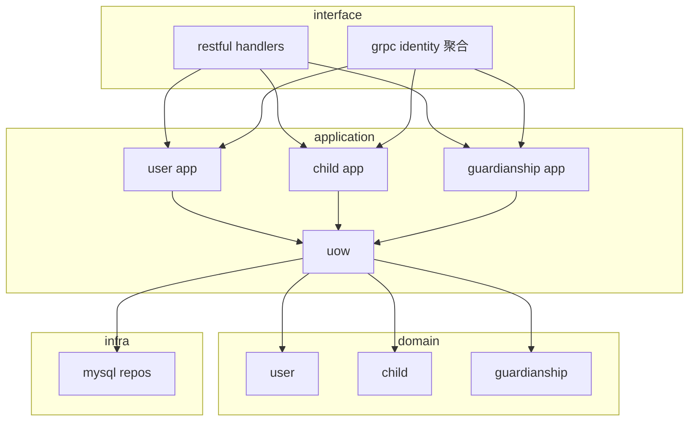
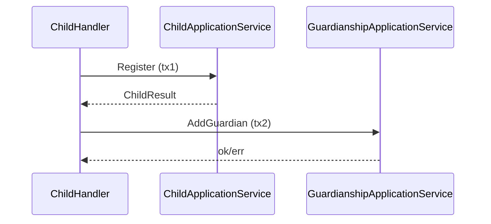

# 用户、儿童、Guardianship

本文回答：用户域（`uc`）如何承载**身份锚点**、**儿童档案**与**监护关系**，REST 与 gRPC 如何分工，以及与认证域、授权域的边界。

**阅读维度**：Why = 身份与关系事实；What = User / Child / Guardianship；Where = `iam-apiserver` 的 `interface/uc`；Verify = [`api/rest/identity.v1.yaml`](../../api/rest/identity.v1.yaml)、[`api/grpc/iam/identity/v1/identity.proto`](../../api/grpc/iam/identity/v1/identity.proto)、[`configs/mysql/schema.sql`](../../configs/mysql/schema.sql) 中 `users` / `children` / `guardianships`。

---

## 30 秒了解系统

- 三类核心对象：**User**（用户档案与状态）、**Child**（儿童档案）、**Guardianship**（`user_id` × `child_id` 监护关系，含 `relation`、`established_at`、`revoked_at`）。
- **REST** 前缀 **`/api/v1/identity`**：当前用户用 **`/me`**、**`/me/children`**；儿童注册 **`POST /children/register`** 在应用层为 **「先 `child.Register` 事务，再 `AddGuardian` 事务」** 两步（见 [核心流程](#核心流程儿童注册与监护)）。
- **gRPC** 拆为 **`IdentityRead`**、**`GuardianshipQuery`**、**`GuardianshipCommand`**、**`IdentityLifecycle`**（[`interface/uc/grpc/identity/service.go`](../../internal/apiserver/interface/uc/grpc/identity/service.go)），偏服务间显式 ID。
- **不负责**：登录与 Token（[01-authn](./01-authn-认证、Token、JWKS.md)）；角色与策略（[02-authz](./02-authz-角色、策略、资源、Assignment.md)）。
- **`configs/events.yaml`**：**N/A**（本仓库无统一事件清单）。

| 对照 | REST | gRPC |
| ---- | ---- | ---- |
| 典型调用 | 前端/BFF、`/identity/me` 族 | 内部服务、`GetUser` / `IsGuardian` / 生命周期 RPC |
| 契约 | [`identity.v1.yaml`](../../api/rest/identity.v1.yaml) | [`identity.proto`](../../api/grpc/iam/identity/v1/identity.proto) |
| 上下文 | JWT → `GetUserID` | 请求体/参数显式传用户/儿童 ID |

### 模块边界

**负责**

- 用户资料与状态、儿童建档与查询、监护授予/撤销/查询（以代码为准）。

**不负责**

- 认证颁发、授权判定；进程 mTLS（见 [01-运行时](../01-运行时/README.md)）。

**依赖**

- REST 需 **AuthMiddleware** 注入用户上下文（装配时传入）；与 authz 无聚合依赖。

### 运行时示意图

仅 **`iam-apiserver`**。

---

## 模型与服务

### 数据关系（概念 ER）

与 [`configs/mysql/schema.sql`](../../configs/mysql/schema.sql) Module 1 对齐。**`guardianships.user_id` → `users.id`，`child_id` → `children.id`**；**`uk_user_child_ref (user_id, child_id)`** 唯一。

**字段要点**：`users` 含 `phone`、`email`、`id_card` 等；`children` 含 `height`/`weight`（0.1 单位）等；**`auth_accounts.user_id`** 与 **`users.id`** 衔接见 [01-authn](./01-authn-认证、Token、JWKS.md)。

### REST 路由（可对照）

[`interface/uc/restful/router.go`](../../internal/apiserver/interface/uc/restful/router.go)；**整组 `/api/v1/identity` 在提供 `AuthMiddleware` 时统一挂载**（无单独 public 路由）。

| 方法 | 路径 | 说明 |
| ---- | ---- | ---- |
| GET/PATCH | `/me` | 当前用户资料 |
| GET | `/me/children` | 当前用户作为监护人的儿童列表 |
| POST | `/children/register` | 注册儿童 + 为当前用户建监护（handler 两步） |
| GET | `/children/search` | 儿童搜索 |
| GET/PATCH | `/children/:id` | 单条儿童 |
| POST | `/guardians/grant` | 为**指定** `user_id` + `child_id` 授监护 |

### 分层依赖

### 领域模型与领域服务

**限界上下文**：维护「谁是谁、儿童是谁、谁与儿童有何关系」；不解决登录、权限产品全家桶。

| 概念 | 职责 |
| ---- | ---- |
| `User` | 用户档案与状态（`status` 等） |
| `Child` | 儿童档案 |
| `Guardianship` | 用户—儿童关系、`relation`、`revoked_at`/`established_at` |

### 应用服务设计

| 子域 | 命令/查询（节选） | 锚点 |
| ---- | ------------------ | ---- |
| User | `UserApplicationService`、`UserProfile`、`UserStatus`、`UserQuery` | [`application/uc/user/`](../../internal/apiserver/application/uc/user/) |
| Child | `Register`、`ChildProfile`、`ChildQuery` | [`application/uc/child/`](../../internal/apiserver/application/uc/child/) |
| Guardianship | `AddGuardian`、`RemoveGuardian`、查询 | [`application/uc/guardianship/`](../../internal/apiserver/application/uc/guardianship/) |

---

## 核心设计

### REST 与 gRPC 不对称

**结论**：同一能力可能两侧都有，但 **REST 强绑定「当前 JWT 用户」**（如 `/me`），gRPC 多 **显式 ID**；不要假设路径一一对称。详情见 [04-身份接入与监护关系边界.md](../03-接口与集成/04-身份接入与监护关系边界.md)。

### gRPC 服务拆分

**结论**：[`identity.Service.RegisterService`](../../internal/apiserver/interface/uc/grpc/identity/service.go) 注册 **四个**服务：

| Proto 服务 | 用途（概括） |
| ---------- | ------------- |
| `IdentityRead` | 读用户/儿童 |
| `GuardianshipQuery` | 监护查询（如 `IsGuardian`） |
| `GuardianshipCommand` | 监护写 |
| `IdentityLifecycle` | 用户生命周期（创建/更新/状态等，依赖装配） |

### 核心流程：儿童注册与监护

**结论**：[`ChildHandler.RegisterChild`](../../internal/apiserver/interface/uc/restful/handler/child.go) 顺序为：**① `childApp.Register`（独立事务）** → **② `guardApp.AddGuardian`（独立事务）**。若 ② 失败，**儿童记录可能已存在**（需运维/补偿或业务重试）；**不是**单一大事务。  
**`AddGuardian` 自身**在 [`guardianship/services_impl.go`](../../internal/apiserver/application/uc/guardianship/services_impl.go) 内用 **`uow.WithinTx`** 包裹仓储写入。

### 核心存储与 `revoked_at`

**结论**：移除/撤销监护走领域 **`RemoveGuardian`** + 仓储 **`Update`**（`revoked_at` 等以领域/PO 为准）。**可验证**：[`infra/mysql/guardianship/repo.go`](../../internal/apiserver/infra/mysql/guardianship/repo.go) 的 **`FindByUserID` 仅 `user_id = ?`，未带 `revoked_at IS NULL`**，故 **`/me/children` 等路径若未在上层过滤，可能仍列出已撤销关系**；`IsGuardian` 同理仅按 user/child 计数，**不区分是否已撤销**。

---

## 边界与注意事项

- 合同与运行时漂移、路由注册：`04-身份接入与监护关系边界.md`。
- 长链路协作：`05-专题分析/03-监护关系链路：用户、儿童、Guardianship 的协作.md`。
- 旧设计稿中的邀请码、主/次监护人等：**非**当前代码默认事实。

---

## 代码锚点索引

| 关注点 | 路径 | 说明 |
| ------ | ---- | ---- |
| 装配 | `internal/apiserver/container/assembler/user.go` | `UserModule`、UoW、Handler、gRPC 聚合 |
| REST | `internal/apiserver/interface/uc/restful/router.go` | `/api/v1/identity`、AuthMiddleware |
| gRPC 聚合 | `internal/apiserver/interface/uc/grpc/service.go` | `Register` → identity |
| gRPC 实现 | `internal/apiserver/interface/uc/grpc/identity/service.go` | 四服务注册 |
| gRPC 注册 | `internal/apiserver/server.go` | `UserModule.GRPCService.Register` |
| 领域 | `internal/apiserver/domain/uc/` | 用户/儿童/监护模型 |
| 仓储 | `internal/apiserver/infra/mysql/user/`、`child/`、`guardianship/` | |
