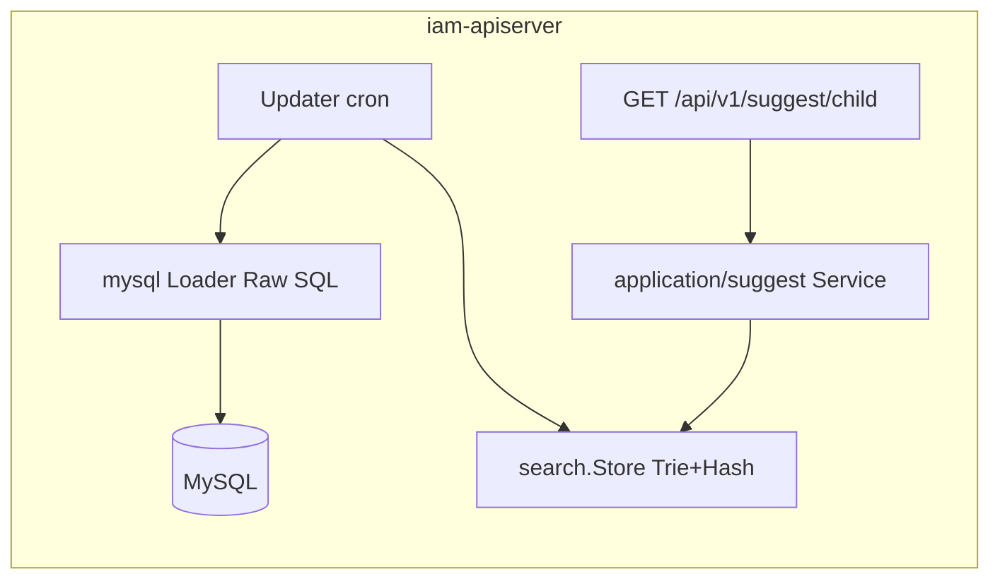
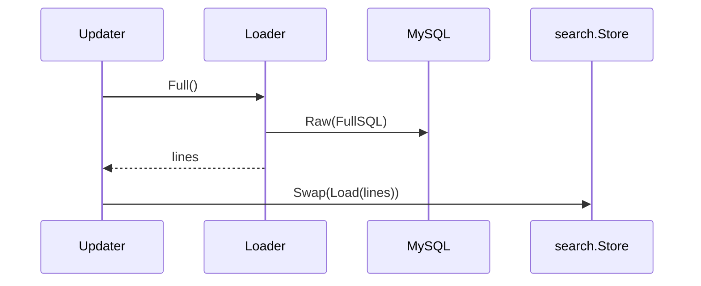

# 儿童联想搜索（Suggest）

本文回答：联想域如何在 **不落专用业务表** 的前提下，从 **MySQL 拉取儿童相关行**、构建 **内存 Trie + Hash** 索引，并通过 **REST** 提供前缀/数字查询；以及与用户域、认证域的边界。

**阅读维度**：Why = 登录后快速按姓名/拼音/手机/ID 联想儿童；What = `Loader` 行格式、`Store`、Updater 调度；Where = `application/suggest`、`infra/suggest/search`、`interface/suggest`；Verify = [`api/rest/suggest.v1.yaml`](../../api/rest/suggest.v1.yaml)、[`configs/apiserver*.yaml`](../../configs/apiserver.dev.yaml) 中 `suggest` 段、[`infra/mysql/suggest/loader.go`](../../internal/apiserver/infra/mysql/suggest/loader.go) 默认 SQL。

---

## 30 秒了解系统

- **无独立 `suggest_*` 表**：数据来自可配置 **Raw SQL**（默认 **`children` + `guardianships` + `users`**），行被规范为 **`name|id|mobiles|-|weight`** 字符串（[`loader.go`](../../internal/apiserver/infra/mysql/suggest/loader.go)）。
- **索引结构**：[`infra/suggest/search`](../../internal/apiserver/infra/suggest/search/) — **Trie**（中文/拼音前缀 + 通配补齐）与 **Hash**（纯数字关键词走手机号/ID 精确匹配），[`Store.Suggest`](../../internal/apiserver/infra/suggest/search/store.go) 内分支。
- **刷新**：`Updater` 启动时 **全量** `Swap` 替换内存索引，之后按 **cron** 全量/可选 **增量** `ImportLines` 合并；可选 **`data_dir/snapshot.txt`** 落盘。
- **REST**：**`GET /api/v1/suggest/child?k=`**（[`interface/suggest/restful`](../../internal/apiserver/interface/suggest/restful/handler.go)）；**`suggest.enable: false`** 时模块不初始化，**路由不注册**（[`routers.go`](../../internal/apiserver/routers.go)）。
- **gRPC**：**N/A**（本模块仅 HTTP）。
- **`configs/events.yaml`**：**N/A**。

| 对照 | 数据面 | 查询面 |
| ---- | ------ | ------ |
| 入口 | MySQL + 可配置 SQL | 内存 `Store` |
| 对外 | — | `GET /api/v1/suggest/child` |
| Verify | 改 SQL 即改数据源 | [`suggest.v1.yaml`](../../api/rest/suggest.v1.yaml) |

### 模块边界

**负责**

- 按配置从库拉取行、维护内存索引、提供联想 API。

**不负责**

- 儿童/监护的写模型与业务规则：见 [03-user](./03-user-用户、儿童、Guardianship.md)（默认 SQL 只读 JOIN）。
- 登录与 Token：见 [01-authn](./01-authn-认证、Token、JWKS.md)（路由可挂 JWT，见下）。

**依赖**

- **MySQL**（与 UC 同库）；**`suggest.enable`** 与 **`SuggestModule.Service`** 存在时才注册路由。

### 运行时示意图

仅 **`iam-apiserver`**。



---

## 模型与服务

### 数据源与行格式（非 ER 表）

与 **`children` / `guardianships` / `users`** 逻辑关联；**默认全量 SQL** 要求至少能映射出 `id`、`name`、`mobiles`、`weight` 列（见 `loader.record`）。行字符串格式：

```text
{name}|{id}|{mobiles}|-|{weight}
```

**可验证行为**：默认 SQL 使用 **`g.deleted_at IS NULL`** 等软删条件；**若业务以 `guardianships.revoked_at` 为准**，需自行改写 **`suggest.full_sql` / `delta_sql`**，否则可能与 [03-user](./03-user-用户、儿童、Guardianship.md) 中「撤销仍可见」问题叠加或抵消。

### 领域模型

[`domain/suggest/term.go`](../../internal/apiserver/domain/suggest/term.go)：**`Term`**（`name`、`id`、`mobile`、`weight`）即 API 返回项。

### 查询语义（对照实现）

| 关键词 `k` | 行为 | 锚点 |
| ---------- | ---- | ---- |
| **仅数字** | Hash 精确匹配（手机/ID 等） | `Store.Suggest` → `table.Search` |
| **非数字** | Trie 前缀 + 不足 **`key_pad_len`** 时用 `*` 补齐再 `Wildcard` | 同文件 |

### 应用层与装配

| 组件 | 职责 | 锚点 |
| ---- | ---- | ---- |
| `Service` | `Suggest(ctx, keyword)` → 调 `search.Current()` | [`application/suggest/service.go`](../../internal/apiserver/application/suggest/service.go) |
| `Updater` | 全量 `Swap(Load)`、增量 `ImportLines`、可选 snapshot | [`application/suggest/updater.go`](../../internal/apiserver/application/suggest/updater.go) |
| `Loader` | `Full` / `Delta(since)` 执行 Raw SQL | [`infra/mysql/suggest/loader.go`](../../internal/apiserver/infra/mysql/suggest/loader.go) |
| `SuggestModule` | `enable` 短路、`LoadConfig`、组装 Service/Updater | [`container/assembler/suggest.go`](../../internal/apiserver/container/assembler/suggest.go) |

---

## 核心设计

### 主链：全量构建与定时刷新



**增量**：`delta_sync_cron` 非空且配置了 **`DeltaSQL`** 时，`runDelta` 在 **当前 Store** 上 **`ImportLines`**（合并，非全量替换）。

### 核心配置（viper `suggest`）

[`LoadConfig`](../../internal/apiserver/application/suggest/config.go) 默认值与 [`apiserver.dev.yaml`](../../configs/apiserver.dev.yaml) 示例：

| 键 | 含义 | 默认/备注 |
| --- | --- | --- |
| `enable` | 是否启用模块 | `false`；为 `true` 才初始化 |
| `data_dir` | snapshot 目录 | 与 `snapshot` 联用 |
| `full_sync_cron` | 全量周期 | 默认 `@every 1h` |
| `delta_sync_cron` | 增量周期 | 空则不做增量调度 |
| `max_results` | 单次返回条数上限 | 默认 `20` |
| `key_pad_len` | 非数字前缀补齐长度 | 默认 `25` |
| `full_sql` / `delta_sql` | 覆盖默认 SQL | 空则用 loader 内建 |
| `snapshot` | 是否写 `data_dir/snapshot.txt` | `data_dir` 非空且未显式设时默认为 `true` |

### REST 与鉴权

- 路径：**`/api/v1/suggest/child`**，Query：**`k`（必填）**。
- **AuthMiddleware**：在 [`routers.go`](../../internal/apiserver/routers.go) 中注入；若全局无 auth，则 **空中间件放行**（与代码一致）。

---

## 边界与注意事项

- **内存索引**：进程内单例 **`search.Current()`**；多副本部署时各节点数据以各自调度为准，**非**分布式一致索引。
- **与 03-user 一致性**：默认 SQL 与监护仓储过滤条件**不完全相同**（例如 `revoked_at`），上线前应用 **`full_sql` 对齐产品语义**。
- 长链路若存在：可收束到专题文档目录（若仓库已有「联想/同步」专题可互链）。

---

## 代码锚点索引

| 关注点 | 路径 | 说明 |
| ------ | ---- | ---- |
| 装配 | `internal/apiserver/container/assembler/suggest.go` | `SuggestModule`、`enable`、Updater 启动 |
| 配置 | `internal/apiserver/application/suggest/config.go` | `LoadConfig` |
| REST | `internal/apiserver/interface/suggest/restful/handler.go` | `GET /child` |
| REST 注册 | `internal/apiserver/routers.go` | `suggesthttp.Register` 条件 |
| 索引 | `internal/apiserver/infra/suggest/search/store.go` | `Load`/`Swap`/`Suggest` |
| SQL | `internal/apiserver/infra/mysql/suggest/loader.go` | 默认 Full/Delta SQL、行格式 |
| 合同 | `api/rest/suggest.v1.yaml` | Verify |
