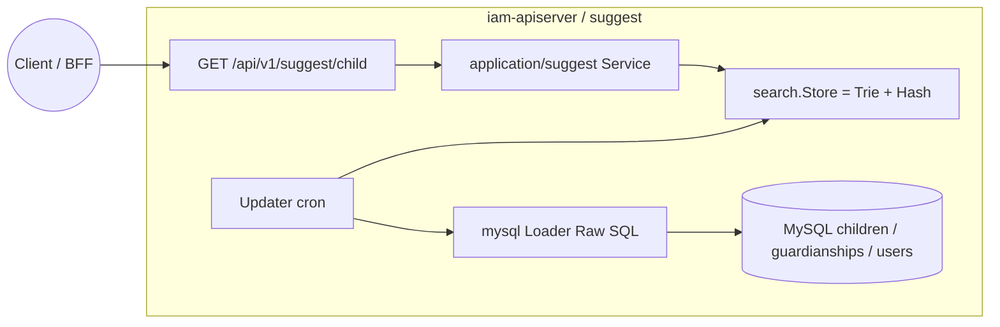
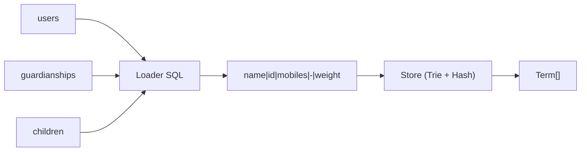
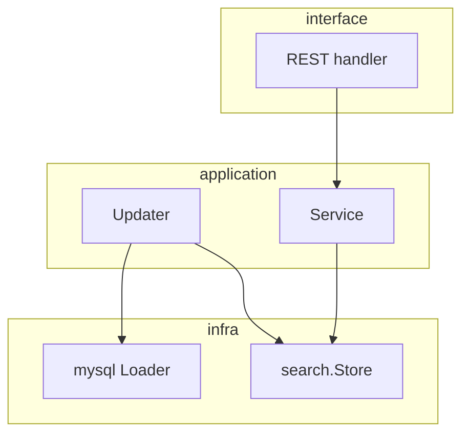
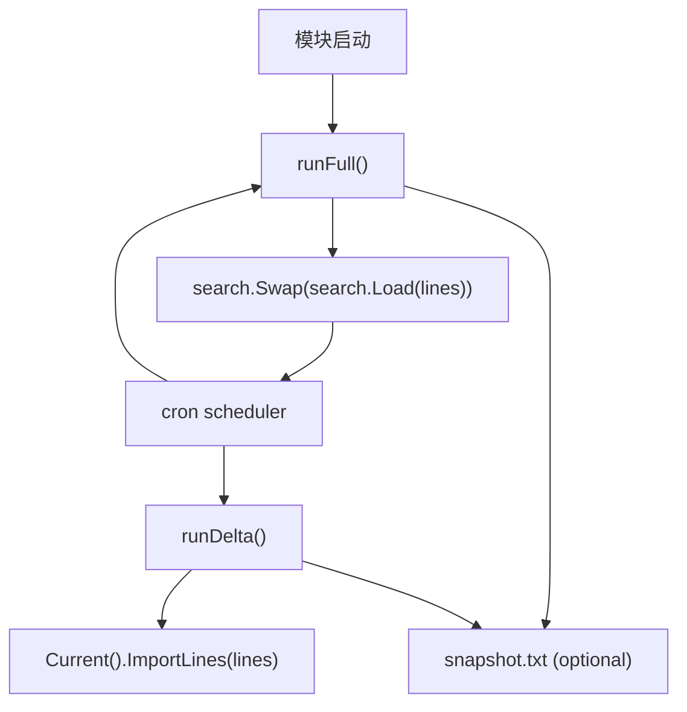

# 儿童联想搜索（Suggest）

本文回答：`suggest` 作为 `iam-contracts` 中的补充读侧能力，今天负责什么、不负责什么；它如何从用户域表中拉数、构建内存索引并通过 REST 提供联想查询；以及当前配置、刷新和真实代码落点分别是什么。

**阅读维度**：Why = 登录后快速按姓名 / 拼音 / 手机 / ID 联想儿童；What = `Loader / Updater / Store / Term`；Where = `application/suggest`、`infra/mysql/suggest`、`infra/suggest/search`、`interface/suggest`；Verify = [`api/rest/suggest.v1.yaml`](../../api/rest/suggest.v1.yaml)、`configs/apiserver*.yaml` 的 `suggest` 段、[`infra/mysql/suggest/loader.go`](../../internal/apiserver/infra/mysql/suggest/loader.go) 默认 SQL。

---

## 30 秒了解系统

- `suggest` 不是用户域的写模型，也不是独立搜索服务；它是依附于 `iam-apiserver` 的一块**内存读侧能力**。
- 当前没有独立 `suggest_*` 表，数据来自可配置 Raw SQL，默认从 `children + guardianships + users` 拉数。
- 模块内最重要的对象是：`Loader / Updater / Store / Term`。
- 查询侧的核心结构是 **Trie + Hash**：数字关键词走 Hash，非数字关键词走 Trie 前缀/通配。
- 刷新侧的核心策略是：启动先做一次全量 `Swap`，之后按 cron 做全量刷新，可选再做增量 `ImportLines`。
- 对外只有一个 REST 入口：`GET /api/v1/suggest/child?k=`；没有 gRPC。

| 主题 | 当前答案 |
| ---- | ---- |
| 数据来源 | 默认 SQL 读 `children / guardianships / users` |
| 内部索引 | `search.Store = Trie + Hash` |
| 刷新策略 | 启动全量、定时全量、可选增量、可选 snapshot |
| 对外暴露 | `GET /api/v1/suggest/child` |
| 真实契约 | [`api/rest/suggest.v1.yaml`](../../api/rest/suggest.v1.yaml) |

### 模块边界

#### 负责

- 按配置从 MySQL 拉取联想数据行
- 构建并维护进程内 `Trie + Hash` 索引
- 提供儿童联想搜索 REST 接口
- 定时刷新和可选快照落盘

#### 不负责

- 儿童、用户、监护关系的写模型与业务规则：见 [03-user-用户&儿童&Guardianship.md](./03-user-用户&儿童&Guardianship.md)
- 登录、Token、JWKS：见 [01-authn-认证&Token&JWKS.md](./01-authn-认证&Token&JWKS.md)
- 分布式一致性搜索、跨副本统一索引、专用搜索集群

#### 依赖

- 依赖 MySQL 与用户域表结构
- 依赖 `suggest.enable` 配置决定是否初始化
- REST 可选依赖中央 `AuthMiddleware`；认证模块未起时仍可能回退为空中间件

### 运行时示意图

`suggest` 只运行在 **`iam-apiserver`** 中。

**图意**：`suggest` 的核心不是业务聚合，而是“数据拉取 + 内存索引 + 查询 API”这条读侧链。

---

## 模型与服务

### 数据关系（ER：N/A）

`suggest` 当前没有自己的业务表，也没有需要单独维护的聚合关系；它更像“从用户域表中拉取结果行，再投影为内存索引”的读侧能力，所以这里不画模块内 ER。

### 数据源关系图

`suggest` 没有自己的业务表，所以这里更重要的是数据源关系，而不是模块内 ER。

**图意**：`suggest` 今天完全建立在“把业务库里的几张表映射成一批联想行，再装进内存索引”这个模型上。

### 领域模型与领域服务

模块真正对外暴露的领域对象非常轻：

| 概念 | 职责 |
| ---- | ---- |
| `Term` | 联想结果项，承载 `name / id / mobile / weight` |

锚点：[../../internal/apiserver/domain/suggest/term.go](../../internal/apiserver/domain/suggest/term.go)

当前没有额外的领域服务或聚合树。更重要的是内存索引模型：

| 组件 | 职责 |
| ---- | ---- |
| `Loader` | 从数据库拉取原始行 |
| `Updater` | 负责全量 / 增量刷新和 snapshot |
| `Store` | 当前活跃的查询索引 |
| `Trie` | 中文 / 拼音前缀与通配查询 |
| `Hash` | 数字关键词的精确匹配 |

### 应用服务设计

| 组件 | 职责一句 | 锚点 |
| ---- | -------- | ---- |
| `Service` | 读取当前活跃 `Store` 并执行 `Suggest(keyword)` | [`application/suggest/service.go`](../../internal/apiserver/application/suggest/service.go) |
| `Updater` | 启动时全量加载，之后按 cron 做全量/增量刷新，可选写快照 | [`application/suggest/updater.go`](../../internal/apiserver/application/suggest/updater.go) |
| `Loader` | 执行可配置 Raw SQL，把结果转成行格式 | [`infra/mysql/suggest/loader.go`](../../internal/apiserver/infra/mysql/suggest/loader.go) |
| `SuggestModule` | 读取配置、短路禁用态、装配 Service/Updater | [`container/assembler/suggest.go`](../../internal/apiserver/container/assembler/suggest.go) |

---

## 核心设计

### 核心数据源：`suggest` 不维护自己的业务事实

**结论**：`suggest` 今天不是一套独立业务模型，而是对用户域数据的只读投影。它不写 `children`、不写 `guardianships`，只负责把这些表的数据整理成联想行。

默认 SQL 当前主要做了这些事情：

- 从 `children` 读儿童名和 ID
- 通过 `guardianships` 连到监护人
- 从 `users` 拿手机号
- 按 child 聚合出一行

**设计边界**：

- 默认 SQL 过滤的是 `deleted_at`
- 它**没有**天然按 `guardianships.revoked_at` 统一过滤

这意味着 `suggest` 和 `user` 域在“撤销关系是否仍可见”上，当前可能并不天然一致。若产品要求一致，应该优先改 `suggest.full_sql` / `delta_sql`。

### 核心索引结构：数字查 Hash，前缀查 Trie

**结论**：当前查询模型不是“一套全文搜索”，而是按关键词类型分流。

| 关键词类型 | 当前行为 |
| ---- | ---- |
| 纯数字 | 走 `Hash.Search`，偏手机号 / ID 精确匹配 |
| 非数字 | 走 `Trie.Wildcard`，不足 `key_pad_len` 时补 `*` 后前缀匹配 |

`Store.Suggest()` 当前的稳定流程是：

1. 先判断关键词是否全数字
2. 选择 `Hash` 或 `Trie`
3. 去重
4. 按权重排序
5. 截断到 `max_results`

这意味着今天更准确的说法是：`suggest` 是“前缀联想 + 数字精确命中”的组合索引，不是通用搜索引擎。

### 核心刷新模型：启动全量、定时全量、可选增量

**结论**：`suggest` 的一致性主要依赖调度刷新，而不是事务内同步更新。

当前刷新口径：

| 路径 | 当前行为 |
| ---- | ---- |
| 启动时 | 先跑一次全量 `runFull()` |
| 全量刷新 | `search.Swap(search.Load(lines))` 整体替换当前索引 |
| 增量刷新 | `ImportLines(lines)` 合并进当前索引 |
| snapshot | `data_dir` 非空且开启 snapshot 时写 `snapshot.txt` |

**设计边界**：

- 多副本部署下，各节点各自刷新，不是分布式统一索引
- 增量刷新不是“精确变更流”，而是基于 `DeltaSQL` 的定时补丁

### 核心暴露：只有一个 REST 入口，没有 gRPC

**结论**：`suggest` 当前只是一块 HTTP 读侧能力，没有单独 gRPC 暴露面。

| 面向 | 当前能力 |
| ---- | ---- |
| REST | `GET /api/v1/suggest/child?k=` |
| gRPC | N/A |

当前装配边界也要写清：

- `suggest.enable = false` 时模块不初始化，路由不注册
- 模块已启用但认证模块未装配时，`AuthMiddleware` 仍可能回退到空中间件

所以今天更准确的说法是：**它是条件式启用、条件式受保护的单 REST 读接口**。

### 核心配置：`suggest.*` 决定的是刷新与索引行为

**结论**：真正影响 `suggest` 行为的不是业务规则，而是 `suggest.*` 这一组运行配置。

| 键 | 含义 | 默认/备注 |
| --- | --- | --- |
| `enable` | 是否启用模块 | 默认 `false` |
| `data_dir` | snapshot 目录 | 非空时且未显式设 `snapshot`，默认会开启 snapshot |
| `full_sync_cron` | 全量周期 | 默认 `@every 1h` |
| `delta_sync_cron` | 增量周期 | 为空则不做增量调度 |
| `max_results` | 单次返回上限 | 默认 `20` |
| `key_pad_len` | Trie 查询补齐长度 | 默认 `25` |
| `full_sql` / `delta_sql` | 覆盖默认 SQL | 为空则用 loader 内建 SQL |
| `snapshot` | 是否写 `snapshot.txt` | 结合 `data_dir` 决定 |

---

## 边界与注意事项

- `suggest` 是补充读侧，不应被讲成用户域的主模型。
- 默认 SQL 和用户域查询语义并不天然完全一致，尤其是 `revoked_at` 处理。
- 当前没有 gRPC，也没有独立写模型；如后续演进为更强搜索服务，应明确区分“当前架构”和“规划架构”。
- 目前没有单独的专题分析文；如果未来要深挖“读侧索引 / 刷新 / 一致性”，建议在 [../05-专题分析](../05-专题分析/README.md) 下单独补专题，而不是继续把实现细节堆回模块文。

---

## 代码锚点索引

| 关注点 | 路径 | 说明 |
| ------ | ---- | ---- |
| 模块装配 | `internal/apiserver/container/assembler/suggest.go` | `enable` 短路、Service/Updater 装配 |
| 配置读取 | `internal/apiserver/application/suggest/config.go` | `suggest.*` 默认值与读取逻辑 |
| REST 暴露 | `internal/apiserver/interface/suggest/restful/handler.go` | `GET /api/v1/suggest/child` |
| 路由注册 | `internal/apiserver/routers.go` | Suggest 路由条件注册 |
| 刷新调度 | `internal/apiserver/application/suggest/updater.go` | 全量 / 增量 / snapshot |
| SQL 数据源 | `internal/apiserver/infra/mysql/suggest/loader.go` | 默认 Full / Delta SQL 与行格式 |
| 内存索引 | `internal/apiserver/infra/suggest/search/store.go` | `Load / Swap / ImportLines / Suggest` |
| 真值契约 | `api/rest/suggest.v1.yaml` | REST 合同 |
