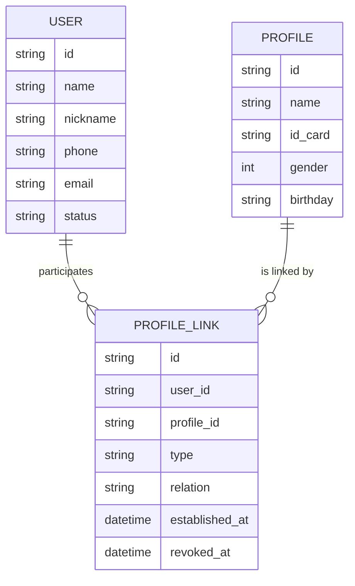
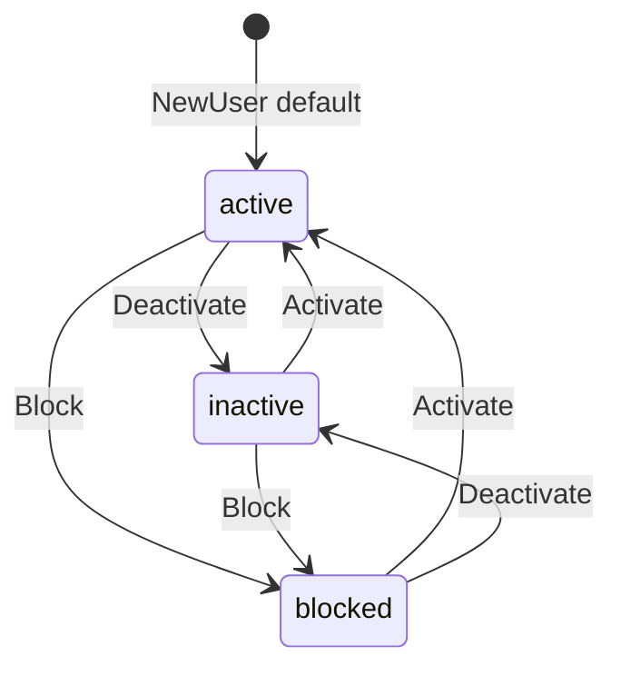
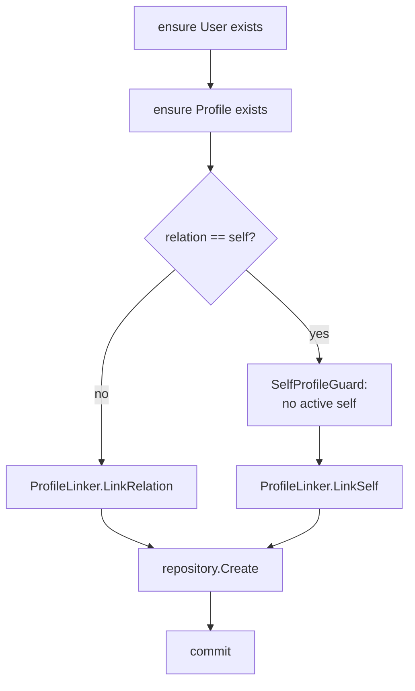

# 领域模型：User / Profile / ProfileLink

> 状态：已实现 · 已核对 domain、application、MySQL repository、migration 和测试；设计动机按“已确认决策”与“待确认决策”分开记录。

## 1. 本文回答

- 为什么一个 `User` 模型不够？
- `User`、`Profile`、`ProfileLink` 分别代表什么事实？
- 为什么 self 是一种关系，而不是 User 的固有 Profile？
- 为什么 ProfileLink 是独立实体，而不是 ID 集合或 Permission？
- `Type` 和 `Rel` 为什么同时存在？
- 三个模型当前有哪些字段、行为和不变量？
- Domain、Application 和 Database 各自保护哪些规则？
- 当前实现中哪些地方仍需要业务决策？

## 2. 30 秒结论

```text
User        = 谁在 IAM 中拥有稳定的 UserID
Profile     = 谁是业务服务对象
ProfileLink = 这个 User 与这份 Profile 是什么关系
```

这三个问题彼此关联，但不等价。因此当前模型使用两个独立实体和一个显式关系实体，而不是一个包含所有字段的大 User：



关系基数是：

```text
User 1 ---- 0..N ProfileLink
Profile 1 - 0..N ProfileLink

因此：
User <-> Profile 是多对多
User 可以没有 self Profile
Profile 也不内嵌“所有者”
```

当前最重要的不变量是：同一 User 最多一条 active self ProfileLink。它由 application 在事务中调用 `SelfProfileGuard`，并由数据库 `self_key` 唯一索引兜底。

## 3. 问题背景：为什么一个 User 不够

### 3.1 身份主体不等于业务档案

User 是 IAM 内部稳定引用的主体。Profile 是业务用来记录姓名、身份证、性别、出生日期等事实的档案。

两者合并会立刻产生几个问题：

- 用户刚注册但尚未建档时，User 必须承担一批不完整的 Profile 字段；
- 用户要管理关系人时，只能复制 User，或将关系人塞进 User 的子集合；
- 同一 Profile 被多个 User 关联时，固定 owner 字段无法表达；
- 登录资料修改会与业务档案修改混在同一生命周期中。

### 3.2 关系本身也是需要管理的事实

User 与 Profile 之间不只有“有/无”两种状态。当前系统至少需要知道：

- 是本人还是关系人；
- 如果是关系人，是 parent、grandparent 还是 other；
- 关系何时建立；
- 关系是否已撤销，何时撤销；
- 同一 User 是否已经有 active self Profile。

这些字段和规则不属于 User 或 Profile 任何一方，因此关系需要成为独立模型。

## 4. 设计目标与约束

| 设计目标 | 模型回应 |
| --- | --- |
| UserID 不被特定登录方式绑定 | User 不包含 provider/identifier/credential/session |
| 注册和建档可以分步完成 | User 不自动创建 self Profile |
| 一个用户可以管理多份档案 | User 通过多条 ProfileLink 关联 Profile |
| 一份档案可以有多个关系用户 | Profile 不内嵌单一 owner |
| 关系类型和历史可追踪 | ProfileLink 持有 Type、Rel、EstablishedAt、RevokedAt |
| 关键不变量可抵御并发 | application guard 与 DB unique constraint 共同保护 |
| 身份关系不直接等于授权 | ProfileLink 不持有 Resource、Action、PermissionGrant |

## 5. 设计决策与替代方案

### 5.1 决策 1：拆分 User 与 Profile

> 标签：设计决策 · 当前领域模型、建档用例和旧模型退役护栏可证明

#### 要解决的问题

登录主体和业务档案的属性、生命周期和关系基数不一致。

#### 当前选择

- User 作为 IAM 内部身份锚点；
- Profile 作为被业务服务的人员档案；
- 两者不通过内嵌字段直接包含，而是通过 ProfileLink 关联。

#### 未采用的方案

| 方案 | 为什么不适合当前场景 |
| --- | --- |
| 一个 `UserProfile` 包含所有字段 | 无法自然表达未建档 User、多份 Profile 和 Profile 被多 User 关联 |
| Profile 是 User 的可选扩展表 | 仍默认一对一，关系人场景需要额外例外模型 |
| 每个业务角色一个实体，如 Child/Guardian | 重复自然人事实，并为每个新关系增加平行用例和表 |
| 用 AuthN LoginIdentity 代表 User | 外部登录标识可变且可多个，不适合成为业务稳定主键 |

#### 后果

- User 和 Profile 可以分别创建、更新和被引用；
- 任何代码都不应假设 `userID == profileID` 或 User 必然有 Profile；
- User 资料和 Profile 档案中同名的“姓名”字段也不应被自动双向同步，除非新增明确用例。

### 5.2 决策 2：将 ProfileLink 建模为独立关系实体

> 标签：设计决策 · 当前模型和数据库结构可证明

#### 要解决的问题

关系不只是一个 ProfileID，它有自己的语义、标识和生命周期。

#### 当前选择

ProfileLink 持有：

```text
ID
UserID
ProfileID
Type
Relation
EstablishedAt
RevokedAt
```

它可以独立建立、查询和撤销，并成为 User/Profile 多对多关系的承载者。

#### 未采用的方案

| 方案 | 丢失的能力 |
| --- | --- |
| `User.profile_ids` | 难以表达关系类型、建立/撤销时间和反向查询 |
| `Profile.owner_user_id` | 只能表达单一所有者，不支持多对多 |
| 两个集合分别维护 | 产生双写一致性问题，仍无处存放关系属性 |
| AuthZ Assignment/PermissionGrant | 只能表达授权关系，不能作为业务身份关系的主事实 |

#### 后果

ProfileLink 的存在可以作为某些业务访问的身份事实输入，但不直接说明 Subject 能对哪个 Resource 执行哪个 Action。最终权限仍应由 AuthZ 决定。

详见 [身份、认证与授权为什么必须分开](../../06-专题设计/01-身份认证与授权边界.md)。

### 5.3 决策 3：self 是关系，不是 User 的内嵌档案

> 标签：设计决策 · 历史提交 `0d62d27d`、`SelfProfileGuard` 和测试可证明

#### 要解决的问题

User 注册时可能不具备完整建档信息，也可能首次要建立的是关系人 Profile。

#### 当前选择

- User 创建不产生 ProfileLink；
- 创建 Profile 时必须显式提供 relation；
- relation 是 `self` 时调用 `SelfProfileGuard`；
- 每个 User 允许零或一条 active self，不允许多条 active self。

#### 未采用的方案

- User 创建时自动创建空 self Profile；
- User 上保留唯一 `self_profile_id`；
- 用 `userID == profileID` 作为 self 规则。

#### 决策带来的代码规则

```text
不能从 User 的存在推导 self Profile 存在；
不能把“没有 self Profile”视为数据损坏；
不能在 User repository 中隐式生成 Profile；
self 唯一性必须在建关系时保护。
```

### 5.4 决策 4：关系使用软撤销保留历史

> 标签：设计决策 · 当前实体、repository 和 schema 可证明；重建政策仍待确认

#### 要解决的问题

关系失效不等于它从未存在。物理删除无法回答过去何时建立、何时失效。

#### 当前选择

`ProfileLink.Revoke(at)` 首次调用写入 `RevokedAt`，后续实体级重复调用保留第一次时间。active 关系由 `RevokedAt == nil` 表示。

#### 未采用的方案

- 物理删除 ProfileLink；
- 只保存 active boolean；
- 把历史全部外包给审计日志，主模型不留生命周期。

#### 当前代价

软撤销要求所有读模型都明确 active-only 语义。当前 Suggest Loader 对 `revoked_at` 的过滤不完整，说明生命周期规则需要被每个派生链路显式消费。

### 5.5 Type 与 Rel 的双层语义

> 标签：当前实现 + 待确认决策

当前映射是：

| `Rel` | `Type` |
| --- | --- |
| `self` | `self` |
| `parent` | `relation` |
| `grandparent` | `relation` |
| `other` | `relation` |

从当前代码和索引可以确认：

- `Rel` 表达较细的业务关系；
- `Type` 将关系粗分为本人和普通 relation；
- active self 唯一性依赖 `TypeSelf` 和 `RelSelf`；
- 历史组合唯一键使用 `type` 而不是 `relation`。

但当前缺少一条可核对的决策记录，来说明为什么必须持久化两个字段，而不是仅持久化 `Rel` 并在查询时派生 `Type`。因此：

```text
“当前存在双字段”是已验证事实；
“双字段是长期最优模型”尚未被证明。
```

复议时应比较：

1. 保留 Type + Rel，由构造器统一派生并检查一致性；
2. 只持久化 Rel，Type 改为计算属性；
3. Type 升格为稳定分类，Rel 改为可扩展元数据。

## 6. User 模型

### 6.1 设计职责

User 是 IAM 内部的稳定身份锚点，供 AuthN、AuthZ 和业务模块以 UserID 引用。它可以有联系资料和运营状态，但不拥有登录凭证或 Session。

代码入口：`internal/apiserver/domain/identity/user/user.go`

### 6.2 字段语义

| 字段 | 当前语义 | 规则所在 |
| --- | --- | --- |
| `ID` | IAM 内部稳定标识；创建时可由调用方指定，也可由持久化层生成 | application option + repository |
| `Name` | 必填用户名称 | domain 构造/Rename 会 TrimSpace 并拒绝空值 |
| `Nickname` | 可选展示名 | 构造 option 会 TrimSpace，`ChangeNickname` 不会 |
| `Phone` | 可选联系手机号 | application 解析；非空时执行唯一性预检查 |
| `Email` | 可选应用输入 | application 解析；当前 domain 不检查唯一性 |
| `Status` | `active`、`inactive`、`blocked` | domain 枚举与行为 |

### 6.3 构造与编辑行为

`NewUser(name, phone, opts...)` 保证：

- Name 经过 `TrimSpace` 后非空；
- Status 是合法枚举，默认 `active`；
- Nickname 如通过 `WithNickname` 设置则会 TrimSpace。

它不保证：

- Phone 必填；
- Phone 唯一；
- Email 唯一；
- 创建 self Profile。

领域行为：

| 行为 | 结果 | 当前边界 |
| --- | --- | --- |
| `Rename` | 规范化并更换 Name | 拒绝空值 |
| `ChangeNickname` | 替换 Nickname | 方法本身不 TrimSpace |
| `ChangePhone` | 替换 Phone | 唯一性必须由 application 先检查 |
| `ChangeEmail` | 替换 Email | 无唯一性规则 |
| `Activate` | 转为 active | 不检查前置状态 |
| `Deactivate` | 转为 inactive | application 同事务写入 Session 撤销任务 |
| `Block` | 转为 blocked | application 同事务写入 Session 撤销任务 |

### 6.4 状态模型



> 标签：当前实现。这张图表示领域方法允许直接切换，不代表业务已正式确认“任意状态都可直达任意状态”。

application 层的 `Block` 与 `Deactivate` 顺序是：

```text
在 Identity 事务中锁定并保存 User 状态
  -> 同事务写 identity_session_revocation_outbox
  -> 提交并返回成功
  -> 后台 Worker 最终幂等调用 AuthN SessionRevoker
```

因此 User 状态与撤销任务原子提交，但 MySQL 状态与 Redis Session 撤销不是一个原子事务。在线 Verify 会实时拒绝 blocked/inactive User，补偿延迟不会使旧 Session 恢复有效。

### 6.5 手机号唯一性

`optionalPhone("")` 返回空值，`UniquenessChecker` 跳过空手机号。非空手机号在创建或修改时执行 application 预检查。

迁移 `000017_users_active_phone_unique_guard` 为未软删除 User 的非空手机号生成 `active_phone`，并建立唯一索引。所以：

```text
业务意图：非空 Phone 唯一
友好错误：application 事务内预检查
并发兜底：数据库唯一索引
软删除后：允许手机号复用
```

> 标签：待确认决策。“Phone 为什么可选”在当前文档和历史证据中没有明确记录。

## 7. Profile 模型

### 7.1 设计职责

Profile 表示业务服务对象的基础档案。它不需要拥有登录能力，也不通过 owner 字段限定只能被一个 User 关联。

代码入口：`internal/apiserver/domain/identity/profile/profile.go`

### 7.2 字段语义

| 字段 | 当前语义 | 规则所在 |
| --- | --- | --- |
| `ID` | Profile 稳定标识 | repository 生成/保存 |
| `Name` | 档案姓名，必填 | domain 构造/Rename 只拒绝空字符串 |
| `IDCard` | 可选身份证值对象 | application 解析和查重，DB 唯一索引兜底 |
| `Gender` | `meta.Gender` | 创建用例在非零值时检查合法性 |
| `Birthday` | `meta.Birthday` | 创建用例在非空值时检查合法性 |

领域行为：

| 行为 | 结果 | 当前边界 |
| --- | --- | --- |
| `Rename` | 修改 Name | 只拒绝 `""`，不 TrimSpace |
| `UpdateIDCard` | 替换 IDCard | 唯一性由 application 负责 |
| `UpdateProfile` | 同时替换 Gender/Birthday | domain 方法本身不做合法性校验 |

### 7.3 为什么 IDCard 可以为空

> 标签：当前实现。

建档用例明确支持空 IDCard：`optionalIDCard` 在原始值为空时返回“未提供”，持久化层将空 IDCard 映射为 SQL `NULL`。

当前可确认的规则是：

- IDCard 非必填；
- 非空时必须能构造合法 `meta.IDCard`；
- 非空时在 application 做友好错误的唯一性预检查；
- `profiles.id_card` 唯一索引兜底并发冲突；
- 多个 SQL `NULL` 不会互相冲突。

> 标签：待确认决策。为什么业务允许无 IDCard 建档，当前缺少独立的业务决策记录；本文不自行推导年龄、地区或证件类型理由。

### 7.4 创建 Profile 不是单表写入

当前公开创建用例是 `MyProfiles.Create`，返回 `CreatedProfileResult{Profile, ProfileLink}`。它在同一事务中：

1. 解析和检查 Profile 字段；
2. 检查 IDCard 唯一性；
3. 确认 User 存在；
4. 解析 relation，self 时检查 active self 唯一；
5. 保存 Profile；
6. 保存 ProfileLink；
7. 统一提交。

因此“Profile 可以与 User 独立建模”不等于“当前公开用例允许创建孤立 Profile”。

## 8. ProfileLink 模型

### 8.1 设计职责

ProfileLink 是 User 与 Profile 之间的关系事实。它提供关系语义和生命周期，不提供资源 Action 授权。

代码入口：

- `internal/apiserver/domain/identity/profilelink/profile_link.go`
- `internal/apiserver/domain/identity/profilelink/types.go`
- `internal/apiserver/domain/identity/profilelink/linker.go`
- `internal/apiserver/domain/identity/profilelink/self_profile_guard.go`

### 8.2 字段语义

| 字段 | 当前语义 |
| --- | --- |
| `ID` | 关系记录的稳定标识 |
| `User` | 关系一端的 UserID |
| `Profile` | 关系另一端的 ProfileID |
| `Type` | `self` 或 `relation`，由 Rel 派生 |
| `Rel` | `self`、`parent`、`grandparent`、`other` |
| `EstablishedAt` | 由服务端 clock 确定的建立时间 |
| `RevokedAt` | `nil` 表示 active，非空表示已撤销 |

### 8.3 Relation 解析语义

`ParseRelation` 会将字符串转小写并 TrimSpace，然后识别 `self / parent / grandparent`。其他值，包括字符串 `other`、空值和未知值，都会被解析为 `RelOther`。

这产生两个当前行为：

```text
EstablishProfileLink 传入未知 relation -> 按 other 建立，不拒绝
CreateProfile 传入空 relation           -> 应用用例在 Parse 前拒绝
```

> 标签：已知风险 + 待确认决策。将未知 relation 宽容降级为 `other` 可能有兼容性价值，也可能隐藏调用方拼写错误。当前没有足够证据说明这是经过确认的长期契约。

### 8.4 建立关系

建立用例在 Identity 事务中执行：



责任分配：

| 规则 | 实现位置 | 为什么放在这里 |
| --- | --- | --- |
| User/Profile 必须存在 | application | 两者是独立聚合/repository，domain link 只持有 ID |
| relation 必须是领域枚举 | domain `validateRelation` | 属于关系实体的自身合法性 |
| 同 User/Profile 不能重复 active link | domain `ProfileLinker` 查 repository | 跨现有关系集合的业务规则 |
| 同 User 最多一条 active self | `SelfProfileGuard` + DB unique index | 需要集合查询并抵御并发 |
| 新 link 与前置检查同事务 | application UnitOfWork | 避免检查和写入分离 |

当前 schema 没有 User/Profile 外键，所以“参与者必须存在”完全依赖所有写入都经过 application 用例。如果有任意 SQL 直写或新 adapter 绕过用例，数据库不会自动阻止孤立 link。

### 8.5 active self 唯一性

active self 有两层保护：

1. `SelfProfileGuard.EnsureCanCreateSelf` 查询当前 User 的 active `TypeSelf` link，提供领域错误；
2. migration 为 active self 生成 `self_key = user_id`，并建立 `uk_active_self_profile_link(self_key)` 唯一索引，兜底并发写入。

撤销 self link 后，repository 将 `self_key` 释放为 `NULL`，因此“每个 User 最多一条 active self”不等于“历史上最多一条 self”。

但还有另一个约束：`uk_user_profile_link(user_id, profile_id, type)`。它会阻止同一 User 与同一 Profile 在撤销后再建立同 Type 关系。

### 8.6 撤销关系

实体与公开用例的幂等语义不同：

| 层次 | 重复撤销的结果 |
| --- | --- |
| `ProfileLink.Revoke(at)` | 幂等；保留首次 `RevokedAt` |
| `ProfileLinker.RevokeLink(entity)` | 对已加载实体幂等 |
| application/gRPC Revoke | 只解析 active link；已撤销或不存在返回错误 |

因此不应在 API 文档中仅根据 domain 方法宣称“撤销接口幂等成功”。

## 9. 不变量归属

模型的规则不应因为“领域驱动”而全部放进 domain。当前分配遵循三个原则：

```text
单个实体自身可判断 -> Domain entity/value
需要查询其他记录或编排多实体 -> Domain checker/guard + Application
需要抵御并发竞态 -> Database constraint
```

| 不变量 | Domain | Application | Database | 当前评价 |
| --- | --- | --- | --- | --- |
| User Name 非空、Status 合法 | 是 | 调用构造/行为 | NOT NULL/数值列 | 实体自身规则 |
| Phone 可选、非空时唯一 | `UniquenessChecker` 端口 | 创建/修改时调用 | 无唯一键 | 并发缺口 |
| Profile Name 非空 | 是 | 调用构造/行为 | NOT NULL | 空白字符串处理不一致 |
| IDCard 可选、非空时唯一 | checker 抽象 | 创建/修改时调用 | `uk_id_card` | 有 DB 兜底 |
| 建 link 前 User/Profile 存在 | 无实体引用 | 事务内显式查询 | 无外键 | 依赖写入边界不被绕过 |
| relation 是合法枚举 | `validateRelation` | 输入解析 | VARCHAR | 未知输入会先降级 other |
| 同 User/Profile 无重复 active link | `ProfileLinker` | 事务内调用 | 历史组合唯一 | DB 实际更严格 |
| 同 User 最多一条 active self | `SelfProfileGuard` | self 写链路显式调用 | `uk_active_self_profile_link` | 双层保护 |
| 撤销保留首次时间 | `ProfileLink.Revoke` | 加载、修改、保存 | `revoked_at` | entity 幂等，API 非成功幂等 |

## 10. 聚合、事务与失败边界

### 10.1 为什么不把三个对象做成一个大聚合

如果 User 作为聚合根内嵌所有 Profile 和 ProfileLink，每次更改一份档案都要加载用户的整个关系集合，同一 Profile 被多个 User 关联时还会出现聚合归属冲突。

当前选择是：

- User、Profile、ProfileLink 各有 repository；
- 实体内规则由实体保护；
- 跨实体用例由 application + UnitOfWork 保证事务一致性；
- 集合间只保存 ID 引用。

这不是“每张表一个聚合”的机械规则，而是由多对多基数、独立生命周期和事务边界共同推导出来的当前选择。

### 10.2 失败时会发生什么

| 用例 | 失败点 | 当前结果 |
| --- | --- | --- |
| Create User | Phone 解析/查重/保存失败 | 事务回滚，不会创建 Profile |
| Create Profile | Profile 或 ProfileLink 任一保存失败 | 整个 Identity 事务回滚 |
| Establish ProfileLink | 参与者不存在/重复/self 冲突 | 事务失败，不保存 link |
| Revoke ProfileLink | active link 不存在 | 返回 not found 类错误，不视为成功 |
| Block/Deactivate User | Identity 保存或任务写入失败 | 同一事务回滚 |
| Block/Deactivate User | Redis Session 撤销失败 | API 已成功；任务保留并指数退避重试 |
| Batch revoke/import | 其中一项失败 | 已成功项不回滚，返回分项结果 |

## 11. 模型边界：不要从关系事实跳到权限结论

```text
ProfileLink 回答：User 与 Profile 是什么关系？
AuthZ 回答：Subject 能对 Resource 执行什么 Action？
```

因此：

- 有 ProfileLink 不等于拥有该 Profile 相关的所有资源权限；
- 没有 ProfileLink 也不必然意味着没有任何通过机构角色获得的权限；
- REST `MyProfiles.Get/Patch` 当前用 active ProfileLink 作为局部访问前置，这是具体用例的当前策略，不能推广成通用 AuthZ 模型；
- Suggest 的 `visibility.Scope` 是查询用例解析出的可见范围，不是 ProfileLink 的别名。

## 12. 已知缺口与决策待办

| 项目 | 类型 | 当前事实 | 需要的决策 |
| --- | --- | --- | --- |
| Phone 可选 | 待确认决策 | DTO、值解析和仓储支持空值 | 明确哪些入站场景允许无手机号 |
| Phone 唯一 | 已实现不变量 | application 友好预检查 + `uk_users_active_phone` 最终兜底；空值与软删除行不占唯一值 | 保持 duplicate-key 映射和 MySQL 8 迁移测试 |
| User 状态迁移 | 待确认决策 | 合法状态迁移由 application 控制；Block/Deactivate 同事务写 Session 撤销任务 | blocked 是否允许直接 Activate |
| Profile 名称规范化 | 已知不一致 | User Name TrimSpace，Profile Name 只拒绝空字符串 | 是否统一空白字符串政策 |
| IDCard 可选 | 待确认决策 | application 允许空值 | 记录允许无证件建档的业务条件 |
| Type + Rel | 待确认决策 | 同时持久化，Type 由 Rel 派生 | 是否长期保留冗余字段，如何防止不一致 |
| 未知 Relation | 待确认决策 | `ParseRelation` 降级为 other | 选择宽容兼容还是严格拒绝 |
| 撤销后重建 | 模型/存储偏移 | domain 查 active，DB 禁止同 Type 历史重复 | 关系是一次性事实还是可多周期建立 |
| 参与者完整性 | 已知风险 | application 检查，DB 无外键 | 是否接受严格写入边界，或增加 DB FK |
| API 撤销幂等 | 待确认决策 | entity 幂等，公开用例重复撤销返错 | 契约是否要求重复调用成功 |

## 13. 常见误解

### 误解 1：每个 User 都必须有 self Profile

不对。当前模型明确允许 User 没有 self Profile；User 创建用例也不会自动建档。

### 误解 2：Profile 就是 User 的详细资料

不对。Profile 可以与多个 User 关联；User 也可以关联多个 Profile。它不是一对一扩展表。

### 误解 3：ProfileLink 就是 Profile 的所有权

不对。它记录关系事实，而且同一 Profile 可以有多个 User 关系。“关系”不能简化成单一所有者。

### 误解 4：有 ProfileLink 就可以读写所有 Profile 资源

不对。当前某些 REST 自助用例使用 active ProfileLink 作为访问前置，但通用访问决策属于 AuthZ。

### 误解 5：因为 `Revoke` 方法幂等，所以 API 重复撤销也成功

不对。application 只加载 active link，因此已撤销关系会返回错误。

### 误解 6：撤销后可以立即重建相同关系

不对。当前 DB 历史组合唯一键会阻止同一 User/Profile/Type 再建立。这一行为是否符合长期业务需求尚待确认。

## 14. 事实源与 Verify

### 14.1 事实源

| 内容 | 路径 |
| --- | --- |
| User 实体和状态 | `internal/apiserver/domain/identity/user` |
| Profile 实体和 IDCard checker | `internal/apiserver/domain/identity/profile` |
| ProfileLink 实体、Linker、SelfProfileGuard | `internal/apiserver/domain/identity/profilelink` |
| User 创建/编辑/生命周期 | `internal/apiserver/application/identity/user` |
| Profile 组合创建 | `internal/apiserver/application/identity/profile/service_my_profiles.go` |
| ProfileLink 建立/撤销 | `internal/apiserver/application/identity/profilelink` |
| 事务边界 | `internal/apiserver/application/identity/uow`、`internal/apiserver/infra/mysql/uow/identity` |
| 数据库约束 | `internal/pkg/migration/migrations/000001_init_schema.up.sql`、`000007_add_active_self_profile_link_guard.up.sql`、`000009_remove_identity_misplaced_profile_attrs.up.sql` |
| 退役模型和命名护栏 | `internal/pkg/architecture/architecture_test.go` |

### 14.2 重点测试

- `internal/apiserver/domain/identity/user/uniqueness_checker_test.go`
- `internal/apiserver/domain/identity/profile/idcard_uniqueness_checker_test.go`
- `internal/apiserver/domain/identity/profilelink/profile_link_test.go`
- `internal/apiserver/domain/identity/profilelink/linker_test.go`
- `internal/apiserver/domain/identity/profilelink/self_profile_guard_test.go`
- `internal/apiserver/application/identity/profile/service_test.go`
- `internal/apiserver/application/identity/profilelink/service_test.go`
- `internal/apiserver/infra/mysql/profilelink/repo_test.go`

### 14.3 验证命令

```bash
go test ./internal/apiserver/domain/identity/...
go test ./internal/apiserver/application/identity/...
go test ./internal/apiserver/infra/mysql/user ./internal/apiserver/infra/mysql/profile ./internal/apiserver/infra/mysql/profilelink
go test ./internal/pkg/architecture
make docs-hygiene
```

## 15. 继续阅读

- 模块定位、设计决策和能力映射：[00-模块总览](00-模块总览.md)
- 创建 User 和组合创建 Profile 的时序：[02-创建 User 与 Profile](02-关键链路-创建User与Profile.md)
- ProfileLink 建立、撤销和批处理：[03-建立与撤销 ProfileLink](03-关键链路-建立与撤销ProfileLink.md)
- ProfileLink 与 Permission 的区别：[身份、认证与授权为什么必须分开](../../06-专题设计/01-身份认证与授权边界.md)
