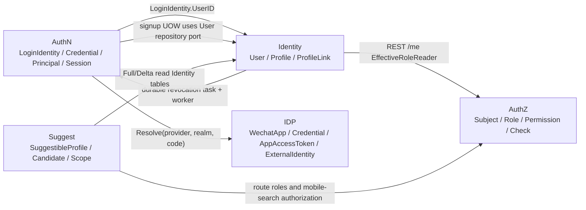

# 模块边界：Identity 与 AuthN / AuthZ / IDP / Suggest

> 状态：已实现 · 已核对跨模块事务、container 装配、REST/gRPC、IDP provider 链路、Suggest Loader/Scope 和架构护栏。

## 1. 本文回答

- Identity 在 IAM 中拥有哪些事实，不拥有哪些事实？
- Identity 与 AuthN、AuthZ、IDP、Suggest 今天通过什么方式协作？
- AuthN signup 为什么可以在自己的事务中创建 Identity User？
- 为什么 Identity Block/Deactivate 通过本地安全 Outbox 最终调用 AuthN SessionRevoker，却不直接管理 Session？
- Identity REST 读取角色名称是否意味着 Identity 拥有 AuthZ？
- IDP 是否已经产出通用 `ExternalIdentity`？
- Suggest 是事件驱动读模型，还是直接读取 Identity 数据表？
- 哪些跨模块依赖是当前有意识的取舍，哪些是已知缺口？

## 2. 30 秒结论

Identity 是 User、Profile、ProfileLink 的主事实边界，但不是完全不与其他模块交互的孤岛。当前存在四类不同的协作：

| 协作方 | Identity 与它的真实关系 | 一致性/失败语义 |
| --- | --- | --- |
| AuthN | LoginIdentity/Session 以 UserID 引用 User；AuthN signup 在自己 UOW 中使用 Identity User repository port；Identity 状态变更写本地安全 Outbox | signup 与 User 同 MySQL 事务；状态与任务同事务，Redis Session 最终幂等撤销 |
| AuthZ | Identity REST `/me` 用 `EffectiveRoleReader` 补充角色名；Profile REST 的 ProfileLink 前置是局部访问规则 | 角色读取失败时返回无 roles 的 User；不执行通用 AuthZ Check |
| IDP | IDP 管理 WechatApp/Credential/AppAccessToken，并产出请求内 `ExternalIdentity`；AuthN 只消费 Resolver | `ExternalIdentity` 不传给 Identity；AuthN 映射为 LoginIdentity ProviderKey/User 关联 |
| Suggest | Suggest infra 直接从 Identity MySQL 表 Full/Delta 派生索引，再结合 AuthZ runtime 与可见 ProfileID 生成 scope | 最终一致；默认 Loader 统一过滤 deleted/revoked Profile、ProfileLink 和 User，并用 tombstone 删除失效项 |

边界的核心不是“不许任何依赖”，而是：

```text
事实归属不混淆；
依赖方向和一致性代价可见；
跨模块协作通过窄端口、事务 port 或派生读模型完成；
一个模块不借协作之名修改另一个模块的任意事实。
```

## 3. 问题背景

### 3.1 同一个 UserID 会出现在多个上下文，但它们回答的问题不同

```text
Identity.User       -> 这个稳定主体是谁，状态如何？
AuthN.Principal     -> 本次请求通过什么证据认证了谁？
AuthZ.Subject       -> 本次授权决策的主体引用是谁？
IDP.ExternalIdentity -> 本次 provider proof 验证了哪个 realm 下的外部标识？
Suggest principal   -> 联想查询的操作者和数据范围是什么？
```

如果把它们都放进 User，User 就会被认证方式、Token、Permission、外部 provider 和搜索索引同时污染。如果又绝对禁止跨模块协作，则 signup、Block 和派生搜索等必要用例无法完成。

### 3.2 模块边界同时是一致性边界

不同协作的事务条件不同：

- User、LoginIdentity、Credential 今天位于同一 MySQL 基础，AuthN signup 可以使用一个本地事务；
- User status 在 MySQL，Session 存储不在同一事务中，Block 无法用普通 DB transaction 实现原子性；
- Suggest 索引是派生数据，可以最终一致，但不能反向写主事实；
- 角色名是 `/me` 展示增强，不应在读取失败时使 User 基础资料不可用。

## 4. 设计目标与约束

| 目标或约束 | 边界策略 |
| --- | --- |
| Identity 事实只有一个主模型 | User/Profile/ProfileLink 只在 Identity domain 定义 |
| 认证和授权可独立演进 | User 不存 LoginIdentity/Session/Permission；只共享 ID/reference |
| signup 不留半完成账号 | AuthN UOW 显式使用 User repository port 参与本地事务 |
| 封禁/停用后应尽快失效 Session | Identity application 同事务写本地任务，Worker 调用窄 `SessionRevoker` port |
| 展示信息不得倒置主从关系 | `/me` 角色读取失败时降级为无 roles |
| 身份关系不等于权限 | ProfileLink 不保存 Assignment/PermissionGrant，不自动生成 policy |
| 搜索性能不污染写模型 | Suggest 维护 `SuggestibleProfile` 派生读模型和进程内索引 |
| 现有运行时不得被理想图覆盖 | 直接 SQL、同步 port、忽略的 proto 字段均明确记录 |

## 5. 当前上下文映射



箭头只表示当前存在的依赖或数据引用，不表示被依赖方将模型所有权转交给调用方。

## 6. 核心设计决策

### 6.1 决策 A：共享稳定 ID，不共享大实体

> 标签：设计决策 · 当前模型和持久化引用可证明

#### 解决的问题

让多个上下文能引用同一个主体，又不迫使 User 同时包含认证、授权和搜索字段。

#### 选择

AuthN LoginIdentity/Session 保存 UserID；AuthZ Subject 使用 `{Type, ID}` 引用；Suggest 使用 ProfileID 和局部搜索投影。

#### 替代方案

1. 所有模块传递并共享完整 User/Profile domain entity；
2. 在各模块复制一份 User 主数据；
3. 用外部 openid、username 或 phone 作为跨模块主键。

#### 取舍

ID/reference 可以维持语义和生命周期独立，但消费方需要查询、缓存或派生自己的读模型，并处理主数据不可用或滞后。

### 6.2 决策 B：AuthN signup 作为跨模块本地事务的明确例外

> 标签：设计决策 · AuthN UOW、signup steps 和提交历史可证明

AuthN signup 需要原子创建/复用 User、LoginIdentity 和 Credential。当前它们都使用同一 MySQL 事务基础，
因此 AuthN UOW 提供 Identity `user.Repository` port，signup 直接使用 Identity domain 构造和 repository port。

#### 为什么不先调 Identity gRPC

这会把一个本地原子事务拆成两次服务调用，并引入 User 已创建、LoginIdentity 失败后的补偿状态。

#### 接受的代价

- AuthN application/UOW 依赖 Identity domain repository port；
- Identity `user.Creator` 中的 Phone checker 不会自动被 signup 复用；
- 三个模型如果未来拆到不同数据库，当前事务设计必须复议。

#### 护栏

这个例外仅支持 signup 所需的 User 解析/创建。它不授权 AuthN 任意修改 Profile、ProfileLink 或 User lifecycle。

### 6.3 决策 C：Block 先提交 Identity 状态，再通过窄端口撤销 Session

> 标签：当前设计决策 + 已知一致性缺口

Identity `StatusChanger` 依赖 AuthN domain 的 `session.Revoker` 接口，而不依赖 Session repository concrete。
`Block` 先在 Identity UOW 中保存 blocked，提交成功后再调用 `RevokeByUser`。

#### 替代方案

1. Identity 直接删除 Redis/Session 数据；
2. 把 User status 和 Session 强行放入同一个技术事务；
3. UserBlocked/UserDeactivated 本地安全 Outbox 异步撤销；
4. 每次 Session/Token 使用时实时查 User status。

#### 当前方案的好处

依赖面窄，Identity 不需要了解 AuthN 存储细节；User 状态和撤销任务在同一 MySQL 事务中提交，在线 Verify 同时实时检查 User 状态。

#### 当前方案的代价

Redis Session 撤销是最终一致的：Worker 失败时任务保留并指数退避，超过 `stale_processing_after` 的 processing 任务可重新 claim。
API 在 MySQL 状态和任务提交后返回成功；MySQL 与 Redis 之间不宣称原子提交或 exactly-once。

### 6.4 决策 D：`/identity/me` 的 roles 是可降级展示增强

> 标签：当前实现；设计动机可从降级语义推导，尚无独立 ADR

Identity REST `UserHandler` 接收 `EffectiveRoleReader`，按当前 tenant domain 和 platform domain 查询并去重有效角色名。如果 reader 为 nil、
subject 构造失败或查询报错，handler 返回无 roles 的 UserResponse，不使 `/me` 整体失败。

这说明当前 roles 是 response enrichment，不是 Identity User 事实，也不是 `/me` 请求的授权决策。

#### 风险

消费方如果将“roles 为空”理解为“用户确实无角色”，无法区分无角色与 AuthZ 查询失败。若这一区别对产品有意义，需要显式的降级状态或独立角色查询。

### 6.5 决策 E：Suggest 是 Identity 事实的派生读模型

> 标签：设计决策 · Suggest 领域/application 护栏与专题设计可证明

Identity 保持 Profile 写模型简洁；Suggest 将 Profile 姓名、手机号等派生为受约束的 `SuggestibleProfile`，并由 memory adapter 维护 TST/Hash 进程内索引。

#### 为什么不直接用 Identity repository 做模糊搜索

- 拼音、前缀、手机号精确匹配的数据形态不同于事务写模型；
- 排序、限流、脱敏和降级不应进入 Profile 实体；
- 索引可重建，可以接受最终一致。

#### 当前实现代价

Suggest 尚未通过 event/outbox 获取变化，而是在 infra Loader 中直接 SQL 读取 `profiles/profile_links/users`。这是对 Identity 存储 schema 的读依赖，
任何表结构或 revoked 语义变化都必须同步 Suggest Loader。

详见 [Suggest 为什么采用派生读模型](../../06-专题设计/05-Suggest为什么是读模型.md)。

## 7. Identity 与 AuthN

### 7.1 模型边界

| Identity | AuthN |
| --- | --- |
| User、UserStatus | LoginIdentity、Credential、Challenge |
| Profile、ProfileLink | Principal、Session、Token、JWKS |

`User` 是长期持久主体；`Principal` 是一次认证结果。User 不保存 provider、realm、identifier、AMR、Session 或 Token。

### 7.2 已实现协作

1. LoginIdentity、Session 和 Token 通过 UserID 引用 Identity User；
2. AuthN signup 在 AuthN UOW 内使用 Identity User repository port 创建、复用或修复 User；
3. AuthN signup 按 LoginIdentity provider key/global identifier 解析 User，不按 Phone 自动合并；
4. Identity Block/Deactivate 与 Session 撤销任务在同一 MySQL 事务中提交；
5. Worker 以 at-least-once 语义调用幂等 `session.Revoker.RevokeByUser`，失败指数退避重试。

### 7.3 不得越过的边界

- Identity 不应存 password、openid、sessionID、token 或 AMR；
- Identity 不应直接读写 AuthN repository concrete 或 Redis key；
- AuthN signup 使用 User repository port 是明确事务例外，不应演变为 AuthN 接管 Identity application；
- Principal 不应被持久化成 User。

## 8. Identity 与 AuthZ

### 8.1 模型边界

| Identity | AuthZ |
| --- | --- |
| User | Subject Ref |
| Profile | 业务系统管理关系所引用的 ID |
| ProfileLink | 可供业务服务构造受信对象上下文，但不是 Assignment、PermissionGrant 或 AuthorizationDecision |

User 不是 Subject 对象本身；AuthZ 可以用 UserID 构造 `subject.Ref`。ProfileLink 不是 PermissionGrant，也不会自动变成 Assignment 或角色继承边。

### 8.2 已实现协作

- Identity container 接收 `EffectiveRoleReader`；
- REST `GET/PATCH /identity/me` 查询 tenant/platform 角色名并补充响应；
- `/identity/me/profiles` 和 `/identity/profiles/:id` 用当前 User 的 active ProfileLink 做局部访问前置；
- Suggest scope provider 使用 AuthZ route runtime 获取角色和手机号搜索能力。

### 8.3 局部 ProfileLink 前置不等于通用 AuthZ

Identity REST 在访问 Profile 详情/修改时，检查当前 User 是否与 Profile 存在 active link。这条规则只回答当前自助 Profile 用例的前置，
没有 Resource/Action 输入，不能代替通用授权。

无作用域的 REST `/identity/profiles/search` 已下线。需要候选搜索时使用 `/suggest/profile`，由 Suggest 的 scope provider 和手机号权限控制可见范围与脱敏。

详见 [身份、认证与授权为什么必须分开](../../06-专题设计/01-身份认证与授权边界.md)。

## 9. Identity 与 IDP

### 9.1 当前模型

IDP 当前主要模型位于 `internal/apiserver/domain/idp/wechatapp`：

- `WechatApp`；
- IDP `Credentials`；
- `AppAccessToken`；
- `SecretVault`、`AppTokenProvider`、token cache 等 ports。

IDP 的通用值对象位于 `internal/apiserver/domain/idp/externalidentity`。它只在一次 provider exchange 请求内存在，包含 provider、realm、
受限 identifiers 和 VerifiedAt，不进入 Identity、数据库或公开协议。

Identity v2 proto 虽然也定义同名 `ExternalIdentity` message 和 User request/response 字段，但 Identity handler 当前仍忽略输入，
response mapper 返回空列表。这是另一份历史 transport 契约，不是 IDP 请求内值对象，也未因本次重构落地。

### 9.2 实际微信小程序 signup 链路

```text
AuthN signup
  -> IDP ExternalIdentity Resolver(appID, jsCode)
  -> IDP 内部查 app、解密 secret、调用 provider
  -> 返回 request-local ExternalIdentity(openid/unionid)
  -> AuthN 构造 LoginIdentity ProviderKey
  -> 解析/创建 Identity User
  -> 建立 LoginIdentity.UserID 引用
```

AuthN application 编排业务用例，但 provider 交换细节完全归 IDP Resolver。IDP 不直接创建 User、LoginIdentity、Principal、Session 或 IAM Token；
Identity 也不需要知道 app secret、provider code 或 ExternalIdentity。

### 9.3 已实现的中间抽象

IDP 已统一产出请求内 `ExternalIdentity`，覆盖微信小程序、微信开放平台和企业微信。AuthN 的单一 mapper 按 SignIn、SignUp、Linking 的既有策略转换它；
历史内部直传 OpenID/UnionID 走 `TrustedLegacyInput`，不伪装为 provider 验证结果。仍不能把 Identity v2 proto message 当成这一领域对象。

## 10. Identity 与 Suggest

### 10.1 读模型与主事实的区别

| Identity | Suggest |
| --- | --- |
| Profile 主事实 | `SuggestibleProfile` 派生读模型 |
| ProfileLink 关系事实 | `visibility.Scope` 所需的局部可见投影 |
| MySQL 事务写模型 | TST/Hash 进程内索引与 Full/Delta runtime |

Suggest 进程内索引可以从 Identity facts 重建，但不是 Profile 主表，也不能回写 Identity。

### 10.2 当前数据来源

默认 Loader 直接执行 SQL：

- 从 `profiles` 读取 ID、Name、created_by；
- 联结 `profile_links` 和 `users` 聚合 Phone；
- Full 构建新 Store 并原子切换 runtime；
- Delta 按 updated_at 读取变化，adapter 将空 Name 行转换为显式 `ProjectionChange(Delete)`。

当前没有订阅 Identity Profile/ProfileLink domain event 或 durable outbox topic。

默认 Full/Delta SQL 同时过滤 `profile_links.deleted_at IS NULL` 与 `revoked_at IS NULL`，
已撤销 link 的 User Phone 不进入 `SuggestibleProfile`。

### 10.3 当前可见范围

`queryprofile.ScopeResolverService` 结合：

- AuthZ facts reader 返回的平台 `profiles/list` 与平台/tenant `search_by_mobile` 授权事实；
- `visibility.Principal` 的 OperatorID/OrgIDs；
- `VisibilityReader` 按 `profiles.created_by` 返回的 ProfileID；
- `ResolutionPolicy` 生成最终 `visibility.Scope`。

`profiles.created_by` 可见性是当前过渡读模型，不是 Identity 领域中的所有权规则。ProfileLink 参与候选构建，但不等于最终 `visibility.Scope`。

## 11. 允许的依赖与禁止的耦合

### 11.1 允许的当前依赖

| 调用方 | 被调用方 | 方式 | 理由 |
| --- | --- | --- | --- |
| AuthN signup | Identity User | domain repository port + shared MySQL UOW | 保证 signup 原子性 |
| Identity lifecycle | AuthN Session | `session.Revoker` port | 封禁后失效会话 |
| Identity REST | AuthZ | `EffectiveRoleReader` | `/me` 响应展示增强 |
| Suggest infra | Identity storage | read-only Full/Delta SQL | 派生搜索索引 |
| Suggest scope infra | AuthZ runtime | route/role query | 生成搜索范围和 mobile capability |
| AuthN signup/linking/signin | IDP ExternalIdentity Resolver | `Resolve(provider, realm, code)` | AuthN 不理解 secret、app repository 或 provider SDK |

### 11.2 禁止的耦合

- Identity domain import AuthN/AuthZ/IDP/Suggest concrete；
- Identity domain 存储 Principal、Subject、Permission、provider token 或 search index 字段；
- Identity application 直接读写 AuthN/AuthZ/Suggest repository concrete；
- AuthN 因 signup 特例而接管 Profile/ProfileLink 任意写入；
- ProfileLink.Rel 直接生成通用 PermissionGrant/Assignment；
- Suggest 回写 Profile 主数据；
- 把 Identity v2 proto 的同名 `ExternalIdentity` 字段与 IDP 请求内值对象混为一谈；
- 把 Suggest SQL 直读描述为已实现事件订阅。

## 12. 已知缺口与复议条件

| 主题 | 当前状态 | 复议或修复触发条件 |
| --- | --- | --- |
| AuthN signup 的 Phone 规则 | 不复用 Identity checker，也不按 Phone 合并；数据库唯一索引负责最终拒绝重复活跃手机号 | 需要更友好冲突提示时，在 signup 增加同事务预检查，但不能改成隐式账号合并 |
| AuthN/Identity 数据库拆分 | 当前 signup 依赖同 MySQL 事务 | 拆库前必须设计 saga/outbox/补偿和幂等 |
| Block/Deactivate + Session | User 状态与本地撤销任务同事务提交；Worker 对 Redis 失败持久化重试，在线 Verify 同时检查状态 | 需要跨 MySQL/Redis 强原子性时另行评估，不宣称 exactly-once |
| `/me` roles 降级 | 无 roles 不区分“无角色”与“查询失败” | 客户端需要可观测降级语义时 |
| REST Profile search | 无作用域 `/identity/profiles/search` 已下线；搜索统一走受授权 Suggest | 新增搜索能力时继续复用显式 scope，不恢复旧入口 |
| IDP ExternalIdentity | 已实现为三类 provider 的请求内值对象；Identity v2 同名 proto 仍未接入 | 增加新 provider 或需要公开/持久化时重新评估契约，不直接复用历史 proto |
| Suggest 同步 | 定时 Full/Delta SQL，无 Profile event | 新鲜度或 schema 耦合成本不可接受时，引入稳定事件/outbox |
| Suggest revoked link | Full/Delta 只接受 active Profile、active ProfileLink 和 active User；最后关联失效生成 tombstone | 保持 Full/Delta 共享 eligibility 和删除传播测试 |
| ProfileLink 与 AuthZ | 彼此独立 | 业务关系继续由 Identity 判断；只有稳定对象属性才经注册后提交 AuthZ |

## 13. 事实源与 Verify

| 内容 | 路径 |
| --- | --- |
| Identity 跨模块依赖 | `internal/apiserver/container/identity/deps.go`、`module.go`、`rest.go`、`grpc.go` |
| Block/Session | `internal/apiserver/application/identity/user/service_lifecycle.go` |
| `/me` roles | `internal/apiserver/transport/rest/identity/handler/user.go` |
| AuthN signup/User | `internal/apiserver/application/authn/signup`、`internal/apiserver/application/authn/uow/uow.go`、`internal/apiserver/infra/mysql/uow/authn/uow.go` |
| IDP 微信模型 | `internal/apiserver/domain/idp/wechatapp` |
| 微信 signup 解析 | `internal/apiserver/application/authn/signup/wechat_signup.go` |
| Suggest Loader | `internal/apiserver/infra/mysql/suggest/loader.go` |
| Suggest scope | `internal/apiserver/infra/suggest/authorization/facts_reader.go`、`internal/apiserver/infra/mysql/suggest/visibility_reader.go` |
| 依赖护栏 | `internal/pkg/architecture/architecture_test.go` |

```bash
go test ./internal/apiserver/application/identity/user
go test ./internal/apiserver/application/authn/signup
go test ./internal/apiserver/application/suggest/...
go test ./internal/apiserver/infra/mysql/suggest ./internal/apiserver/infra/suggest/...
go test ./internal/apiserver/container/identity
go test ./internal/pkg/architecture
```

## 14. 继续阅读

- Identity 总体定位和宏观决策：[00-模块总览](00-模块总览.md)
- AuthN signup 与 Identity 创建链路：[02-创建 User 与 Profile](02-关键链路-创建User与Profile.md)
- ProfileLink 关系语义：[03-建立与撤销 ProfileLink](03-关键链路-建立与撤销ProfileLink.md)
- Suggest 主从取舍：[Suggest 为什么采用派生读模型](../../06-专题设计/05-Suggest为什么是读模型.md)
