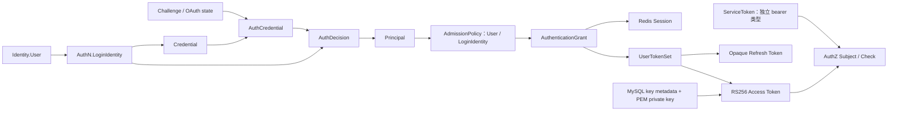
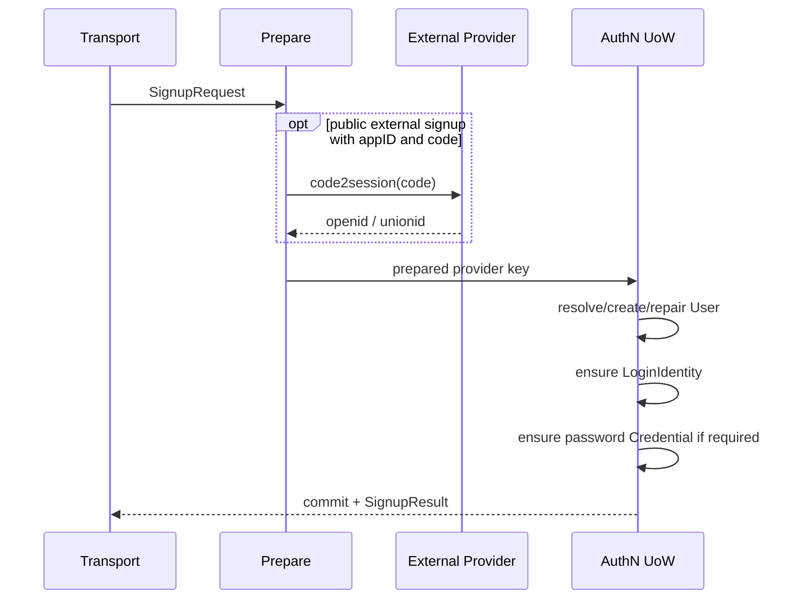

# AuthN 模块总览

> 状态：已实现 · 本文是 AuthN 的总入口，连接登录身份、证明、会话、令牌与密钥生命周期，并明确 SignUp、Linking、Login 的不同决策责任。

## 1. AuthN 的三个子域

AuthN 不回答“这个用户有什么权限”，也不保存完整用户档案。它围绕一个目标展开：建立可信的认证关系，并把一次身份确认延续为可验证、可刷新、可撤销的认证状态。

对外讲解时，主线拆成三个子域：

| 子域 | 业务问题 | 核心领域模型 | 核心领域服务 / 策略 |
| --- | --- | --- | --- |
| 建立认证关系 | 系统凭什么认识你 | `LoginIdentity`、`Credential` | `PasswordIssuer`；SignUp/Linking 负责应用编排 |
| 确认身份与准入 | 如何确认现在是你，而且当前仍允许认证 | `Challenge`、`AuthCredential`、`AuthDecision`、`Principal`、`AdmissionDecision` | `Authenticator`、`AuthStrategy`、`AdmissionPolicy` |
| 延续认证状态 | 如何让系统持续相信是你，并能续期或终止 | `AuthenticationGrant`、`Session`、`AccessToken`、`RefreshToken`、`ServiceToken` | `GrantIssuer`、`Verifier`、`Refresher`、`Revoker`、`LifetimePolicy` |

AuthN 局部对象关系见 [领域模型](01-领域模型与认证策略.md)。跨模块聚合边界使用 [V8 核心模型图](../../_images/architecture/core-domain-model-v8.png)，领域模型与服务综合讲解使用 [V7 综合图](../../_images/architecture/core-domain-model-v7.png)（[SVG 图源](../../_images/architecture/core-domain-model-v7.svg)）。整体图适合放大查阅，正文先沿三个子域阅读。

这三个子域继续展开为四个运行时检查问题：

1. 调用方提交了哪一种认证证明？
2. 这份证明是否控制某个有效 LoginIdentity？
3. 该 LoginIdentity 指向的 User 当前是否允许访问？
4. 如何把一次成功认证延续成可撤销、可刷新、可跨服务验证的登录状态？

它们在一次用户认证中的协作主线是：

```text
建立认证关系：LoginIdentity + Credential
  -> 确认身份：AuthCredential / Challenge -> AuthDecision -> Principal
  -> 认证准入：AdmissionPolicy -> AdmissionDecision
  -> 延续状态：AuthenticationGrant = Session + UserTokenSet
  -> 后续验证 / 刷新 / 撤销
```

这里每一步都缩小不确定性。注册或绑定成功不等于已经登录；OTP 正确不等于 User active；密码匹配不等于 Session 有效；JWT 签名正确也不等于业务操作已授权。

## 2. 概念关系



### 2.1 长期事实

- `LoginIdentity`：`(provider, realm, identifier)` 到 UserID 的长期映射；
- `Credential`：属于 LoginIdentity 的长期认证材料及锁定状态；
- JWKS key metadata：签名密钥的 active/grace/retired 等生命周期事实。

### 2.2 短期事实

- `Challenge`：OTP/OAuth state 的一次性交互状态；
- `Principal`：本次认证成功后的运行时结果，权威认证上下文为 `AuthenticationContext{Method, Realm, AMR, AuthenticatedAt}`；
- `Session`：一段登录期的在线状态，保存认证上下文与允许续期投影的权威事实；
- `AuthenticationGrant`：一次认证成功后形成的 `Session + UserTokenSet` 领域结果；
- AccessToken：短期可验证声明（RS256 JWT）；RefreshToken：不透明续期凭证，只保留轮换/重放与 Session 关联；
- ServiceToken：服务间凭证，不建立用户 Session，也没有 RefreshToken。

长期与短期对象不能合并。例如把 OTP 当 Credential 会错误延长一次性证明的生命周期；把 AccessToken 当 Session 会失去即时撤销和服务端状态检查。

## 3. Provider、Realm 与 Identifier

当前 LoginIdentity provider 包括：

| Provider | Realm | Identifier | GlobalIdentifier |
| --- | --- | --- | --- |
| username | tenant ID 或 `default` | username/email/phone fallback | 空 |
| phone | `global` | phone | 空 |
| wechat_minip | appID | openid | unionid（可选） |
| wechat_open | appID | openid | unionid（可选） |
| wecom | corpID | 企业微信 userid | 空 |

`realm` 不是装饰字段。openid 只在一个 appID 内稳定，用户名可能只在租户内唯一；如果去掉 realm，不同应用/租户会错误合并身份。
`GlobalIdentifier` 只在 provider 确实提供跨 realm 稳定 ID 时辅助查找，它不能被假设必有；同一 `(provider, GlobalIdentifier)` 只保存在一条 canonical
LoginIdentity 上，同一 User 的其他 realm 行不重复保存该值。

## 4. 三条写链为何分开

| 用例 | 前置事实 | 产出 | 不能偷偷做的事 |
| --- | --- | --- | --- |
| SignUp / Onboarding | 可信的新登录入口证明 | ensure User、LoginIdentity、可选 Credential | 不直接创建 Session/token |
| Linking | 已有最近认证的 Principal + 新入口证明 | 给当前 User 增加 LoginIdentity | 不信任请求体 UserID |
| Unlinking | 当前 Principal + owned LoginIdentity | 安全移除入口 | 不能留下 0 个 active 入口 |

Login 是读证明 + 写登录状态：它要求 LoginIdentity 已存在，产生 Principal、Session 和令牌；不会在“找不到身份”时隐式创建 User。

显式拆分的原因是：注册涉及主体创建和同意语义，绑定涉及当前主体授权，登录只应证明已有控制关系。把它们合并会让首次外部登录、账户合并和重试冲突难以审计。

## 5. SignUp 的事务模型

当前 SignUp 分成事务外 Prepare 与事务内 Ensure：



图中外部分支针对公开微信注册：只接受 appID + jsCode，经 IDP 解析；本地用户名路径没有该外部调用。内部历史预解析输入是受信兼容分支，不是公共 openid 直传能力，详见 [信任边界](07-模块边界-AuthN与Identity-IDP-AuthZ.md)。外部 provider 调用不进入 MySQL 事务，避免网络尾延迟占用连接和锁。本地 User、LoginIdentity、Credential 通过同一个 UoW 原子提交。

当前 ensure 语义很具体：

- 同 provider key 已属于同一 User 且 active：复用；
- 已属于其他 User：冲突失败；
- 已存在但 inactive：拒绝，不静默复活；
- 微信身份指向的 User 丢失时允许按原 ID 修复；用户名路径不允许这种 repair；
- provider 不需要密码时返回 `CredentialNotRequired`，不会创建占位 Credential。

## 6. Login 的阶段模型

```text
MethodSelector
  -> ProofFactory
  -> Domain Authenticator
  -> CredentialRecorder
  -> AuthDecision
  -> EnsureTokenContext
  -> AuthenticationGrantIssuer.IssueAuthentication
       -> GrantIssuer.Issue
            -> AdmissionPolicy.Require
            -> SessionCreator.Create
            -> TokenSetMinter.MintTokenSet
            -> RefreshTokenSaver.SaveRefreshToken
```

- MethodSelector 确认公开允许的登录方法与 payload 形状；
- ProofFactory 构造领域 credential；外部 OAuth 路径完成 code/state 交互，手机号路径只构造输入，OTP 消费在认证策略调用 verifier 时发生；
- Authenticator 根据策略验证 LoginIdentity/Credential；
- CredentialRecorder 即使失败也要记录次数并执行锁定策略；
- SignIn 只依赖窄口径的 `AuthenticationGrantIssuer`，不单独编排 Admission 或 Session；
- 领域 `GrantIssuer` 先执行 `AdmissionPolicy`，再创建 Session、由 `TokenSetMinter` 生成 TokenSet 并保存初始 RefreshToken；
- 应用层 token 门面把 `AuthenticationGrant` 映射为传输所需的 token pair，不把 Session 编排泄漏给 SignIn。

这套编排把协议差异留在应用层，把“证明是否匹配身份”放在领域策略，把 Redis/JWT/微信 SDK 留在基础设施适配器。

## 7. Session 与 Token 的统一模型

当前不是纯离线 JWT：

```text
AuthenticationContext -> Session（权威）
  -> AccessTokenProjector -> JWT Codec（RS256 + kid）
RefreshToken -> 仅轮换 / 重放 / Session 关联

signed access token
+ Redis session
+ Redis refresh token state
+ access-token revocation marker
```

Session 支持按 session/user/login identity 撤销，`LifetimePolicy` 同时约束 refresh 滑动窗口和会话绝对上限。刷新会原子消费旧 refresh token并写入新 token，
发现旧 token 已被消费时按 replay 处理并撤销 Session。续期时优先从 Session 重建 Principal；`auth_time` 保持原始认证时间，不用轮换时刻覆盖。

为什么不只用 JWT：纯 JWT 的优点是服务端无需查状态，缺点是 logout、User blocked、LoginIdentity disabled 和 refresh replay 只能等 token 过期。
当前在线验证通过撤销标记、Session 和 User/LoginIdentity 状态检查收敛；它包含多项存储读取，不是一次统一状态查询。

为什么不只用 opaque access token：完全服务端状态更易撤销，但每个资源请求都强依赖 IAM/Redis，跨服务本地验签和故障隔离变差。RS256 JWT + Session 是两者之间的折中。

## 8. 两种 Verify 语义

必须区分：

1. 下游 SDK 本地验签：获取 JWKS，校验签名、issuer、audience、exp 等；不自动查询 Session；
2. IAM 在线 `VerifyToken`：除 cryptographic verification 外，还检查 token store、Session 和主体访问状态。

因此“SDK 验签成功”只证明令牌由可信私钥签发且标准声明有效。需要即时撤销语义的高风险接口，必须增加在线检查或采用足够短的 access TTL。

## 9. JWKS 生命周期

当前关键材料分离保存：

- MySQL 保存 key metadata 和 public material；
- PEM private key 保存于 `jwks.keys_dir`；
- 启动要求恰好一个 active key，并验证私钥可解析且匹配；
- development 或显式 `auto_init` 可自动 bootstrap，其他环境缺 key 则启动失败；
- publish snapshot 只暴露可验证所需公钥，使用 cache tag/ETag；
- rotation 包括 active、grace、retired 等状态，旧 access token 验证窗口由 grace 控制。

轮换的关键不是“换一把 key”，而是保证新 token 已用新 key 签名时，下游已经能获取新公钥；旧 token 尚未过期时，旧公钥仍在 JWKS 中。

## 10. 一致性与失败窗口

| 链路 | 当前保证 | 当前窗口 |
| --- | --- | --- |
| SignUp | User/LoginIdentity/Credential 单 MySQL 事务 | 外部 proof 与本地 commit 之间有时间差 |
| IssueAuthentication / GrantIssuer | Admission 后创建 Session，再 mint/save refresh | mint 或 save refresh 失败会补偿撤销 Session；补偿失败仍可能留下孤儿 Session |
| Refresh | 原子 consume-and-rotate | 依赖 Redis 正确性和可用性 |
| Logout | 尽力撤销 refresh、access、session | 多步骤失败需由明确错误/补偿收敛 |
| User disable | Identity outbox 驱动批量 session revoke | 事件传播期间存在窗口 |
| JWKS mutation | key 元数据先提交，publish cache 后刷新 | post-commit refresh 失败时事实已变但缓存可能滞后 |

这张表说明：事务边界不是“整个认证系统全局原子”。每个跨存储/跨模块链路都需要自己的失败语义。

## 11. 安全不变量

1. LoginIdentity provider key 必须带正确 realm，且不能归属两个 User。
2. Credential 不保存明文密码；外部一次性 code/state 不升级为长期 Credential。
3. Challenge 按 scene 隔离、带 TTL，并通过条件操作原子消费。
4. 认证失败也要记录，记录失败时不能继续签发。
5. User 或 LoginIdentity 非 active 时，登录、刷新、在线验证都拒绝。
6. Token 中 User/LoginIdentity/Session 必须对齐，不能拼接来自不同上下文的标识。
7. Refresh token 必须轮换；旧 token 重放不能再次产生新 pair。
8. 私钥不得进入 JWKS、REST 响应或日志。
9. 验签成功不等于授权成功，资源访问继续交给 AuthZ。

## 12. 方案演化

### 从 provider-specific 登录到统一策略

把各 provider 直接写成独立 handler 容易复制状态检查和 token 签发。当前演化为 method selector + proof factory + domain authenticator，使协议差异、
外部 I/O 和领域认证各自归位。

### 从纯 JWT 到混合 Session

即时撤销、账户禁用和 refresh replay 要求服务端状态，因而引入 Redis Session/Token store。代价是认证在线路径依赖 Redis，需要健康检查、TTL 和多键一致性测试。

### 从静态 PEM 到托管 key lifecycle

当前已经把 key metadata、rotation、publish snapshot 建模，但私钥仍为本地 PEM。更高安全级别可演进到 KMS/HSM 签名；
届时 `JWSKeySourceAdapter` 应返回 signer 能力而不是导出私钥，启动与轮换也需重做。

## 13. 阅读路径

1. [领域模型与认证策略](01-领域模型与认证策略.md)
2. [注册、登录与身份绑定](02-注册登录与身份绑定.md)
3. [Linking 登录身份绑定](03-关键链路-Linking登录身份绑定.md)
4. [Login 登录认证](04-关键链路-Login登录认证.md)
5. [Token 签发、刷新、吊销](05-关键链路-Token签发刷新吊销.md)
6. [JWKS 与本地验签](06-关键链路-JWKS与本地验签.md)
7. [模块边界](07-模块边界-AuthN与Identity-IDP-AuthZ.md)
8. [分层架构与代码索引](08-分层架构与代码索引.md)

`03-Session-Token与JWKS.md` 是三者统一状态模型的短路径说明，适合先建立概念图，再进入 05/06 的实现细节。

## 14. 验证

```bash
go test \
  ./internal/apiserver/domain/authn/... \
  ./internal/apiserver/application/authn/... \
  ./internal/apiserver/infra/token/... \
  ./internal/apiserver/infra/cache/redis/... \
  ./internal/apiserver/container/authn/...
```
