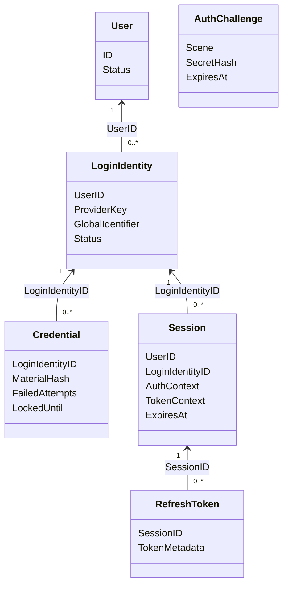
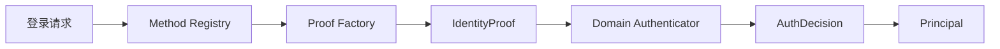

# AuthN 领域模型与身份核验策略

> 状态：已实现 · 本文解释 AuthN 保存什么、临时产生什么，以及不同认证方式为什么可以复用同一条登录主线。

## 1. 先说结论

AuthN 不是“用户模块”，而是证明控制关系并维持认证状态的模块：

```text
建立认证关系：LoginIdentity + Credential
  -> 确认身份与准入：Challenge / IdentityProof -> AuthDecision -> Principal -> AdmissionDecision
  -> 延续认证状态：登录结果 = Principal + TokenPair
       -> Verify / Refresh / Revoke
```

三段分别回答“系统凭什么认识你”“如何确认现在是你”“如何让系统持续相信是你”。`Challenge`、JWT、JWKS、Redis 等机制都应归入对应阶段解释，不能与三个子域并列成一级模块。

这条链上各对象不能互换：

| 对象 | 生命周期 | 回答的问题 | 不承担的职责 |
| --- | --- | --- | --- |
| `LoginIdentity` | 长期、持久化 | 用户用哪个 provider/identifier 登录 | 用户档案、权限 |
| `Credential` | 长期、持久化 | 如何验证对登录身份的控制 | 保存明文证明、表达登录态 |
| `Challenge` | 短期、一次性 | 本次 OTP/OAuth 交互是否可信 | 长期凭据、会话 |
| `Principal` | 单次身份核验 | 本次身份核验成功后“是谁” | 持久化用户、授权判定 |
| `Session` | 一段登录期 | 这次登录是否仍有效 | 用户状态、角色权限 |
| `登录结果` | 完整登录用例的结果 | 会话建立与令牌颁发成功后交付的 Principal 与 TokenPair | 长期持久化、资源授权 |
| `AccessToken` / `RefreshToken` | 短期凭证 | 如何携带访问声明、如何续期 | 代替服务端状态或 AuthZ |

最容易犯的错误是把 `LoginIdentity` 当成 `User`，或把 JWT 验签成功当成授权通过。当前实现都明确拒绝了这种合并。

### AuthN 局部模型：身份关联与持久状态



图中关联表达 ID 引用和逻辑基数，不表示跨 MySQL/Redis 的数据库外键，也不承诺同时存在多个可用 RefreshToken。User 属于 Identity；LoginIdentity/Credential 在 MySQL，Challenge/Session/RefreshToken 在 Redis。Challenge 独立消费和过期，不依附于用户 Session。

本图选择持久事实的关键字段，ProviderKey、MaterialHash、TokenMetadata 为语义分组，不是数据库列清单。请求级 IdentityProof、AuthDecision、Principal、AdmissionDecision 和 登录结果 不独立持久化，沿下文策略与颁发链路解释。Access/Service Token 是已颁发凭证，签名密钥有独立生命周期；完整聚合分类见 [V8 图](../../_images/architecture/core-domain-model-v8.png)，避免在局部图同时展开所有运行时对象。

## 2. LoginIdentity：可登录标识与 User 解耦

`LoginIdentity` 位于 `domain/authn/loginidentity`，核心字段包括 `UserID`、`Provider`、`Realm`、`Identifier`、`GlobalIdentifier`、
验证时间和状态。

它使用 provider key 识别一条登录入口：

```text
(provider, realm, identifier) -> LoginIdentity -> UserID
```

因此一个 User 可以绑定用户名、手机号、微信小程序、微信开放平台、企业微信等多个登录身份；一个登录身份只能归属一个 User。`GlobalIdentifier` 用于 provider 需要跨 realm 查找时的
canonical 锚点：同一 `(provider, GlobalIdentifier)` 只保存在一行，其他属于同一 User 的 realm 行将该字段留空。

为什么不直接把手机号、openid 写进 User：

- 登录方式会增长，User 表会持续增加 provider 专有字段；
- 同一用户可能同时拥有多个登录方式，单列难以表达一对多；
- 登录身份有独立的验证、禁用、解绑生命周期；
- Identity 的 User 是业务主体，AuthN 的 LoginIdentity 是认证入口，两者变化原因不同。

当前代价是每次在线验证必须同时关心 User 与 LoginIdentity 状态。代码通过 `admission.Policy` 集中这项准入检查，避免各用例自行拼接规则，
也避免使用 AuthZ 的 Subject/Access 词汇描述认证状态。

## 3. Credential：长期秘密的验证状态

`Credential` 归属于 `LoginIdentity`。密码凭据保存哈希材料，而不是明文；模型同时记录状态、失败次数、锁定时间以及是否需要重哈希所需的信息。

认证结果不是一个裸 `bool`。领域认证返回 `AuthDecision`：成功时携带 `Principal`，失败时携带失败码；密码策略还通过 `CredentialEffect` 显式声明是否应对长期凭据执行失败计数或成功记录。
应用层随后调用 `CredentialRecorder` 把该副作用映射为 `AuthenticationTransition`，由仓储原子执行，再决定是否返回认证错误。密码失败更新在 MySQL 行锁内调用领域迁移计算具体状态，再持久化结果；SQL 不再另写一份阈值判断。

这种顺序很重要：如果先返回失败，错误路径就可能跳过失败计数和锁定策略。当前 `SignIn.Execute` 的顺序是：

```text
Authenticate
  -> CredentialRecorder.Record
  -> 判断 decision.OK
```

重哈希用于渐进升级密码算法参数：用户下一次成功登录时可把旧参数产生的哈希替换为新参数，而无需一次性要求全量用户改密。密码哈希与 JWT 私钥加密的算法边界见 [密码学、
密钥与令牌](../../03-基础设施/04-密码学密钥与令牌.md)。

## 4. Challenge：一次性证明，不是简化版 Session

OTP 和 OAuth state 都需要解决重放，而不只是“比对字符串”。Challenge 具有场景、过期时间、尝试次数和消费状态；领域层负责 ID/secret hash、签发规格与校验策略，
仓储提供 `ConsumeIfSecretMatches`，在秘密哈希仍匹配时原子消费。应用层只保留发送 gate/quota、短信投递与错误码映射。

两层验证分工如下：

```text
Credential / Challenge
  -> 验证具体证明及其生命周期（哈希、OTP、OAuth state、失败计数、一次性消费）

authentication
  -> 结合证明与 LoginIdentity
  -> 形成 AuthDecision / Principal
```

`application/authn/challenge/ports.go` 定义 OTP 发送 gate/quota 与 SMS 投递端口；这些编排依赖不属于 `authentication` 领域。

手机号验证码还叠加了发送 gate 与配额：不同 scene（登录、绑定）不能互相消费。OTP 接口保留 `(bool, error)`：证明不匹配返回 false，仓储故障返回 error；登录和绑定把后者映射为内部错误，均不放行。OAuth state 也在回调验证中消费，避免一个 state 被重复提交。

可选方案及取舍：

| 方案 | 优点 | 风险/代价 | 当前选择 |
| --- | --- | --- | --- |
| 校验后普通删除 | 实现简单 | 并发请求可能同时通过 | 未采用 |
| 数据库行锁 | 事务语义直观 | 短期高频状态增加数据库压力 | 未采用 |
| Redis 条件消费/Lua | 原子、TTL 原生、吞吐高 | Redis 成为认证可用性依赖 | 已采用 |

## 5. Principal：身份核验的运行时结果

`Principal` 只包含 `UserID`、`LoginIdentityID` 和 `AuthenticationContext{Method, Realm, AMR, AuthenticatedAt}`，表达身份核验确认的主体和核验事实。会话和令牌不属于该对象；用户名身份统一使用 default Realm。

`Principal` 不是 AuthZ 的 `Subject`：前者说明本次认证是谁、怎么认证的；后者参与资源、动作、作用域的授权决策。应用层可以把 Principal 的标识转换为授权上下文，但不能据此跳过 AuthZ。

`auth_time` 进入令牌上下文后还用于敏感操作的最近认证判断。它不是“请求到达时间”，而是这次认证发生的时间。

## 6. Session：JWT 之外的在线状态

Session 记录 UserID、LoginIdentityID、AuthContext、TokenContext 和创建/过期/撤销信息，状态为 `active`、`revoked` 或 `expired`。它让系统具备以下能力：

- 用户退出后立即拒绝后续在线验证；
- 禁用一个登录身份或封禁 User 后阻断访问；
- 按 User 或 LoginIdentity 批量撤销会话；
- 对 refresh 滑动续期设置绝对会话上限。

如果只使用完全离线 JWT，上述状态只能等待 access token 过期，或依赖短 TTL。当前系统选择“签名 JWT + Redis 在线状态”的混合方案，在线路径增加撤销标记、Session 和 User/LoginIdentity 状态读取以实现即时拒绝。

## 7. Token 与 登录结果：完整表达认证结果

Token 不是应用层的序列化细节。`domain/authn/token` 中的 `AccessToken`、`RefreshToken`、`UserTokenSet`、
`AccessTokenClaims` 和 `ConsumedRefreshToken` 表达不同令牌事实；`TokenSetMinter`、`Refresher`、`Verifier`、
`Revoker` 负责其生命周期规则。JWT 编解码、KeySet/JWKS 和 Redis 只是这些领域能力的适配器。

`application/authn/signin` 负责登录应用编排：评估 Admission Decision，然后创建 Session，
再调用 InitialTokenIssuer 生成令牌并保存初始 RefreshToken，最终返回 `Result = Principal + TokenPair`。
SessionCreator 与 InitialTokenIssuer 相互独立；后者只接收 Session，创建后的失败补偿由 SignIn 负责。

## 8. 身份核验策略怎样扩展

应用层先由 `signin/method.Registry` 识别请求方法，再由 `signin/proof.Factory` 把 HTTP/gRPC 输入、OTP 或外部 OAuth 结果构造成领域 `IdentityProof`；
领域 `authentication.Authenticator` 再分派到密码、手机号、微信、企业微信等身份核验策略。



这里有两层多态，目的不同：

- method/proof 位于应用层，处理协议输入与外部交互；
- strategy 位于领域层，处理登录身份与证明是否匹配。

`authentication` 是唯一拥有真实 Strategy Registry 的包（`authenticator.go` + `strategy.go`）；被驱动端口集中在 `ports.go`（`PasswordHasher`、
`LoginPhoneOTPVerifier`），认证结果语义在 `decision.go`（`AuthDecision`、`CredentialEffect`）。`credential` 围绕聚合生命周期组织：
`password_issuer.go` 签发密码凭据，`transition.go` 表达认证状态迁移，`ports.go` 仅收窄签发所需的 `PasswordMaterialHasher`。`challenge` 按 SMS OTP、
OAuth State 类型内聚，共用 `consume.go` / `verification.go` 内核，不引入运行时 Challenge Registry。

新增登录方式时，应增加 provider key、输入选择、proof builder 和身份核验策略，而不是在一个巨型 `switch` 中同时访问短信、微信、仓储和令牌服务。

## 9. 关键不变量

1. 登录身份必须指向一个 User，但不能替代 User。
2. Credential 只能保存不可逆或受保护的验证材料，不能返回给调用方。
3. Challenge 必须有 TTL、场景隔离并只能成功消费一次。
4. 失败认证也必须进入凭据结果记录。
5. Principal 只有在证明成功后才能产生。
6. 当前公开登录必须成功创建 Session 并保存初始令牌才返回结果；两个步骤的能力独立，失败由登录应用补偿。
7. 签发用户令牌前必须确认 User 与 LoginIdentity 当前都允许访问。
8. 服务身份由 mTLS 建立；用户令牌必须绑定用户 Session。
9. Token 验签只证明令牌真实性；业务访问仍需 AuthZ。

## 10. 面试追问

### 为什么既有 User 又有 LoginIdentity？

两者分别代表业务主体和认证入口，基数、状态与变化原因都不同。拆分后才能自然支持一用户多登录方式、独立禁用、绑定/解绑和 provider 扩展。

### 为什么 Challenge 不能只是 Redis 里一个验证码字符串？

认证安全还需要场景、次数、过期、原子消费和审计语义。只存字符串无法稳定阻止并发重放，也无法区分登录与绑定。

### 为什么使用 Session 后还要 JWT？

JWT 提供自包含声明与跨服务验签，Session 提供即时撤销和主体状态联动。当前设计是在性能、分布式验证与安全收敛之间折中，而非重复建模。

## 11. 事实来源与验证

- 模型与领域服务：
  `internal/apiserver/domain/authn/{loginidentity,credential,challenge,authentication,admission,session,grant,token}`
- 登录编排：`internal/apiserver/application/authn/signin`
- Challenge：`internal/apiserver/domain/authn/challenge`（签发/校验规则）与 `internal/apiserver/application/authn/challenge`（发送编排）
- 组合根：`internal/apiserver/container/authn`
- 重点测试：`authentication/loginidentity_strategy_test.go`、`challenge/service_test.go`、`signin/sign_in_access_test.go`、
  `grant/issuer_test.go`、`token/refresher_atomic_test.go`、`session/lifetime_policy_test.go`

```bash
go test ./internal/apiserver/domain/authn/... ./internal/apiserver/application/authn/...
```


## 术语与对象性质

旧的 AuthenticationGrant / SessionEstablishmentResult 结果容器已移除。应用层 Result 组合 Principal 与 TokenPair，不是 OAuth authorization grant，也不是持久化聚合。SignIn 协调身份核验、登录准入、会话建立、令牌颁发及失败补偿；这些步骤不是全局原子事务。

`Principal` 是身份核验结果；`AuthenticationContext` 是身份核验事实快照；`TokenContext` 保存业务组织和准入后的属性。`Realm` 是身份提供方命名空间。

签发器直接从 Session 投影 `AccessTokenClaims`，再补齐令牌 ID、颁发者、受众和期限；编码器接收这一完整声明对象，不再使用另一套签发上下文。`AccessTokenClaims` 表达声明事实，不承诺经过验签，不等于完成会话准入、目标受众和资源授权检查。

`TokenMetadata` 只包含标识和期限，不包含凭证值；凭证值由具体 AccessToken、RefreshToken 承载。应用层 `IssuedTokenDTO` 是颁发结果摘要，不能当作完整声明集合。

签名密钥生命周期、私钥存储、公钥的 JWK 表示和 JWKS 发布是不同职责。公开 JWKS 是可发布公钥的 JSON 投影，不是管理私钥的聚合。Session 与刷新凭证分别持久化；刷新轮换与消费记录由原子操作保护，Session 延期是另一步。新旧签名密钥的激活切换也有跨记录约束，不能归因于单把 Key 的状态转换。

V8 核心图与当前模型保持一致；历史综合图归档保留。应用层 SignIn 负责流程协调，InitialTokenIssuer 负责初始令牌颁发。


## 字段来源与阶段边界

| 概念 | 字段来源与约束 |
| --- | --- |
| `IdentityProof` | 请求级核验输入。密码和 OTP 尚待核验；微信和企业微信身份标识已由 IDP 解析验证。不同方式的证明前提必须在构造入口明确。 |
| `WecomProof.ProviderUserID` | 企业微信的用户标识，区别于 IAM 的 `Principal.UserID`。 |
| `Principal` | 仅保存核验确认的用户、登录身份和认证上下文，不承载会话和令牌事实。 |
| `AuthDecision` | 成功身份只从 Principal 读取；RejectedLoginIdentityID 仅定位失败身份。CredentialUpdate 聚合长期凭据记录意图，Rotation 仅能随成功记录且必须有材料。 |
| `AccessToken.Subject()` | 从 UserID 派生，不再保存第二套可变主体值。AccessTokenClaims 仍同时保留 sub 和 UserID，并检查两者一致。 |
| `AccessTokenClaims.TokenType` | 缺省时补为 access；显式 refresh 或未知类型被拒绝，不会自动转换成 access。 |

IP、UA 保留在应用请求上下文，不在各类 Proof 中重复保存。企业微信 Proof 不携带无消费者的 State 字段；需要 OAuth state 的入口仍由挑战校验链路负责。


## 数字租户退役

AuthN 不提供多租户登录能力。登录请求、SDK PasswordPayload、Proof、Session、AccessToken、RefreshToken 和登录结果均不包含数字 TenantID；仅包含 TokenContext 的会话创建包装也已删除。用户名注册与查找固定使用 `default` Realm，微信 AppID、企业微信 CorpID 等外部身份命名空间保持原义。

新登录与令牌协议只提供身份、会话、业务组织、受众和时间事实。升级采用新的主版本，旧登录状态在切换时全部失效。

Redis 会话与刷新令牌不再保存授权隔离维度；OrgID、身份、期限和刷新轮换规则保持原样。

数据库切换前必须执行 `000030_authn_username_default_realm`：先检查所有 username 身份的同名冲突，再将 Realm 统一到 default，并禁止重新写入其他 username Realm。该迁移不合并用户、不删除身份，不改变身份 ID 或凭据归属。执行要求与预检 SQL 见 [MySQL 事务与迁移](../../03-基础设施/01-MySQL事务与迁移.md)。
