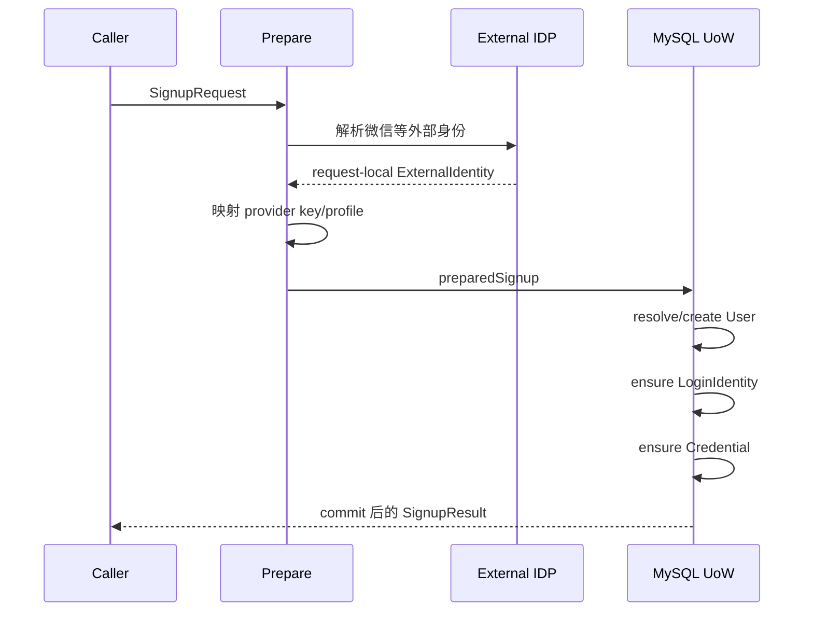

# 注册、登录与身份绑定

> 状态：已实现 · 本文以应用服务的执行顺序解释 AuthN 的写链路、事务边界、幂等语义和并发保护。

## 1. 三条链路不能合并

| 链路 | 已知条件 | 目标 |
| --- | --- | --- |
| SignUp / Onboarding | 只有外部或本地身份证明 | 找到或创建 User，并确保 LoginIdentity/Credential |
| SignIn | 已存在可认证的 LoginIdentity | 产生 Principal、Session 和令牌 |
| Linking | 已有 Principal/User | 给当前 User 增加或移除登录身份 |

把三者塞进“登录接口”的直接后果是：外部身份首次出现时偷偷建 User，绑定时无法证明操作者就是当前用户，重试时还可能创建重复身份。当前代码因此显式拆分用例。

## 2. SignUp：外部 I/O 与本地原子提交分离

`signupService.SignUp` 分为 Prepare 和 WithinTx 两段：



外部 IDP 请求被放在事务外，因为网络调用的延迟和失败不可控；把它包进 MySQL 事务会长期占有连接和锁。Prepare 只形成经过验证的输入，不落本地事实。

事务内使用 AuthN UnitOfWork 提供 `Users`、`LoginIdentities`、`Credentials` 三个仓储，顺序执行：

1. `resolveUserStep` 找到或创建 User；
2. `ensureLoginIdentityStep` 创建或复用登录身份；
3. `ensureCredentialStep` 在需要时创建或复用凭据；
4. 任一步失败，整笔本地写入回滚。

这里的“ensure”表达业务幂等，而不是简单忽略错误。重试同一已存在的 provider key 应复用兼容事实；冲突到其他 User 则必须失败，不能为了幂等篡改归属。

### 为什么不是 Saga

当前 Prepare 阶段没有需要补偿的本地提交，真正写入集中在一个 MySQL 实例的一笔事务中，Saga 会增加状态机与补偿复杂度。若未来注册必须同步写多个独立服务，才需要重新评估 outbox/Saga。

## 3. SignIn：把证明、状态和令牌分成阶段

`SignIn.Execute` 的当前顺序是：

```text
依赖完整性检查
  -> MethodRegistry.Select
  -> ProofFactory.Build
  -> Authenticator.Authenticate
  -> CredentialRecorder.Record
  -> 判断 AuthDecision
  -> EnsureTokenContext
  -> AuthenticationGrantIssuer.IssueAuthentication
       -> GrantIssuer.Issue
            -> Admission.Require
            -> SessionCreator.Create
            -> TokenSetMinter.MintTokenSet
            -> RefreshTokenSaver.SaveRefreshToken
```

每个阶段回答不同问题：

- method selection：调用方请求哪种认证方式；
- proof build：OTP/OAuth/密码输入能否形成可信的领域凭据；
- authenticate：凭据是否控制某个 LoginIdentity；
- record：成功时清理失败状态，失败时累计失败/锁定；
- issue authentication：应用层以窄口径委托领域颁发完整认证结果；
- grant issue：领域层先判断 User/LoginIdentity 准入，再建立 Session、mint UserTokenSet 并保存 RefreshToken。

### 失败为什么也要先 Record

密码猜测防护依赖连续失败记录。若 `decision.OK == false` 时立即返回，攻击路径恰好绕过锁定机制。因此当前顺序是先记录、再返回统一认证错误。

### 为什么认证成功还要 AdmissionPolicy

正确密码只证明秘密匹配，不代表被封禁 User 或已禁用 LoginIdentity 仍可进入系统。`AdmissionPolicy` 同时读取两个状态，分别映射 blocked、disabled、inactive 等结果。
它由领域 `GrantIssuer`、`Refresher` 和 `Verifier` 在登录颁发、刷新、在线验证中复用，判断是否允许建立或维持认证状态，不负责 AuthZ 资源授权。SignIn 因此不单独调用 Admission，
避免将这个不变量遗落在其他颁发入口。

## 4. OTP 和 OAuth 的前置安全

手机号登录/绑定不是收到正确数字就结束：

1. 发送前通过 gate；
2. 按手机号、scene 和时间窗口消耗配额；
3. 创建带 TTL 的 Challenge；
4. 短信发送；
5. 校验时按 scene 找到 Challenge；
6. 条件匹配并原子消费。

OAuth 登录/绑定则把 app、redirect、nonce/user context 编入短期 state 上下文。回调必须验证并消费 state，再用 code 解析外部身份。
state 的核心作用是把“发起请求”和“回调请求”绑定起来，防止登录 CSRF 与回放。

注册事务由本文维护；以下绑定与解绑是主线摘要，逐步时序、错误及并发行为统一见 [Linking 链路](03-关键链路-Linking登录身份绑定.md)。

## 5. Linking：已经登录不等于可以随意绑定

绑定的 `UserID` 与 `AuthenticatedAt` 必须来自可信认证上下文，而不是信任请求体。
新增任何登录身份都先经过 `RecentAuthenticationPolicy`，默认要求 10 分钟内的原始认证时间，并拒绝缺失、零值和超过 1 分钟未来偏差的时间；
不满足时返回 `ErrReauthenticationRequired`（HTTP 401）。刷新 token 和本次外部身份交换都不能刷新这个认证时间。
REST 从已验 claims 注入，gRPC 转发受信调用方 actor 中的 `authenticated_at`；微信扫码完成绑定也会把当前调用方的认证时间传入 Link。
检查发生在 Link 消费手机号 OTP 或交换外部 code 之前；扫码回调的 OAuth state 仍先由 Complete 用例验证消费，过期认证应重新认证并重新发起绑定。
不同输入实现自己的 `prepareLink`：手机号先消费绑定 scene 的 OTP，微信/企微先调用统一 IDP Resolver，
之后由 AuthN mapper 按用例规则生成 provider key，再进入唯一性与 ensure 流程。Resolver 返回的 `VerifiedAt` 继续写入绑定现有字段；企微绑定仍只接受 `user_id`，
不会因存在 `open_user_id` 而扩大绑定语义。

```text
Principal.UserID + AuthenticatedAt
  -> recent authentication check
  + provider-specific proof
  -> prepared provider key
  -> global uniqueness check（需要时）
  -> ensureProviderKey
```

`global_identifier` 是 provider 级跨 realm 查找锚点，同一个 `(provider, global_identifier)` 只由一条 canonical LoginIdentity 保存。
一个 User 在其他 realm/app 下仍可拥有 LoginIdentity，但这些附加行不再重复保存同一个 `global_identifier`。migration 000028 会先拒绝跨 User 冲突，
再把历史同 User 重复值确定性收敛为一条并建立普通唯一索引；并发裁决因此直接由 `auth_login_identities` 完成，不引入额外所有者表。解绑 canonical 行时，
如果同一 User 仍有同 provider 的 active LoginIdentity，Repository 会在同一事务内转移该锚点。

## 6. Unlink：最后一个入口和最近认证

解绑会先确认 LoginIdentity 属于当前 User。以下情况要求最近认证：

- 解绑当前正在使用的 LoginIdentity；
- 解绑用户名或手机号身份。

默认最近认证窗口为 10 分钟，并拒绝明显来自未来的 `AuthenticatedAt`。真正的“不能解绑最后一个活跃身份”不是先 count 再 update，
而由仓储 `UnlinkOwnedUnlessLastActive` 原子完成。

为什么必须原子：两个并发请求若都先看到 active count=2，再各自解绑一条，最终可能留下 0 个入口。MySQL 实现必须在同一临界区锁定/判断/更新，应用层只解释 outcome。

### 仍需理解的边界

最近认证依赖认证上下文中的 `auth_time`。它减少会话被短暂劫持后的敏感操作风险，但不是万能二次认证：高风险系统可以要求针对目标操作的新 Challenge，或采用 WebAuthn/硬件密钥。

## 7. 失败语义

| 失败点 | 当前结果 | 原因 |
| --- | --- | --- |
| 外部身份解析失败 | 不开启/不提交本地事务 | 没有可信 provider key |
| SignUp 事务任一步失败 | User/LoginIdentity/Credential 一起回滚 | 保持本地原子性 |
| 凭据记录失败 | 登录失败，不签发令牌 | 不允许绕过锁定/审计状态 |
| User/LoginIdentity 非活跃 | 登录、刷新、在线验证拒绝 | 认证证明不能覆盖主体状态 |
| Challenge 仓储异常 | 验证失败关闭 | 不能把基础设施错误当验证成功 |
| 并发解绑最后身份 | 一个或多个请求收到明确拒绝 | 仓储原子不变量 |

## 8. 备选设计

### 登录时自动注册

调用方便，但把“认证已有主体”和“创建业务主体”混为一谈，审计、同意条款、资料初始化和冲突处理都变得隐式。当前选择显式 SignUp。

### 每种 provider 独立一套登录服务

短期直观，但状态检查、失败记录、Token 签发会复制多份。当前以应用层 proof builder 吸收差异，以领域 Authenticator 复用认证语义。

### 先查询、后普通解绑

无法守住并发不变量。当前选择仓储级原子操作，即使这让仓储接口更贴近业务语义。

## 9. 面试追问

### 为什么外部 API 调用不应放数据库事务里？

事务持锁时间会被网络尾延迟放大，还会把第三方故障传播为连接池耗尽。应先获取可验证输入，再用短本地事务提交；但要确认外部结果在提交前仍满足安全时效。

### 幂等和唯一约束有什么区别？

幂等定义重复业务请求的期望结果；唯一约束是在并发下守住数据不变量。只有应用层“先查再建”不能替代数据库唯一约束。

### 为什么解绑最后一个身份必须下沉仓储？

因为它需要与读取 active set 和更新状态处于同一数据库临界区。一个通用 CRUD 仓储很难表达这个业务原子性，显式业务方法更诚实。

## 10. 事实来源与验证

- SignUp：`internal/apiserver/application/authn/signup`
- SignIn：`internal/apiserver/application/authn/signin`
- Linking：`internal/apiserver/application/authn/linking`
- Challenge：`internal/apiserver/application/authn/challenge`
- AuthN UoW：`internal/apiserver/application/authn/uow` 与对应 MySQL 实现
- 重点测试：`signup/services_test.go`、`signin/sign_in_access_test.go`、`linking/service_test.go`、`challenge/service_test.go`

```bash
go test \
  ./internal/apiserver/application/authn/signup \
  ./internal/apiserver/application/authn/signin \
  ./internal/apiserver/application/authn/linking \
  ./internal/apiserver/application/authn/challenge
```
