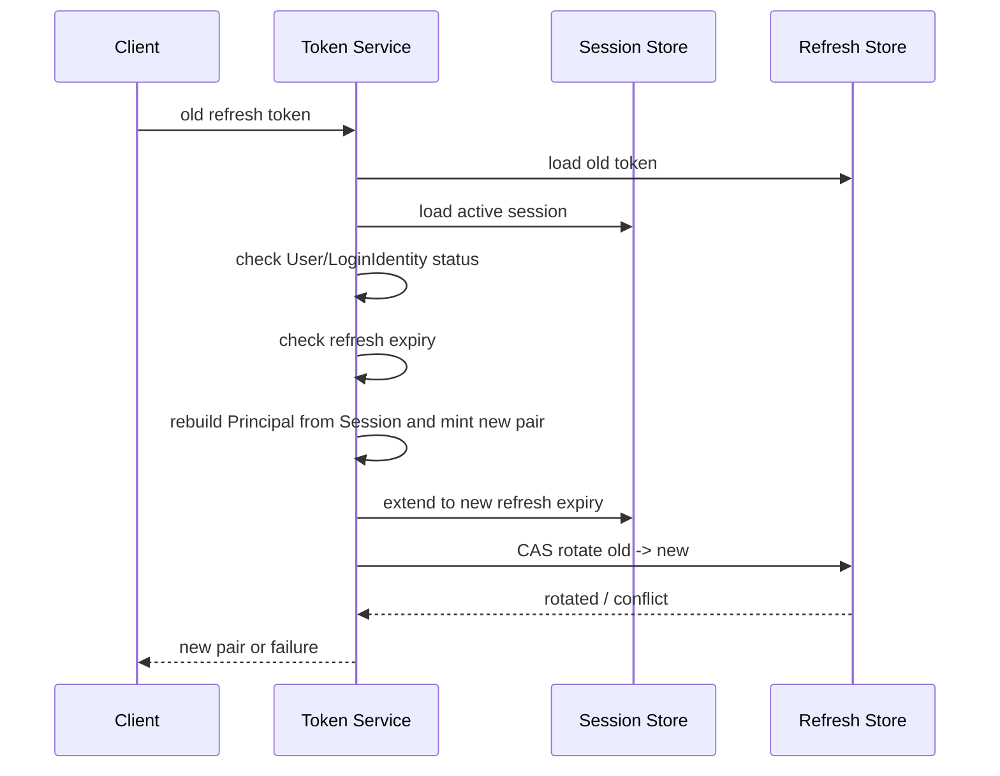

# Session、Token 与 JWKS

> 状态：已实现 · 本文解释令牌签发、刷新、撤销和两种验签语义，并标出当前实现的失败窗口。

## 1. 当前方案不是“纯 JWT”

用户访问采用混合状态模型：

```text
RS256 Access Token
  + Redis Session
  + Redis bearer-token revocation marker
  + Redis Refresh Token
  + MySQL/JWKS key lifecycle
```

JWT 负责可验证声明，Redis 负责在线撤销和续期状态，MySQL 负责签名密钥生命周期的持久事实。Service Token 是独立的短期 bearer token：不创建用户 Session，也没有 Refresh Token，但仍受在线 token-ID 撤销检查约束。

### JOSE/JWT 概念边界

| 概念 | 当前代码中的含义与归属 |
| --- | --- |
| JWT Claims Set | `infra/token/jwt.jwtPayloadClaims`，只表示 Payload 的 wire model；不是完整令牌 |
| JWS | `JWSCompactTokenCodec` 使用 RS256 对 Claims Set 签名，输出 `Header.Payload.Signature` 三段式紧凑序列化 |
| Signed JWT | 当前 Access/Service bearer token 的实际 wire form：以 JWS 保护的 JWT；不是另一个独立领域实体 |
| JWE | 当前未实现；JWT Payload 仅 Base64URL 编码、可被读取，不提供机密性 |
| Signing Key | `domain/authn/signingkey.Key`，表达非敏感身份、算法、状态、有效期和签名/验签资格 |
| JWK | `infra/token/keyset.PublicJWK`，一把公钥的 JOSE 线格式；不是 Signing Key 领域实体本身 |
| JWKS | `infra/token/keyset.JWKS` 及 `application/authn/jwks`，发布多把可验签公钥的集合与缓存契约 |

因此代码中的 `BearerTokenCodec` 是领域端口，`JWSCompactTokenCodec` 是具体 wire adapter；`VerifiedTokenClaims` 是完成验签、标准时间和 issuer 校验后的领域事实，不能反向当作 JWT Header、原始 Payload 或 Signature。

详细执行顺序、错误分支和补偿由 [Token 生命周期链路](05-关键链路-Token签发刷新吊销.md) 维护；本文负责对象、上下文权威、寿命、兼容门禁和验证语义。

## 2. 登录签发

`grant.Issuer.Issue` 的实际步骤是：

1. 通过 `AdmissionPolicy` 确认 User 与 LoginIdentity 允许建立认证状态；
2. 用 Principal 创建 Session；
3. 由 `TokenSetMinter` 在 Session 上 mint `UserTokenSet`；
4. 把 RefreshToken 保存到 Redis；
5. 返回 `AuthenticationGrant = Session + UserTokenSet`。

Access token 由当前 active RS256 key 签名，payload 是类型化投影（含 `user_id`/`login_identity_id`/`sid`/`tenant_id`/`amr`/`auth_time` 等）。
JWT 可读但不保证机密；敏感字段默认不进入 access JWT。Refresh token 是不透明随机值，服务端只保存轮换/重放检测与 Session 关联；
认证上下文与允许续期的投影以 Session 为权威来源。

这里有四个不同对象，不能都叫“JWT Claims”：infra 的 `jwtPayloadClaims` 只负责 Payload 序列化；domain 的
`VerifiedTokenClaims` 表达验签后的可信事实；gRPC/REST Claims 是传输 DTO；SDK `TokenClaims` 是公开兼容投影。
JWT Header 中的 `kid/alg/typ` 不进入领域 Claims，Signature 也不是 Claims。

### 当前失败窗口

Session 创建成功后，若 mint 返回错误或不完整的 TokenSet，或 `SaveRefreshToken` 失败，GrantIssuer 会以
`authentication_grant_failed` 为原因撤销该 Session，并返回原始签发错误。撤销使用独立的 5 秒超时，客户端取消请求不会取消补偿。
即使 RefreshToken 保存结果不确定，Session 撤销成功后它也不能继续在线认证或刷新。

这仍是跨步骤补偿，不是单次原子提交。补偿也失败时，返回错误保留签发与撤销两阶段原因，并记录失败日志；此时孤儿会话仍可能存在，
需要依靠 TTL 或运维处理。Session 创建本身返回错误时，也不能把跨存储结果宣称为全局回滚。

## 3. Session 生命周期与滑动续期

`LifetimePolicy` 同时限制：

- `refreshTTL`：每次 refresh 后令牌的滑动窗口；
- `sessionMaxTTL`：从 Session 创建开始计算的绝对上限。

当前 `Session.ExpiresAt` 表示可滑动有效期，绝对上限单独由 `CreatedAt + sessionMaxTTL` 计算。
新 refresh 的到期时间取 `now + refreshTTL` 与绝对上限中的较早者。这样活跃用户可以续期，但不能无限延长一条已长期存在的登录会话。

缺少创建时间或未配置正数绝对上限时，保守沿用现有过期时间，不为历史会话推断新的生命周期。

Session 在 Redis 中除主记录外，还维护按 User 和 LoginIdentity 的索引，以支持“退出全部设备”、禁用身份和封禁用户后的批量撤销。多键更新使用 WATCH 重试，失败必须显式返回，不能假装部分索引已经一致。

新 Session 只保存强类型 `AuthContext` 与 `TokenContext`：前者持有 Method/Realm/AMR/AuthenticatedAt，后者只持有
TenantDomain、OrgID 和准入后的 Attributes。Redis `schema_version=2` 不再写 `AuthMethod/Realm/AMR/SessionClaims`
副本；读取历史 v1 JSON 时由 Redis adapter 映射为新模型，手机号和 provider 标识不会进入新的 TokenContext。

## 4. Refresh Token Rotation

刷新流程当前按以下顺序执行：



`RotateRefreshToken(oldValue, expectedOldID, newToken)` 由 Redis Lua 原子完成：只有旧值仍存在且 ID 与预期相符时，才写入新值并删除旧值。
两个并发 refresh 只有一个能成功，另一个得到“旧 token 已消费”的冲突，而不是同时获得两组有效 refresh token。

续期投影优先从 Session 重建；仅当历史 Session 缺少认证上下文时，才回退读取旧 RefreshToken 上的 `AuthMethod/Realm/AMR/SessionClaims`，并计数
`iam_legacy_refresh_context_fallback_total`（不记录 claims 值）。新签发的 RefreshToken 不再写入这些重复字段。

历史 access token 缺少顶层 `token_type` 或 `auth_time` 时，验证器会在兼容窗口内分别回退为 access 类型、
从 `attributes.auth_time` 恢复认证时间，并计数 `iam_jwt_missing_token_type_total` 与
`iam_jwt_legacy_attribute_auth_time_fallback_total`。

### 兼容分支退役门禁

历史 Refresh/JWT fallback 不能按发布日期或主观判断删除。领域策略 `LegacyFallbackRetirementPolicy` 定义：

```text
required_zero_window = max(access_token_ttl, refresh_token_ttl, session_max_ttl)
retirement_start = max(全实例升级完成时间, 三项 fallback 指标最后一次增长时间)
允许删除 = now - retirement_start >= required_zero_window
```

执行时必须同时满足：

1. 所有 IAM 实例都已运行不再产生旧格式的新版本；滚动发布未结束时不开始计时；
2. `iam_legacy_refresh_context_fallback_total`、`iam_jwt_missing_token_type_total`、
   `iam_jwt_legacy_attribute_auth_time_fallback_total` 三项 counter 在整个窗口内均无增长；
3. TTL 取观察期内所有实例实际配置过的最大值；任何指标再次增长或 TTL 上调，都要按新的较晚时间重新计时；
4. 达到门禁后，在同一发布批次删除 fallback、对应指标和历史字段读取测试；未达到时只允许继续观测。

按当前默认配置，窗口是 `max(15m, 7d, 24h) = 7d`。这里的“归零”指 `increase(counter[window]) == 0`，不是要求
进程生命周期累计 counter 的绝对值回到 0。

### 当前顺序的残余风险

Session 是先延长，refresh token 后轮换。如果轮换最终冲突或 Redis 报错，请求不会拿到新令牌，但 Session TTL 可能已经被延长。这不直接产生可使用的新凭证，
却意味着失败请求也可能改变 Session 生存时间。

更严格的设计可把 Session 延长和 refresh 轮换放进同一 Lua 脚本，或先轮换再以幂等方式延长；前者要求两类键和校验逻辑共享一个原子脚本，后者则要处理“令牌已轮换但 Session 延长失败”的更危险窗口。
当前顺序优先避免“轮换已成功但延期失败”的窗口，接受失败时 TTL 可能延长；并发 revoke 仍可使会话失效，不能承诺响应返回时会话一直 active。轮换通信错误也可能意味着写入已完成但响应不确定，旧 token 不保证仍可使用。

## 5. 撤销语义

撤销有三层：

- Access/Service bearer token：按 token ID 写入带 TTL 的 revocation marker；
- Refresh token：撤销关联 Session，再删除 refresh token；
- Session：按 session、User 或 LoginIdentity 撤销。

撤销 Access Token 时还会撤销其用户 Session；撤销 Service Token 只写 bearer-token marker，不触碰用户 Session。IAM 在线验证会检查两类 marker；仅依赖 JWKS 的 SDK 本地验签无法感知服务端撤销。

Identity 的 deactivate/block 会在同一 MySQL 事务中写 session-revocation outbox，后台 worker 最终撤销 Redis Session；
同时在线 Token 验证还会读取当前 User/LoginIdentity 状态，关闭事件消费延迟窗口。详见
[Identity 与 AuthN 的边界](../01-Identity/04-模块边界-Identity与AuthN-AuthZ-Suggest.md) 与
[事件和 Transactional Outbox](../../03-基础设施/03-事件与Transactional-Outbox.md)。

管理员 Session 撤销入口需要用户 JWT，并检查 `iam:authn:collection:sessions` 的明确 Action：

| 请求 | Action |
| --- | --- |
| `POST /api/v2/admin/sessions/{sessionId}/revoke` | `revoke` |
| `POST /api/v2/admin/login-identities/{loginIdentityId}/sessions/revoke` | `revoke_by_login_identity` |
| `POST /api/v2/admin/users/{userId}/sessions/revoke` | `revoke_by_user` |

三条路由都先检查当前 Tenant，再检查平台域；不按管理员角色名称旁路。它们是管理操作，不改变退出、refresh 撤销与 Identity 状态事件的既有链路。

## 6. 三层验证语义

### Codec（JWT infra）

始终校验：`header.alg == JWK.alg == RS256`、configured canonical issuer、签名、`exp/nbf/iat`，并只解析已登记 `token_type`。
在线 key source 只接受 active/grace 且满足 `not_before <= now < not_after` 的密钥；retired、尚未生效和已过期密钥均不能验签。

### Application verification policy

在 codec 结果上约束 accepted token type 与 expected audience（集合至少一个交集）。未显式指定 token type 时安全默认只接受 `access`；
service-only 路径必须显式接受 `service`，不再以空列表表示通用 introspection。

### Domain verifier

在密码学验证后，access/service token 都先检查 bearer-token revocation marker。之后 access token 继续检查 active Session 与 Admission；service token 跳过用户 Session/Admission。

SDK `LocalVerifyStrategy` 只覆盖 codec + 本地 policy（RS256、必填 issuer/audience、clock skew）。它无法仅凭 JWKS 知道：

- token 是否刚刚被主动撤销；
- Session 是否退出或过期；
- User 是否刚刚被封禁；
- LoginIdentity 是否刚刚被禁用。

因此本地验签适合低延迟、可接受 access-token 剩余寿命窗口的服务；需要即时撤销语义时，应使用 IAM 远程验证或在网关集中执行在线检查。缓存与 fallback 不能被描述为等价安全语义。

## 7. JWKS 与密钥轮换

服务端 Token Profile 固定为 `RS256 + kid + JWS Compact`：创建/激活/轮换与 REST 参数只接受 RS256；签发要求 active key 的 `header.alg == JWK.alg == RS256`。
当前文件适配器把未加密 PKCS#8/PKCS#1 PEM 私钥写入受权限保护的目录（目录 `0700`、文件 `0600`），并不提供应用层 AES-GCM 包装；生产环境应使用加密磁盘或后续 KMS/HSM 适配器。JWKS 只发布 active/grace key 的公钥信息（含 `alg`）。密钥经历 active、grace、retired 状态，
使旧 access token 在轮换后的有限窗口内仍可验证。

轮换必须协调“新 key 可签名”和“验证方已能看到新公钥”。当前实现以 MySQL keyset 状态、原子 activation、内存发布快照和周期调度器完成生命周期；
完整实现见 [密码学、密钥与令牌](../../03-基础设施/04-密码学密钥与令牌.md)。

## 8. 备选设计

| 设计 | 优点 | 代价 | 适用判断 |
| --- | --- | --- | --- |
| 纯离线短 JWT | 服务无状态、低延迟 | 不能即时撤销 | 可接受短撤销窗口 |
| opaque token + introspection | 状态统一、即时撤销 | IAM 成为每请求热路径 | 强控制、规模可承受 |
| 当前混合方案 | 大多数服务可本地验签，关键路径可在线检查 | 两套语义、Redis 依赖、运维复杂 | 当前选择 |
| consumed marker + Session revoke（当前） | 可识别已消费旧 token 的重放并撤销对应 Session | 合法重复提交也会触发强制重新登录 | 当前安全契约 |
| refresh token family/reuse detection | 可追踪整条 token family 并执行家族级处置 | 需要 family 状态与事件处理 | 更高风险场景可增强 |

当前 rotation 防止同一 refresh token 并发成功两次，并在成功轮换时原子写入不含令牌明文的 consumed marker。已消费旧 token 再次出现时会撤销对应 Session；
任意未签发 token 不会触发撤销。当前仍没有完整 token-family 图谱，也不会跨 Session 批量处置其他家族。

## 9. 面试追问

### JWT 被签名后为什么还要查 Redis？

签名只能证明内容由可信签发者产生且未被篡改，不能表达签发后的退出、封禁、身份禁用。Redis 在线状态用于收敛这段时间差。

### Refresh rotation 如何防并发重放？

不能用 Get/Set/Delete 三步；两个请求会同时读到旧值。当前通过“旧值和旧 ID 仍匹配才写新值并删旧值”的 Lua CAS，使消费成为原子操作。

### JWKS 为什么需要 grace key？

轮换前签发的 token 仍由旧私钥签名。如果立刻移除旧公钥，消费者更新 JWKS 后会拒绝相关未过期 token，而保留旧缓存的消费者可能继续接受。grace 窗口应至少覆盖允许验证的旧 token 寿命和缓存传播时间。

## 10. 事实来源与验证

- 认证结果与初始颁发：`internal/apiserver/domain/authn/grant`
- Token 模型、mint、刷新、验证与撤销：`internal/apiserver/domain/authn/token`
- Token 应用 DTO 与门面：`internal/apiserver/application/authn/token`
- Session 领域：`internal/apiserver/domain/authn/session`
- Redis 存储：`internal/apiserver/infra/cache/redis`
- 签名密钥领域规则：`internal/apiserver/domain/authn/signingkey`
- 签名密钥管理应用：`internal/apiserver/application/authn/signingkey`
- JWKS 公钥发布应用：`internal/apiserver/application/authn/jwks`
- SDK：`pkg/sdk/auth/jwks`、`pkg/sdk/auth/verifier`
- 重点测试：`token/refresher_atomic_test.go`、`token/principal_session_test.go`、`session/lifetime_policy_test.go`、
  `pkg/sdk/auth/jwks/jwks_test.go`

```bash
go test \
  ./internal/apiserver/domain/authn/grant \
  ./internal/apiserver/domain/authn/token \
  ./internal/apiserver/application/authn/token \
  ./internal/apiserver/domain/authn/session \
	./internal/apiserver/domain/authn/signingkey \
	./internal/apiserver/application/authn/signingkey \
  ./internal/apiserver/application/authn/jwks \
  ./pkg/sdk/auth/jwks ./pkg/sdk/auth/verifier
```
