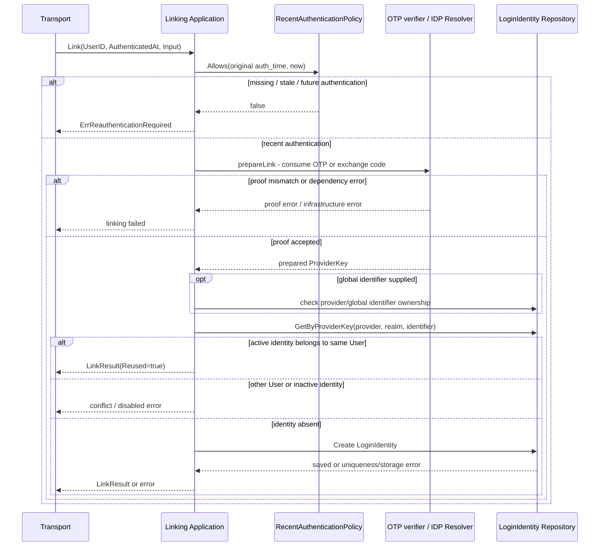
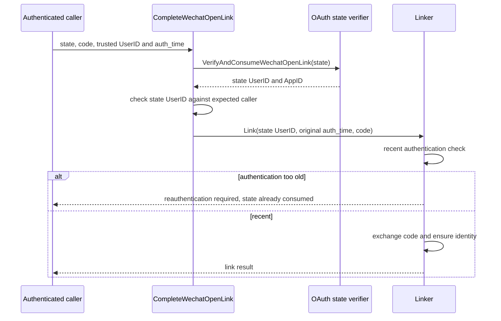
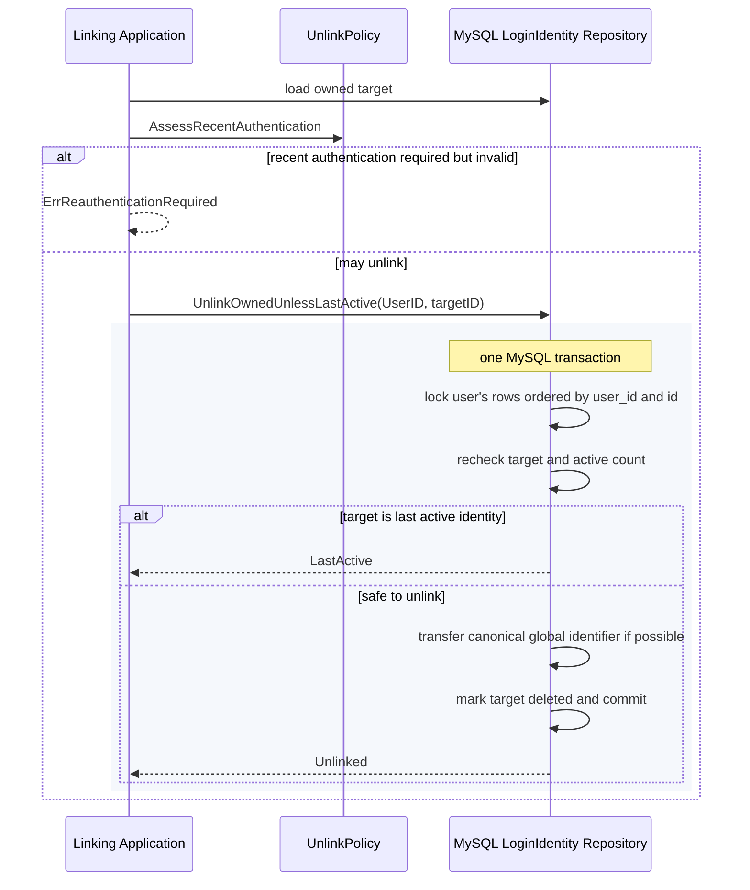

# 关键链路：Linking 登录身份绑定

> 状态：已实现 · 本文负责绑定、解绑的执行顺序、最近认证、唯一性、错误与会话影响；扩展场景单独标记，不作为当前能力。

## 1. 结论与阅读范围

Linking 给已有 User 增加或移除登录入口。新增绑定必须同时满足两份证明：**当前 User 最近完成过认证，以及请求者控制待绑定入口**。前者来自可信 `auth_time`，后者来自 OTP 或 provider code；两者不能互相替代。

当前 Link 只写 LoginIdentity，不创建 User、Session、Token 或 password Credential。注册事务见 [注册、登录与身份绑定](02-注册登录与身份绑定.md)，跨模块职责见 [模块边界](07-模块边界-AuthN与Identity-IDP-AuthZ.md)。本文是 Linking 行为的 canonical 说明。

| 当前入口 | 新入口证明 | provider key | 产出 |
| --- | --- | --- | --- |
| 手机号 | 绑定 scene 的 SMS OTP | phone / global / phone | LoginIdentity |
| 微信小程序 | IDP Resolver 交换 code | wechat_minip / appID / openid | LoginIdentity |
| 微信开放平台 | IDP Resolver 交换 code；扫码回调另检查 state | wechat_open / appID / openid | LoginIdentity |
| 企业微信 | IDP Resolver 交换 code | wecom / corpID / user_id | LoginIdentity |

微信 unionid 是可选的 `GlobalIdentifier`，不替代 realm 内的 openid。企微绑定只接受 `user_id`，不会回退为 `open_user_id`。

## 2. 输入、结果与可信上下文

应用命令为 `LinkRequest{UserID, AuthenticatedAt, Input}`；Input 是上述四种变体。`LinkResult` 返回 Identity 与 Reused，表示新建或复用。公开 DTO 由 transport 映射，字段契约见 `api/rest/authn.v2.yaml` 与 `api/grpc/iam/authn/v2/authn.proto`。

- REST 从已验 access token claims 注入 UserID 和原始认证时间；gRPC 转发受信 actor 上下文，不把普通绑定 payload 的时间当作可信事实。
- 最近认证默认窗口为 10 分钟，允许最多 1 分钟未来时钟偏差；缺失、零值、超窗或明显未来时间均拒绝。
- 刷新令牌的时间、新 OTP 校验时间、外部 code 交换时间都不能覆盖当前主体原始 `auth_time`。
- 响应不交付密码材料、provider token，也不因为绑定成功附带 IAM token pair。

这项检查证明认证新鲜度，不等同于一次独立 MFA，也不替代管理操作所需的 AuthZ 授权。当前没有通用的管理员代用户绑定或独立再认证 API。

## 3. 新增绑定的实际顺序



认证新鲜度在 `prepareLink` 之前检查，避免拒绝当前主体时已经消耗新入口证明。OTP verifier 保留 `(bool, error)`：错误验证码与存储故障都拒绝，但后者返回内部错误，不伪装成用户输错验证码。

IDP 只返回请求级 ExternalIdentity；AuthN mapper 决定 provider key、归属与 VerifiedAt。外部解析和 OTP 消费都不处于 MySQL 事务中，本地保存失败不能回滚已经消费的证明。

### 扫码回调的额外 state 边界



Complete 用例先消费 state，再进入 Link；因此“最近认证检查先于证明消费”仅指 Link 内的 OTP/code 阶段，不适用于外层 OAuth state。若此时认证过旧，调用方需要重新认证并重新发起扫码绑定，不能复用旧 state。state 绑定发起时的 User/App 上下文，防止把其他用户的回调用于当前绑定。

## 4. 绑定幂等、唯一性与失败

| 条件 | 当前结果 |
| --- | --- |
| 同 provider key、同 User、active | 复用，`Reused=true` |
| provider key 已属于其他 User | `ErrLoginIdentityExists` |
| provider key 属于同 User 但非 active | `ErrLoginIdentityDisabled`，不静默复活 |
| global identifier 已归属其他 User | `ErrGlobalIdentifierExists` |
| UserID 缺失或 Input 为空 | 参数错误 |
| 原始认证时间无效 | `ErrReauthenticationRequired`，HTTP 401 |
| OTP 不匹配 / IDP 证明失败 | 拒绝，沿证明错误契约返回 |
| OTP 仓储故障 | 内部错误，不放行 |
| LoginIdentity 查询或保存失败 | 返回错误，不伪造绑定成功 |

复用判断发生在证明消费之后。业务结果幂等不代表可以重放已经使用过的 OTP/code，也不保证两个同时创建的请求都返回成功；数据库唯一约束裁决并发创建。

长期身份的唯一键是 `(provider, realm, identifier)`。跨 realm 的 `(provider, global_identifier)` 只由一条 canonical 行持有；同 User 的其他 realm 行不重复保存。migration 000028 先拒绝跨 User 冲突，再收敛同 User 重复锚点并建立唯一索引。解绑 canonical 行时，仓储可在同一事务内把锚点转移给同 User、同 provider 的其他 active 身份。

## 5. 解绑：最近认证与最后一个入口

解绑命令包括 UserID、目标 LoginIdentityID、当前 LoginIdentityID 和可信 AuthenticatedAt。先检查目标归属，再应用以下规则：

| 目标 | 最近认证要求 |
| --- | --- |
| 当前会话使用的 LoginIdentity | 必须 |
| username 或 phone 身份 | 必须 |
| 其他非当前外部身份 | 不额外要求最近认证，仍检查归属与最后入口 |

最近认证与 Link 共用领域策略；无需在数据库持锁期间调用外部认证服务。



两个请求同时解绑仅剩的两个活跃身份时，在同一用户行锁范围内串行判断；第一个提交后，第二个会看到只剩一个 active 并被拒绝。只在应用层先 count 再 update 无法维持这条不变量。

不存在或不属于当前 User 的目标返回 `ErrLoginIdentityNotFound`；最后一个 active 返回参数错误。非 active 目标不会再次触发最后入口限制，重复解绑沿仓储 outcome 返回，不把已删除身份恢复为 active。此用例不删除 User、Profile、ProfileLink 或授权事实，也不联动禁用 Credential。

## 6. 解绑对已有会话的影响

当前解绑不主动调用 SessionRevoker，但会把 LoginIdentity 标记为 deleted。必须分清记录存在和认证有效：

| 后续路径 | 目标身份解绑后的行为 |
| --- | --- |
| 该身份建立的 Session 记录 | 可能仍在 Redis，未因 Unlink 被主动撤销 |
| 该身份令牌的 IAM 在线 Verify | Admission 读取非 active 身份并拒绝 |
| 该身份 Session 的 Refresh | Admission 拒绝，不发新令牌 |
| 同 User 其他活跃身份建立的 Session | 不因本次解绑直接失效 |
| 下游纯 JWKS 本地验签 | 不感知解绑；仍受令牌和本地验签策略有效期约束 |

这不是“解绑后仍可保持当前在线登录态”的承诺。在线状态与离线验证的完整差异见 [Session、Token 与 JWKS](03-Session-Token与JWKS.md)。

## 7. 一个贯穿案例

用户通过用户名密码登录，得到原始认证时间 t0。在 t0 后 8 分钟绑定手机号：Link 先确认认证足够新，再消费绑定 OTP 并创建 phone LoginIdentity。

到 t0 后 12 分钟，即使刚刷新了 access token，继续新增绑定也需要重新认证，因为 refresh 保留 t0。若此时解绑当前 username 身份，同样需要最近认证。重新认证后，若仍有另一个 active 入口，可以解绑；以被解绑身份建立的旧会话随后无法通过在线 Verify/Refresh，而通过其他活跃身份建立的会话不被本次操作直接撤销。

## 8. 设计取舍与扩展范围

| 方案 | 当前选择或扩展条件 |
| --- | --- |
| 只提交 identifier 就绑定 | 不采用；不能证明控制权 |
| 登录时自动绑定或开通 | 不采用；SignUp、SignIn、Linking 分属不同决策 |
| 物理删除身份 | 当前用 deleted 状态保留身份事实；不等于已有完整安全审计平台 |
| 解绑时主动撤销该身份全部 Session | 可增强；当前由在线 Admission 阻断，Unlink 不主动批量撤销 |
| 邮箱绑定、用户名密码绑定、改密、管理员邀请 | 当前 Link 未实现；增加时需定义证明、权限、Credential 事务和错误契约 |
| 高风险操作专用 Challenge / WebAuthn | 可增强；当前最近认证时间检查不等同于操作级 MFA |

若未来绑定需要同时创建 Credential，应把两类本地写入纳入同一事务；若引入异步安全审计，应明确 outbox、重试和隐私字段。当前 Link 没有这些写入，不能把建议画进已实现时序图。外部 I/O 始终应避免占用长数据库事务。

## 9. 责任与验证索引

以下路径相对仓库根目录；符号对应本文具体规则。

| 规则 | 代码责任 | 回归证据 |
| --- | --- | --- |
| Link 最近认证先于 prepare | [linker.go](../../../internal/apiserver/application/authn/linking/linker.go) 的 link；[recent_authentication_policy.go](../../../internal/apiserver/domain/authn/loginidentity/recent_authentication_policy.go) | `linking/service_test.go` 的 TestLinkRequiresRecentAuthenticationBeforeConsumingProof |
| provider key 复用/冲突 | [link_ensure.go](../../../internal/apiserver/application/authn/linking/link_ensure.go) 的 ensureProviderKey | `linking/service_test.go` |
| state 消费与当前用户归属 | [complete_wechat_open_link.go](../../../internal/apiserver/application/authn/linking/complete_wechat_open_link.go) | `linking/wechat_open_link_oauth_test.go` |
| 敏感解绑规则 | [unlink_policy.go](../../../internal/apiserver/domain/authn/loginidentity/unlink_policy.go)；[unlink_identity.go](../../../internal/apiserver/application/authn/linking/unlink_identity.go) | `linking/service_test.go` |
| 最后 active 与 canonical 转移 | [repo.go](../../../internal/apiserver/infra/mysql/loginidentity/repo.go) 的 UnlinkOwnedUnlessLastActive | `repo_unlink_concurrent_test.go`、`repo_global_identifier_test.go` |
| 解绑后的在线拒绝 | [policy.go](../../../internal/apiserver/domain/authn/admission/policy.go)；[verifier.go](../../../internal/apiserver/domain/authn/token/verifier.go)、`refresher.go` | admission/token tests |

表中 application/domain 路径前缀均为 `internal/apiserver/`。完整分层与 transport 入口见 [代码索引](08-分层架构与代码索引.md)。

```bash
make docs-hygiene docs-facts
go test ./internal/apiserver/application/authn/linking \
  ./internal/apiserver/domain/authn/loginidentity \
  ./internal/apiserver/domain/authn/admission \
  ./internal/apiserver/infra/mysql/loginidentity
```

MySQL 行锁语义需要真实 MySQL 集成测试证据；SQLite fallback 的通过不能替代它。修改公开契约还需运行对应 REST/gRPC 契约检查；文档修订本身不需要重新生成协议代码。
