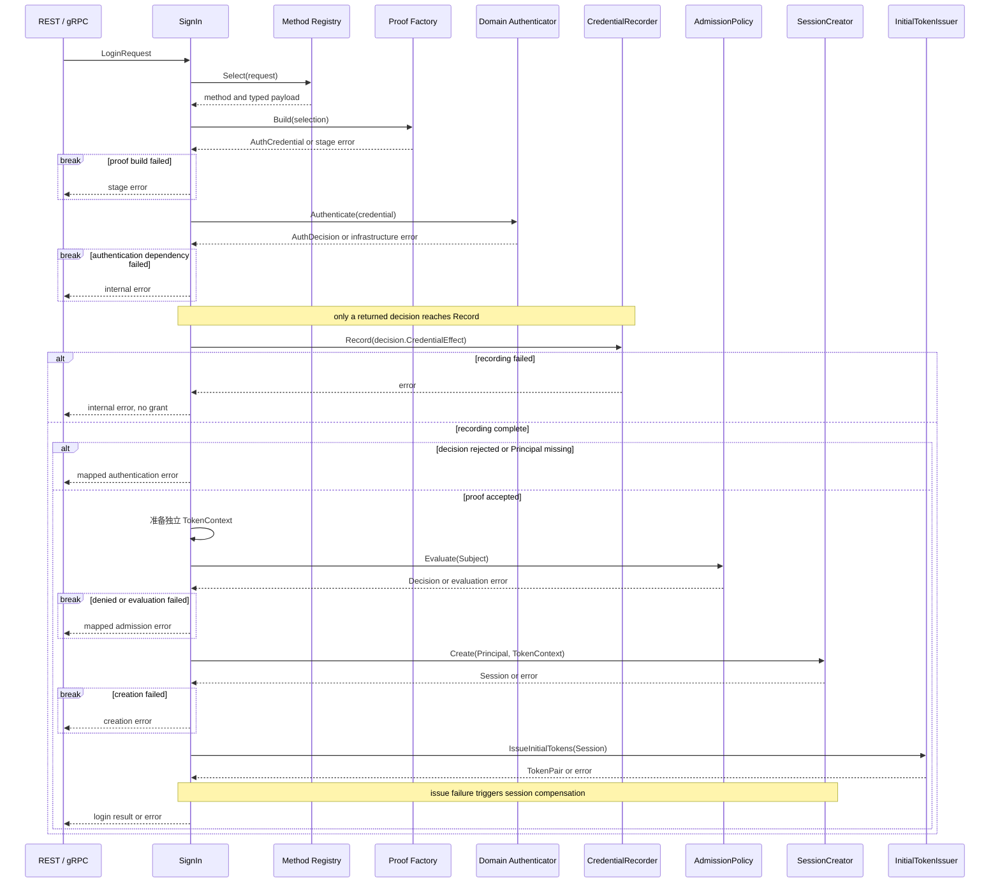
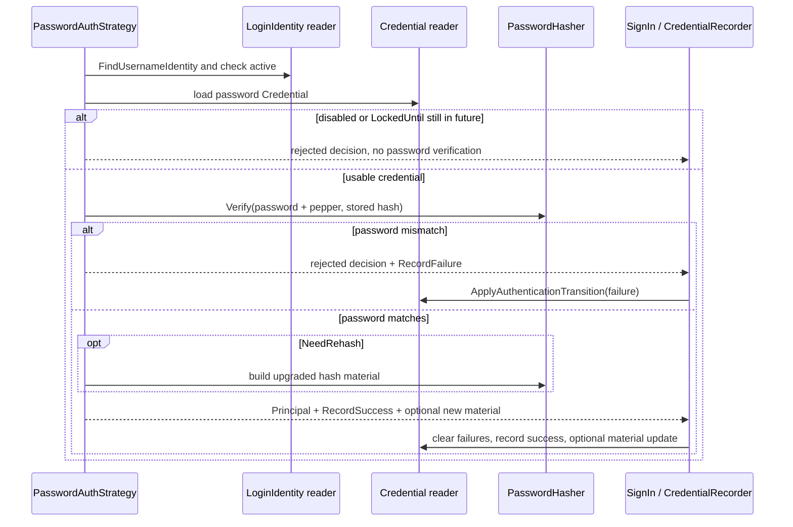
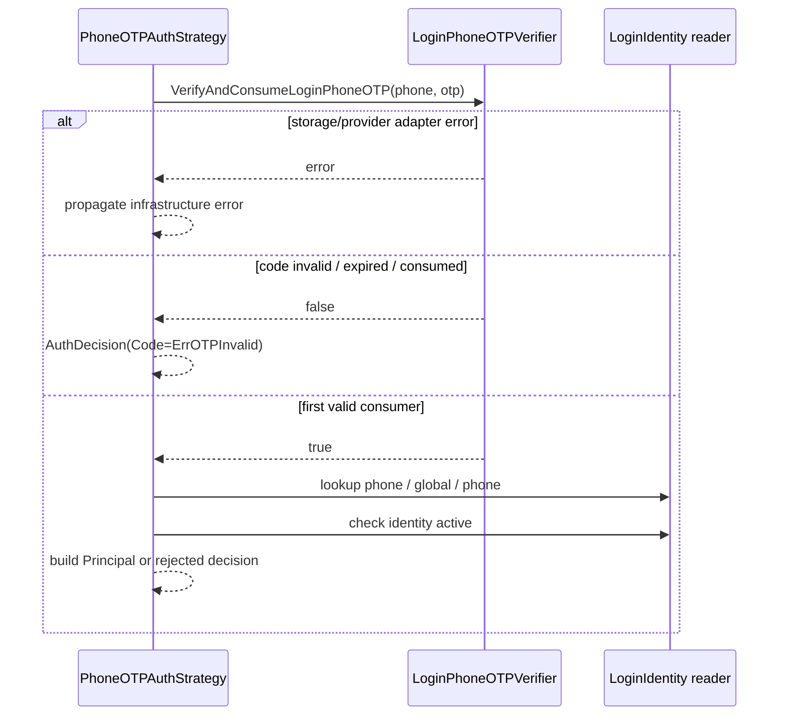

# 关键链路：Login 登录认证

> 状态：已实现 · 本文负责 SignIn 的阶段顺序、身份核验策略、凭据记录与错误契约；完整颁发和续期由 Token 链路文档负责。

## 1. 结论：先证明身份，再准入和颁发

一次公开登录由 SignIn 编排：依次执行身份核验、登录准入、会话建立和令牌颁发。Authenticator 输出 AuthDecision/Principal，CredentialRecorder 保存核验产生的凭据副作用，再由 AdmissionPolicy、SessionCreator、InitialTokenIssuer 完成后续环节。记录失败时立即终止。

因此 Principal 可以先于 User 准入结果产生；它表示证明成功，不能单独代表已经获得有效在线登录态。SignIn 失败不返回 token pair。首次开通走 SignUp，已有用户追加入口走 Linking，资源访问授权继续由 AuthZ 负责。

概念定义见 [领域模型](01-领域模型与认证策略.md)，本页集中说明真实执行责任，避免为每个 provider 复制整套 Session/Token 流程。

## 2. 公开请求的责任链

REST/gRPC 经 `application/authn/session` 门面进入 `SignIn.Execute`。Transport 负责协议映射；方法选择、证明构造、身份核验决策、凭据记录分别由以下能力负责。



图中 Build 或 Authenticate 返回 error 时立即结束，不继续 Record/Grant。Record 处理的是已返回的领域决策；无长期凭据副作用的决策不增加密码失败次数。

| 阶段 | 当前责任 | 不能推导出的保证 |
| --- | --- | --- |
| Method Registry | 选择公开允许的方法并校验 payload 形状 | 方法被识别不代表证明已验证 |
| Proof Factory | 构造 AuthCredential；外部登录时解析 code/state | 手机号 builder 不消费 OTP |
| Authenticator / Strategy | 检查证明和 LoginIdentity，生成决策 | 不读取完整 User 写模型，不承担资源授权 |
| CredentialRecorder | 将 CredentialEffect 映射为仓储状态迁移 | 存储失败不能继续颁发 |
| SignIn | Admission、Session、mint、保存初始 RefreshToken | 跨步骤补偿不等于全局事务 |

SignIn 在应用层分别调用 AdmissionPolicy、SessionCreator 和 InitialTokenIssuer，并负责新会话的失败补偿；续期和登出仍分别由 Refresher、Revoker 处理。

## 3. 三类证明在哪里验证

| 路径 | 应用 proof 阶段 | 领域策略阶段 |
| --- | --- | --- |
| 用户名密码 | 构造 PasswordCredential | 查 LoginIdentity 和 Credential，检查状态/锁定，再验证哈希 |
| 手机 OTP | 构造 PhoneOTPCredential，保留手机号和 OTP 输入 | 调用 OTP 端口消费证明，再查手机号 LoginIdentity |
| 微信/企微等外部证明 | IDP Resolver 交换 code；扫码路径验证消费 OAuth state | 用已解析的外部标识定位 LoginIdentity，检查状态并生成 Principal |

外部 provider 的 openid/unionid/userid 不等于 IAM UserID，IDP AppToken 不等于 IAM AccessToken。认证输入、长期 Credential、短期 Challenge 和运行时 Principal 的生命周期不能合并。

### 3.1 密码：状态检查早于哈希验证



当前生产默认连续失败 5 次后锁定 15 分钟，开发默认关闭。锁定是 **Credential.LockedUntil** 的规则，LoginIdentity 状态只有 active、disabled、archived、deleted，没有 locked 状态。

密码不匹配才声明 `CredentialEffectRecordFailure`；身份不存在、凭据缺失或已经锁定等拒绝结果不应被笼统理解为必定增加计数。仓储在 MySQL 行锁内读取 Credential，调用领域 `ApplyAuthenticationTransition` 计算失败次数/锁定时间，再写具体值，避免 SQL 再实现一份阈值逻辑。首次进入锁定时记录不含证明材料的安全日志。

成功记录用一次更新清零失败次数、写成功时间，并持久化可选新材料。锁定到期后成功登录会清理旧失败状态。NeedRehash 用于渐进升级：生成升级哈希失败时保留已有成功证明；但成功记录的持久化失败会阻止登录颁发。

### 3.2 手机 OTP：消费先于身份查找



因此 OTP 正确但身份未绑定时，证明已经消费，仍不能登录，也不会自动注册。Challenge 的场景、TTL、secret version 和最大尝试次数保证由 domain challenge 与 Redis adapter 共同实现。

当前同一 SMS Challenge 默认最多允许 5 次错误验证。尝试记录绑定当前 SecretHash；旧 verifier 不得删除或消耗后来覆盖的新 Challenge。成功由条件消费裁决，只有首个正确消费者通过；耗尽时 Challenge 和尝试记录原子删除。Login 与 phone-link scene 隔离。

发送 gate/quota 和短信投递属于 Challenge 应用用例，不在登录 proof builder 中。它们不等于 IP/device 全局限流；外围流量防护仍需部署侧治理。

### 3.3 外部证明：解析成功仍需既有绑定

微信小程序、开放平台、企微等路径在应用 proof 阶段调用统一 IDP Resolver。AuthN mapper 将请求级 ExternalIdentity 转为策略输入，再根据 provider/realm/identifier 查找既有 LoginIdentity。缺少绑定时拒绝，不隐式创建 User 或绑定当前请求。

扫码登录还先校验消费 OAuth state，把发起请求与回调上下文关联；外部解析在数据库事务之外。具体 provider 差异及公共输入的信任边界见 [AuthN 与 IDP](07-模块边界-AuthN与Identity-IDP-AuthZ.md)。不能以 provider 不可用为由回退信任客户端提交的 openid。

## 4. Principal、认证时间与 Admission

Principal 是运行时结果，持有 UserID、LoginIdentityID、TenantID 和 `AuthenticationContext{Method, Realm, AMR, AuthenticatedAt}`。不包含 SessionID 或 TokenContext。独立签发上下文由登录应用准备并交给 Session 保存。它不携带 User/Profile 写模型、密码材料、provider token 或完整权限事实。

`auth_time` 表示原始认证发生时刻，不是请求到达时间或 token 刷新时间。Session 保存后续续期的权威上下文，访问令牌使用类型化投影，不任意透传 Principal.Claims。新 JWT 不写 auth_method/realm；JOSE 字段、公开 claims 和历史兼容见 [Session、Token 与 JWKS](03-Session-Token与JWKS.md)。

AdmissionPolicy 在 SignIn 创建 Session 前读取：

1. LoginIdentity 存在、归属于声明 User 且 active；
2. Identity 的 UserStatusReader 返回 User active。

missing、blocked、inactive、disabled、归属不符以及状态查询错误都会阻止颁发。Refresher 和在线用户 Token Verifier 复用该规则。这些检查不是跨 MySQL/Redis 的全局锁，不能声称与并发禁用线性一致；后续在线复查和 Identity 的撤销 outbox 分别承担即时请求判断与最终状态收敛。

## 5. 对外错误与可观测性

| 条件 | 当前处理 |
| --- | --- |
| 方法或 payload 不合法 | 方法选择/证明构造错误，停止后续阶段 |
| 用户名未找到、密码不匹配 | `ErrInvalidCredentials`；错误密码可附带失败记录副作用 |
| Credential 已锁定 | `ErrCredentialLocked`，HTTP 423；不继续哈希验证 |
| OTP 无效 | `ErrOTPInvalid` |
| 证明正确但没有绑定 | 拒绝，不自动 Onboarding |
| Authenticator/OTP 依赖故障 | 包装为内部错误，不伪装成证明成功 |
| CredentialRecorder 保存失败 | 内部错误，不进入准入与会话创建 |
| User/LoginIdentity Admission 拒绝 | 保留对应认证错误，不创建 Session |
| 颁发中途失败 | 不交付 token pair；按 SignIn 补偿规则处理 |

应用通过 `authfailure.Error(decision.Code)` 和阶段包装保留已登记错误码，当前不是“所有失败统一一个错误”。防枚举需要同时考虑响应、耗时和限流；不能仅凭使用统一登录入口就声称完全实现防枚举。

日志只应记录必要 actor、请求关联和结果，不记录密码、OTP、完整 token、provider secret 或私钥。已有锁定日志、OTP 指标和异常日志是排障证据，不应被描述为已经拥有完整风险引擎或合规审计平台。

## 6. 并发与扩展边界

| 问题 | 当前机制与限制 |
| --- | --- |
| 密码并发失败 | MySQL 行锁内运行领域状态迁移；不丢失这类失败计数更新 |
| Challenge 并发消费 | Redis 条件操作只接受首个匹配消费者 |
| 登录与解绑/封禁并发 | 策略与 Admission 分阶段检查；后续在线检查继续拒绝失效身份 |
| 多次独立登录 | 可以产生独立 Session；本文不承诺单设备复用或最大会话数限制 |
| MFA、设备风险、操作级 step-up | 扩展设计，当前普通 SignIn 不返回已实现的 MFA next step |

新增 provider 时依次补 method payload、proof builder、领域策略、container 注入和 transport 契约；signup/linking 是否支持需另行决定。避免把 provider SDK、仓储和签发一起塞进 handler，或让 LoginIdentity 实体直接签 JWT。

## 7. 责任与验证索引

以下 application/domain 路径前缀为 `internal/apiserver/`。

| 关注点 | 实现入口 | 重点证据 |
| --- | --- | --- |
| 阶段顺序、保留错误码、拒绝后不颁发 | [sign_in.go](../../../internal/apiserver/application/authn/signin/sign_in.go) 的 Execute | `signin/sign_in_access_test.go` |
| 手机 proof 不消费 OTP | [phone_otp.go](../../../internal/apiserver/application/authn/signin/proof/phone_otp.go) 的 Build | [phone-otp.go](../../../internal/apiserver/domain/authn/authentication/phone-otp.go) 的 Authenticate |
| 密码锁定、哈希与副作用 | [password.go](../../../internal/apiserver/domain/authn/authentication/password.go) | authentication strategy tests |
| CredentialEffect 和状态迁移 | [decision.go](../../../internal/apiserver/domain/authn/authentication/decision.go)；[transition.go](../../../internal/apiserver/domain/authn/credential/transition.go) | credential tests |
| 失败更新临界区 | [repo.go](../../../internal/apiserver/infra/mysql/credential/repo.go) | credential repository tests |
| state 与外部 proof | `application/authn/signin/proof` | `oauth_test.go`、`wechat_scan_state_test.go` |
| 准入与颁发 | [policy.go](../../../internal/apiserver/domain/authn/admission/policy.go)；[issuer.go](../../../internal/apiserver/application/authn/signin/completion.go) | `grant/issuer_test.go` |

```bash
make docs-hygiene docs-facts
go test ./internal/apiserver/application/authn/signin/... \
  ./internal/apiserver/domain/authn/authentication \
  ./internal/apiserver/domain/authn/credential \
  ./internal/apiserver/application/authn/signin \
  ./internal/apiserver/infra/mysql/credential
```

OTP 原子性修改另测 domain/application challenge 与 Redis adapter。MySQL 锁语义要有真实数据库测试，不能用 SQLite fallback 代替。涉及协议时执行契约与 transport 检查；涉及依赖方向时执行 `internal/pkg/architecture`。完整范围见 [分层索引](08-分层架构与代码索引.md)。
