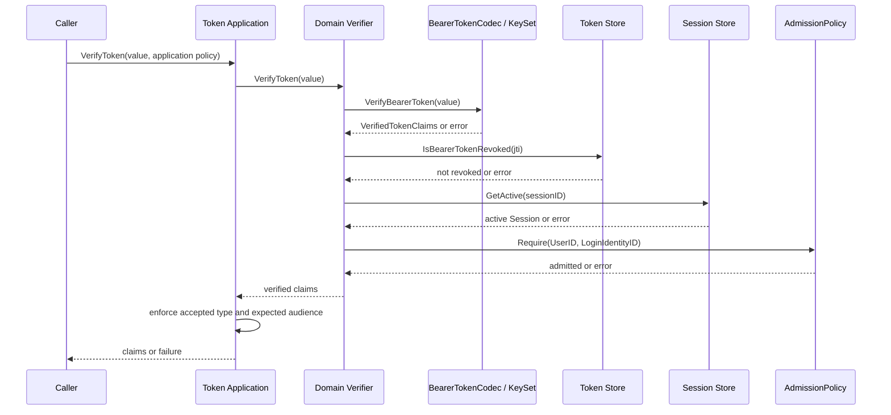
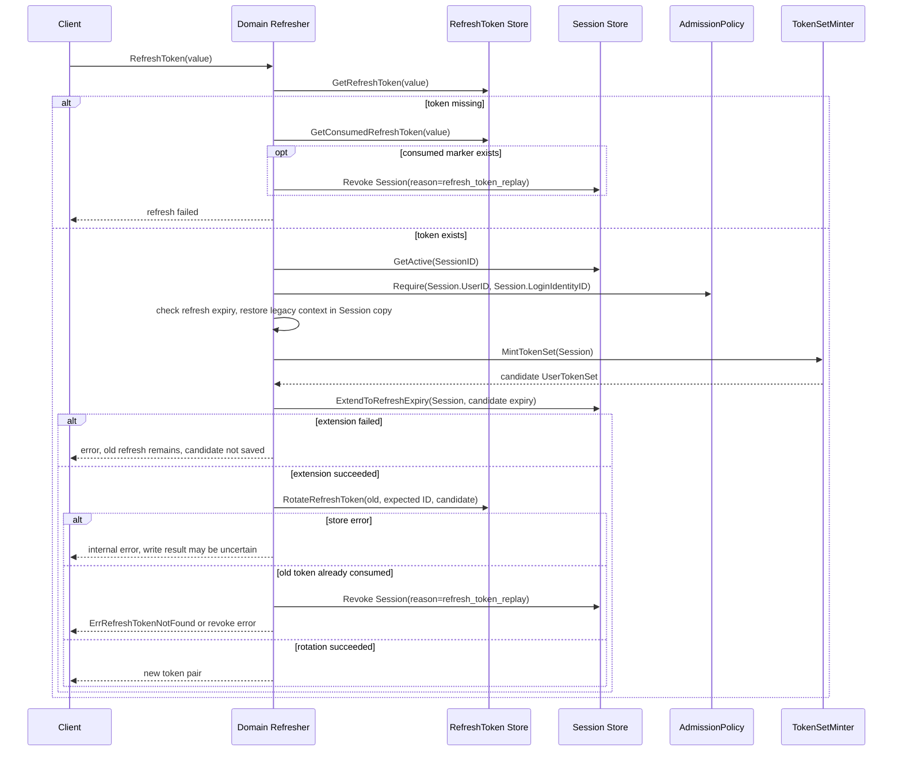
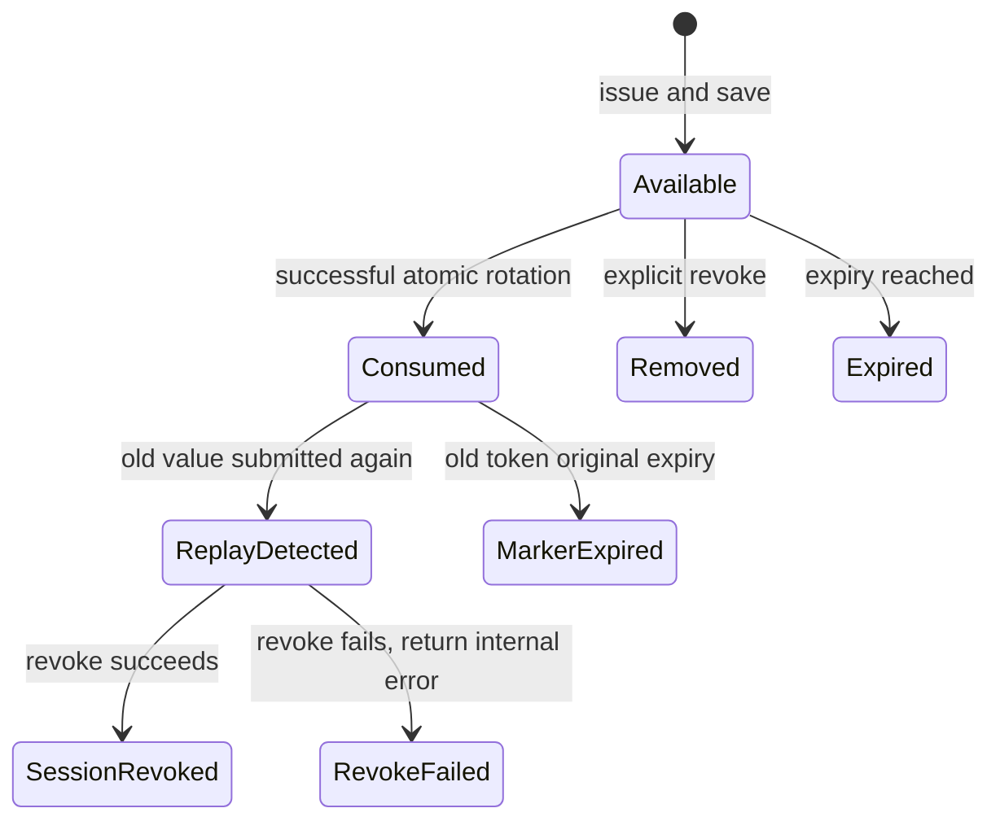
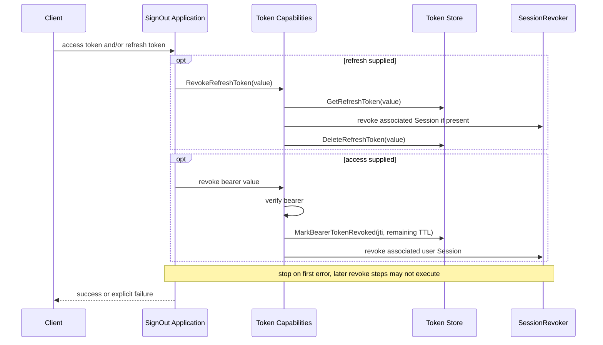
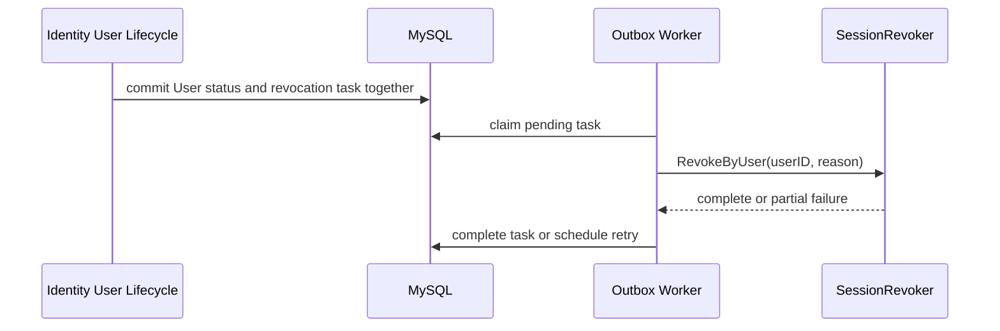
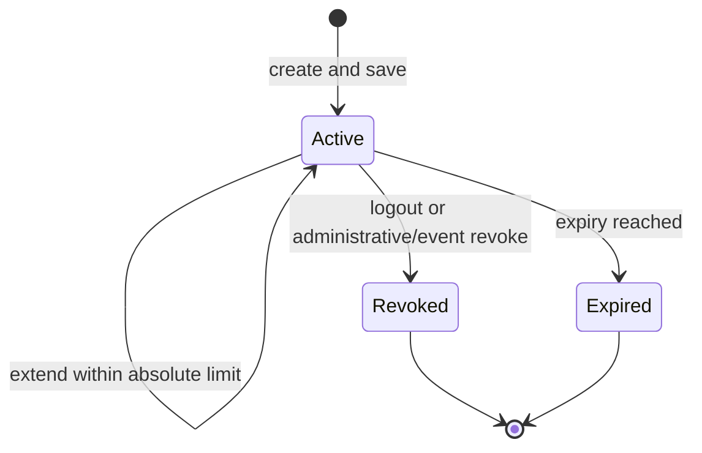

# 关键链路：Token 签发、刷新、吊销

> 状态：已实现 · 本文负责初始 Grant、在线 Verify、Refresh、Logout/Revoke 的真实顺序和失败语义；密钥管理由 签名密钥生命周期与 JWKS 发布文档负责。

## 1. 结论与对象边界

用户证明通过后，SignIn 先执行 Admission，再创建 Session、mint UserTokenSet、保存 RefreshToken，最后交付完整结果。后续访问用 AccessToken，续期用 RefreshToken，在线有效性由 Session 与当前 User/LoginIdentity 准入共同约束。

| 对象 | 权威事实或用途 | 生命周期边界 |
| --- | --- | --- |
| Principal | 本次证明成功的运行时主体 | 不代表已通过后续准入，不是持久化 User |
| 登录结果 | Principal + TokenPair 的应用结果 | 不独立持久化，由传输层映射为响应 |
| Session | 原始认证上下文、续期投影、在线状态 | Redis 保存，可过期、延期、撤销 |
| UserTokenSet | 一次初始颁发/刷新产生的 AccessToken + RefreshToken | 仅包含用户令牌 |
| AccessToken | 用户访问凭证，RS256 Signed JWT | 包含 Session 关联；可在线撤销 |
| RefreshToken | 不透明续期凭证 | 关联 Session，严格轮换，以 Session 为上下文权威来源 |

公开登录与刷新返回 token pair（AccessToken、RefreshToken、ExpiresIn、TokenType），不单独暴露 SessionID。Token 内容、JOSE 概念与历史格式兼容见 [Session、Token 与 JWKS](03-Session-Token与JWKS.md)；Principal 的形成见 [Login 链路](04-关键链路-Login登录认证.md)。本文是各生命周期操作的 canonical 说明。

## 2. 初始颁发：成功与补偿

```mermaid
sequenceDiagram
    participant S as SignIn
    participant AP as AdmissionPolicy
    participant SC as SessionCreator
    participant TI as InitialTokenIssuer
    participant TM as TokenSetMinter
    participant RS as RefreshToken Store
    participant SR as SessionRevoker
    S->>AP: Evaluate(Subject)
    AP-->>S: Decision or evaluation error
    break denied or evaluation failed
        S-->>S: map error; no Session
    end
    S->>SC: Create(Principal, TokenContext)
    SC-->>S: Session or error
    break creation failed or missing Session
        S-->>S: return error
    end
    S->>S: validate Principal / Session alignment
    break alignment mismatch
        S->>SR: compensate newly created Session
        S-->>S: return error
    end
    S->>TI: IssueInitialTokens(Session)
    TI->>TM: MintTokenSet(Session)
    TM-->>TI: complete set or error
    opt complete set
        TI->>RS: SaveRefreshToken
        RS-->>TI: saved or error
    end
    TI-->>S: TokenPair or error
    alt mint or save failed
        S->>SR: Revoke(authentication_grant_failed)
        Note over S,SR: independent 5s timeout, detached cancellation
        SR-->>S: success or compensation error
        S-->>S: return failure; retain both errors if compensation fails
    else success
        S-->>S: Result(Principal, TokenPair)
    end
```

图中 Session 创建错误会立即结束；后续 mint/save/补偿分支只针对成功返回的 Session。空 Principal、缺少依赖或 Admission 拒绝均不能创建 Session；mint 后也要求 AccessToken/RefreshToken 都存在。

Session/Token TTL、issuer、audience 和签名密钥来自组合时配置，客户端不能在每次 SignIn 中任意指定。TokenSetMinter 使用当前 active key 经 BearerTokenCodec 生成访问令牌，再生成与 Session 对齐的 refresh 凭证。私钥不越过 signer/codec 边界，也不进入响应。

### 补偿保证及剩余窗口

mint、TokenSet 完整性或初始 refresh 保存失败时，独立补偿撤销 Session，即使客户端已经取消请求也执行。保存结果不确定时，成功撤销 Session 可以阻断潜在 refresh 记录的在线使用，不要求先知道该记录到底是否落库。

补偿不是全局原子提交：补偿失败会保留两阶段错误并记录 Session 关联日志，剩余记录需依靠 TTL 或运维收敛。Session 创建本身返回错误时，跨存储结果也可能不确定，不能宣称所有写入已回滚。失败时不向客户端交付候选 token pair。

## 3. 在线验证：类型分流之前检查撤销



任何一步错误立即拒绝，图中后续步骤只在前一步成功时执行。Codec 校验签名、RS256 算法与 key 绑定、canonical issuer、exp/nbf/iat，并解析已登记类型。应用 verification policy 再约束 accepted token type 和 audience；仅接受 access，退役和未知类型均拒绝。

用户令牌的 Session/Admission 不是可选检查。服务间调用使用 mTLS + ACL，不颁发用户 Session 或 RefreshToken。

SDK 本地 JWKS 验签不读取在线撤销、Session 或 User/LoginIdentity 状态。它只能按本地策略接受签名和声明，不能提供同等即时撤销能力。缓存或远程失败后 fallback local 会改变安全语义；业务接入应明确选择，见 [两类验签边界](03-Session-Token与JWKS.md)。验签成功后仍需 AuthZ 资源授权。

## 4. Refresh：Session 是上下文权威来源

请求只提交不透明 RefreshToken value。Refresher 先从服务端记录取得 SessionID，加载 active Session，再执行 Admission 和 refresh 过期检查；签发以 Session 为依据，缺失的历史上下文在 Session 副本上恢复，历史 RefreshToken 上的重复上下文字段仅作为兼容 fallback。



active Session、Admission、expiry 和 mint 任一步失败都会提前结束。`auth_time` 保持原始认证时间，刷新不会让敏感绑定/解绑自动满足最近认证。

### 寿命与先延期的取舍

LifetimePolicy 把当前滑动有效期与绝对上限分开。新 refresh expiry 取 `now + refreshTTL` 与 `CreatedAt + sessionMaxTTL` 的较早者；缺少创建时间或正数绝对上限时，保守沿用现有到期时间。精确模型与兼容门禁见 [Session 生命周期](03-Session-Token与JWKS.md)。

当前先延期 Session，再轮换 refresh。延期失败时旧 refresh 保持有效；轮换错误时 Session TTL 可能已经延长。原子脚本通信错误还可能意味着轮换已发生但响应未被确认，不能一律认为旧 token 仍可用。

把延期和轮换合进单 Lua 可缩小窗口，但要同时承担 Session ownership、绝对寿命、索引和 token schema 校验。先轮换再延期则会出现“新 token 已生效，但 Session 延期失败”的窗口。当前没有将两种操作合并成一个原子事务。

## 5. 严格轮换与重放处置

Redis Lua 在旧 value 存在且 token ID 符合预期时，原子写新 token、删除旧 token，并写 consumed marker。marker key 使用旧 token 的摘要，值只保留 Session/User 引用，TTL 为旧 token 原剩余寿命，不保存令牌明文。



该图表达存储事实与业务结果，不是 RefreshToken 上的一组 status 枚举。重放只在 consumed marker 尚可识别或 CAS 明确冲突时触发；任意未签发 token 不会凭空撤销 Session。

并发刷新只有一个原子交换成功，输家按 replay 处理并撤销同一个 Session。因此赢家即使获得 token pair，也不能被承诺该会话继续有效。合法重复提交和被盗旧 token 使用按同一安全契约处理。成功轮换后响应丢失或进程崩溃时，需要重新登录；当前没有重试 grace window。

当前有 Session 级重放处置，没有完整 token-family 图谱，也不跨 Session 批量撤销其他家族。设计扩展必须区分“已有 consumed marker”与“完整 family 追踪”。

## 6. Logout、单令牌撤销与状态联动

| 操作 | 实际副作用 | 边界 |
| --- | --- | --- |
| Revoke AccessToken | 验证 bearer，写 jti marker，再撤销关联 Session | 标记 TTL 来自剩余令牌寿命；分步失败返回错误 |
| Revoke RefreshToken | 查 refresh，撤销关联 Session，再删除 refresh | 不枚举全部 access token |
| Revoke Session | 改为 revoked 并清理关联索引 | 不删除 User/LoginIdentity |
| User block/deactivate | MySQL 同事务写状态和撤销 outbox，worker 批量撤销 Session | 在线 Admission 同时阻断，outbox 负责最终收敛 |



Logout 使用调用方显式提供的令牌，不从 middleware Principal 推导 SessionID；多步失败不能表述为全局回滚。重复 Session 撤销应收敛，缺失 refresh 可以走删除；失效或无法解析 bearer 仍可能返回验证错误，不能承诺所有重复 logout 无条件成功。



这条链不反查全部 Token，也不批量写 jti marker。批量撤销中途失败可以已经处理部分 Session，worker 通过重试收敛。管理端按 Session/User/LoginIdentity 撤销的路由和 Resource/Action 见 [Session 管理契约](03-Session-Token与JWKS.md)。

## 7. Session 状态与索引



Session 主对象与 User/LoginIdentity 两个 Redis 索引在同一事务中保存；Revoke/Extend 通过 WATCH 乐观事务维护。Revoke 是终态，Extend 不能恢复已撤销会话或索引。批量撤销会清理索引存在但主对象缺失的陈旧成员。

旧数据若存在主对象但缺少索引，当前没有全库扫描修复器；依靠已有到期边界收敛，在线 Admission 继续兜底。不能把默认 `session_max_ttl=24h` 当作所有历史部署的实际最大寿命。存储算法与真实 Redis 验证边界见 [Redis 与缓存一致性](../../03-基础设施/02-Redis与缓存一致性.md)。

## 8. 密钥生命周期由独立文档负责

签发使用 active 私钥，验证接受处于有效期的 active/grace 公钥；retired 或超出有效期的密钥不能继续用于在线验签。私钥在受权限保护的 PEM 目录，MySQL 保存 public JWK 和生命周期事实。

真实状态为 active/grace/retired；“生成、发布、签名、轮换”是动作，不应另画成持久化状态。创建并激活先提交数据库，再刷新当前进程发布快照，没有等待所有消费者已获取新公钥的全局确认步骤。

启动、轮换、强制退役、共享目录要求、备份和管理契约统一见 [JWKS 与本地验签](06-关键链路-JWKS与本地验签.md)。不要在 Token 文档重复维护第二套密钥流程。

## 9. 责任与验证索引

以下 domain/application 路径前缀为 `internal/apiserver/`。

| 契约 | 负责实现 | 回归证据 |
| --- | --- | --- |
| Admission 先于 Session；失败补偿 | [issuer.go](../../../internal/apiserver/application/authn/signin/completion.go) | `grant/issuer_test.go` |
| 撤销检查先于 service/access 分流 | [verifier.go](../../../internal/apiserver/domain/authn/token/verifier.go) | `token/bearer_revocation_test.go` |
| 上下文权威与历史 fallback | [refresher.go](../../../internal/apiserver/domain/authn/token/refresher.go) | `token/session_subject_test.go`、`refresher_session_test.go` |
| 延期、CAS、replay 撤销 | [refresher.go](../../../internal/apiserver/domain/authn/token/refresher.go) | `token/refresher_atomic_test.go` |
| 滑动与绝对寿命 | [lifetime_policy.go](../../../internal/apiserver/domain/authn/session/lifetime_policy.go) | `session/lifetime_policy_test.go` |
| bearer marker 与 Session 撤销 | [revoker.go](../../../internal/apiserver/domain/authn/token/revoker.go) | `token/bearer_revocation_test.go` |
| Redis 原子状态 | [token-store.go](../../../internal/apiserver/infra/cache/redis/token-store.go)、`session_store.go` | 对应 Redis adapter tests |
| User 状态传播 | [service_lifecycle.go](../../../internal/apiserver/application/identity/user/service_lifecycle.go) | Identity lifecycle / sessionrevocation tests |

```bash
make docs-hygiene docs-facts
go test ./internal/apiserver/application/authn/signin \
  ./internal/apiserver/domain/authn/token \
  ./internal/apiserver/domain/authn/session \
  ./internal/apiserver/application/authn/token \
  ./internal/apiserver/infra/cache/redis
```

并发修改需补相应 race/原子契约测试；真实 Redis 持久化、故障切换和多实例 JWKS 传播仍需运行环境证据。文档门禁只能覆盖已编码的事实，不能代替这些验证。
