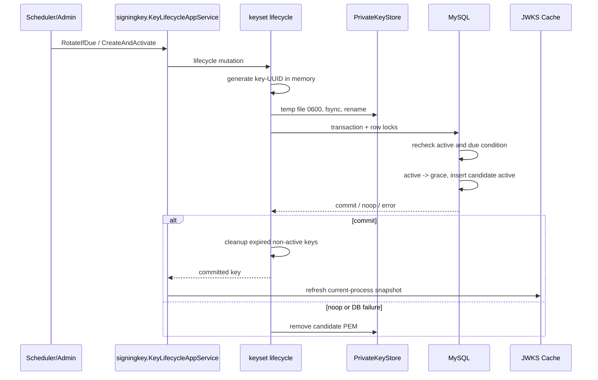

# 关键链路：签名密钥生命周期、JWKS 发布与本地验签

> 状态：已实现 · 已与 signingkey/JWKS application、keyset/MySQL infra、container、迁移、REST 契约和并发测试核对。

## 1. 结论

IAM 使用唯一的 `active` 私钥签发 AccessToken，同时通过 JWKS 发布 `active` 和尚未过期的 `grace` 公钥。资源服务可按 `kid` 本地验签；验签只建立认证上下文，资源访问仍需 AuthZ。

当前私钥存储是共享 POSIX 目录中的 PEM 文件，不是 KMS/HSM。单副本可直接使用；多实例只有在所有签名实例共享同一可靠密钥目录时才受支持，多主机扩容前应优先完成 KMS/HSM 或可靠共享密钥存储。

## 2. 配置契约

```yaml
jwks:
  keys_dir: "/app/data/keys"
  auto_init: true
  rotation:
    automatic_enabled: true
    check_cron: "@every 1h"
    rotation_interval: 720h
    grace_period: 168h
    max_publishable_keys: 3
```

生产要求 `keys_dir` 为非空绝对路径，并默认开启自动轮换；开发默认关闭自动轮换。启动校验保证：

- `rotation_interval > 0`；
- `auth.access_token_ttl <= grace_period < rotation_interval`；
- `max_publishable_keys >= 2`；
- Cron 可解析。

环境变量使用 `IAM_APISERVER_JWKS_ROTATION_*` 前缀；本轮不提供 CLI 参数。

## 3. 启动不变量

启动必须得到且只得到一把可签名的 active：

1. 多个 active：启动失败。
2. 没有 active：只有 development fallback 或显式 `auto_init=true` 才能初始化，否则失败。
3. active 已过期：必须在允许策略下完成轮换，否则失败。
4. active PEM 缺失、无法解析、不是 RSA 私钥，或其公钥与数据库 JWK 不一致：启动失败。

数据库迁移 `000016_jwks_single_active_guard` 使用生成列和唯一索引保证最多一把 active。迁移前存在多个 active 时，唯一索引创建失败，必须人工核对，迁移不会自动选择密钥。

## 4. 原子轮换



目录使用 `0700`，PEM 使用 `0600`。`kid` 使用 `key-<UUID>`，不使用秒级时间戳。

多实例自动任务在事务内重新判断是否到期，只有一个实例完成轮换；并发初始化只有一个胜者。管理员显式创建可以按事务顺序完成多次轮换，但唯一索引保证任意时刻数据库最多一个 active。

数据库提交前失败会补偿删除候选 PEM。提交后 cache 刷新或清理失败不会回滚已经生效的签名密钥，只记录可重试告警。管理端创建、状态变更和 Scheduler 自动轮换都通过 `application/authn/signingkey.KeyLifecycleAppService`；
查询由只读 management 服务负责。

## 5. 生命周期规则

| 状态 | 签发新 Token | 通过 JWKS 验旧 Token |
| --- | --- | --- |
| `active` | 是 | 是 |
| `grace` 且未到 `not_after` | 否 | 是 |
| `retired` 或过期 grace | 否 | 否 |

- 创建管理接口的语义是“创建并原子激活新密钥”，旧 active 同事务进入 grace。
- 不允许直接把唯一 active 手工移入 grace 或强制 retired。
- 普通 retire 只接受已经过期的 grace。
- force-retire 只用于提前撤销非 active 密钥；在线 key source 随后拒绝该 key，公共 JWKS 不再发布它。持有旧公钥的下游本地缓存不一定立即失效，紧急处置必须协调消费者刷新或在线验证。
- `max_publishable_keys` 是安全告警阈值，不会为了满足上限提前移除未过期 grace。
- 清理删除过期数据库记录后同步删除 PEM；PEM 删除失败不恢复已经停止发布的公钥。

## 6. 对外契约和缓存

公开入口保持：

```text
GET /.well-known/jwks.json
GET /api/v2/.well-known/jwks.json
```

响应只包含公钥，并保留现有 JSON、ETag 和 Cache-Control 语义。公共 JWKS 每次构建都查询数据库；REST 先构建响应，再判断客户端 ETag/Last-Modified 是否匹配。`GetCurrentCacheTag` 可复用短期标签快照，不能据此认为公共请求跳过数据库查询。进程快照用于标签读取与观测，不决定数据库中的 active 状态。
资源服务应固定可信 issuer/JWKS URL，校验算法 allowlist、签名以及 `iss/aud/exp/nbf`；`kid` 未命中时可刷新，但不得跳过验签或接受任意 `jku/jwk`。

管理入口统一位于 `/api/v3/authn/admin/jwks/keys`。它们需要用户 JWT，并通过 `RequirePermissionOrGlobal` 检查 `iam:authn:collection:jwks` 上的明确
Action：

| 请求 | Action |
| --- | --- |
| `POST /api/v3/authn/admin/jwks/keys` | `create` |
| `GET /api/v3/authn/admin/jwks/keys` | `list` |
| `GET /api/v3/authn/admin/jwks/keys/{kid}` | `read` |
| `POST /api/v3/authn/admin/jwks/keys/{kid}/retire` | `retire` |
| `POST /api/v3/authn/admin/jwks/keys/{kid}/force-retire` | `force_retire` |
| `POST /api/v3/authn/admin/jwks/keys/cleanup` | `cleanup` |
| `GET /api/v3/authn/admin/jwks/keys/publishable` | `list_publishable` |

授权先检查当前授权域，再检查平台域中相同 Resource/Action。实现不读取 `super_admin` 等角色名来跳过 PermissionGrant。
`POST /api/v3/authn/admin/jwks/keys` 返回 `201 KeyResponse`。

## 7. 运行、备份和紧急退役

- 备份必须同时覆盖 `jwks_keys` 表与真实 PEM 目录，并验证 active PEM 派生公钥与数据库 JWK 匹配。
- 恢复时先恢复两类数据，再以只读检查验证 active 数量、PEM 权限和匹配关系。
- 安全事件下只能 force-retire 非 active key；active 需要先创建并激活新 key，再撤销旧 key。
- 轮换后至少观察一个完整 AccessToken TTL，确认旧 Token 在 grace 期仍能验证、新 Token 使用新 `kid`。
- 日志和指标只记录 `kid`、状态、计数和结果，不记录 PEM、Token 或私钥参数。
- 生命周期指标包括 `iam_jwks_lifecycle_operations_total{operation,result}`、`iam_jwks_post_commit_failures_total{stage}`、
  `iam_jwks_scheduler_executions_total{result}`；既有轮换结果和最后成功时间指标继续保留。

## 8. 事实源与验证

| 内容 | 路径 |
| --- | --- |
| 生命周期领域规则 | `internal/apiserver/domain/authn/signingkey` |
| 签名密钥管理编排 | `internal/apiserver/application/authn/signingkey` |
| JWKS 公钥发布 | `internal/apiserver/application/authn/jwks` |
| PEM、JWS key source 与 JWKS snapshot adapter | `internal/apiserver/infra/token/keyset` |
| 原子数据库转换 | `internal/apiserver/infra/mysql/jwks` |
| Scheduler/启动校验 | `internal/apiserver/infra/scheduler`、`internal/apiserver/container/authn` |
| 单 active 迁移 | `internal/pkg/migration/migrations/000016_jwks_single_active_guard.*.sql` |
| REST 契约 | `api/rest/authn.v2.yaml` |

```bash
go test -race ./internal/apiserver/domain/authn/signingkey/... \
  ./internal/apiserver/application/authn/signingkey/... \
  ./internal/apiserver/application/authn/jwks/... \
  ./internal/apiserver/infra/token/keyset/... \
  ./internal/apiserver/infra/mysql/jwks/... \
  ./internal/apiserver/container/authn
make api-validate
```
