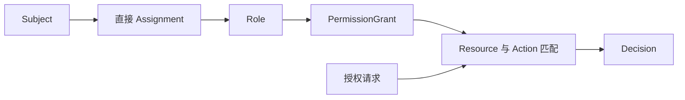

# AuthZ 模块总览

> 状态：已实现 · 本轮代码已实现，生产数据切换与业务验收另行记录。

AuthZ 分为授权事实管理与权限判断两条责任链，共用 Role、Assignment、Resource 和 PermissionGrant。Subject 表示被判定主体，Decision 表示一次判定结果；运行时快照是这些事实的只读投影。

多角色权限取并集；普通 Grant 绑定目录资源和具体动作，系统 Grant 保留既有资源模式和动作通配语义。敏感授权保护与服务角色分配白名单继续在管理入口执行。

授权请求只包含主体、资源键与动作。REST 承担管理控制面；gRPC Check 承担服务间判定。业务服务在通过动作授权后继续检查自己的组织、受试者关系、对象生命周期与数据范围；列表范围须在分页和计数前过滤。

管理写入通过事务维护事实、PolicyVersion 和 Outbox。运行时原子发布不可变快照，保留版本防倒退、新鲜度门禁与数据库版本补偿。残留有效条件或资源属性模式阻止加载，不能当作无条件授权使用。

AuthN 负责身份认证和会话准入；Identity 负责用户及身份关系；AuthZ 不复制这些模型，也不读取 QS 业务数据库。医生身份和监护关系本身不是动作授权。

兼容字段仅用于识别退役请求：非空条件、属性模式或对象上下文被拒绝。历史数据由独立维护工具处理，不进入活动领域恢复。

详见 [领域模型](01-领域模型设计.md)、[运行时链路](02-关键链路-授权判定与不可变快照.md) 和 [维护手册](08-条件授权退役维护手册.md)。
