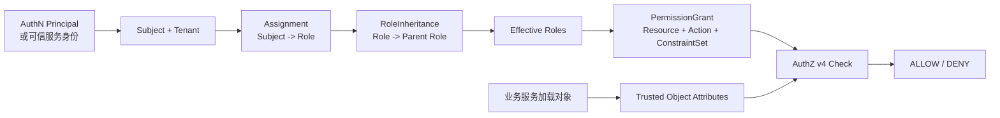

# AuthZ 模块总览

> 状态：已实现 · 本文从问题空间、事实所有权、控制面、执行面和关键取舍建立 AuthZ 的完整心智模型。

## 结论

AuthZ 管理“谁在什么 Tenant 下拥有什么角色，以及这些角色可以执行什么动作”。它不负责认证身份、不加载业务对象，也不替业务模块判断对象归属。

从领域知识看，AuthZ 沿三个子域展开：

| 子域 | 业务问题 | 核心模型 | 服务或执行边界 |
| --- | --- | --- | --- |
| 建权与赋权 | 谁因何拥有哪项能力 | `Subject`、`Role`、`Assignment`、`RoleInheritance`、`PermissionGrant`、`Resource` | 各类 command service；UoW 与 publication 是变更支撑机制 |
| 验权与决策 | 这次访问是否被允许 | `AuthorizationRequest`、`ObjectContext`、`AuthorizationRuntimeSnapshot`、`Decision` | `DecisionService`、领域 `AuthorizationEvaluator` |
| 施权与执行 | 如何把判定结果落实到访问边界 | `Decision` | AuthZ middleware 或拥有业务动作的业务服务 |

因此，施权不是第三套规则引擎：授权事实只在第一段建立，授权结论只在第二段产生，第三段只消费结论。

当前有三种接入面：

- REST v3：角色、Assignment、PermissionGrant、RoleInheritance、Resource 等管理接口。
- gRPC v3：`Check`、`GetAuthorizationSnapshot` 和 Assignment 写入接口。
- 进程内授权：IAM 自身管理路由使用 `RequirePermissionOrGlobal` 检查明确的 Resource/Action。

## 授权主链



主链中只有 Subject、Resource、Action 和受信对象属性进入判定。显示名称、客户端自报角色、客户端自报对象属性都不能成为授权事实。

## 事实、投影与接口

| 层 | 当前职责 | 是否权威事实 |
| --- | --- | --- |
| MySQL AuthZ 表 | Role、Assignment、继承、Grant、Resource、策略版本 | 是 |
| 不可变角色图 | 在内存中连接 Subject→Role、Role→Role 并计算有效角色 | 否，可重建 |
| 快照 Grant 索引 | 按有效角色组织 Grant 候选 | 否，可重建 |
| `AuthorizationRuntimeSnapshot` | 一次 reload 产生的不可变运行时视图 | 否，可重建 |
| REST v3 | 管理权限事实 | 接口，不是事实源 |
| gRPC v3 | 判定、快照查询和服务间写入 | 接口，不是事实源 |

## 与其他模块的边界

| 模块 | 提供给 AuthZ | AuthZ 不承担 |
| --- | --- | --- |
| AuthN | 已认证 Principal、用户 JWT、服务身份 | 密码/MFA/Token/JWKS 生命周期 |
| IDP | 应用与服务调用身份 | 应用注册和凭据管理 |
| Suggest | Resource/Action 与服务端上下文 | 搜索、聚合、数据可见性查询 |
| 业务服务 | 对象加载后的受信属性 | 对象归属、组织关系、生命周期规则 |
| Transport | 身份提取、输入校验、错误映射 | 领域授权规则 |

列表、搜索和批量操作无法逐对象加载属性，因此只能接受无条件 Grant。对象级写操作应先由业务服务加载对象，再调用 gRPC v3 `Check`。

## 一条授权请求究竟包含什么

AuthZ 的判定输入可以写成：

```text
Decision = f(
  Subject,
  Tenant,
  Resource,
  Action,
  Trusted ObjectAttributes,
  AuthorizationRuntimeSnapshot,
)
```

各输入的所有权不同：

| 输入 | 产生位置 | AuthZ 校验 | 不能来自 |
| --- | --- | --- | --- |
| Subject | AuthN Principal 或 gRPC 已认证服务上下文映射 | `<type>:<IAM id>`，type 为 user/group/service | 任意请求体 actor 字符串 |
| Tenant | JWT tenant claim 或可信服务请求 | 非空、作为角色图 domain | 路由默认值之外的隐式猜测 |
| Resource | 调用方的稳定资源合同 | 四段格式与注册信息 | HTTP URL 的机械拼接 |
| Action | 调用方的业务动作合同 | 小写 concrete action | HTTP method 的机械复制 |
| ObjectAttributes | 拥有对象事实的业务服务 | 调用服务白名单、Resource schema、类型 | 浏览器或客户端自报 |
| Snapshot | AuthZ 从 MySQL 完整加载 | 交叉引用、环、schema、Grant 全量校验 | 第二套手工 policy 文件 |

Subject 和 Tenant 解决“谁、在哪个授权域”，Resource 和 Action 解决“要做什么”，ObjectAttributes 只解决“这个具体对象是否满足条件”。对象属性不能反过来修改主体或角色。

## 三条真实调用链

### IAM 自身管理路由

```text
Bearer user JWT
  -> AuthN 在线 VerifyToken
  -> request context: user id + tenant
  -> AuthZ Middleware.RequirePermissionOrGlobal(resource, action)
  -> RouteDecisionService.CheckRoutePermission(current tenant)
  -> 必要时检查 platform tenant
  -> DecisionService.Check -> Runtime.Check -> AuthorizationEvaluator.Evaluate
  -> Middleware 执行 allow / deny / error
  -> handler -> application command/query
```

这条链只做无对象属性的 capability 检查。角色名不在 middleware 的放行条件里。

### 外部业务对象授权

```text
业务请求
  -> 业务服务认证用户并得到 Subject
  -> 业务服务按对象 ID 查自己的数据库
  -> 提取允许参与授权的对象属性
  -> 使用服务身份调用 AuthorizationService.Check
  -> IAM 校验服务身份、资源与属性白名单
  -> snapshot 返回 Decision
  -> 业务服务执行或拒绝动作
```

IAM 不反向查询业务数据库。这样做避免 AuthZ 成为所有业务表的聚合查询层，也明确对象新鲜度和事务一致性由业务服务承担。

### Assignment 管理

```text
可信服务身份
  -> gRPC method ACL
  -> Assignment request constraints
     domain + subject type + role + delegated actor
  -> application command
  -> MySQL UoW + PolicyVersion + Outbox
  -> local reload + remote convergence
```

方法 ACL 只回答“服务能否调用此 RPC”；request constraints 继续回答“能改哪个 Tenant、哪类 Subject、哪些 Role”。二者缺一都会把接口级授权误当成数据级授权。

## 事实所有权为什么必须明确

### Identity 事实不能变成 PermissionGrant

`ProfileLink` 表达 User 与 Profile 的身份/监护关系，生命周期来自 Identity。把它复制为 Grant 会出现双写：关系解除后，Grant 是否同时撤销？失败时哪份为真？
当前设计要求业务模块读取关系后形成对象属性或直接在业务域判断，不把关系行长期复制进 AuthZ。

### AuthN 状态不能变成长期角色

MFA、Session active、LoginIdentity enabled 是认证时态事实。它们变化频繁且有过期语义，不适合作为持久 Role。需要这类条件时，应在可信请求上下文中显式建模，并重新评估重放与缓存边界；
当前 AuthZ v4 尚未把它们作为 ConstraintSet 输入。

### 业务对象状态不能由 IAM 自己查

如果 IAM 直接查询每个业务库，它会承担连接、schema、权限、超时和跨库一致性；任何业务服务故障都会进入 IAM 热路径。当前反向依赖被禁止：对象拥有者加载事实，IAM 只验证被允许的属性合同。

## 控制面和执行面的失败归属

| 失败 | 谁处理 | 默认行为 |
| --- | --- | --- |
| JWT 无效/Session 失效 | AuthN/REST middleware | 401，未进入 AuthZ |
| gRPC 无服务身份 | gRPC interceptor/AuthZ transport | PermissionDenied |
| 方法 ACL 拒绝 | gRPC interceptor | PermissionDenied |
| Assignment constraints 拒绝 | AuthZ transport | PermissionDenied，不泄露内部规则 |
| 对象属性来源不可信 | AuthZ transport | PermissionDenied |
| 属性 key/type 不合法 | AuthZ domain/runtime | InvalidArgument |
| 无匹配 PermissionGrant | AuthZ runtime | 正常 DENY |
| MySQL 写事务失败 | Application/infra | 写入失败并回滚版本/事件 |
| 提交后本地 reload 失败 | Runtime/运维 | 写事实已提交，旧快照继续服务并记录 degraded |
| 远端实例 reload 失败 | Event consumer | 返回错误，让消息层重试 |

这里最重要的区别是：授权拒绝不是基础设施故障，基础设施故障也不能降级成允许。

## 为什么不是“统一关系引擎”

Assignment、RoleInheritance、ProfileLink 都可以画成边，但它们拥有不同的不变量：

| 关系 | 生命周期 | 强约束 | 运行用途 |
| --- | --- | --- | --- |
| ProfileLink | Identity 业务关系 | 用户与档案关系语义 | 身份/业务查询 |
| Assignment | AuthZ 直接授权 | Tenant、Subject、Role、active 唯一 | 角色图入口 |
| RoleInheritance | AuthZ 能力复用 | 引用完整性、无环、active 唯一 | 角色图闭包 |

把它们放进一个 generic relation 表会让唯一约束、删除语义、审计 actor 和查询模型全部条件化。当前明确建模虽然表更多，但数据库约束和代码责任更直接。

## 替代方案与放弃理由

### 每次 Check 直接查 MySQL

优点是无需 reload；代价是每次授权要读取 Assignment、继承、Grant、Resource schema，并重复图计算。它把数据库放进所有服务请求热路径，且难以保证一次判定读到一致视图，因此当前选择不可变快照。

### 全部交给 Casbin policy/matcher

优点是配置集中；代价是对象属性类型、schema、缺失属性、matched Grant、版本与管理写模型都要挤进字符串 policy。该方案已经退役，当前授权语义和运行时角色图都由 IAM 自己表达。

### 把授权放回各业务服务

优点是对象事实近；代价是角色、资源命名、平台管理员和审计语义在多个服务重复。当前拆分是：IAM 统一 capability 与条件判定，业务服务仍拥有对象加载和业务关系。

### 把所有请求都路由到 IAM REST

浏览器友好，但服务身份、mTLS、ACL、类型化属性和 SDK 合同更适合 gRPC。于是 REST 留作管理控制面，`Check` 留在可信服务间数据面。

## 自有角色图的准确位置

角色图是不可变快照中的派生索引，不是新的权限事实源：

```text
Assignment:       Subject -> Role
RoleInheritance:  Role -> ParentRole
                         |
                         v
              Immutable Role Graph 计算有效角色

PermissionGrant + ConstraintSet
                         |
                         v
               AuthorizationEvaluator 求值
```

仓库不再把权限规则持久化为 Casbin policy，也不存在运行时 Casbin 模型配置文件。`roleGraph` 直接使用 `subject.Ref`、`tenant.ID` 和 `role.Name`，
避免把领域值编码为第三方字符串 tuple。

当前有效角色解析保持原有 32 层边界。快照发布前先检测非法角色引用、自环和普通循环，发布后的角色图只读；深度边界和 visited set 共同阻止无界遍历。

## API 边界

- REST 管理前缀：`/api/v4/authz`。
- gRPC 服务：`iam.v3.AuthorizationService`。
- 授权判定：gRPC `Check`，不是 REST `/check`。
- 快照语义：`roles` 是有效角色，`direct_roles` 是直接 Assignment。

具体接口分别见 [REST 管理与路由授权](05-关键链路-REST管理与路由授权.md)和 [gRPC 服务间授权与 SDK](06-关键链路-gRPC服务间授权与SDK.md)。

## 不属于 AuthZ 的判断

- “这个报告是否属于当前用户”应由报告模块查库后形成受信属性。
- “当前 Subject 是否已经通过 MFA”来自 AuthN 可信上下文。
- “搜索结果应该返回哪些数据”属于 Suggest/业务查询；AuthZ 只提供 capability 判断。
- “某角色名称看起来像管理员”不是授权依据；必须存在匹配的 PermissionGrant。

## 变更这个边界前必须回答

若要把新的属性、关系或主体类型引入 AuthZ，评审至少要回答：

1. 谁拥有该事实，谁负责它的新鲜度？
2. 它是持久授权事实，还是请求时上下文？
3. 客户端能否伪造，传输层如何建立信任？
4. 它变化时是否需要 PolicyVersion 与全实例 reload？
5. 缺失、超时和类型错误时是 deny 还是系统错误？
6. 列表/批量场景如何避免逐对象 N+1 Check？
7. 它能否被当前审计、回放与生产验证覆盖？

没有这些答案，不应仅为“接口方便”扩大 AuthZ 的事实所有权。

## 安全边界与发布验收

当前实现包含租户限定角色详情、platform 专属目录写入、逐租户防倒退的独占快照、60 秒新鲜度门禁、数据库版本补偿、32 节点继承上限和显式可信属性配置。维护命令与逐项验证见 [安全加固与发布验收](09-安全加固与发布验收.md)。
