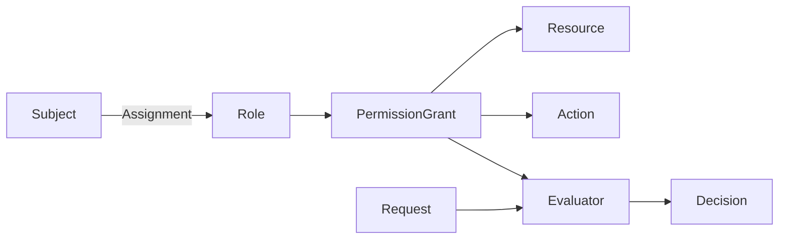

# AuthZ 领域模型设计

> 状态：已实现 · 本轮代码已实现，生产数据切换与业务验收另行记录。

AuthZ 管理资源与动作授权。用户通过 Assignment 直接取得 Role，角色聚合 PermissionGrant；多个角色的授权取并集。角色继承与对象属性条件已退役。

## 事实与边界

| 对象 | 职责 |
| --- | --- |
| Subject.Ref | 授权主体的类型和标识，不是认证凭据 |
| Assignment | 主体与角色的直接关系 |
| Role | 稳定角色标识、展示信息与管理保护 |
| Resource | 资源键、归属信息和具体动作目录 |
| PermissionGrant | 角色对资源键／范围和动作的允许授权 |
| Request / Decision | 单次授权输入、结果、命中证据和策略版本 |

IAM 不保存医生管理关系、监护关系或业务对象属性。业务系统继续检查机构、受试者关系、对象状态及其他业务规则；Scope 尚未引入。

## 授权不变量

- 目录资源和请求只接受具体动作；可信系统授权可以使用动作及资源通配。
- 普通授权绑定目录资源 ID，资源键和动作必须与目录一致。
- Role.ManagementProtection 只控制管理保护。敏感授权限制与服务分配白名单继续保留。
- 修改资源动作须验证已有有效 Grant；删除角色须检查有效 Assignment 和 Grant。
- 事实变更、PolicyVersion 和 Outbox 在同一事务提交。运行时快照是可重建投影。
- GrantKey 保持 v2 算法；固定使用历史无条件集合的规范编码，已有无条件键不变。

## 兼容与历史

领域对象不再包含 Constraints、AttributeSchema 或 ObjectContext。REST、gRPC 和 SDK 保留弃用字段／方法用于明确拒绝旧条件用法，不能将非空条件静默忽略。历史存储列暂留，原始内容由维护清单与审计读取，不进入活动授权恢复。

见 [条件授权退役维护手册](08-条件授权退役维护手册.md)。
