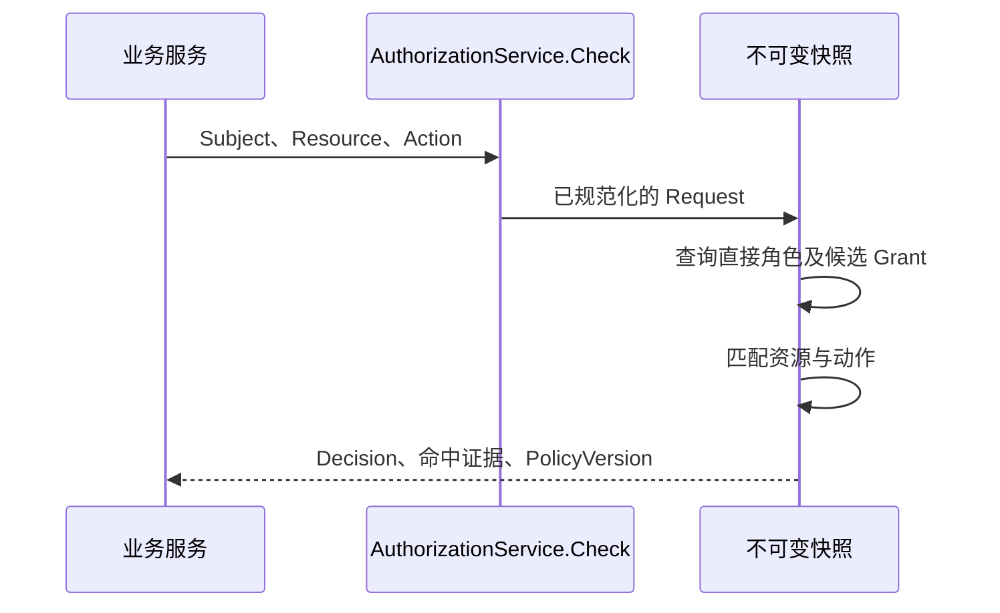

# 关键链路：授权判定与不可变快照

> 状态：已实现 · 本轮代码已实现，生产数据切换与业务验收另行记录。

MySQL 是授权事实源。Runtime 在一致读事务中加载 Role、有效 Assignment、有效 PermissionGrant、Resource 和 PolicyVersion，构建不可变快照后原子发布。

## 判定链路

资源与动作任一 Grant 匹配即允许，所有角色均无匹配则拒绝。对象关系、数据过滤和状态规则由业务系统执行。

## 加载与发布保护

持久化映射拒绝非空条件 Grant 和非空资源属性模式，不能将未迁移数据恢复成无条件领域对象。未知角色／资源引用、目录动作冲突、敏感权限违规及版本回退也会阻止快照发布。

加载失败保留已有快照，但不能刷新其验证时间；超过原有新鲜度边界后拒绝授权。首次加载失败不得就绪。策略事件、定期复核及健康指标继续使用原实现。

快照中的角色只来自直接分配。兼容输出 roles、direct_roles 使用原有应用过滤；所有实际权限条目均为 UNCONDITIONAL。不同授权的资源范围和动作匹配保持原语义。

## 协议退役

Check 不再接受非空对象上下文；缺失属性不再是判定结果。旧模式与字段编号暂时保留，不能复用。当前用户资料可以返回本人的权限条目用于导航，后端仍执行最终授权。

见 [领域模型](01-领域模型设计.md) 与 [维护手册](08-条件授权退役维护手册.md)。
