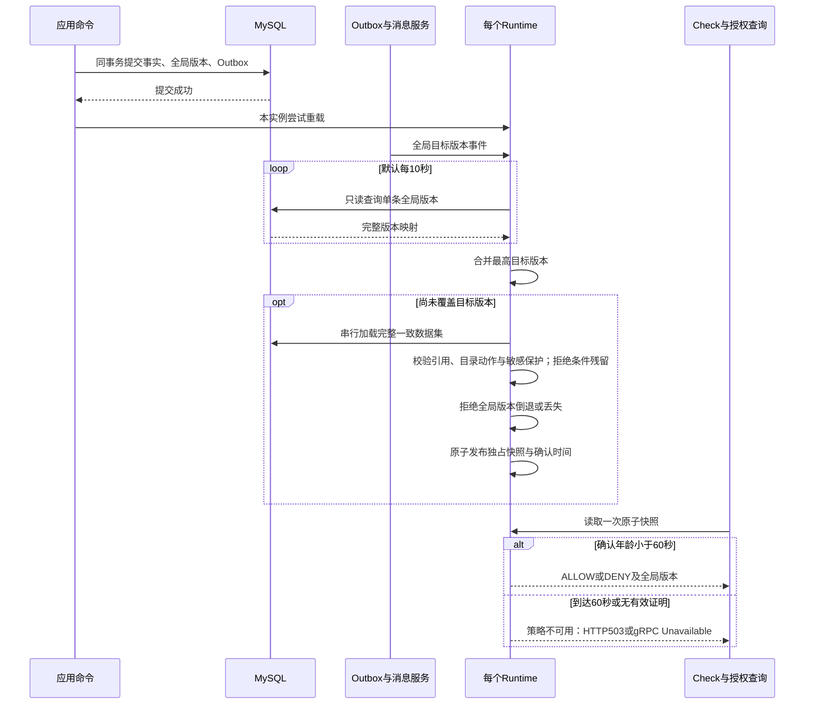

# 关键链路：多实例策略收敛

> 状态：已实现 · 事实提交、快照发布、新鲜度确认与生产验收分别提供证据。

AuthZ 将授权事实、PolicyVersion 和 Outbox 同事务提交。提交成功表示事实已经持久化；各实例通过事件和数据库版本核对收敛。当前快照未能重新确认一致时，最多服务 60 秒，到达边界即停止提供授权结果。

## 写入、发布与确认



Runtime 的可取消单一入口覆盖完整的加载、构建和发布过程。Check 不访问数据库，也不获取重载锁。发布检查比较单条全局版本水位。加载失败、构建失败、取消和回退拒绝均保留原快照。

事件类型为 `iam.authz.version_changed.v2`，载荷只携带全局版本，不携带策略增量。重复及乱序事件通过最高目标版本去重；已加载的版本不重复触发全量读取。未收到消息的实例由数据库核对补偿。

## 60 秒合同

确认时间取自证明所依据的数据库读取**开始时刻**，而非响应、构建或发布完成时刻。确认必须同时覆盖该次数据库版本和此前已观察到的最高事件目标。收到事件、重复旧事件、同步失败均不能续期。慢读取和慢构建会消耗预算。

快照和确认时间作为同一原子值发布，防止读到旧快照的请求误用新快照的证明。快照构建深复制 Grant、Resource 及其集合；查询结果和版本映射也由调用方独立持有。

`Check`、主体授权快照查询、有效角色查询共用门禁。确认年龄 `>= max-unconfirmed` 即返回 `ErrAuthorizationPolicyUnavailable`（103002），映射 HTTP 503 / gRPC `Unavailable`。普通策略不匹配仍是正常 DENY；REST 无权限仍为 403。REST 中间件保留不可用错误，SDK 保留 gRPC 不可用语义。

此合同只约束 IAM 本次返回的授权结果。外部服务自行缓存的权限、已发起的业务操作和缓存中的旧 ALLOW 不受这个时限自动约束。

## 启动、恢复与停止

1. 加载初始快照；残留有效条件 Grant、非空资源属性模式或非法引用阻止启动。
2. Runtime 进入需要同步的状态，启动受生命周期管理的同步循环。
3. 注册实例独立订阅，随后立即执行一次数据库版本核对，补偿初始加载与注册间的事件窗口。
4. 注册失败保留循环并按核对周期重试，readiness 为未就绪。
5. 注册成功、循环运行且新鲜度恢复后自动就绪。

短暂同步失败在新鲜度预算内记录 degraded；到期后未就绪并拒绝授权。订阅“注册成功”只表示本地注册操作完成，不能证明连接持续可靠。发布连接健康和最近收到消息的时间均不作为一致性证明。

重复 Start 不产生第二个循环，重复 Stop 不重复关闭依赖。Stop 取消同步读取和事件回调，等待循环结束后停止订阅。生命周期停止后不能重新启动同一个协作者，应创建新的模块实例。实例通道由组合根生成，应用发布服务只处理版本事件。

## 配置

```yaml
authz:
  policy-sync:
    check-interval: 10s
    sync-timeout: 10s
    max-unconfirmed: 60s
  attribute-providers-file: configs/authz_attribute_providers.yaml
```

三个时长必须为正数，核对间隔和单次同步超时均严格小于最大未确认时间。生产配置使用 `/app/configs/authz_attribute_providers.yaml`。配置随部署生效，本轮不提供热更新。

完整版本端口 `ReadVersions` 只读，不复用可能创建版本记录的 `GetCurrent`。MySQL 全量加载使用只读、可重复读事务，使授权事实和版本来自同一数据库视图。

## 观测与故障处理

| 信号 | 解释 |
| --- | --- |
| `iam_authz_native_reloads_total{result}` | 完整加载、构建、发布的成功与失败 |
| `iam_authz_native_reload_duration_seconds` | 重载耗时 |
| `iam_authz_native_loaded_policy_version_max` | 当前已加载的全局版本，指标名沿用既有名称 |
| `iam_authz_native_policy_version_lag_max` | 最高目标版本与已加载全局版本之差 |
| `iam_authz_native_freshness_age_seconds` | 最近确认的年龄，由同步和查询更新 |
| `iam_authz_native_expired_checks_total` | 因不可用策略而拒绝的查询次数 |
| `iam_authz_native_version_check_failures_total` | 数据库核对、补偿或目标覆盖失败 |
| `iam_authz_native_subscription_registered` | 订阅注册状态，不是消息连接健康证明 |

健康详情保留全局版本水位、最后事件、重载时间和 channel，增加 fresh、freshness_age_seconds、degraded、sync_running 和 subscription_registered。readiness 是实例就绪状态，集群收敛仍需逐实例比较版本。

数据库中断时检查同步失败、新鲜度年龄和 503。数据校验失败时根据具体对象修复事实或配置；不能跳过非法记录、静默截断继承、修改 PolicyVersion 回退或强制更新确认时间。消息中断时数据库核对继续承担漏消息补偿。

## 维护和发布

本次治理使用 `iam-maintenance authz-hardening preflight/apply/evidence`，不修改历史迁移和表结构。`authz-v3-converge` 保留其原有独立用途，不用于新的目录写权限治理。

操作顺序、指纹保护、证据字段、回退约束和验证结果见 [安全加固与发布验收](09-安全加固与发布验收.md)。生产发布和生产数据治理需要在后续发布阶段执行；本地依赖测试不等同于生产验收。

## 代码入口

- [Runtime 与发布](../../../internal/apiserver/infra/authz/runtime/runtime.go)
- [新鲜度与只读版本核对](../../../internal/apiserver/infra/authz/runtime/freshness.go)
- [MySQL 一致数据源](../../../internal/apiserver/infra/authz/runtime/mysql_source.go)
- [策略订阅生命周期](../../../internal/apiserver/container/authz/policy_sync.go)
- [版本事件应用服务](../../../internal/apiserver/application/authz/policypublication/service.go)

## 时间线示例

```text
T+00s  快照覆盖数据库版本，确认时间为本次读取开始时刻
T+10s  消息连接中断，数据库版本核对成功，确认时间正常推进
T+20s  数据库也不可用，核对失败，不修改确认时间
T+69s  距 T+10s 为 59 秒，可使用原快照，健康详情 degraded
T+70s  确认年龄达到 60 秒，Check/主体快照/有效角色均不可用
T+75s  数据库恢复，读到更新版本并完成重建；订阅注册和循环正常后恢复就绪
```

如果 T+75s 的数据库读取持续 8 秒，新的证明时间仍是 T+75s，不是 T+83s。并发到来的更高事件目标若未被覆盖，该次操作也不能刷新确认时间。

如果数据库返回了低于已发布版本的全局版本，Runtime 保留现有快照并记录失败。运维应检查数据库路由、备份恢复或版本数据损坏；不能用降低内存版本的方式让健康检查恢复。
