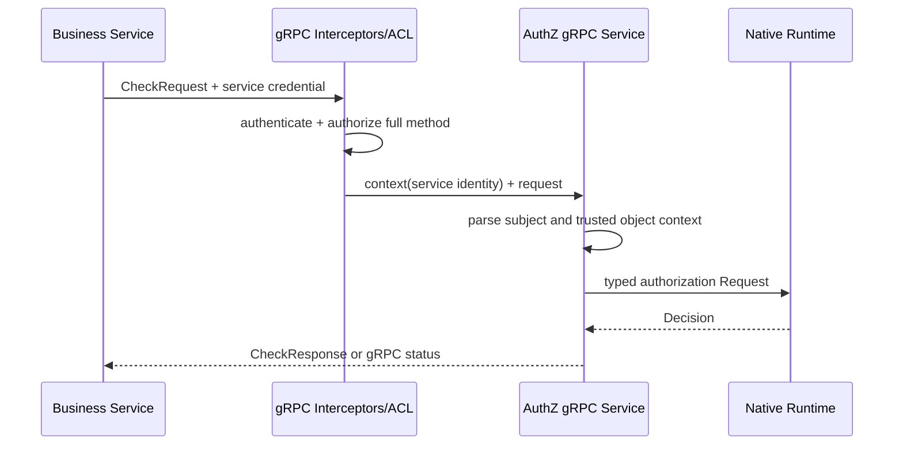

# 关键链路：gRPC 服务间授权与 SDK

> 状态：已实现 · 本文以 `iam.authz.v4.AuthorizationService` proto、gRPC 服务、拦截器/ACL、Assignment constraints 与 Go SDK 为依据。

## 结论

gRPC v3 是 AuthZ 的服务间执行面：

- `Check` 做单次 Resource/Action/对象条件判定。
- `GetAuthorizationSnapshot` 给可信服务返回 app 范围的角色与 capability 视图。
- `GrantAssignment`、`RevokeAssignment`、`ReplaceManagedAssignments` 是受 ACL 与内容级 constraints 双重限制的 Assignment 写入。

REST v3 不提供 Check。外部业务服务不应下载 Role/Grant 后自行实现判定，也不应让普通客户端直接调用 gRPC 并声明受信对象属性。

## RPC 契约矩阵

| RPC | 类型 | 输入核心 | 输出核心 | 额外授权 |
| --- | --- | --- | --- | --- |
| `Check` | 读/判定 | subject、domain、resource、action、optional object context | allowed、reason、matched evidence、policy version | service identity + method ACL + attribute trust whitelist |
| `GetAuthorizationSnapshot` | 读/视图 | subject、domain、app_name | effective roles、direct roles、permissions、version | service identity + method ACL |
| `GrantAssignment` | 增量写 | subject、domain、role_name、granted_by | policy version | service identity + method ACL + Assignment constraints |
| `RevokeAssignment` | 增量写 | subject、domain、role_name、revoked_by/reason | policy version | 同上 |
| `ReplaceManagedAssignments` | 集合写 | subject、domain、role_names、changed_by/reason | managed target subset、version、changed | service identity + method ACL + explicit managed role set |

proto `api/grpc/iam/authz/v4/authz.proto` 是 RPC 名、字段号、枚举值与响应形状的机器真相源。
`api/grpc/README.md` 与 `pkg/sdk/docs/06-authz.md` 只做使用说明，不能重新定义契约。

## 服务身份是所有 RPC 的前置条件

AuthorizationService 的五个 RPC 都调用 `requireServiceIdentity`。transport 只信任 gRPC interceptor 写入 context 的 service identity，
不接受 request body 中的 caller name 代替认证结果。

信任链可拆为：

```text
transport credential / mTLS or configured service credential
  -> interceptor authenticates service
  -> service identity placed in context
  -> grpc_acl.yaml checks full method name
  -> AuthZ service applies RPC-specific content checks
```

`grpc_acl.yaml` 的默认策略是 deny。当前主要覆盖为：

- `qs-apiserver.svc`：可调用全部五个 AuthZ v3 RPC。
- `qs-collection-server.svc`：只可 `Check` 与 `GetAuthorizationSnapshot`。
- `reporting`：只可 `GetAuthorizationSnapshot`。
- `admin`：ACL 上允许 AuthorizationService 通配方法，但 Assignment 写仍要经过内容级授权。

方法 ACL 只是“能否调这个 RPC”，不是“这次请求中的 Subject/Role/ObjectAttributes 一定可信”。

## `Check` 传输链



### 基础输入

`subject`、`domain`、`resource`、`action` 都必填。

- Subject 必须是 `<type>:<iam-id>`，ID 要能解析且非零。
- Domain 是 Tenant 授权域。proto 字段保留 `domain` 名称，不代表对外暴露 Casbin 模型。
- Resource 必须是四段具体 key，不能由请求方使用通配。
- Action 必须是具体动作。

基础字段缺失、Subject 格式错误、Resource/Action 不合法会返回 `InvalidArgument`，而不是 `allowed=false`。

### 对象属性信任边界

`ObjectContext` 包含 `object_id` 和重复的 typed `ObjectAttribute`。当前 transport 的可信窗口是显式白名单：

```text
caller_service = qs-apiserver.svc
resource       = qs:evaluation:collection:assessments
attribute_key  = object.origin_type
```

默认配置中，其他 key/resource 返回 `InvalidArgument`，其他 caller 尝试提交该属性返回 `PermissionDenied`。可以通过显式配置注册新的 service/resource/attribute 组合。重复 key、缺 typed value、带属性却缺 `object_id` 也会失败。

传输层可以解析 string/int64/bool 三种 oneof，但是否符合具体 Resource schema 仍由 authorization runtime 校验。
“proto 能表达某类型”不等于“某个 caller 已被允许提交它”。

### 响应解释

| 字段 | 意义 |
| --- | --- |
| `allowed` | 最终 allow/deny |
| `reason` | `ALLOWED`、`NOT_MATCHED` 或 `ATTRIBUTE_MISSING` |
| `deny_code` | 稳定的 deny 机器代码 |
| `matched_grant_id` | allow 时命中的 Grant |
| `matched_role` | allow 时导致命中的 effective Role |
| `policy_version` | 做决策的快照在该 Tenant 的版本 |
| `missing_attribute_keys` | 条件 Grant 所需但未提交的属性 |

`allowed=false` 是正常授权结果，不是 gRPC error。运行时不可用、请求违反 schema 或传输信任合同才是 error。业务调用方应分开统计两者。

## capability 检查与 object-aware 检查

SDK 提供两个方便方法：

- `Allow(subject, domain, resource, action)` 不提交 ObjectContext，只有无条件 Grant 可能放行。
- `CheckObject(..., objectID, attributes)` 显式提交业务服务加载的对象属性。

列表、搜索、批量动作应使用 capability 检查，并依赖无条件 Grant。对单个已加载对象的读写可用 object-aware Check。不应为了让条件 Grant 通过，对列表请求伪造一个代表性 object ID/属性。

## `GetAuthorizationSnapshot` 的使用边界

请求必须包含 Subject、Domain 和 `app_name`。响应为：

- `roles`：指定 app 下的 effective roles，包含继承结果。
- `direct_roles`：指定 app 下由 Assignment 直接获得的角色。
- `permissions`：指定 app 下去重合并的 Resource/Action 与 mode。
- `policy_version`：当前快照的 Tenant version。

`UNCONDITIONAL` 表示存在至少一条无条件 Grant；`OBJECT_CHECK_REQUIRED` 表示所有候选 Grant 都需具体对象检查。快照不包含某个具体对象的最终 allow，
所以 UI/服务不能把 `OBJECT_CHECK_REQUIRED` 当成已授权。

编辑 Assignment 只能使用 `direct_roles`。如果把 `roles` 整体回写，会把 inherited role 物化为新 Assignment。

## Assignment RPC 的双层授权

Assignment 写 RPC 必须经过：

```text
method ACL
  -> authenticated caller service
  -> assignment constraints
  -> application/domain/UoW
```

`configs/grpc_assignment_constraints.yaml` 当前对 `qs-apiserver.svc` 允许 `fangcun` domain、
`user` Subject 类型与明确的 `qs:*` Role 集合，并要求 Grant 携带 delegated actor。

constraints 缺失时的当前行为不对称：

- `GrantAssignment` / `RevokeAssignment` 在有已认证 service identity 时会放行到应用层。
- `ReplaceManagedAssignments` 因无法得到明确 managed set 而返回 `Internal`。

因此生产配置不能利用 nil authorizer 作为默认安全策略。开发和生产组合应显式加载 constraints，架构测试还应确认 ACL 和 constraints 的方法/caller 覆盖一致。

### 为什么 `admin allow_all` 不能直接 Replace

Replace 不是“我能改 Assignment”这一个 bool 问题，而是必须得到调用方拥有的具体 Role 子集 M。无边界 `allow_all` 无法表达“哪些 Assignment 属于该调用方管理”，
因此 replacement authorizer 要求显式 roles，不接受 allow-all 等价扩张。

## `ReplaceManagedAssignments` 响应的精确语义

`ReplaceManagedAssignmentsResponse.direct_roles` 当前返回经规范化的目标受管 Role 子集，不是提交后 Subject 的全部 direct roles。

```text
实际 direct roles = preserved unmanaged roles ∪ response.direct_roles
```

但响应不会再次读取并返回 preserved unmanaged roles。如需完整视图，调用方应在成功后调用 `GetAuthorizationSnapshot`。

`changed=false` 表示这次替换是 no-op：没有写 Assignment，没有 bump PolicyVersion，也没有写 Outbox。`policy_version` 会返回当前已存在版本（无版本时为默认值）。

## SDK 边界

`pkg/sdk/authz.Client` 是对生成的 `AuthorizationServiceClient` 的薄封装：

- 不在客户端复制权限 matcher。
- 不自动根据 role name 得出 allow。
- 不自动加载业务对象或生成属性。
- 将 gRPC error 统一包装为 SDK error，但保留 proto response 语义。

调用方仍负责：

1. 使用正确的服务凭据和 deadline。
2. 在有条件 Check 前从业务事实源加载对象。
3. 区分 deny 与 transport/runtime error。
4. 将关键日志关联 subject/domain/resource/action/policy version，但不记录敏感凭据。
5. 对撤权敏感操作考虑版本收敛窗口。

## 错误分层

| 层 | 典型错误 | 调用方应如何理解 |
| --- | --- | --- |
| 传输认证 | 缺 service identity | 调用凭据/拦截器配置错误 |
| 方法 ACL | caller 无权调 RPC | 服务能力配置错误或未授权 |
| 输入合同 | Subject/Resource/attribute 格式错 | 调用方 bug，不宜盲目重试 |
| 正常判定 | `allowed=false` | 业务无权限，不是 RPC 失败 |
| Assignment content auth | domain/role/actor 超出 constraints | 调用方不得管理该关系 |
| application/domain | Subject 不存在、Role 不存在或冲突 | 业务事实错误 |
| infrastructure | runtime/DB/UoW 不可用 | 服务故障，应告警并根据幂等性重试 |

## 可观测性

authorization runtime 统计 Check allowed/denied/error 和延迟；Assignment transport 另外统计：

```text
iam_grpc_assignment_authorization_total{service,operation,result}
```

`result` 区分 allowed/denied/failed。denied 表示明确不允许，failed 表示 authorizer/config 自身错误。这个指标不证明后续事务已提交，
所以不能将 allowed 计数直接当作 Assignment 变更成功数。

## 验证证据

- proto compile/生成代码锁定 RPC 和字段编号。
- `internal/apiserver/transport/grpc/service/authz/service_test.go` 锁定服务身份、Check 映射、snapshot 模式与 Assignment RPC。
- assignmentconstraints loader 测试锁定默认 deny、method/role/domain 配置和 Replace 边界。
- `grpc_acl.yaml` 与架构测试锁定五个 RPC 的 caller 覆盖。
- SDK 测试锁定方法映射与 error wrapping。
- docs-facts 将 gRPC README 列出的 RPC 与 proto service 直接比对。

这些仓库证据不能证明生产凭据、网络路由、目标实例快照版本或业务服务实际属性加载正确。

## 新增调用方或 RPC 的评审清单

1. 调用方服务身份如何认证，`service_name` 是否稳定？
2. `grpc_acl.yaml` 是否只开放最小 full method 集合？
3. 如果是 Assignment 写，constraints 是否给出明确 domain/subject/role/actor 边界？
4. 如果提交 ObjectAttributes，它们的事实拥有者、caller/resource/key 白名单和 Resource schema 是什么？
5. deny、invalid argument、permission denied、unavailable/internal 是否被调用方分开处理？
6. proto、生成代码、SDK、ACL、constraints、测试和文档是否同步？
7. 撤权成功后如何证明所有实例已收敛？

## 属性配置与不可用状态

`configs/authz_attribute_providers.yaml` 显式登记调用服务、资源键、属性键集合；默认保留上述 QS 组合，不存在硬编码生产回退。类型与枚举值由 Resource schema 管理。条件 Grant 的每个谓词均须存在提供者；配置允许预注册未来属性，未用于条件 Grant 的 schema 属性不强制注册。文件缺失、格式错误或既有 Grant 无提供者时拒绝启动；配置部署并重启生效。

Check 与 GetAuthorizationSnapshot 超过新鲜度预算时返回 gRPC `Unavailable`。客户端必须传播错误，不能转换成 ALLOW 或正常的 `allowed=false`。proto 消息字段和 SDK 方法保持不变。IAM 的 60 秒边界不自动约束业务服务自身缓存。
