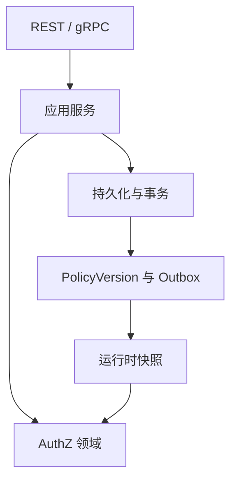

# 分层架构与代码索引

> 状态：已实现 · 本轮代码已实现，生产数据切换与业务验收另行记录。

| 层 | 代码位置 | 责任 |
|---|---|---|
| 领域 | `internal/apiserver/domain/authz` | Role、Assignment、Resource、Grant、动作匹配与决策 |
| 应用 | `internal/apiserver/application/authz` | 授权管理、服务白名单、敏感保护、事务编排 |
| 运行时 | `internal/apiserver/infra/authz/runtime` | 不可变快照、直接角色权限并集与版本收敛 |
| 持久化 | `internal/apiserver/infra/mysql` | 活动对象恢复；拒绝残留条件与属性模式 |
| 传输 | `internal/apiserver/transport` | 身份、参数、弃用字段兼容拒绝与响应映射 |
| 兼容 DTO | `internal/pkg/authzcompat` | 只接受规范合法空字段，不执行条件 |
| 本轮维护 | `internal/apiserver/maintenance/conditionretire` | 独立清单、白名单迁移、漂移与补偿 |
| 历史格式 | `internal/apiserver/maintenance/legacycondition` | 旧数据规范化、GrantKey 与历史角色迁移支持 |

历史格式代码不提供通用条件求值器，不能被活动授权领域或 Runtime 调用。旧角色迁移清单与本轮清单相互独立。

修改资源动作时覆盖目录写入、Grant 创建、快照恢复和普通请求；修改服务角色授予时覆盖白名单及受保护角色；修改收敛时覆盖 Outbox、单调版本、新鲜度与多实例读取。旧继承接口继续返回 410。

验证顺序是领域与契约测试、真实 MySQL 迁移专项、三个仓库整体检查，再进行部署和普通角色业务验收。自动化通过不代表生产数据已经迁移。

详见 [维护手册](08-条件授权退役维护手册.md)。
