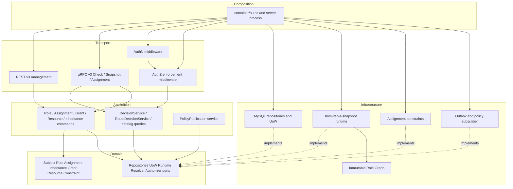

# 分层架构与代码索引

> 状态：已实现 · 本文给出从变更意图到代码、测试、契约与文档的完整追踪方法。

## 结论

修改 AuthZ 时应从“机器契约或组合根 → 应用链 → 领域不变量 → 基础设施投影 → 文档与门禁”追踪，而不是只改 handler 或专题说明。本页是导航，不复制实现细节。

AuthZ 的两条主依赖方向是：

```text
控制面：Transport -> Application Command -> Domain -> UoW/Repositories -> PolicyVersion/Outbox
执行面：Transport/Middleware -> Application Query -> Runtime Port -> Immutable Snapshot

基础设施实现 Domain/Application 端口；
Domain 不反向依赖 Gin、gRPC、GORM、Redis 或具体运行时索引实现。
```

一个变更只改某个分层并不一定错，但必须证明边界外的契约没有被影响。例如纯文案不需改 proto，但新增 Action 就不可能只改 router。

## 分层责任图



自有角色图只出现在 Infrastructure 的 immutable snapshot 构建内部。Domain 只声明 `RoleResolver` 能力，不知道 map、遍历算法或快照布局。

## 代码索引

| 关注点 | 主要位置 |
| --- | --- |
| gRPC v3 契约 | `api/grpc/iam/authz/v4/authz.proto` |
| REST v3 契约 | `api/rest/authz.v4.yaml` |
| gRPC transport | `internal/apiserver/transport/grpc/service/authz` |
| REST router/handler | `internal/apiserver/transport/rest/authz` |
| 授权查询 | `internal/apiserver/application/authz/authorization` |
| Assignment 写入与准入 | `internal/apiserver/application/authz/assignment`、`assignmentadmission`、`objectattributeadmission` |
| 跨聚合写策略 | `internal/apiserver/domain/authz/policy`（Resource/Role 变更）、`domain/authz/assignment/replacement_policy.go` |
| Role/Grant/Resource/Inheritance 写入 | `internal/apiserver/application/authz/{role,permissiongrant,resource,roleinheritance}` |
| Unit of Work | `internal/apiserver/application/authz/uow` 与 persistence 实现 |
| 授权运行时与不可变角色图 | `internal/apiserver/infra/authz/runtime` |
| 建权与赋权后的发布收敛机制 | `internal/apiserver/application/authz/policychange`、`policypublication` |
| HTTP 施权边界 | `internal/pkg/middleware/authz` |
| Assignment constraints | `internal/apiserver/infra/authz/assignmentconstraints` |
| 配置组合 | `internal/apiserver/container/authz`、`configs/apiserver.*.yaml` |
| permission catalog | `internal/apiserver/application/authz` 中的资源/动作常量与 registry |
| migration/bootstrap | `internal/pkg/migration/migrations`、`configs/mysql/bootstrap.sql` |
| 语义收敛工具 | `internal/apiserver/maintenance/tenant_retirement.go`、`cmd/iam-maintenance` |
| Go SDK | `pkg/sdk/authz`、`pkg/sdk/docs/06-authz.md` |

## 组合根是真实运行时边界

`internal/apiserver/container/authz` 决定哪些能力真正被创建和注入，比某个未被引用的 constructor 更能说明当前系统。读 AuthZ 时至少要确认：

1. MySQL repositories/UoW 是否注入所有 command service。
2. immutable-snapshot Runtime 是否用 MySQLSource 初始建照。
3. `DecisionService`、snapshot reader 与 `RouteDecisionService` 是否指向同一 runtime。
4. Assignment constraints 配置是否加载并注入 gRPC service。
5. policy sync subscriber 是否创建、启动并在 shutdown 停止。
6. runtime health reporter 是否进入 readiness。
7. REST/gRPC/Identity/Suggest 所需能力是否由组合根真正交付。

“包存在”不等于“运行时使用”。当前组合根只装配自有 immutable-snapshot runtime；旧 evaluator、旧 Casbin model 或退役 adapter 即使仍出现在历史 migration 和退役门禁中，
也不能被文档写成活跃路径。

## 按变更类型寻找落点

| 变更 | 必查范围 |
| --- | --- |
| 新增 Resource/Action | 常量/registry、route middleware、bootstrap、OpenAPI、门禁 |
| 修改 ConstraintSet | domain schema/evaluator、Resource schema、runtime、proto/DTO、测试 |
| 修改 Assignment | command、constraints、repository/UoW、proto/SDK、版本事件 |
| 修改继承 | 循环检测、不可变角色图构建、snapshot/effective roles、测试 |
| 修改 snapshot 字段 | domain view、runtime、proto、transport、SDK、兼容语义 |
| 修改 reload | command post-commit、event handler、metrics/readiness、运维文档 |
| 修改角色图 | 同时保护直接/有效角色、角色管理保护、多层/菱形继承、32 层边界与 Decision 等价性 |

### 新增 Resource/Action

最小完整改动通常包括：

```text
domain Resource key/action/schema
  -> application permission catalog/constants
  -> REST middleware or external Check caller
  -> bootstrap/migration/convergence data
  -> route/OpenAPI/proto as applicable
  -> grant and deny tests
  -> canonical docs and gate facts
```

若只在 router 中添加 Action，而 Resource catalog/bootstrap 没有对应记录，生产会表现为“路由正常但所有人 403”。

### 新增 ObjectAttribute

至少要同步：

- attribute type/schema 定义和 Resource catalog 数据；
- ConstraintSet 写入校验与运行时求值；
- gRPC proto 是否已能表达所需类型；
- caller/resource/key 信任白名单；
- 业务服务如何从真实对象提取；
- 伪造、缺失、错类型、不等值与满足条件测试。

只改 schema 可以让 Grant 变得合法，但不会自动让任意服务获得声明该属性的信任。

### 新增 Assignment 调用方

需要同时评审传输凭据、`grpc_acl.yaml`、Assignment constraints、delegated actor 语义、受管 Role 所有权和并发写入模式。
不能因为 caller 可调 `Check` 就顺便给它开 Assignment 写入。

### 修改 RoleInheritance

需要同时检查领域方向语义、数据层 active unique guard/锁、成环检查、snapshot 图编码、direct/effective roles 返回和最大层次。
只把 UI 中的父子文案对调很容易将 `child -> parent` 写反。

### 修改策略收敛

需要分开评估：事实事务、version/outbox 原子性、本地 reload、远端 subscriber、原子快照替换、readiness/metrics 和生产证据。修改其中一层的重试次数不会自动改善其他层。

## 推荐验证

```bash
go test ./internal/apiserver/domain/authz/...
go test ./internal/apiserver/application/authz/...
go test ./internal/apiserver/infra/authz/...
go test ./internal/apiserver/transport/grpc/service/authz/...
go test ./internal/apiserver/transport/rest/authz/...
go test ./pkg/sdk/...
go test ./internal/apiserver/maintenance/... ./cmd/iam-maintenance/...

python3 scripts/check-docs-links.py
python3 scripts/check-docs-facts.py
python3 scripts/check-route-contracts.py
python3 scripts/check-openapi-contracts.py
```

架构测试还负责阻止 AuthZ v2 的退役 URL、旧 evaluator、旧 Casbin 配置与依赖重新进入当前运行路径。

## 验证层次与能证明的结论

| 层次 | 代表检查 | 可证明 | 不可证明 |
| --- | --- | --- | --- |
| Domain 单测 | constraint/resource/assignment/inheritance tests | 构造与求值不变量 | 事务与生产数据 |
| Application 测试 | command/query/integration tests | UoW 编排、版本/事件意图 | 真实多实例收敛 |
| Repository 测试 | active guard/concurrency/UoW tests | 指定数据库或 SQLite fixture 语义 | 未测隔离级别的线性化 |
| MySQL Replace 并发 | `replace_managed_assignments_mysql_concurrent_test.go`（需 `MYSQL_HOST`） | 独立角色与主体 fixture + 事务内 Role-read barrier + 最终集合/精确版本/Outbox 断言 | CI 默认跳过；不能替代全部生产并发场景 |
| Runtime 测试 | immutable snapshot/runtime tests | 图闭包、Grant/Constraint 判定 | 生产规模和滞后 SLO |
| Transport 测试 | REST/gRPC router/service tests | 契约映射、信任白名单 | 实际 ingress/mTLS 配置 |
| 架构/文档门禁 | architecture/docs/route/openapi scripts | 退役引用与编码事实没漂移 | 全部 prose 与生产部署正确 |
| 部署后验证 | SHA、health、versions、Check samples | 指定环境指定时刻行为 | 未来版本或所有流量必然正确 |

## 问题定位手册

### 某个 REST 管理路由突然 403

1. 确认 JWT 解析后 UserID/OrgID。
2. 从 router 找到精确 Resource/Action，不要猜角色名。
3. 分别和 platform 查 Subject effective roles/Grant。
4. 检查实例快照 policy version 与 reload health。
5. 确认 bootstrap/convergence 中存在该 Resource/Action Grant。

### gRPC `Check` 返回 deny

1. 先看 reason/deny_code，区分 `not_matched` 与 `attribute_missing`。
2. 用 `policy_version` 确认判定所依赖的快照。
3. 查 direct/effective roles，检查继承方向。
4. 查命中 Role 下的 Resource Pattern/Action/Constraint。
5. 如果缺属性，回到业务服务加载链和 gRPC 白名单，不在 IAM 内伪造属性。

### Assignment 写返回 PermissionDenied/Internal

1. 确认 service identity 和 full method ACL。
2. 检查 constraints 文件是否加载、caller 是否匹配。
3. 检查 domain、subject type、role name 与 delegated actor。
4. Replace 要检查是否给出明确 managed roles，不能依赖 allow-all。
5. 进入 application 后再查 Subject/Role 存在性与 UoW 错误。

### 写成功但旧权限仍可用

1. 确认 DB 事实与 committed PolicyVersion。
2. 检查 Outbox 是否 pending/retrying/published。
3. 举每个存活实例的 ephemeral channel 和 loaded version。
4. 检查 reload failure 与数据建照错误。
5. 用固定 Subject/Resource/Action 对每个实例复验，不只看负载均衡后的单次样本。

## Casbin 退役记录

Casbin 已从当前运行时退役。实施时按以下顺序完成：

1. 固化 Subject→Role、Role→ParentRole、管理保护、direct/effective roles、多层继承和循环失败的表征测试。
2. 实现自有不可变角色图，确定最大深度/节点数和错误语义。
3. 对同一 Dataset 运行新旧实现的差分测试，比对 direct/effective roles 与所有 Check Decision。
4. 切换 snapshot 内部实现，保持 application/runtime port 不变。
5. 移除 Casbin import/dependency，保留旧配置和表不得回归的退役门禁，再做完整验证。

当前实现是 `roleGraphBuilder → roleGraph → RoleResolver`。历史 migration 中的 `casbin_rule` 仍是迁移事实，不会因为运行时组件退役而改写。

## 文档维护规则

- 本目录是 AuthZ 当前行为的 canonical 文档。
- `api/` 与 `pkg/sdk/docs/` 只解释对应接口，不重新定义领域模型。
- `docs/00-概览`、术语表和专题只引用本目录的术语与结论。
- 面试、演讲材料最后更新，只做解释层，不得成为反向修改 canonical 文档的事实源。
- 历史生产证据必须绑定 SHA、workflow run 和数据库状态，不可升级成当前 HEAD 的结论。
- 新 RPC、新 REST URL 或退役路径必须进入 docs-facts/docs-links 门禁。

## 事实优先级

```text
组合根与运行时代码
  > protobuf / OpenAPI / migration / bootstrap
  > 测试与自动门禁
  > 本目录 canonical 文档
  > 专题、运维回顾、面试和演讲材料
```

文档门禁是漂移侦测器，不是生产验收器。绿色门禁只能证明被编码的事实，不能证明所有 prose 都正确，也不能证明生产已部署。

## 加固代码索引

| 责任 | 入口 |
| --- | --- |
| 完整重载串行化、版本向量与所有权 | `infra/authz/runtime/runtime.go`、`snapshot.go` |
| 只读版本端口与 60 秒门禁 | `infra/authz/runtime/freshness.go`、`mysql_source.go` |
| 同步生命周期和实例通道 | `container/authz/policy_sync.go`、`channel.go` |
| 共用图规则与原子建边 | `domain/authz/roleinheritance/graph_policy.go`、`infra/mysql/roleinheritance/repo.go` |
| 可信属性准入与配置 | `application/authz/objectattributeadmission`、`infra/authz/attributeproviders` |
| Identity 主体适配 | `infra/authz/subjectresolver` |
| 数据审计、事务收敛和证据 | `maintenance/authz_hardening.go`、`cmd/iam-maintenance/tenant_retirement.go` |
| 真实依赖测试 | `infra/authz/integration/hardening_mysql_test.go`、`infra/authz/runtime/message_integration_test.go` |

新增治理和发布步骤见 [安全加固与发布验收](09-安全加固与发布验收.md)。
