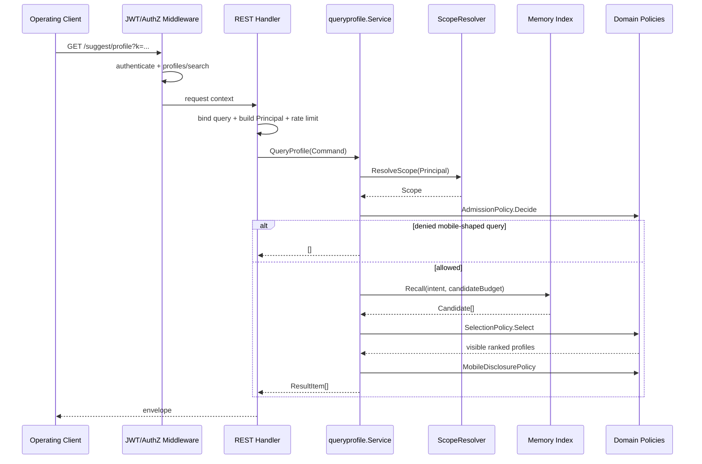

# 关键链路：SuggestProfile 查询与安全策略

> 状态：已实现 · 当前只有 REST；查询编排位于 `application/suggest/queryprofile`。

## 1. 对外契约

```http
GET /api/v2/suggest/profile?k=<keyword>&limit=<n>
Authorization: Bearer <token>
```

成功响应使用统一 envelope：

```json
{
  "code": 0,
  "message": "success",
  "data": [
    {
      "id": "123",
      "name": "张三",
      "mobile_mask": "138****8000",
      "weight": 1
    }
  ]
}
```

`data` 在成功场景始终是数组而不是 `null`。ProfileID 在 domain/application 内是 `int64`，到 REST DTO 时转成字符串。

P1 修复后，handler 的 Swagger 注解使用专用 `ProfileSuggestResponse`，生成 Swagger 与 `api/rest/suggest.v2.yaml` 都描述
`{code,message,data[]}`。`scripts/check-openapi-contracts.py` 当前会比较路径响应和顶层 envelope shape，
但不会递归解引用 `ProfileSuggestResponseItem`。因此当前契约一致已经核实。item 字段的未来漂移仍需补一层门禁。

## 2. 端到端顺序



安全顺序不是可交换的。路由权限在进入 handler 前判断；手机号能力在访问包含原始手机号 key 的索引前判断；可见性过滤在最终 limit 前执行；
脱敏在 domain profile 转 application result 时执行。

## 3. 路由层授权

路由装配位于 `transport/rest/module_routes.go`：

1. 必须存在 JWT middleware，先执行 `AuthRequired()`；
2. AuthZ 模块可用时，再要求当前授权域的：

```text
resource = iam:identity:collection:profiles
action   = search
```

该层失败通常返回 `401` 或 `403`，不会进入 Suggest handler。

如果 AuthZ 模块本身未装配，路由当前只挂 JWT middleware；后续 scope facts reader 会得到空平台能力，并限制在 owner/org/visibility 范围。这个降级边界必须结合模块部署约束理解，
不能把“没挂路由权限”解释成全量放行。

## 4. 请求绑定与 Principal

### 4.1 参数

| 参数 | 规则 |
| --- | --- |
| `k` | query 必填；缺失或空字符串在 transport 层返回 `400` |
| `limit` | 可选；`<=0` 或大于 `MaxResults` 时使用 `MaxResults` |

空白字符串与空字符串的层次不同：`k=%20%20` 能通过 `binding:"required"`，随后 `NewKeyword` trim 为空并返回 `200 + []`；直接调用 application 时空字符串也返回空数组，
而且不会访问 scope/index。

### 4.2 `visibility.Principal`

handler 从 request context 构造最小快照：

| 字段 | 来源 |
| --- | --- |
| `OperatorID` | 已认证 UserID |
| `OrgID` | business org claim（若存在） |
| `OrgIDs` | REST 当前未填充，保留给其他入口/未来扩展 |

请求不携带授权分区。`OrgID` 仅用于业务数据可见性，不能替代权限判断。

## 5. REST 限流

handler 在调用 `QueryProfile` 前按 OperatorID 限流。手机号形态关键词与普通关键词使用独立桶：

| backend | 算法 | 多实例 | 故障语义 |
| --- | --- | --- | --- |
| `memory` | 进程内 token bucket | 各实例独立 | 无外部依赖 |
| `redis` | 约 1 秒 fixed window | 共享 | 50ms 超时或 Redis 错误时 fail-open |

`per_operator_qps<=0` 表示关闭限流。memory adapter 用 `operator_map_max_entries` 限制桶数量，达到上限时淘汰最久未访问项。
Redis 配置缺少 client 时记录告警并回退 memory。

限流是滥用抑制，不是授权边界。Redis fail-open 不会绕过路由权限、scope 或手机号准入。

## 6. Scope 解析

`ScopeResolverService` 先读取 AuthZ 事实，再按需读取 visibility ProfileIDs，最后调用领域 `ResolutionPolicy`。

### 6.1 AuthZ facts

`infra/suggest/authorization.FactsReader` 使用 `user:<OperatorID>` 作为 subject：

1. 先检查平台域 `profiles/list`；
2. 若允许，再检查平台域 `profiles/search_by_mobile`；
3. 若不允许平台 list，检查当前 tenant domain 的 `profiles/search_by_mobile`。

平台 `list` 与手机号搜索是独立 capability，不能由角色名、`super_admin` 布尔值或“平台用户”身份直接推断。

### 6.2 visibility facts

当没有平台全量 list 能力时，MySQL `VisibilityReader` 查询：

```sql
SELECT id
FROM profiles
WHERE deleted_at IS NULL AND created_by = OperatorID
```

它可以按 OperatorID 包一层短 TTL cache。cache 会复制 ID slice，也会把查询错误缓存到 TTL 到期；当前 key 只有 OperatorID，因为底层规则也只依赖 OperatorID。

### 6.3 最终 Scope

| 场景 | Profile 可见范围 | 手机号搜索 |
| --- | --- | --- |
| 有平台 `profiles/list` | 全部 Profile | 取平台 `search_by_mobile` |
| 无平台 list | operator owner + principal org + visibility ProfileIDs | 取当前 tenant `search_by_mobile` |

一个候选只要满足 all、显式 ProfileID、OrgID 或 owner 中任一条件即可见。

当前默认 Loader 的 OrgID 来自配置占位。若所有候选都写入同一非零占位，而调用者 OrgID 也相同，会形成过宽组织可见范围；多组织部署必须提供真实组织投影。

## 7. 查询准入

`AdmissionPolicy` 在 scope 已解析、索引尚未访问时分类：

| 关键词 | 手机号能力 | 决策 | 是否访问索引 |
| --- | --- | --- | --- |
| trim 后为空 | — | empty denial | 否 |
| 通常 7–15 位纯数字 | 否 | mobile forbidden | 否 |
| 通常 7–15 位纯数字 | 是 | numeric exact | 是 |
| 其他纯数字 | — | numeric exact | 是 |
| 非纯数字 | — | text prefix | 是 |

手机号无权限故意返回 `200 + []`，不返回业务 `403`；这样调用者无法通过响应区分“号码存在但无权搜索”和“没有匹配”。外层 `profiles/search` 路由授权失败仍返回 `403`，两者是不同边界。

## 8. 候选召回：TST 与 Hash

`CandidateRecaller` 的当前实现是 `infra/suggest/index/memory.Runtime`。它只召回，不判断 scope，不做最终排序。

### 8.1 TextPrefix → TST

每个 `SuggestibleProfile` 导入：

- trim 后的 DisplayName；
- `go-pinyin` 生成的全拼；
- 拼音首字母。

短关键词补 `*` 到 `KeyPadLen` 后进入三元搜索树通配展开。两个限制分别控制成本：

| 限制 | 控制对象 | 默认值 |
| --- | --- | --- |
| `WildcardKeyCap` | 最多展开多少个终端 key | `100` |
| `CandidateBudget` | 最多返回多少个去重 Profile 候选 | `MaxResults * 10` |

TST adapter 根据命中的 key 生成 `MatchDirectPrefix` 或 `MatchExpandedPrefix`。姓名/拼音 key 当前不做统一大小写和 Unicode 规范化，调用方与数据源应使用一致格式。

### 8.2 NumericExact → Hash

Hash key 包含：

- ProfileID 的十进制字符串；
- Loader 提供的每个原始手机号字符串。

匹配必须完整相等，候选强度为 `MatchExact`。手机号不会做前缀枚举，也没有 E.164/国家码归一化；`138...`、`+86138...` 和带空格格式会成为不同 key。

### 8.3 Runtime 未初始化

`Runtime.Recall` 在没有 active Store 时返回空候选而不是错误。正常启动会先 Full 再暴露可用模块；optional 启动失败则直接换成 `DegradedQuerier`。因此对外空数组可能表示无匹配、
被过滤、未就绪或主动降级，排障必须看 health/metrics。

## 9. 可见性过滤、去重与排序

召回结果进入 `SelectionPolicy` 后按固定顺序处理：

```text
Candidate[]
  -> Scope.Allows filter
  -> ProfileID deduplicate
  -> Weight desc
  -> MatchStrength desc
  -> DisplayName direct-prefix bonus
  -> ProfileID asc
  -> final limit
```

先 filter 再 limit 可避免无权候选直接占满最终结果窗口；ProfileID 最后升序保证同分结果稳定。

但 `CandidateBudget` 在 scope filter 之前生效。短前缀产生大量无权候选时，可见项可能落在召回窗口之后，所以最终返回条数可能小于 limit。这是当前已知召回质量限制，
不应通过把授权过滤移进 TST 或无限扩大窗口偷偷解决。

## 10. 手机号输出

`MobileDisclosurePolicy` 在 application 映射 ResultItem 时执行：

- 默认只取第一个手机号并返回 `前三位 + **** + 后四位`；
- 无手机号或过短手机号返回空，REST 因 `omitempty` 可不输出 `mobile_mask`；
- 非生产环境可配置明文输出；production 初始化明确拒绝该配置。

即使用户没有手机号搜索能力，只要可见候选由姓名/ID 命中，当前响应仍可能包含脱敏手机号。这是“搜索能力”和“展示掩码”分离后的现有合同；若业务要求无 mobile capability 时连掩码也不可见，应修改领域披露策略，
而不是只改 transport。

## 11. 对外行为矩阵

| 场景 | HTTP/结果 | 访问 scope/index |
| --- | --- | --- |
| 未挂载 `k` 或 `k=` | `400` | 否 |
| JWT 缺失/无效 | `401` | 否 |
| 外层 `profiles/search` 无权限 | `403` | 否 |
| 限流拒绝 | `429` | 否 |
| `k` 仅空白 | `200 + []` | 否 |
| 手机号形态但无 mobile capability | `200 + []` | scope 是，index 否 |
| 无匹配 | `200 + []` | 是 |
| 候选全部不可见 | `200 + []` | 是 |
| optional 降级 | `200 + []` | 否 |
| scope/index adapter 返回错误 | 统一错误响应 | 取决于失败阶段 |

## 12. 日志与指标

相对 Suggest 自身的派生状态，原始手机号只存在于进程内索引，不写入文件或日志；Identity MySQL 仍是它的权威事实源。这里的“日志”指 Suggest 专用业务日志：手机号形态查询只记录 OperatorID、
是否允许和关键词 rune 长度，不记录原始关键词。仍应单独确认通用 access log 是否包含完整 query string。

| 指标 | 含义 |
| --- | --- |
| `iam_suggest_queries_total{strategy}` | 已完成策略决策的查询数 |
| `iam_suggest_mobile_shaped_queries_total` | 手机号形态请求数 |
| `iam_suggest_results_returned` | 最终返回条数 |
| `iam_suggest_matched_candidates` | scope 前召回数 |
| `iam_suggest_visible_after_scope` | scope 后、去重前候选数 |
| `iam_suggest_rate_limited_total{kind}` | 普通/手机号桶限流次数 |

`DecisionKind` 到 label 的映射只存在于 metrics adapter：`mobile_denied`、`numeric_exact`、`prefix_text`。领域层不依赖 Prometheus label。

## 13. 测试与契约证据

| 行为 | 证据入口 |
| --- | --- |
| Keyword、mobile admission、排序 | `domain/suggest/search/search_test.go` |
| Scope 组合与 Allows | `domain/suggest/visibility/visibility_test.go` |
| 手机号脱敏与 Profile 不变量 | `domain/suggest/profile/profile_test.go` |
| 空关键词短路、mobile denied、不足窗口 | `application/suggest/queryprofile/service_test.go` |
| platform/tenant facts 解析 | `infra/suggest/authorization/facts_reader_test.go` |
| TST/Hash 召回与旧 key 清理 | `infra/suggest/index/memory/*_test.go` |
| REST envelope、400/401/429 | `transport/rest/suggest/handler_test.go` |
| OpenAPI shape | `scripts/check-openapi-contracts.py` + `make api-validate` |
